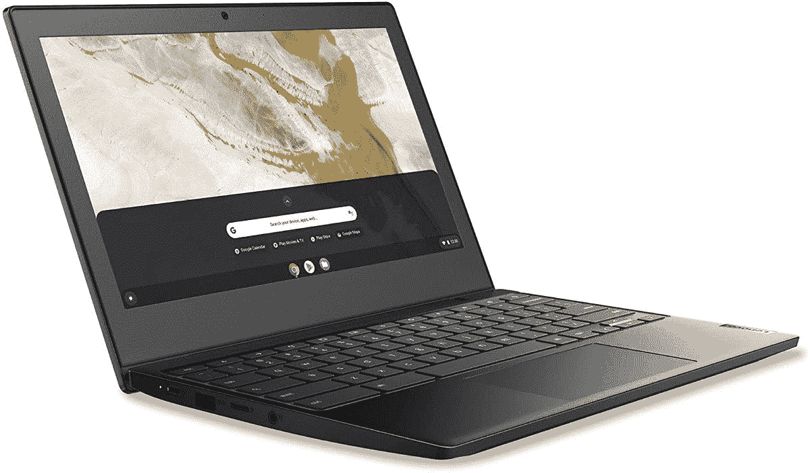

# 不，真的，你现在只需花 79 美元就能买到 Chromebook

> 原文：<https://www.xda-developers.com/ideapad-3-chromebook-prime-day/>

一年中有多少次你可以只花 **$79** 就给自己买一台全新的开箱即用的笔记本电脑？这些机会不会经常出现，但 [Prime Day](https://www.xda-developers.com/amazon-prime-day/) 是其中之一，即使这笔交易实际上并不在亚马逊。是的，今年你可以在百思买花 79 美元买到一台全新的联想 [Chromebook](https://www.xda-developers.com/best-chromebooks/) 笔记本电脑。没接住。

这是最新最热的硬件吗？它不是。这是一个不错的小机器，是轻便的还是给孩子们用的？绝对的。你想给你的孩子买一台比这贵 15 倍的[惠普精英版蜻蜓 Chromebook](https://www.xda-developers.com/hp-elite-dragonfly-chromebook-unboxing/) 吗？当然不是！

因此，IdeaPad 3 Chromebook 不会轰动世界，但它也远不是我们见过的 Chromebook 最糟糕的尝试。这是一台 11.6 英寸的笔记本电脑，配有 720p 显示屏，老实说，这可能是这台笔记本电脑最令人失望的部分。但是，嘿，只要 79 美元！其余的，虽然，实际上是相当不错的。它使用英特尔赛扬 N4020，这是这个级别的预期，以及 eMMC 存储和 4GB 内存。但它完全可用。存储也可以通过 microSD 卡进行扩展。

也许更令人惊讶的是 USB-C 与 USB-A 的结合。你可以在价格不到 100 美元的笔记本电脑上获得 USB-C 3.1。太棒了。电池寿命也是如此，最多使用 10 小时，实际上更像是 8 小时，但仍然足以度过一整天的学习时间。音箱还过得去，是联想的笔记本电脑，所以键盘不错，够耐用，经得起后辈递出来的坎坷人生。

 <picture></picture> 

Lenovo IdeaPad 3 Chromebook

##### 联想 IdeaPad 3

这是一款全新的 Chromebook 笔记本电脑，售价低得离谱，只有 79 美元。现在没有比这更便宜的笔记本了。

最终，它是一款非常简单的 Chromebook，但由联想制造会让你安心，因为它仍然是一款优质产品。尽管这么便宜。不过，在 7 月 13 日交易结束前都是这个价格，所以现在是时候了。不要错过这个机会！