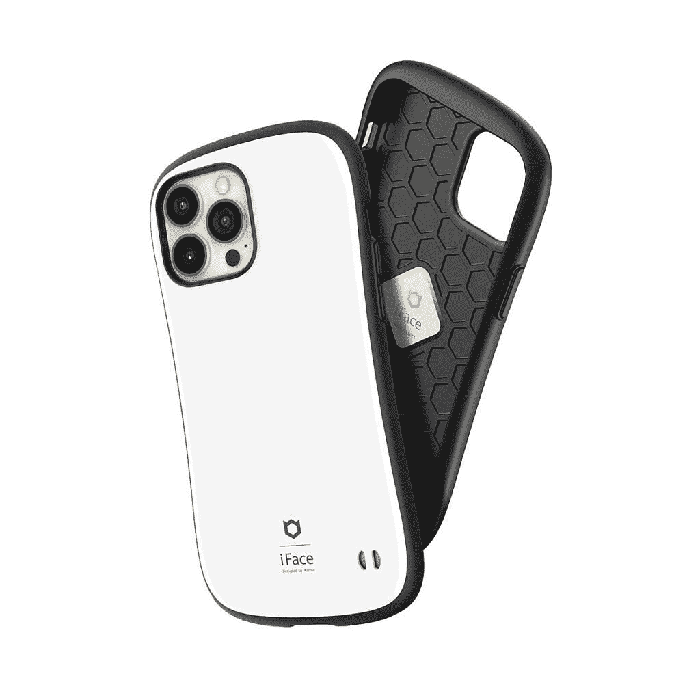
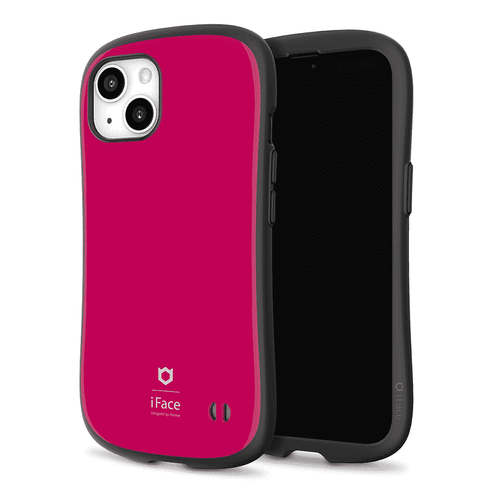

# 购买 iFace iPhone 13 保护套

> 原文：<https://www.xda-developers.com/iface-iphone-13-cases/>

iFace cases 的所有设计都采用了弧形设计，因此一眼就能认出来。他们为苹果和安卓设备提供了大量的保护套，提供了一些非常漂亮的颜色供选择。围绕这些案件的大肆宣传导致它们成为日本最受欢迎的案件之一。为您的手机增加一些保护，同时享受众多不同颜色选项中的一种。

[**在亚马逊上购买 iFace**](https://amzn.to/326pPIn)

一流的情况下，利用一个光滑的聚碳酸酯外壳。这是一块可定制的颜色你选择。你可以在背面找到一个挂绳孔，用来系上配饰、饰物或任何你想添加到包里的东西。外壳的弯曲形状使其更容易握持，让您能够很好地握住手机。这也使这款包有别于市场上的其他设计，脱离了你可能习惯的标准矩形设计。

一流的外壳边缘使用坚固的橡胶边框来保护您的手机免受跌落。角落装有气穴，如果你摔了手机，气穴会吸收冲击力。在外壳内部，蜂窝空气缓冲矩阵设计用于加强手机的结构。这种设计有助于将冲击的震动分散到整个外壳中。每个外壳都是一个坚固的整体，增加了这些 iFace 外壳的耐用性。

相机的切口也用同样厚的橡胶边框加固。这款保护套高出 iPhone 的镜头，确保你的手机能够得到额外的保护，不会被玻璃划伤。结合所有这些保护功能，您最终将获得 360 度军用级坠落保护。

 <picture></picture> 

iFace First Class for iPhone 13

 <picture></picture> 

iFace First Class for iPhone 13

随着 [Kusumi 系列](https://www.amazon.com/stores/page/17635CA4-5BAD-4771-9429-06B87416812D?tag=xda-6cfckq6-20&ascsubtag=UUxdaUeUpU6326&asc_refurl=https%3A%2F%2Fwww.xda-developers.com%2Fiface-iphone-13-cases%2F&asc_campaign=Short-Term)的推出，该系列最近增添了新的色彩。这个新系列有柔和、轻盈、梦幻的色彩。背面经过哑光处理，具有防指纹表面。这些新保护套适用于 iPhone 13、iPhone 13 mini、iPhone 13 Max 和 iPhone 13 Pro。

去亚马逊[上看看大量的颜色和外壳选择，为你的 iPhone 13 买一个 iFace 外壳。你会明白为什么这些是现在日本最受欢迎的案例。](https://amzn.to/326pPIn)

###### 我们感谢 iFace 赞助了这篇文章。我们的赞助商帮助我们支付与运行 XDA 相关的许多费用，包括服务器成本、全职开发人员、新闻撰稿人等等。虽然您可能会在门户内容旁边看到赞助内容(这些内容将始终被标记为赞助内容),但门户团队对这些帖子不承担任何责任。赞助内容、广告和 XDA 仓库完全由一个独立的团队管理。XDA 绝不会通过接受金钱来赞扬一家公司，或以任何方式改变我们的观点或看法，从而损害其新闻诚信。我们的意见不能被收买。