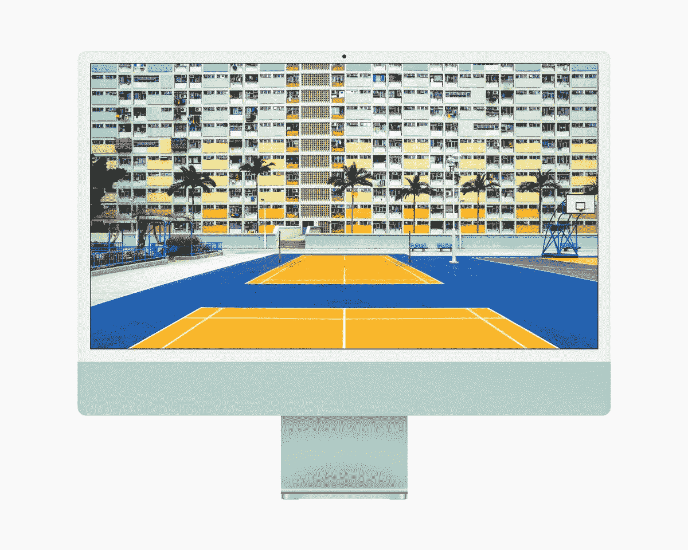

# 装有 M1 芯片的苹果 iMac 支持连续性和切换吗？

> 原文：<https://www.xda-developers.com/imac-continuity-handoff/>

# 装有 M1 芯片的苹果 iMac 支持连续性和切换吗？

如果您打算购买新的 24 英寸 iMac，并想知道它是否支持连续性和切换，我们有答案！

使用多台苹果设备的主要优势之一是它们在生态系统中协同工作的方式。假设你有一部 [iPhone 12](https://www.xda-developers.com/apple-iphone-12-series/) ，并且你刚买了新的 [iPad Pro 2021](https://www.xda-developers.com/ipad-pro/) ，它采用了 M1 芯片。你可以无缝传输文件，在 iPad 上完成 iPhone 上的任务，直接在 iPad 上接听电话，等等。这些功能是苹果所说的连续性和移交的一部分。

现在，让我们添加一台 Mac 电脑。现在，所有三种设备 iPhone、iPad 和 Mac——将协同工作，帮助你做一些事情，比如使用连续性相机功能进行[扫描文档，访问跨设备的通用剪贴板，等等。如果你刚刚给自己买了一台全新的](https://www.xda-developers.com/continuity-camera/) [24 英寸 iMac](https://www.xda-developers.com/apple-announces-new-m1-powered-imac/) 配有 M1 芯片，或者打算很快买一台，你一定想知道这些连续性和切换功能是否适用于这款设备。

## 带 M1 的 24 英寸 iMac 支持连续性和切换吗？

简单的答案是肯定的，苹果最近推出的 24 英寸 iMac 支持连续性和切换功能。重要的是要明白，连续性和移交都是 macOS 内置的特性，因此是您购买 Mac 时获得的软件包的一部分。这两种功能都使用 Wi-Fi 和蓝牙等常见技术与网络上的多个设备进行通信，并在它们之间提供无缝集成。无论你购买哪一款新 Mac，这些功能都将默认提供给你，无论它是采用英特尔芯片还是苹果自己的芯片。

因此，如果你有了新的 M1 24 英寸 iMac，并且已经有了 iPhone 或 iPad，你就可以很容易地使用连续性和移交来使你的工作流程更加方便。如果你没有 iPhone，你可能想等几个月后即将到来的 iPhone 13，预计它将带来急需的改进，如更小的凹槽和高刷新率显示屏。

 <picture></picture> 

Apple iMac 24-inch 2021

##### 苹果 iMac (2021 年)

新的 24 英寸 iMac 配备了 M1 芯片和更新的设计语言。作为苹果产品，它很好地融入了苹果生态系统，因为它支持连续性和移交。