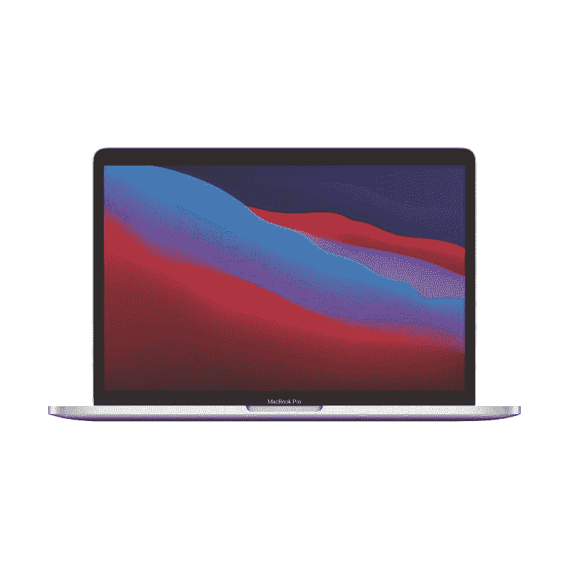

# iMac vs MacBook Air vs MacBook Pro vs Mac Mini:哪款 M1 Mac 适合我？

> 原文：<https://www.xda-developers.com/imac-vs-macbook-air-vs-mac-mini/>

苹果硅继续进入各种 Mac 电脑。首先，它被添加到 MacBook Air、MacBook Pro 和 Mac mini 中。然后到了 24 寸 iMac。该公司现在共有四台采用 M1 芯片的电脑，这就引出了一个问题——你应该选择哪台 M1 Mac 电脑？

幸运的是，由于相同的芯片驱动所有的机器，它们都提供了相似的性能水平。但这只会让在它们之间做出选择变得更加棘手。让我们来分析一下每一款搭载 M1 的 MAC 电脑，看看哪一款最适合你。

## iMac (24 英寸，M1，2021 年)

让我们从苹果 M1 产品线的最新成员开始吧——24 英寸 iMac 。这是一台一体式电脑，这意味着这台电脑的所有功能都集成在它华丽而超薄的屏幕中。它如此纤薄，以至于 iMac 看起来像一个巨大的 [iPad Pro](https://www.xda-developers.com/ipad-pro/) 。除了屏幕，您还可以获得无线键盘和鼠标来帮助您开始使用。

鉴于 iMac 本质上是一个巨大的屏幕，它不应该被移动。因此，如果你正在寻找一台可以放在桌子上的 Mac 电脑，很可能放在你的客厅或书房，并为你提供完整的电脑体验，那么 24 英寸的 iMac 可能适合你。更重要的是，苹果提供了七种充满活力的颜色，结合全新的设计，确保您的 iMac 无论放在哪里都令人愉悦。

iMac 的主要亮点是其 24 英寸 4.5K 视网膜显示屏，提供 4480x2520 像素的分辨率和 500 尼特的亮度。它旨在清晰而详细地展示一切。新款 iMac 比其他 M1 MAC 电脑高出一大截的另一个地方是网络摄像头。它装有一个 1080p 摄像头，结合 M1 芯片的图像信号处理器(ISP)，将把你的视频通话带到一个新的水平。相比之下，MacBook Air 和 MacBook Pro 配备了 720p 网络摄像头，Mac mini 没有配备网络摄像头。

这款 iMac 中 M1 芯片的存在确保了出色的性能，由于热量调节，iMac 中 M1 的功率可能比 MacBook Air 中的芯片更大。iMac 的基本型号配备了一个风扇和 7 核 GPU，而更昂贵的型号配备了两个风扇和 8 核 GPU。因此，如果你在执行 GPU 密集型任务，配备 M1 的高端 iMac 会表现得更好。

iMac 的基本款也不是板载存储和连接的最佳 Mac。苹果在这个版本中只允许 1TB 的存储空间，你只能得到两个 [Thunderbolt](https://www.xda-developers.com/best-thunderbolt-3-laptops/) / USB 4 端口。高端型号允许高达 2TB 的板载存储，并有两个额外的 USB 3 端口。

抛开局限性不谈，iMac 对于那些不追求便携性、想要一台大屏幕、好的网络摄像头和高性能电脑的人来说是一个很好的选择。

 <picture></picture> 

Apple iMac (24-inch, M1, 2021)

##### 苹果 iMac (2021 年)

新款苹果 iMac 采用 M1 芯片，24 英寸 4.5K 视网膜显示屏，高达 16GB 的内存和高达 2TB 的存储空间。

## MacBook Pro (13 英寸，M1，2020 年)

配备 M1 的 13 英寸 MacBook Pro 是一款笔记本电脑，目标客户是想要功能强大的便携式机器的消费者。由于苹果尚未在 16 英寸的 MacBook Pro 中包含自己的硅，13 英寸的 Pro 型号是目前最强大的苹果硅笔记本电脑。这使您可以在任何地方完成所有工作。

苹果还承诺，通过 Apple TV 应用程序，无线网络使用时间可达 17 小时，电影播放时间可达 20 小时。这比 M1 驱动的 MacBook Air 多了大约两个小时。此外，由于捆绑了 61W USB Type-C 充电器，它的充电速度也比空气快得多。

虽然你没有 iMac 那样的 24 英寸 4.5K 视网膜显示屏，但 Pro 上的 13.3 英寸视网膜显示屏实际上提供了更高的每英寸像素，为 226.98 PPI。它在 500 尼特的亮度也和 iMac 一样。

新款 MacBook Pro 在端口方面确实有所欠缺，只有两个 Thunderbolt 端口。总的来说，新的 13.3 英寸 MacBook Pro 对于任何寻求能够轻松承担高要求工作负载的强大笔记本电脑的人来说都是一个很好的选择。它甚至是我们挑选的目前市场上最好的笔记本电脑的一部分。

 <picture></picture> 

13-inch MacBook Pro

##### 苹果 MacBook Pro 13 英寸(M1，2020 年)

苹果 MacBook Pro 采用 M1 芯片，13.3 英寸视网膜显示屏，高达 16GB 的内存和高达 2TB 的存储空间。

## MacBook Air (13 英寸，M1，2020 年)

MacBook Air 长期以来一直是最适合旅行的笔记本电脑，就在它的 Windows 竞争对手开始赶超它的时候，苹果以 M1 芯片的形式给了它急需的动力。苹果硅的存在确保了速度几乎与它的亲兄弟相匹配。它还拥有纤细的设计，是该公司产品组合中最轻的笔记本电脑。

这款笔记本电脑采用了与 MacBook Pro 相同的 13.3 英寸 Retina 显示屏，为消费者提供了清晰的身临其境的体验。然而，你只能获得 400 尼特的亮度，而 Pro 支持 500 尼特。显示器不是 Air 与 Pro 共享的唯一东西。它还配备了相同的 720p 网络摄像头、相同的 RAM 和 SSD 选项、相同的触控板，甚至相同的连接选项，包括端口。

虽然这不一定是一个缺点，但 Air 的超薄设计意味着它在电池方面有所牺牲。它还捆绑了相对较慢的 30W USB Type-C 充电器。Air 的电池仍然非常出色，你可以通过 Apple TV 应用程序进行长达 15 小时的无线网络浏览或长达 18 小时的电影播放。

如果你想要一台超便携的笔记本电脑，并且在性能方面不偷懒，那就别再犹豫了。

 <picture></picture> 

MacBook Air (M1)

##### 苹果 MacBook Air (M1，2020 年)

苹果 MacBook Air 采用 M1 芯片，13.3 英寸视网膜显示屏，高达 16GB 的内存和高达 2TB 的存储空间。

## 苹果迷你电脑(M1，2020 年)

Mac mini 是 M1 苹果公司最实惠的电脑，给消费者提供了很多选择。它是为那些不想在电脑上花太多钱或者喜欢自己的显示器和其他外围设备的人准备的。你买了 Mac mini，它本质上是你电脑的心脏，然后挑选外围设备。如果你以前的台式机上已经有了这些外设，Mac mini 就更有意义了。你不会得到让你的计算机开箱即可工作的便利，这在这里的所有其他选择中都是可能的。

因为它是一台台式机，所以它也可以放在你家里的一个地方，考虑到外设的混搭，它可能看起来不如新的 iMac 漂亮。但是你仍然会得到和其他选择一样强大的 M1 芯片。此外，即使是基本款也有 8 核 GPU 和风扇，这意味着你的机器在原始性能方面不会被任何其他 M1 Mac 超越。它还提供了大量端口选择，包括两个 Thunderbolt/ USB 4 端口、两个 USB-A 端口、一个 HDMI 2.0 端口和千兆以太网。

从本质上说，如果你不回避一点点设置，并正在寻找一个降压计算机爆炸，M1 Mac mini 是一个值得选择。

 <picture></picture> 

Apple Mac Mini M1

##### 苹果 Mac Mini (M1，2020 年)

苹果 Mac mini 配备了 M1 芯片、高达 16GB 的内存和高达 2TB 的存储空间。

* * *

## 我应该买哪一款 M1 Mac？

在所有这些苹果硅驱动的 MAC 电脑中进行选择似乎有些棘手，但只要考虑一下你的需求，事情就会简单得多。如果你想要一台不会被移动的电脑，iMac 是最简单的选择。然而，如果有预算问题，并且你没有问题得到你自己的外围设备，[新的 Mac mini](https://www.amazon.com/2020-Apple-Mini-256GB-Storage/dp/B08N5PHB83?tag=xda-1gumute-20&ascsubtag=UUxdaUeUpU2896&asc_refurl=https%3A%2F%2Fwww.xda-developers.com%2Fimac-vs-macbook-air-vs-mac-mini%2F&asc_campaign=Short-Term) 将会工作得很好。

对于那些寻找便携设备的人来说， [M1 MacBook Air](https://www.amazon.com/Apple-MacBook-13-inch-256GB-Storage/dp/B08N5LNQCX?tag=xda-1gumute-20&ascsubtag=UUxdaUeUpU2896&asc_refurl=https%3A%2F%2Fwww.xda-developers.com%2Fimac-vs-macbook-air-vs-mac-mini%2F&asc_campaign=Short-Term) 是个不错的选择。但是如果你不想在性能方面有所损失，[MacBook Pro 变种](https://www.amazon.com/dp/B08N5N6RSS/?tag=xda-1gumute-20&ascsubtag=UUxdaUeUpU2896&asc_refurl=https%3A%2F%2Fwww.xda-developers.com%2Fimac-vs-macbook-air-vs-mac-mini%2F&asc_campaign=Short-Term)可能更适合你。它会给你带来更亮的显示屏，更好的音频系统，更大的电池和更快的充电器。

无论您最终选择什么，只要确保您得到了您需要的配置，因为您以后将无法升级它。