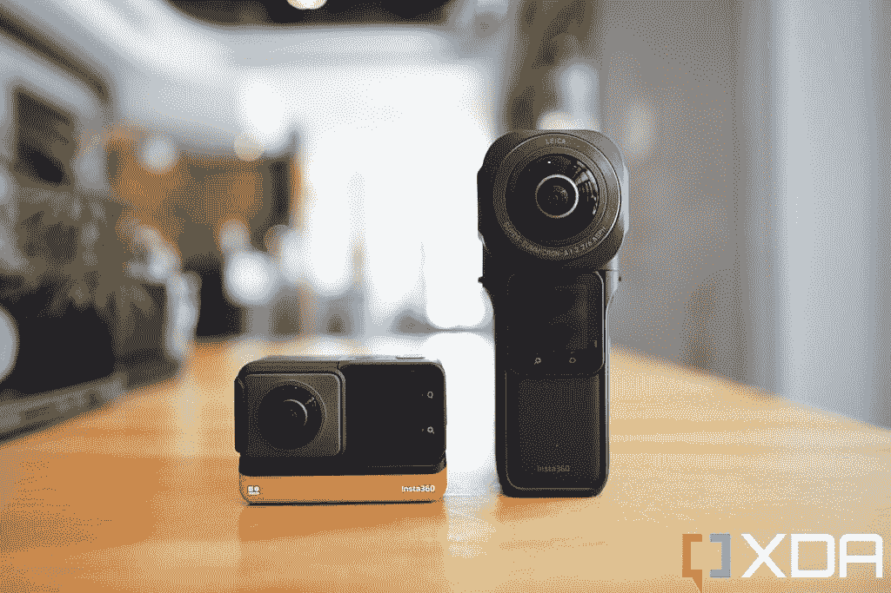
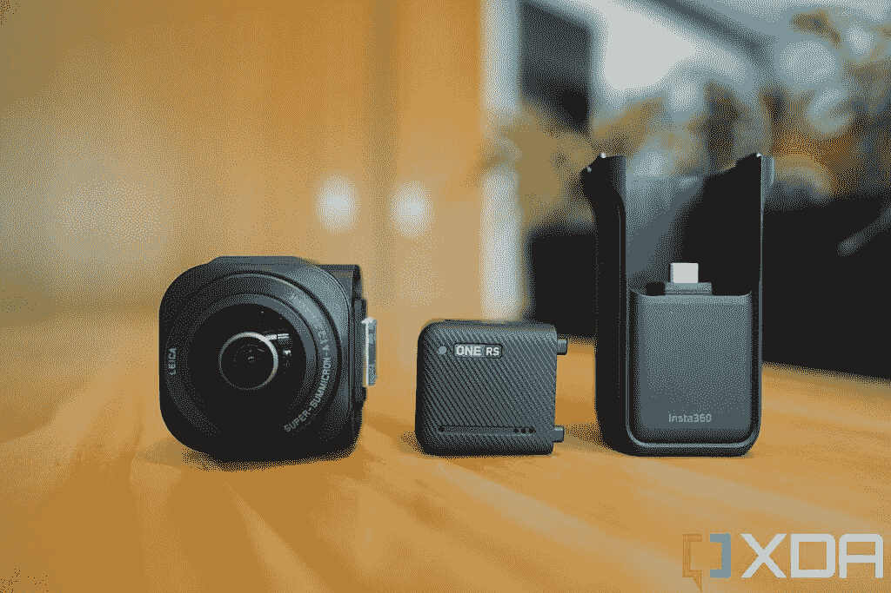
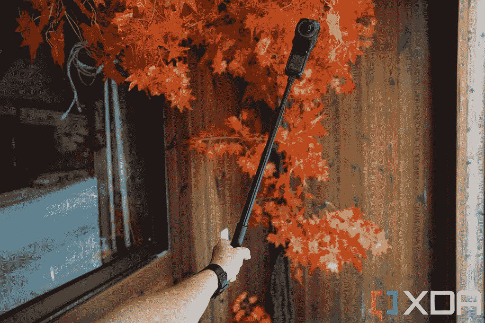
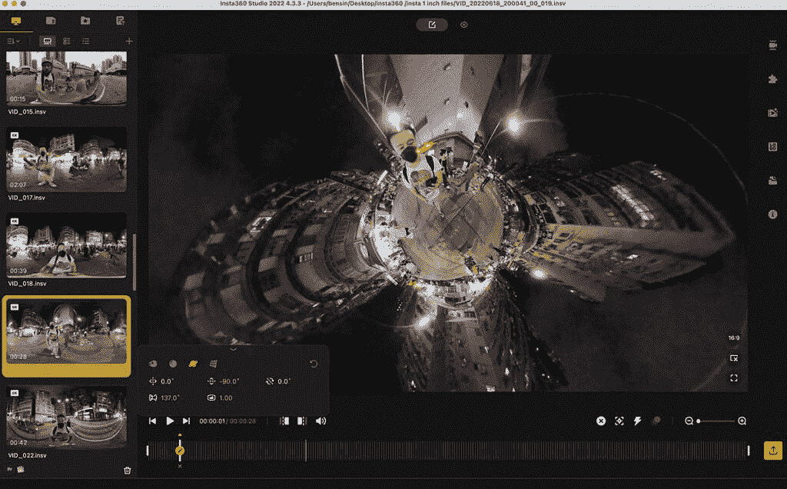

# Insta360 One RS 1 英寸 360 版回顾:徕卡传感器，用于拍摄出色的弱光 360°视频

> 原文：<https://www.xda-developers.com/insta360-one-rs-1-inch-360-edition-review/>

两个月前，我评测了 [Insta360 One RS](https://www.xda-developers.com/insta360-one-rs-review/) ，这是一款模块化相机，可以在几秒钟内从动作相机转变为 360°相机。现在推出了一款名为 Insta360 One RS 1 英寸 360 Edition 的升级型号，顾名思义，它采用了一个带有 1 英寸传感器的高级 360°镜头。提醒你一下，这不是普通的传感器，而是 Insta360 声称与徕卡合作开发的传感器。

1 英寸的图像传感器有两个，因为 360 相机使用两个镜头，只是 Insta360 之前的 360 镜头中 1/2.3 英寸传感器的两倍大小，它立即带来了图像和视频质量的显著改善，特别是在弱光条件下。与之前的 5.7K 相比，更大的传感器还允许相机以 6K 分辨率拍摄。

随着硬件价格的上涨，价格也在上涨。Insta360 One RS 1 英寸 360 版是该公司迄今为止最贵的消费级相机，价格为 799 美元。但它的价格仍然低于市场上其他 1 英寸 360 相机，如 1000 美元的理光 Zeta Z1。很明显，这款新的 Insta360 相机更多地针对“亲消费者”，而不是普通消费者。

 <picture></picture> 

Insta360 One RS 1-inch 360 Edition

##### Insta360 One RS 1 英寸 360 版

标准 Insta360 One RS 的这一升级带来了一个新的 360°镜头，配有一对由徕卡合作设计的 1 英寸传感器

***关于这篇评测:**这篇评测是在对 Insta360 提供的 Insta360 One RS 1 英寸 360 版进行了一周的测试后撰写的。该公司没有参与此次审查。*

* * *

## Insta360 One RS 1 英寸 360 版:定价和供货情况

Insta360 One RS 1 英寸 360 版零售价为 799 美元，在全球的在线和实体零售商处均有销售，如亚马逊和苹果商店，以及 Insta360 自己的在线商店。

799 美元的价格是整套的，包括 1 英寸的镜头，核心，电池底座/安装支架。这是一款模块化相机，有一款更便宜的 649 美元版本，针对拥有现有 Insta360 One R 或 One RS 相机的人。这个版本不包括核心，因为以前相机的旧核心也可以与新的 1 英寸传感器一起工作。

* * *

## 硬件和设计

对于那些不熟悉最初的 Insta360 One RS(两个月前推出)如何工作的人来说:它基本上由四部分组成:一个核心，包含 1 英寸的 LCD 屏幕和相机的大脑；一个电池底座和两个相机“模块”:一个 360°镜头和一个拍摄超宽镜头的 4K 动作镜头。核心和电池底座是必须使用的物品，用户可以在 360°镜头或 4K 镜头之间进行更换。

这款新机型配备了前述的增强型 1 英寸 360°镜头，*需要一个新的电池底座*，它可以兼作底部带有四分之一英寸螺钉的安装支架。核心不变。这意味着那些拥有 Insta360 One RS 的人不需要购买新的内核(因此在定价部分提到了更便宜的套装)。

 <picture></picture> 

The Insta360 One RS released in April (left) and the Insta360 One RS 1-inch 360 Edition with new battery base.

从照片中可以看出，新的 1 英寸型号明显比原来的相机大。1 英寸的镜头模块当然要大得多，但电池底座也要大得多。

 <picture></picture> 

The 1-inch lens (left); the core (middle); the new battery base/mounting bracket (right).

我对整体尺寸(大约六英寸高)和重量(239 克)还算满意，但无论如何，我外出时都会把相机放在背包里。那些倾向于将 Insta360 相机带在身上(放在口袋里)的人可能会发现新的尺寸/重量很笨重。另一个问题是，当我将这款新的 1 英寸版相机安装在加长自拍杆上时(这是大多数用户经常做的事情，因为相机是最好的使用方式)，重量开始给杆带来压力。根据你使用它的程度，这可能会成为一个问题。

 <picture></picture> 

If I extend this stick longer, the weight of the camera starts stressing the stick -- I can see it bend slightly.

内核包含一个用于 microSD 卡的插槽(它没有内部存储)，以及一个用于充电和其他附件的 USB-C 端口。但现在电池底座中也有一个 USB-C 端口，在这种特定型号中更容易访问，因为核心被电池底座/安装支架完全包裹起来。

核心和镜头通过引脚适配器连接，核心通过 USB-C 连接连接到电池底座。电池底座上有电源和录音按钮。当所有部件都连接在一起时，相机的等级为 IPX3，这意味着它只能防溅，不能浸没在水中。这与之前的 Insta360 One RS(或 Insta360 One X2)相比是一个很大的降级，insta 360 One RS 的防护等级为 IP68，每次可以在水下拍摄几分钟。

### 电池

更大的电池底座带来了预期的更长电池寿命。Insta360 One RS 1 英寸版一次充电可拍摄长达 62 分钟。没有人能够连续测试这个，因为 microSD 卡将在一个小时内用完存储空间。但是我已经把这台相机拿出来进行了一个周末的拍摄，在两天的断断续续的使用中拍摄了超过 25 个片段(长度从 10 秒到 5 分钟不等)，相机在周末后仍然有大约 45%的电池，所以我认为电池寿命根本不是问题。

* * *

## 图像质量

新的 1 英寸传感器可以拍摄 6K/30fps 的视频或 21MP 的静态照片。那些不熟悉 360 镜头的人需要知道，这里的分辨率栏是不同的。对于具有固定视野的传统视频，4K 镜头对于地球上 99%的屏幕来说绰绰有余。即使是 1080p 对于大多数人眼来说也足够锐利了(比如我还是不太在乎我的手机屏幕是 1080p 还是 WQHD+)。但 4K 实际上只是 360 镜头的平均分辨率，因为视频捕捉了更多的画布(字面上，你周围的一切)。专业级的 360 摄像机大多是 8K 或者 11K。这意味着 6K 360 视频介于休闲消费级 360 相机和专业级之间。

首先要回答的问题是，与之前的 Insta360 360 相机相比，1 英寸 360 镜头的图像质量到底好多少？下面是一些从新的 1 英寸相机和 Insta360 One X2(使用与旧的 RS 相同的 360 传感器)拍摄的 360°视频中截取的剧照。

这种差异是显而易见的——1 英寸的镜头更清晰，噪音更少——但也许没有听到“徕卡”和“1 英寸传感器”这两个词时预期的那么令人惊讶我认为值得记住的是，这些是从 360 个同时捕捉我周围整个世界的视频中截取的剧照，期望图像质量像 iPhone 13 相机拍摄的那样清晰是不合理的。

1 英寸的镜头更清晰，噪点更少

下面可以看到 360 的镜头——但因为 YouTube 在 4K 分辨率下达到了极限，这些视频被稍微压缩了。我可以确定当直接在我的电脑屏幕上观看时，画面看起来更好一些。

这些视频也是在低光条件下拍摄的，目的是推动相机。如果我使用更好的灯光，镜头看起来会更好。

虽然脸书和 YouTube 等平台支持 360 视频，但 Instagram 或抖音等大多数社交媒体平台不支持。相反，你可以重新构建一个 360°视频(平移、放大和缩小，视情况而定)，然后将其导出为“普通”视频，以便共享。Insta360 是第一款提供这种功能的消费级 360 相机，现在即使几乎所有的 360 相机都可以做到这一点，我仍然发现 Insta360 的软件是最擅长渲染这些重构视频的，就像下面的一个。

如果你想知道相机是如何漂浮在我上方或悬停在我面前的，那是因为 Insta360 的软件会自动将自拍杆从视野中抹去。所以虽然你可以看到我的手拿着什么东西，但你看不到它是什么。

这意味着 Insta360 One RS 1 英寸 360 版可以作为单人拍摄工具。我可以拍摄自己，而不需要有人拿着相机。以前的 Insta360 相机也可以做到这一点，但这里改进的视觉效果使重新构建的镜头看起来更像样一点。

* * *

## 软件

有两种方法可以编辑/调整捕获的视频。第一种是直接通过 Insta360 的移动应用程序，可在 iOS 或 Android 上使用。文件通过蓝牙传输到手机上，从这里，你可以对镜头做任何你想做的事情，包括前面提到的重构，或者调整颜色和应用滤镜。然后，你可以直接从 Insta360 的移动应用程序将文件分享到社交媒体平台，或者直接保存到手机上。

但使用移动应用程序最终会对视频进行压缩，所以那些希望获得最佳视频的人应该使用 Insta360 的桌面应用程序，该程序适用于 Windows 和 macOS。在这里，你得到一个全尺寸的桌面软件，可以让你看到更多，并以苹果的 ProRes 格式或其他视频格式导出。

 <picture></picture> 

Insta360's desktop software.

这个应用程序比桌面软件更容易使用，我认为大多数人使用它都没问题。例如，在手机应用程序上重新构建视频，就是拿着手机四处平移(在你的现实世界空间中)。在桌面软件上，需要用鼠标光标设置相机枢轴点。

* * *

## 该不该买 Insta360 One RS 1 寸 360 版？

**您应该购买 Insta360 One RS 1 英寸 360 版，如果:**

*   您希望在弱光条件下拍摄 360°视频，而不像大多数消费级 360°相机那样图像质量明显下降。
*   你想要一个多功能的相机，既可以是 360°相机，也可以是传统的 GoPro 风格的动作相机。
*   你想要最好的便携式 360°摄像机来记录你的生活。

**你不应该购买 Insta360 One RS 1 英寸 360 版，如果:**

*   白天，在良好的光线下，你可以进行更多的 360°视频拍摄。标准的 One RS 是更好的选择。
*   你想要一个 360 度的水下探险相机。
*   你已经拥有了几个月前发布的 Insta360 One RS。

在过去的几年里，Insta360 的相机一直是我旅行时的必备物品，因为我喜欢拍摄我的整个环境，然后再重新构建视频的能力。对于像我这样经常独自旅行的人来说，这是非常有益的，因为 360°相机的特性意味着我可以在不需要帮助的情况下拍摄自己。

在过去的几年里，Insta360 的相机一直是我旅行时的必备物品

过去，我曾简单推荐过 Insta360 相机，但这款相机比较复杂，因为它的价格高达 799 美元。我两个月前评测的标准版 Insta360 One RS 售价 550 美元，该套装包括这套不含的 4K 动作镜头。所以对大多数人来说，标准版可能是更好的选择。还有 Insta360 One X2，这是一款独立的 360°相机，售价 450 美元。1 英寸的传感器确实可以产生更高质量的 360 视频，但对于大多数人来说，它值得多花 250 美元或 350 美元吗？我认为不是。

但 Insta360 One RS 1 英寸 360 版将拥有自己的客户群:拥有大量社交媒体追随者的职业冒险家。

抖音和 Instagram 故事最近风靡一时，只要看一眼 Insta360 的 Instagram 账户，你就会发现有许多跳伞运动员、跑酷练习者、滑板运动员和山地自行车手依靠 Insta360 相机捕捉他们的镜头。对于这些人来说，800 美元的画质提升是值得的。

 <picture></picture> 

Insta360 One RS 1-inch 360 Edition

##### Insta360 One RS 1 英寸 360 版

标准 Insta360 One RS 的这一升级带来了一个新的 360°镜头，配有一对由徕卡合作设计的 1 英寸传感器