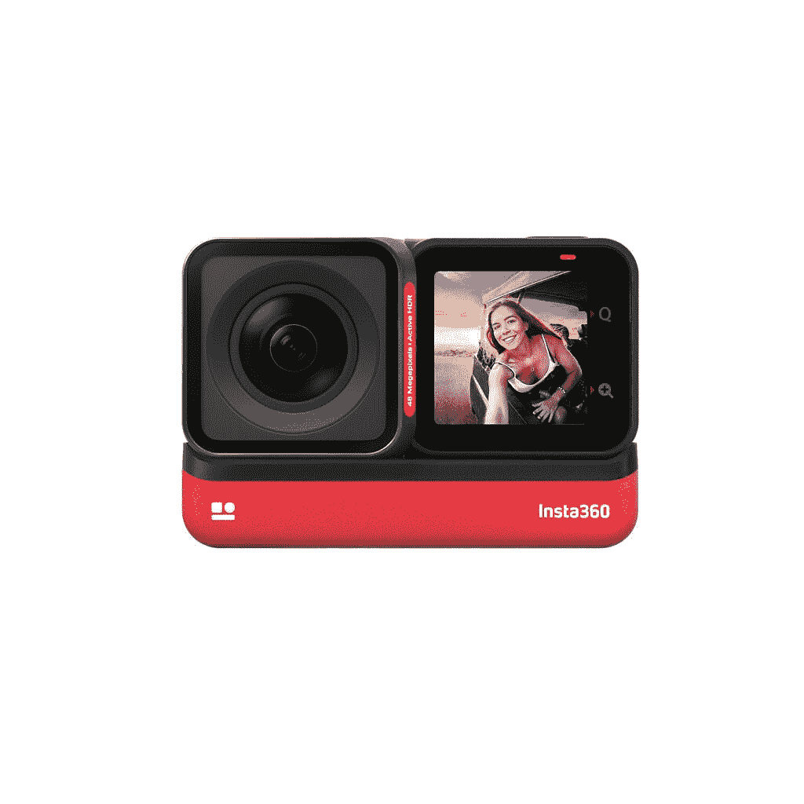
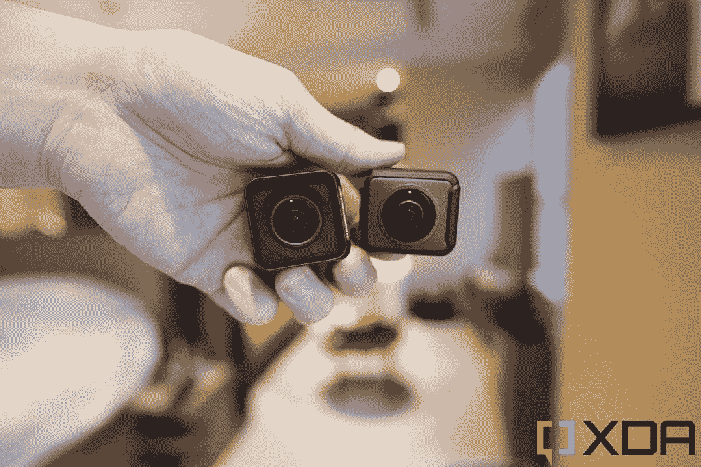
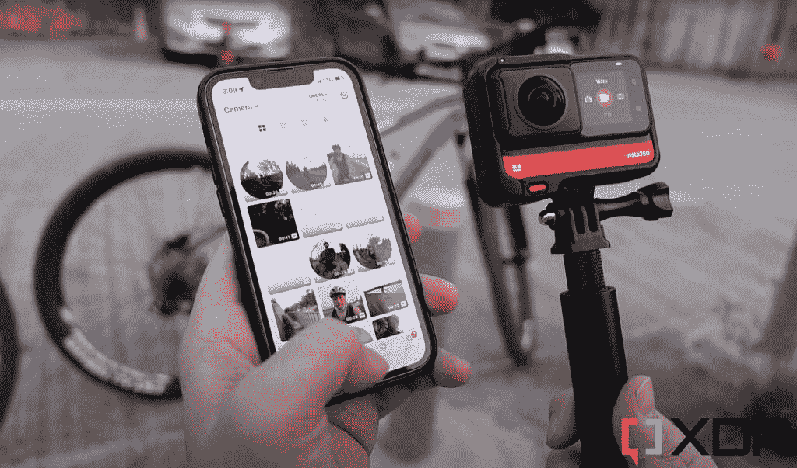

# Insta360 One RS 点评:集史诗动作相机和 360°相机于一身

> 原文：<https://www.xda-developers.com/insta360-one-rs-review/>

当你想到动作相机——那些极限运动爱好者放在头盔、肩膀、背包等上面的小型立方体广角相机——第一个想到的品牌可能是 GoPro。但近年来，GoPro 遇到了来自 Insta360 的主要竞争，insta 360 是一个中国新贵品牌，以其非常受欢迎的 360 度相机而闻名。Insta360 的最新产品 One RS 是一款可以通过模块化从标准动作相机转变为 360 度相机的相机。这个概念是原创的，硬件是精心打造的，但也许最重要的是，它的出色软件功能使 Insta360 相机(不仅仅是 One RS)使用起来如此有趣。

***关于这个评测:** Instas360 三月初给我发了一个 One RS Twin 版评测。Insta360 没有参与此次审查。*

* * *

## Insta360 One RS:定价和供货情况

Insta360 One RS 是一款模块化相机，其部件可以单独出售，也可以各种组合出售。最常见的包装是 549 美元的“双版本”，包括核心，电池底座，4K 动作镜头和 360 相机镜头，以及安装支架。还有一款 299 美元的“4K 版”，包括上述所有功能，但省略了 360°镜头(这意味着你实际上只购买了一台动作相机)；549 美元的“1 英寸版”包括核心、电池底座和一个带有 1 英寸传感器的徕卡品牌动作镜头。

所有这些包现在都可以在 Insta360 的网站或亚马逊上订购。

 <picture></picture> 

Insta360 One RS

##### Insta360 One RS

Insta360 One RS 是一款模块化摄像机，可以在 30 秒内从动作摄像机变成 360°摄像机

* * *

## 设计和硬件

Insta360 One RS 由三部分组成:

*   一个核心，包含一个未公开的处理器，一个 1.5 英寸的屏幕，麦克风，MicroSD 卡插槽和 USB-C 端口
*   1，445 毫安时的电池底座
*   相机镜头(有三个选项)

这三个镜头选项包括一个 4K 广角动作镜头(官方名称为 4K 增强镜头)，可以拍摄相当于 16 毫米焦距的镜头；一个 360°镜头(由两个各具有 180 度 FoV 的 5.7K 鱼眼镜头组成)；和一个徕卡品牌的广角 1 英寸传感器(这基本上是 4K 增强镜头的高级版本，具有更大的传感器，可以吸收更多的光)。

 <picture></picture> 

The 4K Boost lens (left) and 360 lens (right).

Insta360 将单独出售上述所有部件，以及包括一个或多个镜头的包装。我测试了“双版本”，包括 4K 增强镜头和 360 镜头，以及一个安装支架。

所有这些部件都通过销槽连接(类似于 80/90 年代任天堂盒式磁带中的销槽)，并轻松地咬合到位。一旦连接上，整个套件感觉很坚固，就像是一个整体。如果连接正确，One RS 的防水等级实际上为 IPX8，水下可达 16 英尺。

连接后，Insta360 One RS 的重量为 121 克(4.3 盎司)，尺寸为70.1 x 49.1 x 32.6 毫米。这比 GoPro Hero 10 Black 和 DJI Action 等独立的动作相机要大一些，也重一些。

核心采用电源和快门两个物理按键；USB-C 和 Micro-SD 卡插槽(均由防水盖覆盖；麦克风；以及支持触摸和滑动的 1.5 英寸 LCD 屏幕，以通过相机的用户界面进行导航。用户可以通过与触摸屏互动，或通过手机上的 Insta360 配套应用程序直接控制相机。我会在软件部分多讲讲 app。屏幕还可以用作取景器，由于其模块化的特性，它可以与镜头位于同一侧(用于自拍和视频日志)或相反侧(用于在用户面前捕捉镜头)。

4K Boost 镜头可以在正常模式下拍摄 4800 万张静态照片或录制高达 4K/60fps 的视频，或在类似变形的超宽屏模式下录制 6K/24fps 的视频。与此同时，360 镜头可以以 30fps 的速度录制高达 5.7K 的 360 度视频，或以高达 100fps 的速度录制较低分辨率的视频。

1，445 mAh 的电池底座允许 Insta360 One RS 在一次充电后拍摄约 70 分钟。

One RS 是立方体形状，显然可以独自在表面上直立，但大多数用户会希望将其与安装支架配对，该支架包含在 Twin Edition 中。这是一个快速释放支架，这意味着按下按钮将打开一个挡板，Insta360 One RS 将通过它滑入和滑出。底座底部有四分之一英寸的螺纹，这是自拍杆、三脚架等广泛使用的标准。

* * *

## 使用 Insta360 One RS

Insta360 One RS 内置麦克风和触摸屏，可以轻松导航到所有拍摄模式，几乎可以开箱即用地开始拍摄-它只需要一个单独购买的 MicroSD 卡。一旦做到了这一点，Insta360 One RS 就可以作为一台独立的相机独立运行，甚至不需要智能手机。您可以通过内置屏幕预览场景，按下按钮进行录制，查看屏幕上拍摄的镜头，并通过 MicroSD 卡将文件传输到计算机。

然而，通过 Insta360 配套应用程序(可在 iOS 和 Android 上使用)将 Insta360 One RS 与智能手机配对会使体验更加轻松。例如，你可以在一个更大的屏幕上预览和回顾视频。该应用程序还提供高级相机设置，如调整曝光和白平衡，也许最有用的是，你可以用手机远程控制 Insta360 One RS。你不必触摸相机本身来改变拍摄模式或开始录制。在这之后，我将在软件部分详细介绍 Insta360 应用程序。

 <picture></picture> 

Insta360 One RS connected to an iPhone 13 Mini

[sc name = " pull-quote-wide " quote = " Insta360 One RS 可以作为独立的相机使用，但与 insta 360 的应用程序配合使用会更加方便"]

凭借 4K 增强镜头，One RS 是一款相当典型的动作相机，这意味着它可以捕捉到清晰的视野，一切都在焦点上。镜头内部有光学稳定功能，但 Insta360 的软件稳定功能也非常出色，因为即使在我走路、骑自行车或全速奔跑时，镜头也基本稳定流畅。由于超宽的 16 毫米焦距，我可以用手握住遥感器，伸出手臂，仍然可以将我的整个头部和肩膀放在 vlogs 的框架中。增加一个自拍杆显然会有所帮助，并有助于更广泛的取景，不仅显示我，还显示我的背景。内部麦克风在捕捉我的声音方面做得不错，Insta360 的软件会自动应用去噪算法来消除背景声音——尽管这让我的声音听起来数字化了。

下面是一组 4K 增强镜头的镜头，拍摄于白天和夜晚。请注意，即使我全速奔跑，稳定性也非常好。动态范围在白天拍摄时也非常出色。显然，在晚上，视频质量会受到影响，有明显的噪音。

切换到 360°镜头，Insta360 One RS 可以捕捉高达 5.7K 的 360 度镜头。与几乎所有 360 相机一样，这里的镜头只是两个 180 度超级鱼眼视频拼接在一起，Insta360 的软件在隐藏缝合线方面做得很好。这不应该是一个惊喜，因为 360 相机最终是 Insta360 的主要声誉。其独立的 360°摄像机 One X2 被广泛认为是市场上最好的消费级 360°摄像机。One RS 的 360 度镜头实际上与 One X2 的镜头完全相同，所以你得到的是完全相同的 360 度镜头。

虽然 360 度视频可以用 VR 头戴设备或在 YouTube 上观看，但我更喜欢将 360 度视频重新构建为常规视频，以便上传到 Instagram。为此，Insta360 开发了这个创造性的软件技巧，让我可以在现有的 360 度镜头周围平移，按照我认为合适的方式设置取景，然后用这些相机运动渲染一个常规视频。下面是一个例子:这是一个 360 视频，我重新设计了它，让它看起来像是有一个摄影师在乐队周围平移(顺便说一下，我是打鼓的)。事实上，摄像机只是静止在乐队房间的中央。请注意，音频虽然不惊人，但可以认为是好的，因为音频是由 One RS 的内置麦克风捕捉的。

下面是更多重构的 360 样张，大多是晚上拍的。虽然夜晚的香港仍然光线充足，但它仍然被认为是弱光环境，而且镜头基本上没有噪音。

你会注意到在上述视频的一些角度，它看起来像是相机漂浮在我的上方，好像它安装在无人机上。不是的。事实上，One RS 只是连接到一个加长的自拍杆上。Insta360 的软件会自动将自拍杆从场景中擦除。在下面的剧照中，你可以看到我伸开双臂，抱着一个已经被数码删除的东西。

通过这两个镜头，Insta360 One RS 可以以不同的速度拍摄延时视频，以及慢动作(速度降低高达 8 倍)。对于 360 视频，Insta360 One R 的镜头与任何竞争对手的消费级 360 相机一样清晰，而 4K 动作摄像头的镜头也不错，但被 GoPro Hero 10 击败，它可以拍摄 4K/120fps。

* * *

## Insta360 One RS:软件

但是真正起作用的是软件。Insta360 既有前面提到的 iOS 和 Android 的移动应用程序，也有 Windows 和 Mac 的桌面软件。说实话，移动应用程序往往更容易使用，更直观，但需要桌面软件来渲染 6K 宽屏镜头。我使用 Insta360 产品多年，99.9%的时间都在使用手机 app。

移动应用程序通过几次点击无线连接到 One RS 然而，这个过程在 iOS 应用程序上比在 Android 应用程序上快得多(我们谈论的是 10 秒对 1 分钟)。一旦连接，两个版本的应用程序有相同的界面。

在应用程序中，我们可以直接在手机屏幕上看到相机的取景器，直接在应用程序中控制相机，以及对已经拍摄的镜头进行编辑。对于一个免费的移动应用程序来说，编辑套件相当令人印象深刻——你不仅可以修剪长度，切换纵横比(16:9，9:16，1:1)并将视频渲染到手机的存储中，你还可以应用美颜滤镜来放大眼睛或提亮皮肤(唉)。色温、对比度、整体亮度也可以调整，但还有一个一站式的“颜色增强”按钮，它使用人工智能自动应用调整。我发现它在很大程度上运行良好。

对于 4K Boost 镜头镜头，编辑很简单，几乎就像你在修复任何普通的智能手机镜头。然而，使用 360 镜头，我们可以做很多事情，包括前面提到的将 360 视频重新构建为普通视频。我们可以用手指挤压和滑动镜头，或者通过标记相机移动的枢轴点来构建视频。

上面的 gif 被严重压缩，但在下面的截图中，你可以看到 5.7K 360 镜头即使放大也看起来相当清晰。这意味着 Insta360 拍摄的 360 镜头提供了一个非常多样化的竞技场。我可以一路放大到一个微小的类似行星的镜头，或者一路拉近来观察我周围风景的细节。

* * *

## 谁应该购买 Insta360 One RS？

Twin Edition 549 美元的价格乍一看似乎很高，但当你考虑到你正在获得一台高质量的 4K 动作相机和一台 360 相机时，这个价格是合理的。光是一台 GoPro Hero 10 就要 500 美元；GoPro 的一台独立 360°相机售价 400 美元。

如果你是一名户外冒险家，想要一台可以捕捉场景中几乎所有事物的多功能相机，Insta360 One RS 是最佳选择之一

如上所述，我认为 Insta360 的软件优于我测试过的 DJI 和 GoPro 的竞争产品，尤其是 reframing 功能。老实说，我经常觉得我没有充分利用 Insta360 360 相机，因为我只是用它们在街上散步，或者偶尔骑自行车。Insta360 的 360°镜头非常受那些参加极限户外活动的人的欢迎，如跳伞、骑越野车等。当我看到那段视频(经常被 Insta30 的 Instagram 账户分享)时，我感到敬畏。

如果你是一名户外冒险家，想要一台可以捕捉场景中几乎所有东西的多功能相机，Insta360 One RS 是最佳选择之一。如果你既不需要 360°镜头也不需要动态镜头，有更便宜的套装，价格可以低 100 美元左右。

 <picture></picture> 

Insta360 One RS

##### Insta360 One RS

对于第一次尝试 Insta360 产品的人来说，这是最佳选择——该套件包括 4K 动作镜头和 360°镜头，只需快速更换镜头，您就可以捕捉广角稳定 4K 镜头或 360 度视频。