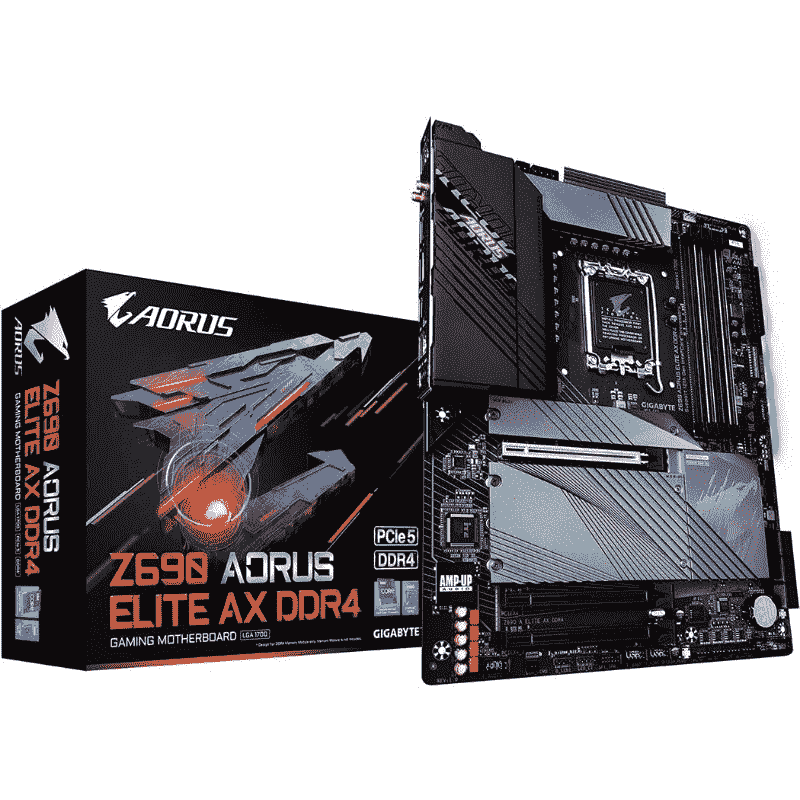
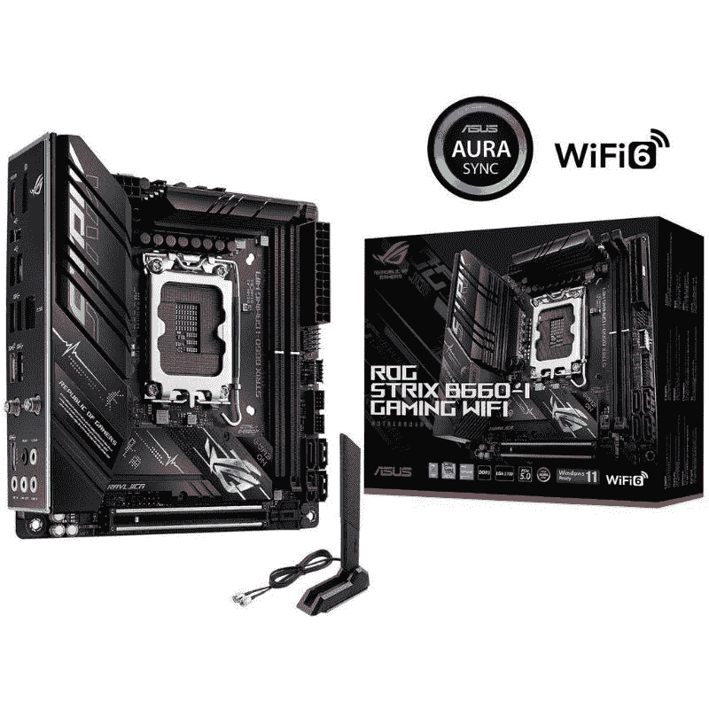

# 英特尔第 12 代处理器支持 PCIe 5.0 吗？

> 原文：<https://www.xda-developers.com/intel-12th-gen-pcie-50/>

英特尔的新 Alder Lake CPUs 现在已经上市，它们比上一代芯片有了很大的改进。从新的混合核心架构到支持包括 DDR5 RAM 支持在内的高级功能，新的 Alder Lake 芯片有很多值得期待的地方。这些处理器最棒的一点是，所有这些出色的功能还扩展到了第 12 代移动芯片。我们强烈建议您查看我们专门的[英特尔第 12 代 Alder Lake hub 页面](https://www.xda-developers.com/intel-12th-gen-alder-lake/#platform)，了解有关这些新处理器的一切。

英特尔新的 Alder Lake 处理器还支持 [PCI Express 5](https://www.xda-developers.com/pcie-5/) ，这意味着新芯片将能够利用市场上所有高速 PCIe 5.0 外设。如果你不知道，新的 PCIe 5.0 标准提供了难以置信的快速传输速度，与 PCIe 第四代标准相比，带宽增加了一倍。还值得指出的是，英特尔的 Alder Lake 平台是第一个支持 PCIe 5.0 的平台，所以如果你想要新的界面，你的选择相当有限。考虑到目前市场上没有消费级 PCIe 5.0 外设，这未必是一件坏事。预计 AMD 将于今年晚些时候推出锐龙 7000 系列芯片，加入这场竞争。

## 所有英特尔 Alder Lake 处理器都支持 PCIe 5 吗？

这个问题的简短答案是否定的。只有第 12 代 Alder Lake 台式机部件支持 PCIe 第 5 代支持。这意味着，所有移动芯片——包括[阿尔德莱克 H 系列](https://www.xda-developers.com/intel-12th-gen-core-h-series-processors-announced-for-the-next-gen-gaming-laptops/)，P 系列和 U 系列芯片——只支持 PCIe 4.0。据该公司称，缺乏最终用户 PCIe 第五代产品和缺乏时间来验证更快的接口是没有将 PCIe 5.0 支持添加到移动芯片的原因。

在这个桌面端，Alder Lake 芯片通过 x16 通道连接支持高达 64 GB/s 的吞吐量的 PCIe 5.0。这些芯片支持 x16 PCIe 5.0 连接以及额外的 x4 PCIe 4.0 连接。另一方面，Alder Lake 系列中的低功率型号支持 x12 PCIe 4.0 配置和 x16 PCIe 3.0 连接。下面快速浏览一下英特尔 600 系列芯片组，让您了解芯片组 PCIe 通道和 DMI 通道支持:

为了利用 Alder Lake 的 PCIe 5.0 支持，您也需要一个兼容的主板。幸运的是，几乎所有的 [LGA1700 主板](https://www.xda-developers.com/best-lga-1700-motherboard/)包括一些高端 Z690 和更实惠的 B660 主板都支持 PCIe Gen 5。PCIe 5 插槽的数量取决于每个主板的设计，但可以肯定地说，你至少会在主插槽上获得支持。下面我们将介绍几款具有 PCIe 5.0 插槽的主板，请务必查看一下。

 <picture></picture> 

Gigabyte Z690 Aorus Pro

##### 技嘉 Z690 Aorus Pro

技嘉 Z690 Aorus Pro 是市面上比较实惠的 Z690 主板之一。

 <picture></picture> 

ASUS ROG Strix B660-I Gaming WiFi

##### 华硕 ROG Strix B550-F 游戏 Wi-Fi

华硕 ROG Strix B660-I 游戏 WiFi 是价格实惠的 B660 型号之一，采用迷你 ITX 外形，支持 PCIe 5.0。

## 最后的想法

所以，为了回答手头的主要问题——英特尔第 12 代 Alder Lake 支持 PCIe 5.0 吗？是的，在 Alder Lake 平台上有 PCIe 第五代支持，但只有桌面部分是兼容的，而不是移动芯片。您还需要一个兼容的支持 PCIe 5 的主板来使用新的外设。如果您想了解 PCIe 5.0 兼容处理器和主板的最新列表，请务必查看我们收集的[最佳 CPU](https://www.xda-developers.com/best-cpus/)和[最佳主板](https://www.xda-developers.com/best-motherboard/)，因为我们会不断更新这些列表，推出市场上的新选项。