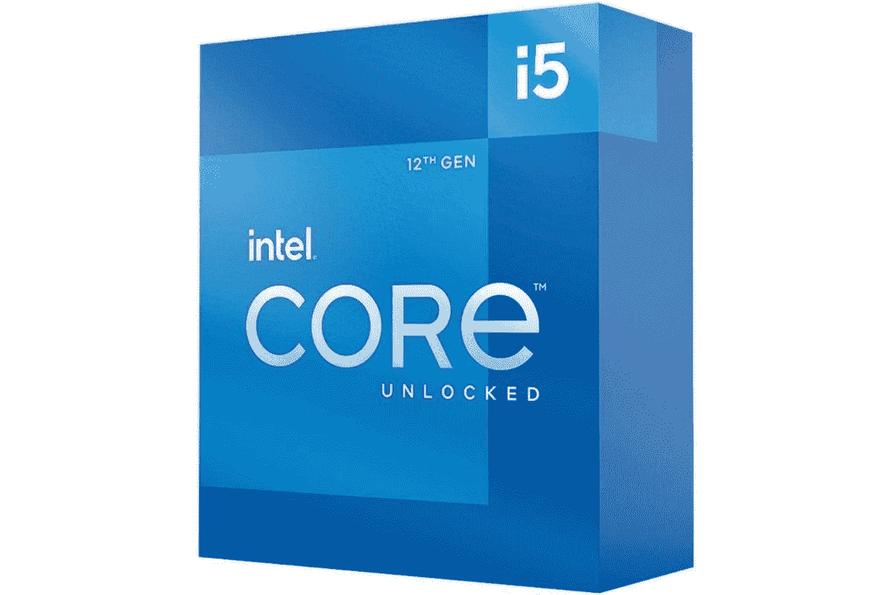

# 英特尔第 12 代与第 11 代台式机处理器:您应该购买哪一款？

> 原文：<https://www.xda-developers.com/intel-12th-gen-vs-11th-gen/>

新的第 12 代英特尔酷睿处理器终于到来，它们比上一代处理器有了一些重大改进。我们已经为我们的 [Alder Lake review](https://www.xda-developers.com/intel-alder-lake-review/) 测试了几个这样的芯片，可以肯定地说它们是目前市场上[最好的 CPU](https://www.xda-developers.com/best-cpus/)之一。从新的混合核心架构到为发烧友提供的令人惊讶的超频扩展空间，Alder Lake 使英特尔在竞争中重新获得了性能领先优势。但是，与第 11 代相比，英特尔第 12 代到底有多大的改进呢？

## 英特尔第 12 代与第 11 代台式机处理器:规格

在我们开始比较并讨论平台和兼容性等问题之前，我们认为最好先了解一下每一代处理器的规格。虽然纸面上的规格并不总是实际现实性能的指标，但它们仍然清楚地描绘了每个处理器在日常性能方面的预期。

让我们先来看看每一代的未锁定部分，看看有什么不同:

| 

规格

 | 

英特尔酷睿 i9-12900K

 | 

英特尔酷睿 i9-11900K

 | 

英特尔酷睿 i7-12700K

 | 

英特尔酷睿 i7-11700K

 | 

英特尔酷睿 i5-12600K

 | 

英特尔酷睿 i5-11600K

 |
| --- | --- | --- | --- | --- | --- | --- |
| **内核** | 16 (8P + 8E) | 8 | 12(8 便士+ 4E) | 8 | 10 英镑(6 便士+ 4E) | 6 |
| **螺纹** | 24 | 16 | 20 | 16 | 16 | 12 |
| **基频** | 3.2GHz (P 内核)&#124; 2.4GHz (E 内核) | 3.5 千兆赫 | 3.6GHz (P 内核)&#124; 2.7GHz (E 内核) | 3.06 千兆赫 | 3.7GHz (P 内核)&#124; 2.8GHz (E 内核) | 3.9 千兆赫 |
| **升压频率** | 5.0GHz (P 内核)&#124; 3.8GHz (E 内核) | 5.3 千兆赫 | 4.9GHz (P 内核)&#124; 3.8GHz (E 内核) | 5.0 千兆赫 | 4.9GHz (P 内核)&#124; 3.6GHz (E 内核) | 4.9 千兆赫 |
| **三级高速缓存** | 30MB | 16MB | 25MB | 16MB | 16MB | 12MB |
| **默认 TDP** | 125 瓦 | 125 瓦 | 125 瓦 | 125 瓦 | 125 瓦 | 95W |
| **内存支持** | DDR4 3200MT 公吨/秒&#124; DDR 5-4800 公吨/秒 | DDR4 3200MT 公吨/秒 | DDR4-3200 &#124; DDR5-4800 | DDR4-3200 | DDR4-3200 &#124; DDR5-4800 | DDR4-3200 |
| **集成显卡** | UHD 图形 770 | 英特尔 UHD 显卡 750 | 英特尔 UHD 显卡 770 | 英特尔 UHD 显卡 750 | 英特尔 UHD 显卡 770 | 英特尔 UHD 显卡 750 |
| 

RCP 定价

 | $589 | $549 | $409 | $409 | $289 | $272 |

您马上会注意到的第一件事是第 12 代 Alder Lake CPUs 上更高的内核数和线程数。值得注意的是，我们现在看到的是增加了 Gracemont E-cores 来处理高度线程化的任务。顾名思义，与负责高优先级任务的 P 内核相比，效率内核的功耗非常低。P-core 针对处理单线程和轻度线程任务进行了优化。这些内核在设计上类似于英特尔第 11 代处理器上的未锁定内核，这意味着它们将根据任务最大限度地提高频率。

对于第 11 代 Rocket Lake CPUs，我们有一个最多八个内核的标准设置，峰值提升可达 5.3 GHz。Windows 任务调度器以最快的两个活动内核为目标，也就是在某些情况下支持线程较少的应用程序的内核。事实上，Rocket Lake 芯片利用了几种不同的加速技术，包括 Turbo Boost 2.0、Turbo Boost Max 3.0、单核热速度加速、全核热速度加速等等。

现在，让我们快速浏览一下这两代产品的主流和低功耗器件的规格:

| 

**规格**

 | 

**英特尔酷睿 i9-12900**

 | 

**英特尔酷睿 i9-11900**

 | 

**英特尔酷睿 i7-12700**

 | 

**英特尔酷睿 i7-11700**

 | 

**英特尔酷睿 i5-12600**

 | 

**英特尔酷睿 i5-11600**

 | 

**英特尔酷睿 i5-12500**

 | 

**英特尔酷睿 i5-11500**

 | 

**英特尔酷睿 i5-12400**

 | 

**英特尔酷睿 i5-11400**

 | 

**英特尔酷睿 i3-12300**

 | 

**英特尔酷睿 i3-12100**

 |
| --- | --- | --- | --- | --- | --- | --- | --- | --- | --- | --- | --- | --- |
| **核心** | 16 (8P + 8E) | 8 | 12(8 便士+ 4E) | 8 | 6 (6P + 0E) | 6 | 6 (6P + 0E) | 6 | 6 (6P + 0E) | 6 | 4 (4P + 0E) | 4 (6P + 0E) |
| **螺纹** | 24 | 16 | 20 | 16 | 12 | 12 | 12 | 12 | 12 | 12 | 8 | 8 |
| **基频** | 2.4GHz (P 内核)&#124; 1.8GHz (E 内核) | 3.5 千兆赫 | 2.1GHz (P 内核)&#124; 1.6GHz (E 内核) | 2.5 千兆赫 | 3.3GHz | 2.8GHz | 3.0 千兆赫 | 2.7 千兆赫 | 2.5 千兆赫 | 2.6 千兆赫 | 3.5 千兆赫 | 3.3GHz |
| **升压频率** | 5.0GHz (P 内核)&#124; 3.8GHz (E 内核) | 5.3 千兆赫 | 4.8GHz (P 内核)&#124; 3.6GHz (E 内核) | 4.9 千兆赫 | 4.8GHz | 4.8GHz | 4.6 千兆赫 | 4.6 千兆赫 | 4.4GHz | 4.4GHz | 4.4GHz | 4.3GHz |
| **三级高速缓存** | 30MB | 16MB | 25MB | 16MB | 18MB | 12MB | 18MB | 12MB | 18MB | 12MB | 12MB | 12MB |
| **默认 TDP** | 65W | 65W | 65W | 65W | 65W | 65W | 65W | 65W | 65W | 65W | 60W | 60W |
| **内存支持** | DDR4 3200MT 公吨/秒&#124; DDR 5-4800 公吨/秒 | DDR4 3200MT 公吨/秒&#124; DDR 4-2933 公吨/秒 | DDR4 3200MT 公吨/秒&#124; DDR 5-4800 公吨/秒 | DDR4-3200 &#124; DDR4-2933 | DDR4-3200 &#124; DDR5-4800 | DDR4-3200 &#124; DDR4-2933 | DDR4-3200 &#124; DDR5-4800 | DDR4-3200 &#124; DDR4-2933 | DDR4-3200 &#124; DDR5-4800 | DDR4-3200 &#124; DDR4-2933 | DDR4-3200 &#124; DDR5-4800 | DDR4-3200 &#124; DDR5-4800 |
| **集成显卡** | UHD 图形 770 | 英特尔 UHD 显卡 750 | 英特尔 UHD 显卡 770 | 英特尔 UHD 显卡 750 | 英特尔 UHD 显卡 770 | 英特尔 UHD 显卡 750 | 英特尔 UHD 显卡 770 | 英特尔 UHD 显卡 750 | 英特尔 UHD 显卡 730 | 英特尔 UHD 显卡 730 | 英特尔 UHD 显卡 730 | 英特尔 UHD 显卡 730 |
| 

**RCP 定价**

 | $489 | $439 | $339 | $323 | $223 | $213 | $202 | $192 | $192 | $182 | $143 | $122 |

除了上面提到的，您还可以购买不带集成显卡的各种 CPU。此外，上面提到的每个 CPU 还有一个“T”变体，它本质上是一个低功耗单元，默认为 35W，而不是大多数情况下看到的 65W。还值得指出的是，我们去年看到了第 10 代酷睿 i3 处理器，而不是新的第 11 代 i3 芯片，这就是为什么我们没有将它们添加到组合中。

当谈到这些芯片的整体性能时，英特尔声称一些大数字。据说，在一些内容创作工作负载中，英特尔酷睿 i5-12600 比 AMD 锐龙 7 5700G 快 31%。这意味着新的 12600 也一定会超过锐龙 5600G。这肯定不是第 11 代芯片的情况，因为锐龙 CPU 声称全面获胜。英特尔还声称性能大幅提升，至少在酷睿 i9-12900 与上一代酷睿 i9-11900 CPU 的对比中是如此。不言而喻，供应商提供的基准测试应该有所保留，这就是为什么一旦我们有机会自己测试新的 CPU，我们将更新本文。

## 英特尔第 12 代和第 11 代台式机处理器:平台和兼容性

### DDR5 内存

所有新的 Alder Lake CPUs 都支持 DDR4 和新的 [DDR5 内存套件](https://www.xda-developers.com/best-ddr5-ram/)。这被认为是这一代最大的升级之一，因为 Rocket Lake 芯片只正式支持 DDR4。事实上，英特尔的新 Alder Lake CPUs 是第一款支持 DDR5 的现代计算芯片。AMD 新的[锐龙 6000 系列](https://www.xda-developers.com/amd-ryzen-6000/)移动芯片有 DDR5 内存支持，但桌面领域的 DDR5 支持只会随着其 [7000 系列芯片](https://www.xda-developers.com/amd-teases-ryzen-7000-processor-am5/)到来。

DDR5 标准的到来无疑为更高的性能水平打开了大门，但不言而喻，DDR5 作为一种标准仍处于初级阶段。正如我们在 [DDR4 与 DDR5 内存比较](https://www.xda-developers.com/ddr4-vs-ddr5/)中提到的，性能确实有所提升，但还不足以保证升级，至少不会立即升级。我们认为 DDR5 是一个很好的选择，值得考虑未来的价值，但 DDR4 一定会为您的资金提供更多价值。

### PCIe 5.0 支持

英特尔的 Rocket Lake CPUs 于去年推出，支持 PCIe 4.0，该公司已经在推进 PCIe 5.0 支持。英特尔的新 Alder Lake 芯片支持 PCIe 5.0，通过 x16 通道连接的吞吐量为 64 GB/s。台式电脑芯片支持一个 x16 PCIe 第五代连接和一个附加的 x4 PCIe 第四代连接。这是购买新 CPU 时需要考虑的另一个重要升级。那么，PCIe 5.0 带来了多大的改进呢？

几代 PCI Express 之间最大的改进之一是带宽的增加。也就是说，拥有 PCIe 5.0 的唯一真正优势，至少在消费者方面，是高速存储。目前市场上的 [m.2 NVMe 硬盘](https://www.xda-developers.com/best-m-2-ssd/)可以达到每秒 6900 兆字节的连续读取速度。PCIe 5.0 硬盘可能会使这个数字翻一番。例如，三星已经为企业市场宣布了速度高达 13000 兆字节/秒的 [PCIe 5 固态硬盘](https://www.xda-developers.com/samsung-announces-pcie-5-ssd-enterprise/)。这些高速驱动器进入消费者领域只是时间问题。

[显卡](https://www.xda-developers.com/these-are-the-best-graphics-cards-you-can-buy-nvidia-geforce-rtx-3080-amd-radeon-rx-6800-xt-and-more/)也使用 PCI Express 连接，但它们并不真的需要太多的带宽。即使是英伟达最强大的消费级 GPU，RTX 3090，也只能完全使用 PCIe 4.0 x16 连接。虽然这可能会随着下一代图形处理器而改变，但我们认为这将仅限于高端设备。总的来说，PCIe 5.0 支持，就像 DDR5 内存一样，考虑未来价值是很好的，但不用说，新的 PCIe 第 5 代固态硬盘在发布时将非常昂贵，下一代高端 GPU 也是如此。

### TDP(热设计功率)与 PBP(处理器基础功率)

凭借新的奥尔德湖处理器，英特尔放弃了“热设计点”这一术语。替换它的是 PBP(处理器基本电源)。这似乎已经成为一个讨论的话题，主要是因为英特尔没有对这一变化提供太多的解释。好吧，如果你想知道的话，我们在第 12 代奥尔德湖芯片中看到的处理器基本功耗指标只是 TDP 的一个更新术语。此外，英特尔还引入了一种称为最大涡轮功率的新指标，以表示涡轮频率下的功耗。因此，PBP 代表了取代 TDP 的保证基本性能水平(PL1)，而 MTP 量化了 Turbo Boost (PL2)期间的功耗。

### 英特尔奥尔德湖 600 系列主板

过去，英特尔因频繁升级其主板而饱受批评。新的阿尔德湖薯片也延续了这一趋势。英特尔新的第 12 代台式机 CPU 需要 600 系列芯片组和新的 LGA 1700 CPU 插槽。这实质上意味着，如果你从第 11 代 CPU 升级，你将无法使用新的芯片。新的 600 系列芯片组支持多达 16 个 PCIe 5.0 通道，以及来自 m.2 存储驱动器的 4 个 PCIe 4.0 通道。所有这些都是对第 11 代处理器的旧 500 系列芯片组的一个很好的提升。该公司还将 DMI 连接的吞吐量增加了一倍，从 x8 DMI 3.0 管道增加到 x8 DMI 4.0 连接。它现在的速度是 15.66 GB/s，而上一代是 7.88GB/s。

新的 LGA 1700 CPU 插座也是一个不容错过的变化。新的插槽比 LGA 1200 主板上的插槽大。较大的插座现在比 LGA 1200 插座多容纳 500 个插头。需要额外的引脚来支持更新的接口，如 PCIe 5.0、DDR5 等。虽然英特尔正在将其层流 CPU 冷却器与主流部件捆绑在一起，但您将需要新的或至少是新的安装硬件来安装现有的 Alder Lake 芯片冷却器。我们建议您查看我们关于 [LGA 1700 CPU 冷却器](https://www.xda-developers.com/cpu-coolers-socket-lga-1700/)的文章，以了解更多关于它们的信息。您还可以查看我们收集的[英特尔 CPU 最佳主板](https://www.xda-developers.com/best-motherboard-intel/)，找到一些不错的选择。

## 英特尔第 12 代和第 11 代台式机处理器:价格和可用性

第 12 代和第 11 代英特尔酷睿处理器现已上市。Core i9-12900K 的起价为 589 美元，比上一代产品高出 40 美元。酷睿 i7-12700K 和酷睿 i5-12600K 的托盘价格相同，分别为 409 美元和 289 美元。您可以查看上面的规格表，了解两代处理器的价格。我们正在考虑这一代稍贵的 CPU，但这也带来了更好的性能和对下一代功能的支持的承诺。

 <picture></picture> 

Intel Core i5-12600K CPU

##### 英特尔酷睿 i5-12600K

英特尔酷睿 i5-12600K 是我们目前在市场上能买到的最好的 CPU。

 <picture></picture> 

Intel Core i7-12700K

##### 英特尔酷睿 i7-12700K

英特尔酷睿 i7-12700K 介于 12600K 和 12900K 之间，物有所值。

 <picture></picture> 

Intel Core i9-12900K

##### 第 12 代英特尔酷睿 i9-12900K

酷睿 i9-12900K 轻松击败锐龙 9 5950X，成为主流市场上性能最好的 CPU 之一。

## 英特尔第 12 代与第 11 代台式机处理器:最终想法

不可否认，新的 Alder Lake 芯片拥有比即将推出的第 11 代芯片甚至 AMD AM4 生态系统更现代的平台。正如我们在 Core i5-12600K 和 Core i9-12900K 评测中提到的，英特尔在 Alder Lake 项目上有一个良好的开端。虽然 12900K 代表了英特尔在 CPU 领域的最佳表现，但 12600K 同样可以为主流市场带来强劲的性能。事实上，酷睿 i5-12600K 是我们目前市场上[最佳游戏 CPU](https://www.xda-developers.com/best-cpu-gaming/) 的选择。我们尚未接触到来自英特尔的新主流 Alder Lake 器件，但可以肯定地说，我们预计其性能水平将优于我们在第 11 代处理器中看到的水平。

DDR5 和 PCIe 第五代支持等尖端功能也是需要考虑的重要因素。我们不一定认为这些是改变游戏规则的特性，至少现在还不是，但是它们会让你在未来的很多年里都过得很好。值得注意的是，您也可以使用 DDR4 和仅支持 PCIe 4.0 的 B660 主板来构建，以保持 Alder Lake PC 的整体价格低廉，直到您准备好全面升级到新平台。