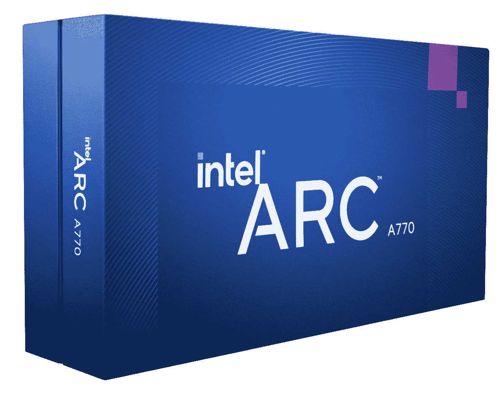
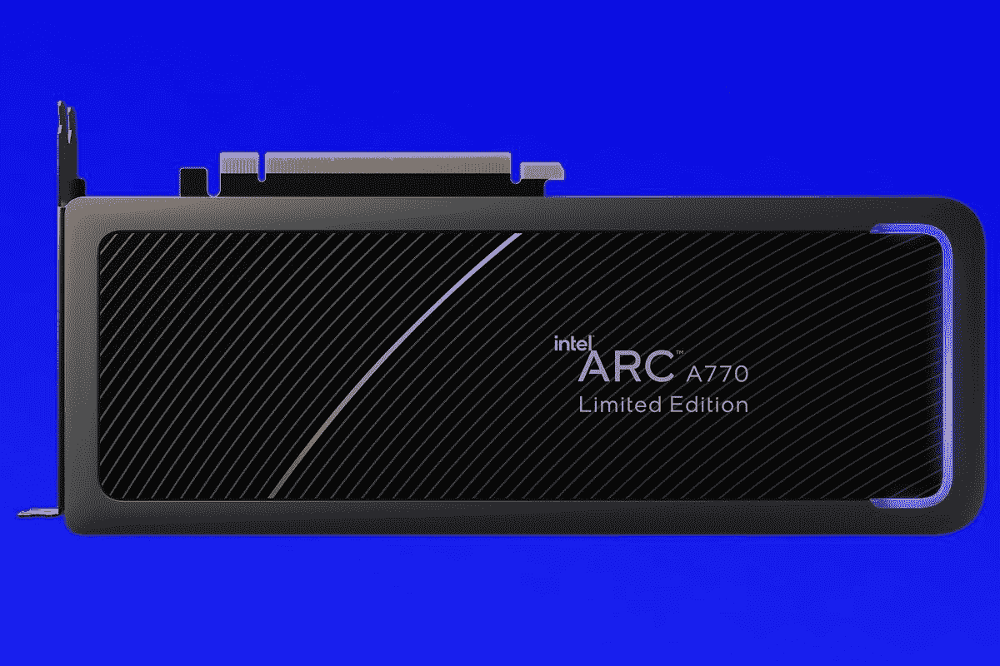

# 英特尔 Arc A770 评测:这仅仅是开始

> 原文：<https://www.xda-developers.com/intel-arc-a770-review/>

消费级显卡的双头垄断已经持续太久了。AMD 和 Nvidia 已经独占了市场。东西越来越强大，但也越来越贵。三号玩家英特尔携二十年来首个专用 GPU 阵容登场。旗舰发布的是这个，英特尔 Arc A770 限量版。

将有第三方版本的英特尔 Arc GPUs，但这是制造商自己的第一个产品。“限量版”与我们预期的英特尔合作伙伴卡有一个关键的规格差异。这款电脑拥有巨大的 16GB VRAM，售价仅为 349 美元。这本身就令人震惊。

英特尔声称，这第一次尝试和它的姐妹版本 A750，在英伟达的 RTX 3060 的范围内。一款中档但还是很有能力的 GPU。这种性能和能够以低价出售的能力构成了一个诱人的标题，但实际上这是如何发生的呢？Arc A770 有什么好的吗？而且重要的是，它是否足够优秀，可以和院子里的大狗抗衡？

答案是肯定的，但有一些警告。但这仅仅是开始。

 <picture></picture> 

Intel Arc A770 Limited Edition

##### 英特尔 Arc A770 限量版

英特尔二十年来的首款旗舰消费级 GPU 以令人难以置信的价格带来了急需的第三方产品

**浏览此评论**

## 关于这篇评论

这项审查是使用英特尔提供的英特尔 Arc A770 限量版预发布样本进行的。收集的所有性能数据都是我们自己的，英特尔的任何人都没有看到或参与过此次评估的内容。

## 英特尔 Arc A770 的定价和供货情况

英特尔 Arc A770 限量版将于 10 月 12 日在英特尔上市，零售价为 349 美元。与限量版中的 16GB 相比，8GB VRAM 卡的建议价格为 329 美元。

英特尔没有对 A770 的第三方版本的可用性发表评论，但我们已经看到了宏碁 Predator 游戏品牌的一款确认产品。这一款目前没有定价或供货情况。

## 英特尔 Arc A770 规格和硬件

英特尔 Arc A770 限量版的规格如上图所示，它还与姐妹卡 A750 进行了比较(评论即将推出)。这个版本和其他版本的 A770 的唯一区别是它有 16GB 的 VRAM。预计第三方大多会选择 8GB。所有其他规格保持不变。

我们在第一次开箱时看了一下硬件，有点惊讶 A770 有多好。作为一款硬件设计，很精致。除了将 I/O 板实际固定到卡上所需的螺钉之外，整个设计都是无螺钉的。它精致而时尚，A770 上有一抹 RGB，提醒你是一名游戏玩家。

这是最近最好看的显卡了

背板很聪明，整个东西都覆盖在一个隐形的亚光黑色完成。我不知道它有柔软的触感是好是坏，但不管怎样它还是有。作为一个硬件，这看起来比它的实际价值要高得多。

在这方面，英特尔绝对用 A770 和 A750 解决了问题。这可能是我们有段时间见过的最好看的显卡了。

RGB 是通过电脑上的专用应用程序来控制的，但前提是你要将盒子里的小电缆连接到主板上的 USB 接头上。这可能是我对外观唯一的不满。电缆长度刚好足够整齐地穿过，但它是另一根悬挂在卡正面的电缆。也许很挑剔，但让自己看起来像样是另一回事。也许最后会更好。

A770 有四个显示输出，包括 DisplayPort 和最新的 HDMI 2.1。它还附带了一个配套应用，英特尔 Arc Control，用于管理驱动程序、系统监控和性能调整。

## 测试平台规格

虽然将 A770 与最昂贵、最快的 CPU、绝对最快的内存等搭配起来很诱人，但这种显卡的目标是什么，这种搭配有点失败。

总有一天我们会做到这一点，当第 13 代酷睿 i9-13900K 上市时，我们将构建一个“英特尔超级构建”，看看会发生什么。但 A770 将最吸引那些预算较低的人，所以为了测试，我将它放入我的普通游戏 PC 中，如下所示。

*   英特尔酷睿 i5-11600K
*   32GB GSkill 三叉戟 DDR4-3200
*   英特尔 Arc A770 16GB
*   至关重要的 P5 加 PCIe 4.0 固态硬盘

所有测试的游戏都是从一个关键的 MX500 SATA 固态硬盘加载的。

这个测试系统意味着现在我们主要关注游戏。因为我手头没有第 12 代英特尔 CPU，所以像深度链接和 Hyper Encode 这样的工具暂时是禁区。为此，您需要第 12 代或第 13 代集成显卡的英特尔 CPU。我们将在第 13 代下降后更新评论，提供这些功能的更多细节。

同样值得注意的是，你需要在主板上启用 Resizeable Bar。英特尔说 A770 没有它将是垃圾，所以在开始研究你的 UEFI/BIOS 之前。大多数现代主板应该有它，如果没有，你可能需要安装一个更新。但如果你没有启用它，英特尔的配套软件会警告你，所以把它当作需要打开的阅读。

## 英特尔 Arc A770 游戏性能

说到游戏，我们要谈论的不仅仅是 GPU。英特尔现在也有自己的升级技术，称为 XeSS。简单来说，你可以把它想象成英伟达 DLSS 或者 AMD 的 FSR。它以较低的分辨率渲染帧，将它们通过引擎，并将其升级回您正在播放的任何分辨率。这与以原生分辨率播放并不完全相同，但它的想法是在给你每秒帧数一点点提升的同时，在细节上足够接近。

XeSS 也不是英特尔 Arc 独有的，为了便于比较，我尽可能在我的 Nvidia GeForce RTX 2080 上测试了它。Arc A770 定位在 RTX 3060 附近，但是唉，我的设备有显示输出问题。但在我的体验中，RTX 2080 在游戏性能上是相似的，尽管不是苹果之间的比较。

XeSS 并不完全覆盖 DLSS 或 FSR，但它已经在几个游戏中推出。《古墓丽影》和《死亡搁浅:导演剪辑》最近已经更新，英特尔提供了即将加入派对的《东京幽灵》和《刺客 3》的早期版本。

### 合成基准

使用 3DMark 图形基准测试套件，下表显示了与 2080 在 Fire Strike、Time Spy 和 DirectX 光线跟踪基准测试中的相对性能。总之，越高越好。

| 

基准

 | 

英特尔 Arc A770 16GB

 | 

英伟达 RTX 2080

 |
| --- | --- | --- |
| 超火力打击 | 7,106 | 6,351 |
| 时间间谍(DX12) | 13,412 | 10,810 |
| 时间间谍极限(DX12) | 6,334 | 5,032 |
| DirectX 射线跟踪 | 31.5 帧/秒 | 20.75 帧/秒 |

在所有这些基准测试中，新的 A770 轻而易举地超过了 Nvidia 的一款较旧但仍然强大的 GPU。但当你进入游戏领域时，就不那么清晰了。

### XeSS 游戏

让我们把有 XeSS 的游戏和没有 XeSS 的游戏分开来。因此，对于这一点，我们将着眼于四个标题:古墓丽影，杀手 3，鬼火东京，和死亡搁浅。

下表显示了参考 RTX 2080 和 Arc A770 的性能。所有游戏都在各自的最高图形设置下运行。

| 

比赛

 | 

英特尔 Arc A770 16GB

 | 

英伟达 RTX 2080 8GB

 |
| --- | --- | --- |
| 古墓丽影 | 

*   1080p(关闭 XeSS)-107 fps
*   1080p (XeSS Ultra) - 109 FPS
*   1440p(关闭 XeSS)-87 FPS
*   1440p (XeSS Ultra) - 91 FPS
*   1440p (XeSS 性能)- 106 FPS

 | 

*   1080p(关闭 XeSS)-119 FPS
*   1080p (XeSS Ultra) - 122 FPS
*   1080p (DLSS 画质)- 124 FPS
*   1440p (XeSS Ultra) - 98 FPS
*   1440p (DLSS 质量)- 115 FPS

 |
| 杀手 3 | 

*   1440p(达特穆尔)- 114 FPS
*   1440 像素(迪拜)- 125 帧/秒
*   1440p (XeSS Ultra，达特穆尔)- 119 FPS
*   1440p(中国，XeSS Ultra，光线追踪)- 55 FPS

 | 

*   1440p(中国，XeSS Ultra w/ RT) - 42 FPS
*   1440p(中国、DLSS 质量 w/ RT) - 52 FPS

 |
| 东京幽灵 | 

*   1440p (XeSS Ultra，无 RT) - 113 FPS
*   1440p (XeSS Ultra w/ RT) - 74 FPS

 | 

*   1440p (DLSS 质量)- 119 FPS
*   1440p (XeSS Ultra) - 117 FPS

 |
| 死亡搁浅导演剪辑 | 

*   1440p(关闭 XeSS)-92 FPS
*   1440p (XeSS Ultra) - 88 FPS

 | 

*   1440p (DLSS 画质)- 110 FPS
*   1440p (XeSS Ultra) - 98 FPS

 |

这些结果需要考虑一些事情，尤其是 XeSS 似乎仍然是一项正在进行的工作。死亡搁浅是一个明显的异常值，在我的测试中，打开它比不打开它时的平均帧率低。它在 RTX 2080 上取得的成绩也令人印象深刻，但也存在一些问题。Arc A770 似乎更适合 XeSS，能够以其超高质量的设置在所有四种比赛中运行，而不会撕裂，也没有 RTX 2080 那么做作。Nvidia 卡也经历了大量的屏幕撕裂(关闭了 Vsync)。

最终，DLSS 似乎仍然有优势，如果你有 Nvidia 卡，你可能应该总是选择它。但在 Arc A770 上，它(大部分)值得启用。它在一些游戏中提供了很好的增益，尤其是 Hitman 3，并且有足够的帮助，你可以实际尝试使用光线追踪。

XeSS 仍然是全新的，并将继续改进，但搭配 A770 令人印象深刻。在 ultra 设置下，你真的需要仔细观察才能发现任何图像质量问题。在 1440p 时，它看起来和关闭时一样好。降低到性能设置，你会注意到更多的问题，如奇怪的闪烁或温和的艺术化，但我认为这些收益是值得的。

### 非 XeSS 游戏

目前，XeSS 在 Arc A770 上甚至不是完全必要的。1080p 的性能非常出色，当您提升到 1440p 时，您仍然能够最大限度地利用图形并享受良好的帧速率。同样，有一些我们将在下面得到的警告。

在这一部分，我们将会看到《地铁出埃及记:增强版》、《Forza Horizon 5》、漫威的《蜘蛛侠》重制版和《Z 世界大战余波》。

| 

比赛

 | 

英特尔 Arc A770 16GB

 | 

英伟达 RTX 2080 8GB

 |
| --- | --- | --- |
| 漫威的蜘蛛侠重拍 | 

*   1080p - 68 FPS
*   1440p - 68 FPS
*   1440 像素(黑白)- 49 帧/秒

 | 

*   1080p - 78 FPS
*   1440p - 75 FPS

 |
| 极限地平线 5 | 

*   1080p - 83 FPS
*   1440p - 71 FPS

 | 

*   1080p - 80 FPS
*   1440p - 67 FPS

 |
| 地铁出埃及记:增强版 | 

*   1080p(正常室温)- 69FPS
*   1440p(正常 RT) - 61 FPS

 | 

*   1080p(正常 RT，DLSS 关闭)- 61 FPS
*   1440p(正常 RT，DLSS 关闭)- 53 FPS

 |
| Z 世界大战 | 

*   1080p (DX11) - 28 FPS
*   1080p (Vulkan) -不可用

 | 

*   1080p (DX11) - 124 FPS
*   1080p (Vulkan) - 144 FPS

 |

Arc A770 在 Forza Horizon 5 和 Metro Exodus:增强版中表现尤为出色。后者甚至不能在没有光线跟踪功能的 GPU 上运行，它实际上比我的 Nvidia 卡运行得更好。蜘蛛侠也可以在 1440p 下完美播放，奇怪的是在类似于 1080p 的 FPS 下，图形已经达到极限，尽管如果你在混合中添加光线跟踪，你会看到一个冻结点和大约 20 FPS 的下降。

第二次世界大战 Z 是唯一一次真正的失败，因为可怕的 DX11 性能和由于某种原因无法选择 Vulkan。Arc A770 在硬件层面上支持 Vulkan，在 Doom 等其他游戏中也能完美运行。不过，英特尔意识到了我所看到的问题，并正在寻找解决办法。控制终极版也是一个怪胎。Arc A770 支持 DX12 和 DXR 光线追踪，但游戏拒绝启用它，即使在手动启动 DX12 可执行文件时也是如此。如果游戏在 DX11 模式下运行，它至少可以解释相当糟糕的性能。但是会有初期问题。

没有硬件 DX9 的支持，它的任何人的猜测，你的游戏将如何发挥

DX11，事实上甚至 DX9 是 A770 开始看起来不那么令人印象深刻的地方。我们在发布之前已经知道，英特尔正在为 DX9 提供硬件支持，而不是依赖 DX12 模拟。但 2022 年年中的早期测试也表达了对 DX11 性能的担忧。除了前面提到的 WWZ，我还没有遇到任何运行在 DX11 上的绝对游戏破坏者，但你可以感觉到与玩 DX12 或 Vulkan 游戏相比的差异。

以《巫师 3》为例。A770 可以让你在 1440p 时达到最大，你可以获得 80-90 FPS 的帧速率。但它也相当不一致，通过调低图形或施加 60 FPS 的上限来补救。DX9 是过山车再次转弯的地方，因为你现在根本不依赖英特尔，而是依赖微软。

运行 Borderlands 2 很好，尽管再次，非常不一致的帧速率。也不像你从旧游戏中想象的那么快。但它是可行的，而且完全可以玩。但《蝙蝠侠:阿卡姆疯人院》就不一样了。事情开始还不错，但是游戏开始几分钟后，你得到一个复杂的错误信息，整个系统崩溃。

底线是你在 DX11 游戏里应该还可以，甚至可能是 DX9 游戏。但是不能保证。缺乏对 DX9 的支持是可以理解的，毕竟它确实太老了。但是仍然有很多流行的游戏使用 DX11，我希望英特尔会继续做得更好。如果一款游戏支持 DX12 或 Vulkan，那么 Arc A770 将助你一臂之力。在较新的游戏中，349 美元的卡性能非常好。可以说这是最重要的。

### 性能调整

上面运行的所有基准测试都是在 Arc A770 的库存设置下进行的。当你第一次打开它时，功率限制将被设置为 190 瓦，并且没有调谐。你当然可以使用 Arc Control 来修改这个。在桌面上肯定会有更多的表现，但这是否值得我不太确定。

当然，你会在综合基准中看到一些收益。通过将 A770 的额定功率限制提高到 225 瓦，你可以让你的火力打击超得分上升一点。使用性能提升滑块，把它提高到 20，你可以增加几百个点。但是你也增加了用电量，虽然应该说不是热量。Arc A770 具有良好的散热性能，通过这些温和的性能调整，我最多可以将它推到 75C。绝对温度上限是 90 摄氏度，所以如果你不介意温度稍微高一点的话，还是有余地的。

在游戏中，你可以用同样的设置获得 10-15 FPS 的提升。没有光线追踪的《刺客 3》反应最好，而《古墓丽影》的收益最小。这将是一场接一场的比赛，但如果你需要一只手来获得一些额外的帧，它就在那里。

## 英特尔 Arc A770 编码

Arc GPUs 对许多人来说最大的吸引力之一是它包含了硬件 AV1 编码。这甚至适用于入门级 Arc A380。鉴于他们的价格，一两个内容创作者肯定会关注英特尔的方向。

不过，AV1 在很大程度上仍是一个新手。DaVinci Resolve 等软件现在支持 A770 上的硬件 AV1 编码，并且它也包含在 OBS 中。Arc 还可以利用英特尔的深度链接和 Hyper Encode 技术，使 GPU 能够与英特尔 CPU 上的集成显卡协调工作。你需要一个第 12 代或者更高的版本，而我目前还没有，所以我们要等几个星期才能尝试。

技术是健全的，它似乎是可行的。在 DaVinci Resolve 中，我使用硬件 AV1 编码器在不到 7 分钟的时间内以 40000 比特率渲染了一个 4 分 30 秒的 4K60 剪辑，并使用了 10GB 的 16GB VRAM。生成的文件看起来与 h.264 编码一样好，但实际上却小了大约 200MB。在我的 Resolve 测试中，AV1 并没有比使用快速同步的 h264 提供更多的速度提升。

我们有一个关于 AV1 为何如此重要的完整解释,你绝对应该读一读。Nvidia 紧随其后，在 RTX 40 系列上采用硬件 AV1 编码，但英特尔几乎是第一个。不过，如果你把 Arc A380 也算上，英特尔确实是第一。如果对你来说很重要，A770 是个不错的选择。

\ r \ nht TPS://www . YouTube . com/watch？v=b7-S8S-8s_Y\r\n

使用 A770 在 OBS 中以 Twitch 质量设置(1080p、60 FPS、6000 比特率)录制该样本剪辑。设置有点尴尬，但使用硬件 QSV 编码器似乎可以获得高质量的镜头，同时减轻系统其余部分的负担。XSplit 的 Gamecaster 也支持 AV1，但在你能够真正使用它进行流媒体播放之前，这些应用程序仅限于游戏玩家。尽管如此，为未来做好准备并没有错。

## 谁应该购买英特尔 Arc A770？

所以，这个百万美元的问题是:你应该买一个吗？这比简单的是或不是要复杂一点。

**如果**您应该购买

*   您在预算紧张的情况下构建游戏电脑
*   你在找 AV1 编码
*   你在找一张有很多 VRAM 的卡

**你不应该买如果**

*   光线追踪很重要
*   你想玩老游戏
*   你没有为一些初期问题做好准备

一方面，GPU 市场终于出现了第三个玩家。英特尔渴望尽其所能帮助降低价格。如果你已经在梦想 1600 美元的 RTX 4090，这是不可能的。但这是一个更重要的领域，是大众购买的那部分市场。

我们得到了 RTX 3060 性能水平的承诺，在很大程度上，英特尔已经兑现了这一承诺。在新游戏中，您可以享受高达 1440p 的高帧率、高细节和总体良好的体验。这是一款为未来而非过去打造的 GPU。虽然它可以处理光线跟踪，有时会有惊人的结果，但这是一个中档卡。如果光线追踪很重要，你还是会想花更多的钱。

因此，如果你有一个旧游戏库，你的里程数会有很大的不同。AMD 和 Nvidia 在这方面绝对有优势，但这些公司也有很多很多年的经验。这是英特尔 Arc 的第一年，你不能批评英特尔向前看，而不是向后看。

不过，你必须对这些问题和其他初期问题持开放态度。在本次审查期间，英特尔已经更新了驱动程序两次，所有迹象表明在发布后还会有更多更新。除了一些粗糙的边缘，它并不像互联网上的一些角落预测的那样糟糕。

很难说你一定要冲出去买一个，尽管我坚信这是值得的。首先，如果你对通常在 AMD 和 Nvidia 之间做出选择感到恼火，那就去支持这个新人吧。没有支持，它永远不会成功。但是 Arc A770 的显卡还不错。它在我的电脑里看起来不可思议，性能完全符合我通常对 GPU 的要求。我不玩高于 1440 便士的游戏，只要它看起来不错而且稳定，我就很高兴。

如果这听起来像你，那就试试吧。作为第一代产品，Arc A770 相当不错，尤其是 349 美元。而这仅仅是开始。欢迎来到派对，伙计。

 <picture></picture> 

Intel Arc A770 Limited Edition

##### 英特尔 Arc A770 限量版

RTX 3060 风格的性能、光线跟踪、XeSS、DisplayPort 2.0 和 HDMI 2.1 集成在一个小巧的包装中，售价 349 美元。哦，它有 16GB 的显存。