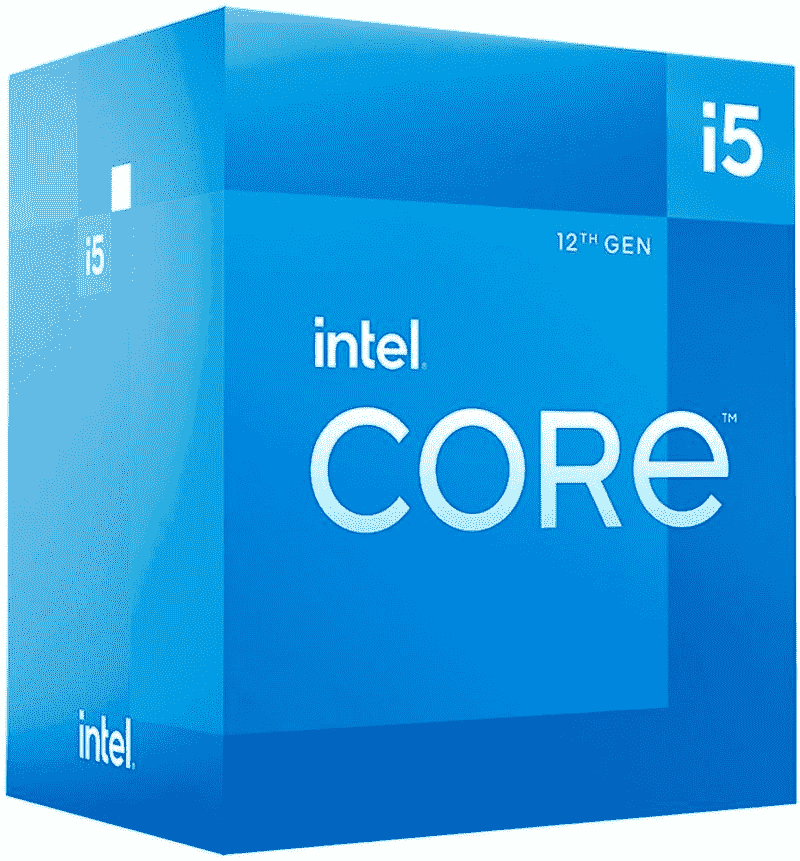

# 英特尔酷睿 i5-12500 vs AMD 锐龙 5 5500:买哪个预算的 CPU？

> 原文：<https://www.xda-developers.com/intel-core-i5-12500-vs-amd-ryzen-5-5500/>

AMD 最近宣布了一些新的 CPU 作为其春季更新的一部分。在锐龙 5000 系列的所有选择中，锐龙 5500 是目前最实惠的选择。我们之前已经比较过锐龙 5 5500 和锐龙 5 5600，看看哪一款更好。在本文中，我们将看看英特尔酷睿 i5-12500 与 AMD 锐龙 5 5500 CPU 的比较，以找出哪一个是更好的预算购买的 CPU。

**浏览本文:**

## 规范

在我们开始比较之前，让我们快速浏览一下每个 CPU 的规格表，看看每个处理器带来了什么:

| 

**规格**

 | 

**英特尔酷睿 i5-12500**

 | 

**AMD 锐龙 5 5500**

 |
| --- | --- | --- |
| **CPU 插座** | LGA1700 | AMD AM4 |
| **内核** | 6 | 6 |
| **螺纹** | 12 | 12 |
| **光刻** | 7nm 纳米 FinFET | 7nm 纳米 FinFET |
| **基频** | 3.0 千兆赫 | 3.6 千兆赫 |
| **升压频率** | 高达 4.6GHz | 高达 4.2GHz |
| **为了超频而解锁？** | 不 | 是 |
| **三级高速缓存** | 18 MB 英特尔智能高速缓存 | 16MB |
| **默认 TDP** | 65W | 65W |
| 最大。工作温度(Tjmax) | 100 摄氏度 | 90 摄氏度 |
| **内存支持** | 高达 DDR5 4800 MT/sUp 至 DDR4 3200 MT/s | DDR4 最高 3200MHzUp 最高 128GB |
| **集成显卡** | 英特尔 UHD 显卡 770 | 钠 |

## 英特尔酷睿 i5-12500 与 AMD 锐龙 5 5500:性能差异

就整体规格而言，英特尔酷睿 i5-12500 和锐龙 5 5500 芯片非常相似。酷睿 i5-12500 没有效率内核，因此我们考虑六个性能内核和十二个线程。核心配置类似于锐龙 5 5500，它也有 6 个核心和 12 个线程，支持 SMT。至于核心频率，酷睿 i5 12500 的基本频率为 3.0GHz，而锐龙 5 5500 的基本频率更快，为 3.6GHz

英特尔有更高的最大提升频率，达到 4.6GHz，而不是锐龙的 4.2GHz。值得指出的是，英特尔酷睿 o5-12500 缺乏 Turbo Boost Max 技术 3.0 频率支持，因为它仅用于产品组合中的高端芯片。虽然英特尔酷睿 i5-12500 的高速缓存略高，但我们认为这不足以造成性能差异。如果有什么不同的话，我们希望这两种芯片具有相同的性能水平。

还值得指出的是，英特尔酷睿 i5-12500 配有集成显卡，而锐龙 5 5500 没有。这意味着你需要一个专用显卡来使用这个 CPU。也就是说，这两种芯片都捆绑了自己的股票 CPU 冷却器。虽然英特尔酷睿 i5-12500 配备了层流冷却器，但锐龙 5 5500 配备了幽灵隐形冷却器。两个股票冷却器都一样好，所以你不必花第三方冷却器。

最后，值得指出的是，Ryze 5 5500 CPU 在 PCIe 3.0 中表现最佳。这意味着您将无法利用 PCIe 4.0 外围设备，包括新的固态硬盘、显卡、显卡等。相比之下，英特尔芯片同时支持 PCIe 4.0 和 PCIe 5.0。锐龙 5 5500 也仅限于 DDR4 内存，而英特尔处理器也支持 [DDR5 内存模块](https://www.xda-developers.com/best-ddr5-ram/)。我们还没有得到这两种芯片中的任何一种，所以一旦我们有机会测试它们，我们将有一个更详细的比较。

## 定价和可用性

AMD 推出了售价 159 美元的锐龙 5 5500，使其成为最实惠的锐龙 5000 系列台式机处理器之一。这对于入门级构建来说很好，我们认为它最好与经济型 B550 主板搭配使用。锐龙 5 5500 将于 4 月初上市。另一方面，英特尔酷睿 i5-12500 现在就可以买到。你现在可以花 219 美元买一个。这与锐龙 5 5600G 的价格相同，我们认为，如果你想建造一台经济型游戏 PC，这也是一个值得考虑的可靠选择。一旦锐龙 5 5500 上市，我们将添加购买链接。同时，请点击下面的链接，查看锐龙 5 5600G 和英特尔酷睿 i5-12500 处理器。

 <picture></picture> 

AMD Ryzen 5 5600G Processor

##### AMD 锐龙 5 5600G

AMD 锐龙 5 5600G 是一个伟大的 APU，对于那些目前正在努力购买市场上的 GPU。

 <picture></picture> 

Intel Core i5-12500

##### 英特尔酷睿 i5-12500 处理器

英特尔酷睿 i5-12500 是入门级电脑的理想预算 CPU。它支持 DDR5 内存和 PCIe 5.0。

## 英特尔酷睿 i5-12500 vs AMD 锐龙 5 5500:你该买哪个？

虽然与英特尔酷睿 i5-12500 相比，锐龙 5 5500 的价格明显更低，但我们认为您最好还是购买英特尔芯片。这主要是因为英特尔处理器同时支持 PCIe 4.0 和 PCIe 5.0，而不是只支持锐龙芯片上的 PCIe 3.0。酷睿 i5-12500 更适合那些希望打造持久耐用钻机的人。您可以轻松地将其与较新的 B660 主板配对，并以大约 600 美元的价格启动并运行系统。

如果你执意要买一个 AMD 处理器，那么我们建议看看锐龙 5 5600 甚至锐龙 5 5660G。它们不像锐龙 5 5500 那么便宜，但它们肯定能让你用得更久，性能更好。您还可以查看我们收集的[最佳 CPU](https://www.xda-developers.com/best-cpus/)，以找到更多在 2022 年购买的选项。AMD 还将在今年晚些时候推出下一代[锐龙 7000 系列处理器](https://www.xda-developers.com/amd-ryzen-7000/)，所以你可能也想等一等。与此同时，您可以查看一下目前为市场上许多游戏装备提供动力的[锐龙 6000 系列移动处理器](https://www.xda-developers.com/amd-ryzen-6000/)。