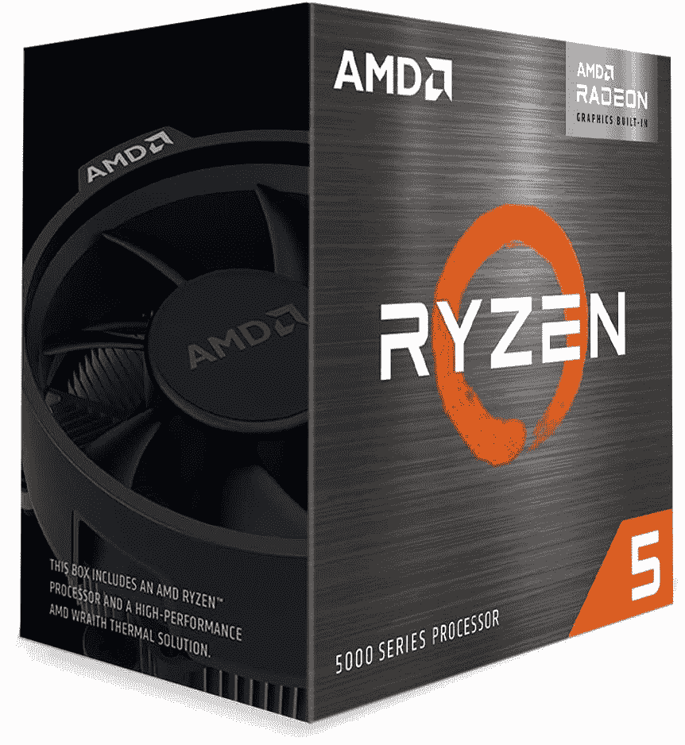

# 英特尔酷睿 i5-12600 vs AMD 锐龙 5 5600G:买哪个 CPU？

> 原文：<https://www.xda-developers.com/intel-core-i5-12600-vs-amd-ryzen-5-5600g/>

英特尔[第 12 代 Alder Lake CPU 家族](https://www.xda-developers.com/intel-12th-gen-alder-lake/)现在又有新成员加入，如酷睿 i5-12600K、酷睿 i7-12700K 和[酷睿 i9-12900K](https://www.xda-developers.com/intel-core-i9-12900k-vs-amd-ryzen-5950x/) 。有 22 个新的 SKU，包括 65W 和 35W CPUs。其中一些甚至与英特尔的新层流冷却器捆绑在一起，以控制热量。在本文中，我们将看看新的英特尔酷睿 i5-12600 与 AMD 锐龙 5 5600G 相比如何，以找出哪一款是入门级游戏电脑的最佳主流消费类 CPU。

**浏览这篇文章:**

## 英特尔酷睿 i5-12600 与 AMD 锐龙 5 5600G:规格

在我们深入比较之前，先快速浏览一下每个处理器的规格:

| 

**规格**

 | 

**英特尔酷睿 i5-12600**

 | 

**AMD 锐龙 5 5600G**

 |
| --- | --- | --- |
| **CPU 插座** | LGA 1700 | AMD AM4 |
| **内核** | 6 (6P + 0E) | 6 |
| **螺纹** | 12 | 12 |
| **光刻** | 英特尔 7(10 纳米) | 7nm 纳米 FinFET |
| **基频** | 3.3GHz | 3.9 千兆赫 |
| **升压频率** | 4.8GHz | 4.4GHz |
| **为了超频而解锁？** | 不 | 是 |
| **三级高速缓存** | 18MB | 16MB |
| **默认 TDP** | 65W | 65W |
| 最大值。工作温度(Tjmax) | 100 摄氏度 | 95 摄氏度 |
| **内存支持** | DDR4 3200MT 公吨/秒&#124; DDR 5-4800 公吨/秒至 128GB | DDR4 最高 3200MHzUp 最高 128GB |
| **集成显卡** | 英特尔 UHD 770 | 镭龙 RX 织女星 7 图形 |

正如你所看到的，新的英特尔酷睿 i5-12600 与去年推出的无锁版有很大不同。关于非 K 版本的 CPU，需要注意的最重要的一点是，它没有效率核心(E 核心)。我们看到的核心总数为 6 个，并且都是性能核心。这意味着 CPU 在技术上应该表现得好像它有标准内核一样，这些内核更注重性能而不是能效。这使它更符合锐龙 5 5600G，它也碰巧有 6 个核心和 12 个线程。这两种 CPU 都集成了图形处理器，是游戏玩家的理想选择。英特尔酷睿 i5-12600 配备了英特尔 UHD 770 显卡，而锐龙 5 5600G 使用 RX Vega 7 显卡。

## 英特尔酷睿 i5-12600 与 AMD 锐龙 5 5600G:性能

英特尔酷睿 i5-12600 带来了 6 个内核和 12 个线程。所有六个核心都被称为 P 核心，这意味着它们将一起工作来完成所有任务。缺失的 E 核心意味着核心配置更像其他主流 CPU(包括锐龙 5 5600G)上的标准核心。这两种芯片有很多共同点。我们看到的是相同的 6 核 12 线程配置，默认 TDP 设置为 65W。

 <picture></picture> 

AMD Ryzen 5 5600G Processor

虽然酷睿 i5-12600 的基本时钟为 3.3GHz，启动速度较慢，但它能够一直提升到 4.8GHz。另一方面，锐龙 5 5600G 的基本时钟为 3.9GHz，根据工作负载的不同，它可以进一步提升到 4.4GHz。英特尔酷睿 i5-12600 芯片也缺乏 Turbo Boost Max 技术 3.0 频率支持，因为它仅用于产品组合中的高端芯片。

尽管缺少 Core 和一些其他功能，但英特尔声称酷睿 i5-12600 CPU 的整体性能很高。事实上，该公司甚至表示，酷睿 i5-12600 与锐龙 7 5700G 更具可比性，而锐龙 5 5600G 则完全不在考虑范围内。据英特尔称，与锐龙 7 5700G 相比，酷睿 i5-12600 在一些日常工作负载方面的速度提高了 30%，在照片和视频编辑应用方面的速度提高了 31%。

更高的性能提升可能是因为更高的升压时钟和对更快的 DDR5 内存的支持。英特尔芯片还能够进一步伸展翅膀，以更高的功耗提高性能阈值。在对性能做出最终裁决之前，我们将等待我们对 CPU 的了解，但英特尔似乎在这方面比锐龙 APU 领先很多。

锐龙 5 5600G 保持不败的一个关键方面是能效。英特尔酷睿 i5-12600 的额定最大睿频功率高达 117 瓦。尽管考虑到未锁定的 12600K 的功耗，这是一个令人印象深刻的数字，但它仍然远远超过了锐龙 5 5600G 的已知功耗。同样，我们将不得不自己测试 CPU，以策划一个明确的赢家，但我们怀疑英特尔在能效方面从 AMD 手中抢走了火炬。

## 平台和兼容性

英特尔酷睿 i5-12600 的一个新特点是，它自带 CPU 冷却器。没错，英特尔已经宣布推出其新的层流 CPU 冷却器。其中一款将与酷睿 i5-12600 捆绑销售。新款 [CPU 冷却器](https://www.xda-developers.com/best-cpu-coolers/)设计新颖，兼容[LGA 1700](https://www.xda-developers.com/cpu-coolers-socket-lga-1700/)12600 主流 CPU 插座。英特尔还宣布推出新的英特尔 600 系列芯片组 SKU，包括 H670、B660 和 H610。您仍然会看到相对较高的平台入门成本，但我们预计这些基于更新的 600 系列芯片组的新主板比我们现在市场上的 Z690、 [LGA 1700 主板](https://www.xda-developers.com/best-lga-1700-motherboard/)更实惠。

至于锐龙 5 5600G，这是现有的 AM4 平台之一。市场上有很多兼容的 AMD 主板，包括很多价格实惠的主板。锐龙 5 5600G 还捆绑了经典的幽灵隐形 CPU 冷却器，所以没有必要花更多的钱购买新的 CPU 冷却器。但是，您将错过对 DDR5 和 PCIe 5.0 的支持，这两个版本都可以在新的 Alder Lake CPUs 上获得。这不一定是一个交易破坏者，但如果你从头开始构建一个新的 PC，你可能会考虑购买一个面向未来的 CPU。

## 定价和可用性

英特尔酷睿 i5-12600 的售价为 223 美元，与 AMD 锐龙 5 5600G 的 230 美元价格持平。根据可用性的不同，您可能需要支付更多的费用，但是可以肯定地说，这两种 CPU 的价格都非常有竞争力。基于英特尔 Alder Lake 的构建可能比基于 AMD 的构建成本略高，主要是因为购买新主板、DDR5 模块等相关的高平台入门成本。在性能方面，酷睿 i5-12600 似乎比锐龙 5 5600G 更胜一筹。你可能不会看到一个主导的性能，但不可否认的是，新的英特尔芯片给现有的 AMD 处理器一个机会。AMD 锐龙 5600G 唯一真正的优势可能是在功耗部门。这是 AMD 芯片有望大放异彩的地方。我们认为，由于 12600 缺少 E 内核，这一点在比较中会更加明显。

## 英特尔酷睿 i5-12600 与 AMD 锐龙 5 5600G:最终想法

英特尔酷睿 i5-12600 是 Alder Lake 家族中的一款稳定产品，我们认为它将成为 2022 年最受欢迎的 CPU 之一。与上一代 11600 相比，它提供了显著的逐代性能提升，与锐龙 7 5700G 形成了鲜明对比。在我们自己测试了酷睿 i5-12600 之后，我们将在未来更新这一产品，但如果你不介意在你的构建上多花一点钱，这似乎比锐龙 5 5600G 更容易。与此同时，你可以看看我们的[英特尔酷睿 i5-12600K 与 AMD 锐龙 5 5600X](https://www.xda-developers.com/amd-ryzen-5-5600x-vs-intel-core-i5-12600k/) 的对比，看看 2022 年哪个强大的主流 CPU 更好。或者，您也可以查看我们收集的[最佳 CPU](https://www.xda-developers.com/best-cpus/)，为您的下一次构建购买。

 <picture></picture> 

Intel Core i5-12600

##### 英特尔酷睿 i5-12600 处理器

英特尔酷睿 i5-12600 标志着那些寻求构建基于奥尔德湖的新电脑的人的坚实切入点。

 <picture></picture> 

AMD Ryzen 5 5600G

##### AMD 锐龙 5 5600G

AMD 锐龙 5 5600G 是 APU 中的一只野兽，它装备精良，可以对抗目前市场上一些甚至最好的 CPU。