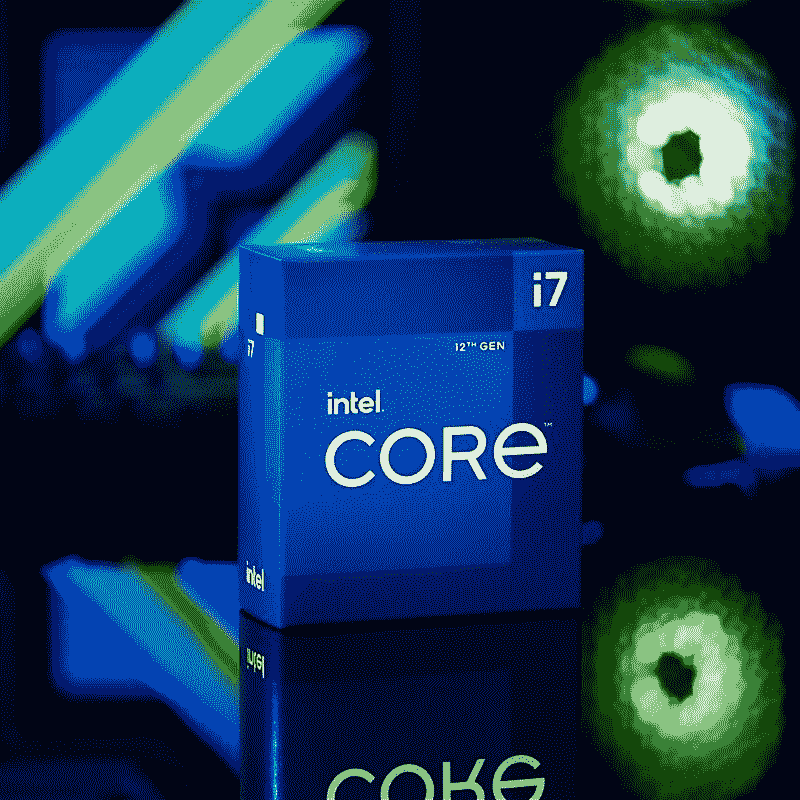

# 英特尔酷睿 i7-12700 与 AMD 锐龙 7 5800X3D:哪个更好？

> 原文：<https://www.xda-developers.com/intel-core-i7-12700-vs-amd-ryzen-7-5800x3d/>

AMD 几天前发布了一系列新处理器，作为其春季更新的一部分。该公司的新锐龙 7 5800X3D 是锐龙 7 5800X 的升级版，具有更多三级高速缓存。在这篇文章中，我们将看看英特尔酷睿 i7-12700 与 AMD 锐龙 7 5800X3D 的比较，以找出哪一个是更好的游戏 CPU。

**浏览这篇文章:**

## 规范

在我们进行对比之前，让我们先快速浏览一下规格表，看看每款处理器的特点:

| 

**规格**

 | 

**AMD 锐龙 7 5800X3D**

 | 

**英特尔酷睿 i7-12700**

 |
| --- | --- | --- |
| **CPU 插座** | AMD AM4 | LGA 1700 |
| **内核** | 8 | 12(8 便士+ 4E) |
| **螺纹** | 16 | 20 |
| **光刻** | 7nm 纳米 FinFET | 英特尔 7(10 纳米) |
| **基频** | 3.4GHz | 2.10GHz (P 内核)&#124; 1.60GHz (E 内核) |
| **升压频率** | 4.5 千兆赫 | 4.80GHz (P 内核)&#124; 3.60GHz (E 内核) |
| **为了超频而解锁？** | 不 | 不 |
| **三级高速缓存** | 96MB | 25MB |
| **默认 TDP** | 105 瓦 | 65W |
| 最大值。工作温度(Tjmax) | 90 摄氏度 | 100 摄氏度 |
| **内存支持** | DDR4 最高 3200MHzUp 最高 128GB | DDR4 3200MT 公吨/秒&#124; DDR 5-4800 公吨/秒至 128GB |
| **集成显卡** | 钠 | 英特尔 UHD 770 |

## 英特尔酷睿 i7-12700 与锐龙 7 5800X3D:性能差异

从上面的规格表中可以看出，AMD 锐龙 7 5800X3D 是一个具有 16 个线程的八核 CPU。另一方面，英特尔酷睿 i7-12700 采用了英特尔新的混合架构，具有高性能和高效率内核。酷睿 i7-12700 总共有 12 个内核，其中 8 个是高性能内核，4 个是高效内核。正如我们在对[酷睿 i7-12700 处理器](http://xda-developers.com/intel-core-i7-12700-review/)的评测中指出的，这种混合内核架构允许芯片在不同的基准测试中产生更好的结果，同时甚至可以对抗一些高端部件。我们还没有机会测试锐龙 7 5800XD，但新的锐龙芯片将显示更好的结果，特别是在游戏方面。这是因为增加了 L3 缓存。

正如您所见，AMD 锐龙 7 5800X3D 配备了 96MB 三级高速缓存，而相比之下，英特尔酷睿 i7-12700 只有 25MB。这将允许许多应用程序直接从缓存中快速存储和获取必要的资源，而不必处理任何延迟问题。它可能会在提高芯片的整体性能输出方面发挥巨大作用，特别是在游戏方面。

根据 AMD 的内部测试，新的锐龙 7 5800X3D 的性能明显优于锐龙 7 5800X，只是因为增加了更多的高速缓存。据说，额外的 L3 高速缓存比旧芯片的性能提高了 40%。事实上，AMD 甚至可以说，其带有 3D V-cache 的新芯片是目前最好的游戏处理器。这意味着，它很可能会匹配甚至 Core i9-12900K 的一般性能，这是 Alder Lake 在桌面领域的 Halo 产品。来，看一看:

但是当我们测试英特尔酷睿 i7-12700 并将性能数据与 12900K 进行比较时，我们注意到这种锁定芯片在游戏和类似线程任务中的总体性能接近 12900K。与锐龙 7 5800X3D 芯片相反，英特尔酷睿 i7-12700 处理器在最大提升频率下还拥有稍快的 P 内核。就整体 CPU 架构或核心时钟而言，这真的不是苹果之间的比较，但 12700 的 4.80GHz 加速核心比锐龙 7 5800X3D 的 4.5GHz 更快。AMD 降低了新芯片的时钟速度，可能是因为热问题。事实上，AMD 已经证实，它甚至没有为超频解锁，因为他们还没有找到一种合适的方法来调整这些带有 3D V-cache 的新芯片。这可能意味着英特尔芯片应该能够匹配锐龙 7 5800X3D 的总体性能，或者至少接近它。

关于这些芯片，另一件值得指出的事情是，酷睿 i7-12700 支持 DDR4 和 DDR5 内存模块，而锐龙 7 5800X3D 仅支持 DDR4 内存。虽然不需要立即升级到新的内存标准，但我们认为 DDR5 内存整体性能更好，尽管它有一些延迟问题。您可以查看我们的 [DDR4 与 DDR5 内存](https://www.xda-developers.com/ddr4-vs-ddr5/)以了解更多关于差异的细节。

## 没有锐龙 7 5800X3D 的股票冷却器

关于新的 AMD 芯片，另一件值得指出的事情是，它没有与股票 CPU 冷却器捆绑在一起。考虑到锐龙 7 5800X 也没有，这并不奇怪。然而，英特尔酷睿 i7-12700 自带库存 CPU 冷却器，这意味着您不必担心在 CPU 冷却器上花费更多。此外，新的层流 RM1 股票应该能够处理锐龙 7 5800X3D 芯片的热输出没有任何问题，因为你不能超频和推动它超出其股票设置。

锐龙 7 5800X3D 的最高工作温度为 90°C，而 12700 的最高工作温度为 100°C。然而，在我们的测试中，酷睿 i7-12700 的散热性能远远低于可接受的限制。一旦我们有机会测试锐龙 7 5800X3D 的热性能，我们将有更多的讨论。

## 定价和可用性

AMD 锐龙 7 5800X3D 将于 4 月 20 日开始销售，售价 449 美元。这与锐龙 7 5800X 最初推出时的价格相同。另一方面，英特尔酷睿 i7-12700 仅售 359 美元。你也可以购买不带集成 GPU 的酷睿 i7-12700F，价格仅为 312 美元。

 <picture></picture> 

Intel Core i7-12700 processor

##### 英特尔酷睿 i7-12700 处理器

与酷睿 i5-12600K 和酷睿 i7-12700K 相比，英特尔酷睿 i7-12700 是一款非常出色的 CPU，值得考虑。

## 英特尔酷睿 i7-12700 vs 锐龙 7 5800X3D:该买哪个？

锐龙 7 5800X3D 的整体性能可能会更好，但你也会多花大约 100 美元，外加 CPU 冷却器的额外费用。除非您希望获得 4K 游戏发烧友级版本的绝对最佳性能，否则我们建议您选择酷睿 i7-12700 处理器。它不仅匹配未锁定的 12700K 的一般性能，甚至接近 12900K 的 CPU，而且您还可以在包装盒中获得一个股票冷却器。您可以轻松构建一个中高端游戏平台，而无需花费大量资金购买这款处理器。同样值得指出的是，AMD 的新锐龙 7000 系列芯片将在几个月后上市，搭载 Zen 4 内核和 PCIe 5.0 支持等新功能。

如果你想看看你的其他 CPU 选项，那么一定要看看我们收集的最好的 CPU。如果你想探索笔记本电脑领域的选择，你也可以看看锐龙 6000 系列芯片[。或者，您也可以加入我们的](https://www.xda-developers.com/amd-ryzen-6000/) [XDA 计算论坛](https://forum.xda-developers.com/c/xda-computing.12289/)，讨论您的构建，或者从我们社区的专家那里获得更多产品建议。