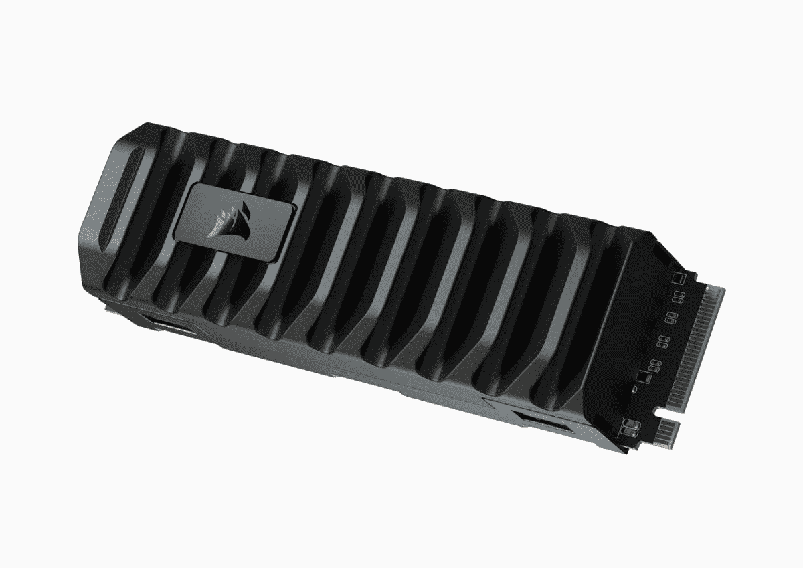
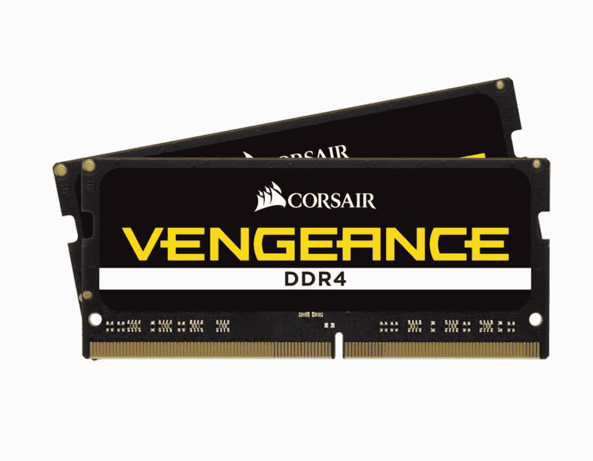

# 英特尔 NUC 12 极限(龙峡谷)审查:疯狂强大

> 原文：<https://www.xda-developers.com/intel-nuc-12-extreme-dragon-canyon-review/>

在使用英特尔的 NUC 12 Extreme(也称为 Dragon Canyon)大约一个月后，我不得不说，我比我想象的更喜欢它。毕竟，我通常使用自己制作的电脑。我可以告诉你关于我的塔的最详细的信息，比如哪些部分在那里，我为什么选择它们，以及我会用无限的预算改变什么。一台预装的电脑如何超越它？

答案原来是，龙峡谷 NUC 实际上只是一个预建的 PC 的一半。它没有配备任何内存、存储或显卡，所以我必须自己挑选。当然，你没有完全定制的自由，比如选择机箱甚至主板，你可以选择你想要的内存类型。但是它感觉起来像一个不错的中间地带，在那里你可以挑选一些组件，并且已经为你做了一些其他的工作。

它并不完美。拆开它经常感觉像你会打破什么，因为有某些大的部分是由电缆连接，感觉不是很强。英特尔还为您挑选了内存，它是 DDR4，而不是更新的 DDR5。

不过，这东西还是挺可爱的。Corsair 为此次评测提供了 SSD 和 DDR4 内存，坦率地说，我也很乐意推荐这些部件。

 <picture></picture> 

Intel NUC 12 Extreme

##### 英特尔 NUC 12 至尊版

英特尔的下一代计算单元 12 Extreme 是第一款采用第 12 代处理器的产品，它采用模块化设计，您可以自带 RAM、存储和显卡。

 <picture></picture> 

MP600 PRO XT 2TB M.2 NVMe PCIe Gen. 4 x4 SSD

##### NUC 英特尔 M600 专业版 XT

这款固态硬盘使用 PCIe Gen 4 实现最快的读写速度，并配有铝制散热器以实现持续的性能。

 <picture></picture> 

Vengeance Series 64GB (2 x 32GB) DDR4 SODIMM 3200MHz CL22 Memory Kit

##### 海盗船复仇 LPX DDR4 内存

这款 DDR4 内存支持自动超频，专为移动系统设计。

**浏览此评论:**

## 英特尔 NUC 12 至尊版(龙峡谷)的定价和供货情况

*   英特尔 NUC 12 至尊版将于 2022 年在 Q2 上市，酷睿 i7 和酷睿 i9 型号的价格分别为 1149 美元和 1449 美元。

英特尔 NUC 12 至尊版于 2 月份发布，预计将于今年第二季度上市。现在，英特尔的全系列台式机处理器正在发货，它应该很快就会上市。

有两种配置。其中一款配备酷睿 i7-12700，售价 1149 美元，另一款配备酷睿 i9-12900，售价 1449 美元。除了 CPU 之外，产品大部分是相同的，规格表中记录了一些非常小的差异。

它只作为 DIY 套件出售，这意味着你至少要自带 RAM 和存储空间。CPU 确实带有集成显卡，但您可能希望添加自己的显卡。当然，更大的问题是，现在获得一个新显卡的最便宜的方法是在一台新的预装 PC 上获得它。

## 英特尔 NUC 12 至尊版(龙峡谷)规格

| 

处理器

 | 第 12 代酷睿 i9-12900 处理器最高可达 5.1GHz 睿频加速，8P+8E 内核，24 个线程，30MB 三级高速缓存第 12 代酷睿 i7-12700 处理器最高可达 4.9GHz 睿频加速，8P+4E 内核，20 个线程，25MB 三级高速缓存 |
| 

制图法

 | PCIe x16 插槽，用于附加独立显卡(最高 12 英寸)，英特尔 UHD 显卡 770 |
| 

储存；储备

 | 3 个 M.2 键 M 插槽:1 个 80 CPU 连接 PCIe x4 第四代 NVMe，2 个 42/80 PCH 连接 PCIe x4 第四代 NVMe 或 SATA3SSD RAID-0 和 RAID-1 支持英特尔 Optane SSD 和英特尔 Optane 内存 M10、H10 和 H20 就绪 |
| 

记忆

 | 双通道 DDR4-3200 SODIMMs，1.2V，最大 64GB |
| 

港口

 | HDMI 2.0b 端口 Mini DisplayPort 1.4 端口前置和后置 Thunderbolt 4 端口支持 5V/9V 快速手机充电模式六个 USB 3.1 Gen2 端口 10GbE 端口标配英特尔酷睿 i9 处理器 SKU 上提供英特尔 2.5Gb (i225-LM)以太网端口支持 UHS-II 的 SDXC 插槽 |
| 

连通性

 | 英特尔无线 AX 201、IEEE 802.11ax 2x2/ Wi-Fi 6E AX211(部分 SKUs 蓝牙 5，带内置天线 |
| 

系统 BIOS

 | 256Mb 闪存 EEPROM，采用面向 EFI 即插即用的英特尔平台创新框架高级配置和电源接口 V5.0b、SMBIOS2.5 英特尔 BIOS 英特尔 Express BIOS 更新支持 |
| 

硬件管理功能

 | 电压和温度检测符合 ACPI 标准的电源管理控制 |
| 

扩展能力

 | 两个内部 USB 2.0 接头 |
| 

声音的

 | 通过 HDMI 或 DisplayPort 信号提供高达 7.1 声道的数字音频 |
| 

操作系统兼容性

 | Windows 10 各种 Linux 发行版 |
| 

环境工作温度

 | 0℃至+35℃ |
| 

储存温度

 | -20 摄氏度至+60 摄氏度 |
| 

价格

 | $1,150 / $1,450 |

如你所见，有两种型号，一种配备酷睿 i7，另一种配备酷睿 i9。英特尔将后者发给我进行审查，尽管它对审查的内容没有任何意见。

*   它四周都有风扇，机身内部没有多余的空间。
*   RGB 照明包含在头骨的正面和底部。
*   拆卸有点复杂。

### 外观和感觉

英特尔 NUC 12 至尊版是我见过的设计最有趣的电脑之一，因为它没有浪费一寸空间。一旦你添加了显卡，这实际上并不是强制性的，机箱中就没有空间了。幸运的是，四周都有风扇，令人惊讶的是，我没有任何过热的问题。

不过，每一两周清洁一次侧面是必要的，因为当灰尘开始聚集时，这一点变得非常明显。

凭借创新的设计，英特尔将大量的性能整合到一个极小的空间中。

当然，这台电脑比普通的 NUC 迷你电脑要大得多。它应该尽可能的小，同时仍然有可移动的部件。正面有一个大的发光头骨，显然是为了吸引游戏玩家，底部有匹配的 RGB 照明。当然，如果你不喜欢这些，你可以关掉英特尔 NUC 软件工作室的灯。当头骨没有被照亮时，它看起来就像一块黑色的面板。

在电源按钮前面的正中间，下面是几个前置端口，包括 USB 3.2 Gen 2 Type-A、Thunderbolt 4、3.5 毫米音频插孔和 SD 读卡器。在背面，还有另外六个 USB 3.2 Gen 2 Type-A 端口，两个 Thunderbolt 4 端口，以太网，甚至还有一个 HDMI 端口，以防你没有自带显卡。

### 组装和拆卸

我发现将它拆开再组装起来有点复杂，至少与只需卸下几个翼形螺钉的全尺寸塔式机相比是如此。要打开它，您需要采取以下步骤:

1.  用四颗十字螺钉卸下后面板。工程师们的加分之处在于螺丝留在面板上，所以你不会丢失它们。
2.  滑出两侧面板。
3.  抬起顶部面板。
4.  拧开后面板上的口盖并向下折叠。

好了，现在机箱打开了。如果你正在安装一个图形卡，怎么做是很明显的。你只需将它插入 PCIe 插槽并连接电源电缆，它就会自动呈现在你面前。但是，这将阻止您访问计算单元。换句话说，确保你先安装内存和固态硬盘。

在一块你必须拧开的支撑物后面，你会发现计算单元。它只是一个长方形的黑盒子。你可以拧开它们，打开电脑的盖子。如果你想的话，你可以移除计算单元，但我真的不建议这么做。它所连接的电线看起来很脆弱。

打开计算单元后，您就可以安装内存和固态硬盘了。正如规格中所述，您需要确保获得 DDR4 SODIMM 内存。这意味着，如果你想从闲置的台式机中取出一些 DDR4 内存，或者在未来的版本中重用这些内存，那你就不走运了。SODIMM 内存小于标准大小。

一旦你插入固态硬盘和内存，你就可以合上计算单元的盖子，接上你的显卡(如果你有显卡的话)，拧上背面的挡板，重新装上顶部面板，滑上侧面板，然后拧上后面板。插上电源，你就可以开始了。

显然，在一个许多台式机制造商强调简单和免工具维修的时代，额外的步骤代表着更多的复杂性。但是如果你要去一个叫 NUC 的地方，你会寻找一个占地面积更小的地方。这里的工程是非凡的，我喜欢我的底盘体积所带来的性能。我的主桌面完全相反。这是一座尽可能大的塔，所以尝试一些不同的东西总是很好的。

## 性能:它配有一个锁定内核 i9-12900

*   酷睿 i9-12900 的 CPU 性能真的很快。
*   令人失望的是它只支持 DDR4-3200 SODIMM。

英特尔 NUC 12 至尊版是一款出色的照片和视频编辑电脑。

英特尔 NUC 12 至尊版的 CPU 有两种选择:酷睿 i7-12700 或酷睿 i9-12900。英特尔给了我后者，我用 64GB 内存和 2TB 固态硬盘填充了其余部分，这两个都是由 Corsair 提供的，还有一个 NVIDIA GeForce RTX 2080 Ti。我实际上可以尝试将 RTX 3090 放在那里，但让我们明确一点:任何人都不应该将酷睿 i9-12900 与 RTX 3090 配对。如果你想买一台 RTX 3090，也买一台酷睿 i9-12900k T1。

SKU 中的“K”表示它已为超频解锁，在决定您需要什么样的系统时，考虑您是否想要它是很重要的。它也不仅仅适用于酷睿 i9，因为您可以获得酷睿 i5-12600K 和酷睿 i7-12700K。如果你正在寻找游戏性能，这可能是更好的方向。

我认为非 K 芯片更主流，更适合创作者。这是一台出色的电脑，可用于视频编辑、Photoshop 和 Lightroom 中的照片编辑等。英特尔新的第 12 代处理器有大有小的内核，因此它们可以在您需要时提供强大的功能，在您不需要时可以降低功耗。该处理器共有 16 个内核(8 个 P 内核和 8 个 E 内核)和 24 个线程。

[酷睿 i7-12700](https://www.xda-developers.com/intel-core-i7-12700-review/) 配备了 12 个内核和 20 个线程，虽然它拥有相同数量的性能内核，但只有四个高效内核。就我个人而言，我认为在为 NUC 12 至尊版选择酷睿 i7-12700 还是酷睿 i9-12900 时，请考虑您的使用案例。酷睿 i7 是一款高端生产力芯片，具有更强的处理能力。核心 i9 是为了极致的力量。

### 性能基准

对于性能基准，我试图关注 CPU 性能，而不是整体性能。当你构建一台个人电脑时，有很多因素会影响性能。有些东西是显而易见的，如 CPU 和 GPU，但你仍然可以用缓慢的存储，缓慢的内存，甚至只是一个便宜的 CPU 冷却器来限制自己。换句话说，既然你带了自己的 GPU、RAM 和 SSD，这里主要评估的是 CPU。

以下测试中，测试 CPU 性能的是 Geekbench 和 Cinebench。3DMark 还可以细分为 CPU 和 GPU 得分(Time Spy 分别为 12，920 和 13，914，Time Spy Extreme 分别为 6，264 和 6，554)。

|  | 

英特尔 NUC 12 至尊内核 i9-12900，RTX 2080 Ti

 | 

[惠普 omz ill](https://www.xda-developers.com/hp-omen-45l-desktop-review/)酷睿 i9-12900K，RTX 3090

 | 

[微星攻略 GE76](https://www.xda-developers.com/intel-core-i9-12900hk-review/) 酷睿 i9-12900HK，RTX 3080 Ti

 | 

[MacBook Pro](https://www.xda-developers.com/apple-macbook-pro-2021-m1-max-review/) M1 Pro

 |
| --- | --- | --- | --- | --- |
| 

极客工作台 5

 | 1,767 / 13,355 | 1,921 / 15,723 | 1,774 / 12,630 | 1,755 / 9,954 |
| 

Cinebench R23

 | 1,806 / 16,316 | 1,894 / 23,659 | 1,833 / 14,675 | 1,530 / 9,532 |
| 

3DMark:时间间谍

 | 13,652 | 18,734 | 12,287 |  |
| 

3DMark:时间间谍极限

 | 6,483 |  | 5,867 |  |
| 

PCMark 10

 | 8,051 | 9,012 | 7,820 |  |
| 

橙色房间

 | 14,847 | 16,616 | 11,452 |  |
| 

VRMark:青色房间

 | 13,170 | 16,887 | 11,542 |  |
| 

蓝色房间

 | 4,627 | 6,174 | 3,815 |  |

我仍然没有看到任何东西在单核分数上击败英特尔，尽管 Core i9-12900 不太匹配 Core i9-12900K，后者的 TDP 更高。最终，CPU 性能*几乎*尽善尽美，仅次于 K 系列变体。

### 内存和固态硬盘

就像我之前说的，Corsair 送来了一些 DDR4 内存和一个固态硬盘，这两个都符合这台机器的规格。先说 DDR4-3200 SODIMM 内存。

| 

DDR4-3200 SODIMM

 | 

DDR5-4800

 |
| --- | --- |
|  |  |

虽然 DDR4 仍然很常见，但 DDR5 在这里会更好。

说到内存，现在的市场有点复杂。英特尔第 12 代处理器增加了对 DDR5 内存的支持；然而，由于世界各地的短缺，DDR5 仍然非常昂贵。正因为如此，你仍然会看到许多产品都搭载了 DDR4。

在平常的日子里，没有太多的取舍。然而，有了 DDR4 SODIMM 内存，你可以看到比我评测配有 DDR4 的 HP om ---- l 时有更多的不同。由于英特尔制造了这种钻机，我希望对 DDR5 的支持。

至于 PCIe 第四代固态硬盘，你可以看到速度非常快。由于英特尔 NUC 12 至尊版的空间较小，我实际上不得不移除 Corsair 随附的内置散热器，因此我期待在我的主机上对它做一些进一步的测试。

## 谁应该购买英特尔 NUC 12 至尊版(龙峡谷)？

显然，英特尔 NUC 12 至尊版并不适合所有人。毕竟，它甚至不是一台完全构建的计算机，也不像完全定制的那样灵活。

**谁应该购买英特尔 NUC 12 至尊版:**

*   希望在不进行完全定制构建的情况下灵活添加一些自己的部件的人
*   想要一台功能强大、占用空间尽可能小的电脑的用户

**谁不应该购买英特尔 NUC 12 至尊版:**

*   寻找预装电脑的人
*   寻求以最经济的方式购买配有新显卡的新计算机的客户

我非常喜欢英特尔 NUC 12 至尊版。这是一台具有高速 CPU 性能的非凡电脑。这一切都符合我所能想象的最紧凑的尺寸，可以容纳全尺寸显卡。

但是你必须记住这并不便宜。你必须想要这个。当然，我认为如果你手头已经有了一些零件，会有所帮助。