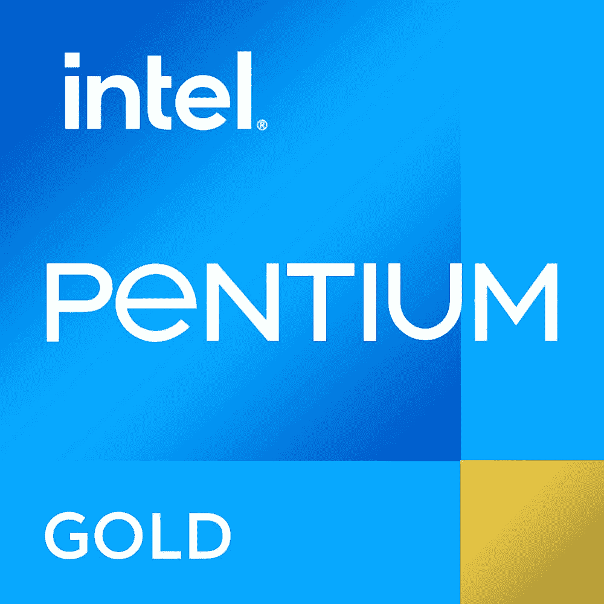

# 英特尔奔腾黄金 G7400 vs AMD 速龙黄金 3150G:买哪个入门级 CPU？

> 原文：<https://www.xda-developers.com/intel-pentium-gold-g7400-vs-amd-athlon-gold-3150g/>

英特尔新的第 12 代 Alder Lake CPUs 现已正式发布。除了更受欢迎的高端芯片，Alder Lake-S 台式机系列还包括低功耗的主流 CPU，如奔腾黄金 G7400 和赛扬 G6900。Pentium Gold G7400 和 Celeron G6900 低功耗部件旨在为入门级生产力或多媒体机器提供动力。这些新芯片与市场上一些类似的低功率处理器进行了正面交锋，包括 AMD 的一些 Athlon 选项。在本文中，我们将看看奔腾黄金 G7400 与 AMD 速龙黄金 3150G CPU，看看哪一个更好。

**浏览本文:**

## 英特尔奔腾金色 G7400 与 AMD 速龙金色 3150G:规格

在我们开始之前，值得指出的是，你不能在市场上单独购买 AMD 速龙黄金 3150G。它的可用性仅限于原始设备制造商，这意味着你只能通过购买预建的计算机来获得这种特殊的 CPU。另一方面，Intel Pentium Gold G7400 最近推出，现在可以购买。因此，让我们快速浏览一下这些处理器的规格，看看它们在纸面上是什么样子:

| 

**规格**

 | 

**英特尔奔腾金色 G7400**

 | 

**AMD 速龙 3150G**

 |
| --- | --- | --- |
| **CPU 插座** | LGA 1700 | AMD AM4 |
| **内核** | 2 (2P + 0E) | 4 |
| **螺纹** | 4 | 4 |
| **光刻** | 英特尔 7(10 纳米) | 7nm 纳米 FinFET |
| **基频** | 3.7 千兆赫 | 3.5 千兆赫 |
| **升压频率** | 钠 | 3.9 千兆赫 |
| **三级高速缓存** | 6MB | 4MB |
| **默认 TDP** | 46W | 65W |
| 最大值。工作温度(Tjmax) | 钠 | 95 摄氏度 |
| **内存支持** | DDR4 3200MT 公吨/秒&#124; DDR 5-4800 公吨/秒至 128GB | DDR4 最高 3200MHzUp 最高 128GB |
| **集成显卡** | 英特尔 UHD 710 | 镭龙 RX 织女星 3 图形 |

## 英特尔奔腾金牌 G7400 与 AMD 速龙金牌 3150G:性能

从规格来看，AMD Athlon Gold 3150G 比英特尔新的奔腾 Gold G7400 CPU 更强大是显而易见的。Pentium Gold G7400 是一款具有四个线程的双核处理器。这种特殊的芯片也没有 E 内核，这是我们在一些高端 Alder Lake 芯片上看到的。另一方面，AMD 芯片封装了四个内核和四个线程来对抗竞争。AMD Athlon Gold G3150G 不仅拥有更多内核，还可以提升至高达 3.9GHz 的运行频率

AMD Athlon Gold 3150G 也有更多的功率，因为它配备了 65W 的基本功率，而不是奔腾 Gold 的 46W。这两个 CPU 还配有集成显卡，这意味着您可以启动并进入系统，而不必将它们与独立的 GPU 配对。这里讨论的 AMD 芯片也因其超频时的稳定运行而闻名，但它与 Alder Lake 系列中的新奔腾处理器相比究竟如何还有待观察。

关于新的奔腾黄金 G7400 值得一提的几件事包括增加了一个机箱内 CPU 冷却器。Pentium Gold G7400 捆绑了新的层流 RS1 CPU 冷却器。新芯片还支持 [DDR5 内存](https://www.xda-developers.com/best-ddr5-ram/)，这是目前台式机领域英特尔芯片独有的功能。缺乏对 AMD Athlon Gold 3150G 的 DDR5 支持不一定是一个交易破坏者，因为购买这些新的内存模块不是特别容易。也就是说，新芯片肯定会受益于更快的内存。

## 英特尔奔腾金牌 G7400 与 AMD 速龙金牌 3150G:定价和可用性

英特尔奔腾黄金 G7400 的建议零售价为 64 美元，我们认为这是一个非常合理的价格。但是，您需要一个新的英特尔 600 系列主板。即使你在盒子里有一个普通的 CPU 冷却器，我们认为你最终还是会为这个特殊的芯片支付一大笔钱作为升级。正如我们前面提到的，AMD Athlon Gold 3150G 不能单独购买，因此您必须购买一台预建的机器才能接触到这款特殊的 CPU。

 <picture></picture> 

Intel Pentium Gold G7400

##### 英特尔奔腾金色 G7400

新的英特尔奔腾黄金 G7400 是入门级构建的可靠选择。它还配有一个新的 CPU 冷却器。

一旦我们有机会测试新的英特尔芯片，我们将在未来更新更多的基准和性能数据。与此同时，我们鼓励您查看我们关于 I[ntel Alder Lake processors deep dive](https://www.xda-developers.com/intel-12th-gen-alder-lake/)的文章，以了解有关新 CPU 的更多信息。