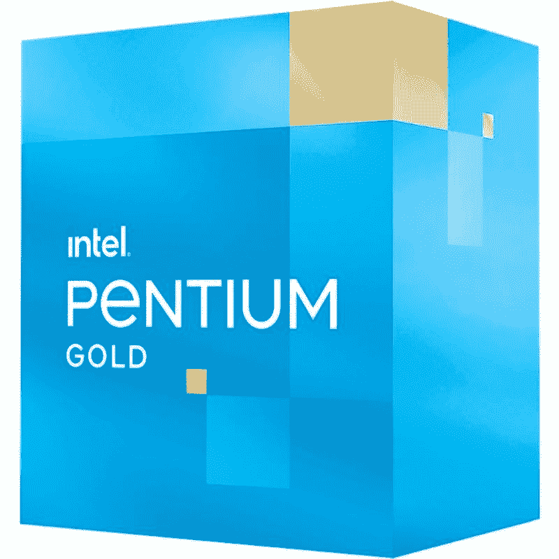

# 英特尔奔腾金色 G7400T 与 AMD 速龙金色 3150GE

> 原文：<https://www.xda-developers.com/intel-pentium-gold-g7400t-vs-amd-athlon-gold-3150ge/>

英特尔最终公布了第 12 代 Alder Lake 台式机处理器的完整阵容，结束了所有的泄露和猜测。市场上现有的 Alder Lake 芯片已经成为我们收集的[最佳 CPU](https://www.xda-developers.com/best-cpus/)，所以看看剩下的芯片会带来什么会很有趣。英特尔在组合中添加了一系列 65W 和 35W 低功耗芯片，为 Alder Lake 家族添加了多达 22 种不同的 SKU。这些低功耗的 CPU 在市场上相当受欢迎，因为这些芯片往往会在短时间内提高时钟速度，从而提高能效。

除了现有的 Alder Lake 芯片的少数非 K 变体之外，英特尔还展示了其新的 Alder Lake-T 系列 35W 芯片。在本文中，我们将英特尔奔腾黄金 G7400T 与 AMD 速龙黄金 3150GE CPU 进行对比。这场比赛将让我们找到更好的芯片，为入门级的生产力和娱乐建设。

**浏览这篇文章:**

## 英特尔奔腾金色 G7400T 与 AMD 速龙金色 3150GE:规格

下面快速浏览一下每个 CPU 的规格，看看它们在纸面上是如何相互比较的:

| 

**规格**

 | 

**英特尔奔腾金色 G7400T**

 | 

**AMD 速龙金牌 3150GE**

 |
| --- | --- | --- |
| **CPU 插座** | LGA 1700 | AMD AM4 |
| **内核** | 2 | 4 |
| **螺纹** | 4 | 4 |
| **光刻** | 英特尔 7(10 纳米) | 12 纳米 |
| **基频** | 3.1 千兆赫 | 3.3GHz |
| **升压频率** | 钠 | 3.8GHz |
| **为了超频而解锁？** | 不 | 是 |
| **三级高速缓存** | 6MB | 4MB |
| **默认 TDP** | 35W | 35W |
| 最大值。工作温度(Tjmax) | 100 摄氏度 | 95 摄氏度 |
| **内存支持** | DDR4 3200MT 公吨/秒&#124; DDR 5-4800 公吨/秒 | DDR4 高达 2933MHz |
| **集成显卡** | 英特尔 UHD 710 | 镭龙 RX 织女星 3 图形 |

## 英特尔奔腾金牌 G7400T 与 AMD 速龙金牌 3150GE:性能

英特尔奔腾黄金 G7400T 是众多将于 2022 年上市的 35W Alder Lake CPUs 之一。这款低端芯片可能不如该系列中的其他一些英特尔酷睿处理器强大，但仍比赛扬 G6900T 高一步。英特尔还透露了奔腾黄金 G7400T 的非 T 版本，其基频略高，基本功率值也更高。

AMD Athlon Gold 3150GE 是 Athlon Gold 3150G 芯片的低功耗版本，运行功率为 35W。Athlon Gold 3150GE 在许多方面与 Athlon 3150G 相似。3150G 型号的功耗增加了 86%，基础时钟和提升时钟分别提高了 6%和 2.6%。但不言而喻，与低功耗芯片相比，它能够在更长时间内保持提升频率。AMD Athlon Gold 3150GE 的存在主要是因为人们倾向于使用低功率 CPU 来提高能效。

值得指出的是，奔腾黄金 G7400T 和速龙黄金 3150GE 都是入门级的低端 CPU，性能有限。这些 CPU 通常由企业部署用于处理日常工作负载的系统，或者由临时用户部署用于家庭娱乐系统。虽然从纸面上看，英特尔芯片与 Athlon 31590GE 相比可能不是很强大，但我们认为总体性能大致相同。如果有的话，我们希望英特尔芯片在许多工作负载中的表现优于速龙 3150GE，只要搭配正确的组件，包括新的 [DDR5 内存](https://www.xda-developers.com/best-ddr5-ram/)模块。

与许多其他低端 Alder Lake 芯片一样，Pentium Gold G7400T 也缺少 Gracemont E 内核。我们正在寻找一个双核单元，它有 4 个线程，与一个类似规格的 Athon 3150GE 进行交换。由于除了 DDR4-3200MT/s 模块之外还支持 DDR5-4800MT/s，奔腾芯片在某些工作负载下肯定会有略好的性能。相比之下，AMD 速龙 3150GE 只支持最高 2933MHz 内存速度的 [DDR4 模块](https://www.xda-developers.com/best-ddr4-ram/)。这两个 CPU 还带有集成显卡，可以部署没有独立 GPU 的入门级系统。

## 英特尔奔腾黄金 G7400T 与 AMD 速龙黄金 3150GE:最终想法

英特尔的 Alder Lake 系列在许多方面都比上一代英特尔芯片有了重大升级。我们还没有机会测试所有的阿尔德湖芯片，但初步印象指向一个重大的世代对世代的改进。Alder Lake 芯片的总体性能优于许多功耗较低的比较芯片。新的英特尔芯片在功耗方面有了巨大的改善，但在这方面它落后于 AMD 的 CPU。

英特尔奔腾黄金 G7400T 售价 64 美元，是 Alder Lake-S 系列中最实惠的 CPU 之一。另一方面，AMD Athlon Gold 3150GE 不能单独购买，因为它仅限于合作伙伴 OEM。看看这种特殊芯片在入门级领域的表现会很有趣。英特尔还为新的奔腾黄金和赛扬 CPU 宣布了新的层流 RS1 [CPU 冷却器](https://www.xda-developers.com/best-cpu-coolers/)，所以我们也期待看到一个体面的冷却性能。一旦我们有机会测试新的 CPU，我们将使用更多的基准测试数据来更新这一比较。

 <picture></picture> 

Intel Pentium Gold G7400 Processor

##### 英特尔奔腾金色 G7400T

英特尔的新奔腾黄金 G7400T 可能不是 Alder Lake 家族中最强大的 CPU，但众所周知，它比相同价位的许多竞争芯片都更强大。