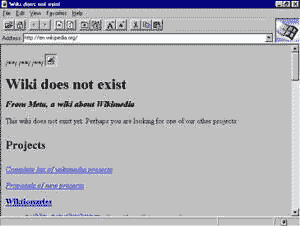
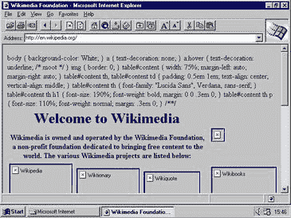
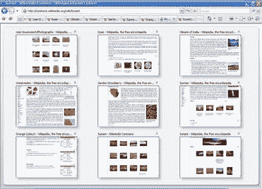
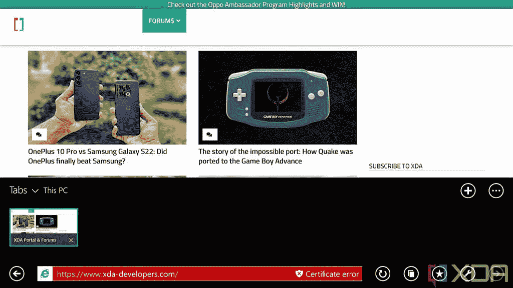

# Internet Explorer 已死——微软浏览器历史回顾

> 原文：<https://www.xda-developers.com/internet-explorer-browser-history/>

在近 27 年后，微软正在扼杀 ie 浏览器，这是其内部的网络浏览器，现在是迷因和模仿推特账户的主题。事实上，对于传统浏览器来说，这是一条漫长而崎岖的道路，它是微软曾经的象征。

微软没有专注于 web 标准，而是开发了 VBScript 和 JScript 等专有技术，作为 JavaScript 的替代方案。其意图从来不是为每个人创造一个更好的、开放的网络。它将像雷德蒙公司统治桌面软件一样统治网络。

有一段时间，这很有效。众所周知，微软曾因将 ie 与 Windows 捆绑销售而被起诉，声称存在反垄断行为。这使得微软在网络浏览器中占据了主导地位，尽管网景在许多方面技术更胜一筹。

2003 年，Internet Explorer 拥有 95%的使用份额，但 Mozilla Firefox 在 2004 年推出，谷歌 Chrome 在 2008 年推出。

事实上，将软件与操作系统捆绑在一起是让人们使用该软件的好方法。事实上，有人可能会说，你实际上必须努力让大多数客户转向他们必须从外部获得的东西。但事实就是如此。Internet Explorer 最终被称为谷歌 Chrome 安装程序，因为当你安装一台新电脑时，你要做的第一件事就是打开 IE，安装 Chrome，然后再也不碰那个蓝色的 E。

## Internet Explorer 1

 <picture></picture> 

Image via [Wikipedia](https://en.wikipedia.org/wiki/Internet_Explorer)

Internet Explorer 是 Thomas Reardon 的发明，它是作为 Microsoft Plus 的一部分发布的！对于 Windows 95，这是一个 49.99 美元的软件包，包括“互联网启动工具包”、一个名为*的太空少年弹球*的游戏，以及一些实用程序，如“磁盘空间管理 3”和“压缩代理”。这个团队由六个人组成，考虑到 1995 年 8 月 16 日微软 Internet Explorer 发布的日期，这并不奇怪。

此后不久，Internet Explorer 1.5 发布，增加了对表格的支持。这也是微软开始将其与 Windows NT 捆绑销售的时候，这意味着它不必向一家被指控剽窃其源代码的公司支付一些许可费。

## Internet Explorer 2

 <picture></picture> 

Image via [Wikipedia](https://en.wikipedia.org/wiki/Internet_Explorer_2)

随着 1995 年 11 月 22 日 Internet Explorer 2 的发布，事情进展得相当快。事实上，10 月份就有 IE 2 的测试版，所以那是在最初版本发布后的几个月。这里有一些值得注意的事情。虽然第一个版本只适用于 Windows 95 和后来的 Windows NT，但 Internet Explorer 2 增加了对旧的 Windows 3.1 和 Macintosh 系统 7.0.1 的支持。

添加了一些我们在今天的 web 中更熟悉的关键特性，比如对 JavaScript、HTTP cookies、SSL 等的支持。它被升级到支持 HTML3，你可以从网景导入书签。

1996 年 4 月，Mac 版的 Internet Explorer 2.1 问世，它支持在网页中嵌入 AVI、QuickTime、AIFF、MIDI 和 WAV 文件。

## Internet Explorer 3

快进到 1996 年 8 月 13 日，因为那是 Internet Explorer 3 发布的时间。这也是我个人使用的第一个浏览器版本，尽管更确切地说，那是 Internet Explorer 3.02。虽然 Internet Explorer 2 是 Mac 上支持的第一个版本，但这是第一个与 Mac 捆绑在一起的版本，并且是 Mac OS 8 附带的。

在这一点上，IE 仍然试图赶上网景，这是两者之间的竞争开始升温。IE3 中增加的一项功能是支持 CSS，即级联样式表。此外，还有对 ActiveX 和框架的支持，这些东西你再也听不到了。框架是一种将两个网页合二为一的方式，所以一个框架作为导航栏，一个框架作为内容，所以当你点击导航中的链接时，只需要加载内容。

这也是微软推出 JScript 的时候，这是它自己的 JavaScript 版本，几乎是完全相同的语言。

捆绑软件也很受欢迎。IE3 带有互联网邮件和新闻、Windows 地址簿、微软漫画聊天、RealPlayer、NetMeeting 和 Windows Media Player。显然，那些大多已经不存在了。

## Internet Explorer 4

Internet Explorer 于 1997 年 9 月发布于 Windows，1998 年 1 月发布于 Mac，1998 年 3 月发布于 Unix，这是所谓的浏览器战争真正开始升温的时候。今天，没有网络浏览器的操作系统是不可想象的。毕竟，我们所有的软件都是下载的。没有它我们会迷失方向。1998 年，没有人获得我们现在看到的千兆速度。那时候，我们有拨号上网。我仍然记得等待*图片*加载的过程。忘记尝试流视频或下载软件。那是一段很长的路。

我试着画这幅画，因为它是一幅完全不同的风景。当然，你可以从一些网站下载软件，但这要花很长时间。毕竟，那时我们有 Napster。但关键是，获得软件需要时间和工作。将 web 浏览器与 Windows 98 捆绑在一起意味着人们将会使用它，因为另一种选择是去商店购买 Netscape，这意味着必须采取行动并付款。

我知道你在想什么:膨胀器怎么样？90 年代对膨胀器来说是巨大的。当时没有人知道如何处理他们的电脑(同样，人们几乎不知道互联网是什么，AOL 试图让人们使用关键字，因为没有人理解 URL)，软件供应商希望他们的东西在新的个人电脑上，所以任何新的个人电脑都会带有大量的第三方软件。那么，为什么网景不直接让原始设备制造商把他们的浏览器和 Windows 捆绑在一起呢？

微软不同意。雷德蒙德公司强烈鼓励原始设备制造商帮助发展 Internet Explorer，并积极试图阻止他们捆绑 Netscape，甚至阻止他们在桌面上显示另一个浏览器的图标。

这是美国司法部介入的地方。1999 年末，人们发现微软实际上是在垄断市场。第二年，法院下令微软必须一分为二:一家公司制造 Windows，另一家公司制造软件。微软提出上诉，并在 2001 年，它不再有义务分手。

回到 Internet Explorer 4 本身，它增加了对活动桌面的支持，允许将 HTML 内容添加到桌面。回到这个时候，微软正在考虑在任何地方使用 HTML，尽管像这样的标记语言直到后来才出现在应用程序中。它与 Microsoft Chat 2.0、Outlook Express、NetMeeting、FrontPage Express 2.0 和 RealPlayer 捆绑在一起。

这也是三叉戟引擎出道的时候，那是 IE 余生都在用的浏览器引擎。

## Internet Explorer 5

微软 Internet Explorer 5 于 1999 年 3 月 18 日推出。由于 Internet Explorer 4 中有很多新功能，如 HTML4 支持，所以 IE5 必须解决一些问题，如改进的 CSS2 支持。不过仍然有新的功能，如自动完成，Hotmail 集成，离线收藏夹，将页面保存为 MHTML 的能力，历史浏览器栏和搜索浏览器栏。

在 Windows 上，IE5 至少需要一个英特尔 486DX 处理器，以及 37MB 内存。对于 Mac，你需要一个 PowerPC 处理器和 8MB 内存；然而，这实际上并不是停止支持 68k 处理器的版本。这是 Internet Explorer 4.5 附带的。

## Internet Explorer 6

Internet Explorer 6 于 2001 年 8 月 24 日发布，使得 2000 年成为第一个没有新的 Internet Explorer 版本的日历年。这是我们在 2006 年之前看到的最后一个。这也是第一个不支持 Mac 的版本。微软与苹果的协议已经到期，这家位于库比蒂诺的公司继续开发自己的 Safari 浏览器。

IE6 进行了重新设计，因为它是在 Windows XP 之前不久发布的。众所周知，Windows XP 有一个全新的设计，叫做 Luna。正如我们从其他 UX 操作系统改革中看到的那样，软件也趋向于焕然一新。还有对动态 HTML 和 CSS 的改进。

这个时代是互联网浏览器的巅峰。在 IE6 作为浏览器当前版本的五年里，它达到了 90%的使用份额，IE 整体达到了 95%。此时，网景已经被 AOL 收购，尽管网景品牌的浏览器一直持续到 2008 年。

IE6 是最后一个独立于 Windows 的浏览器版本。展望未来，Internet Explorer 将会随 Windows 一起出现。如今，我们已经习惯了浏览器在我们不注意的时候自动更新。那是一个不同的时代，你必须选择更新你的浏览器，或者你可以选择不更新。使其成为 Windows 的一部分简化了升级人员的过程。

## Internet Explorer 7

 <picture></picture> 

Image via Wikipedia

Internet Explorer 7 于 2006 年 10 月 18 日发布，在此之后的一年时间里，Internet Explorer 6 仍然是最受欢迎的 IE 版本。这个版本是一个里程碑，因为它是第一个引入标签的版本。今天，很难想象如果没有标签，网络浏览器会是什么样子。另一个关键的新特性是对 RSS 的支持。第一个预装它的操作系统是 Windows Vista。

浏览器增加了对 PNG 中每像素 alpha 透明度的支持。此外，它还添加了网络钓鱼过滤器，该过滤器主要根据已知的网络钓鱼攻击网站列表来检查您访问的网站。它并不完美，但它向浏览器安全迈出了一步，这是微软实际上擅长的事情之一。另一个安全特性是 ActiveX 控件现在需要被允许才能操作，JavaScript 不能在空白页上操作。

## Internet Explorer 8

IE8 于 2009 年 3 月 19 日推出，当年晚些时候发布的操作系统 Windows 7 中预装了 I E8。像 IE7 一样，它早在 SP2 就得到支持，如果你还记得，Windows XP 是第一个不会消失的 Windows 版本。它拥有巨大的市场份额，当 2014 年支持终止时，微软实际上很难杀死它。需要新的软件来支持它。

这是第一个带有 InPrivate 浏览功能的 Internet Explorer 版本。基本上，当你使用 InPrivate 模式时，你做的事情不会出现在你的浏览器历史中。这在今天很常见，InPrivate 品牌仍然存在。另一个引入是 SmartScreen。网络钓鱼过滤器根据已知的不良行为者列表检查网站，而 SmartScreen 过滤器根据已知的良性网站列表检查网站，如果网站不在列表中，就会被发送到微软。

开发者工具随 IE8 首次亮相，这是我们期待现代浏览器功能的另一个例子。事实上，对于老版本的浏览器，我们谈论的是新版本的 HTML 和 CSS，但现在我们谈论的是今天仍然存在的功能。在 IE6 和 IE7 中，开发工具可以用作工具栏，但在 IE8 中，它们与应用程序集成在一起。它允许开发者在浏览器中调试网站。

## Internet Explorer 9

不像它最近的三个前辈和它的三个继任者，Internet Explorer 9 的发布与 Windows 的新版本不一致。它于 2011 年 3 月 14 日问世，支持 Windows Vista SP2、Windows 7 和 Windows Phone 7.5。

最显著的特性是支持 HTML5 和 CSS3。这些是现代网络的基石。虽然 HTML5 是 14 年前推出的，但它今天仍在使用。

## Internet Explorer 10

IE10 于 2012 年 9 月 4 日发布，与 Windows 8 并列。也恰逢[微软的 Surface PC 阵容](https://www.xda-developers.com/best-microsoft-surface-pcs/)推出，包括 Surface RT 和 Surface Pro。虽然你可以在 Windows 7 上获得它，但 Internet Explorer 10 最大的变化是它在 Windows 8 中实际上有两个独立的版本。有我们都知道和讨厌的常规桌面 Internet Explorer，然后有一个新的 Metro 应用程序。Metro 是 Windows 8 的新设计风格，但让我们后退一点。

 <picture></picture> 

Metro Internet Explorer

让我们从整体上来谈谈 Windows 8，这样你就能更好地理解 Metro 是什么了。微软取消了开始菜单，这是自 Windows 95 以来用户操作电脑的方式。它用一个由磁贴组成的开始屏幕取代了它。其中一个图标是桌面图标，可以让你回到桌面。如果你启动一个传统的 Win32 应用程序，它将在桌面上启动，并且它将完全按照你所期望的方式工作。当你启动一个通常来自 Windows 商店的 Metro 应用程序时，它会全屏启动，你必须用手势来管理它。用 Metro 关闭一个 app 就没有更多的 X；你只需要知道把应用程序从屏幕顶部拖下来。

此外，你无法从桌面环境访问 Metro 应用。这两件事完全分开，完全不协调。但是，微软仍然见证了苹果在 iPhone 和后来的 iPad 上的革命。它知道未来是可以触摸的，但却采取了完全错误的方法。

如果你从开始屏幕打开 Metro Internet Explorer，它就会启动。如果你从桌面打开它，你会得到经典的 Internet Explorer。如果这听起来很蠢，那是因为确实如此，但这还不是最糟糕的。如果您更改了默认浏览器，您将再也看不到 Metro Internet Explorer。甚至从开始屏幕打开它都会打开经典 IE。这太诡异了。

IE10 也是第一个集成 Adobe Flash 的，而不是要求用户安装附加组件。它也是最后一个包含 Windows Internet Explorer 绑定的版本，微软从 IE7 开始就一直在使用它。从 IE11 开始，它只是被称为 Internet Explorer。

## Internet Explorer 11

Internet Explorer 11 于 2013 年 10 月 17 日推出，它包含在 Windows 8.1 中。到这个时候，它仍然有两个不同的应用程序的奇怪行为，这取决于你从哪里启动它们以及你的默认浏览器是什么。然而，Windows 发生了很大的变化。Windows 8.1 中的尝试是修复 Windows 8，所以添加了熟悉的 X 来关闭 Metro 应用程序，添加了开始按钮来带你回到开始屏幕，Metro 应用程序可以从桌面环境访问。窗口 Metro 应用直到 Windows 10 才出现。

IE11 中的大多数新功能都是改进，其中一个很大的改进是更好地支持高 DPI 显示器。高分辨率屏幕是新事物，在许多不同的领域，Windows 花了一段时间才赶上。

## 微软 Edge -斯巴达

在微软的第二次 Windows 10 发布会上，它宣布了下一代网络浏览器 Project Spartan。它将有一些创新的新功能，比如用笔标记网页并保存的功能。它还将内置 Cortana，并会有一个新的阅读视图。它也会变得更快。

微软 Edge 于 2015 年 7 月 29 日作为 Windows 10 的一部分推出。Windows 10 本身是 Windows 开发和发布方式的一大改变。在 2014 年的惨败之后，这家位于雷德蒙德的公司在淘汰 Windows XP 时遇到了很多麻烦，它意识到自己只是在与自己竞争。Windows 10 被宣布为所有运行 Windows 7、Windows 8.1 和 Windows Phone 8.1 的设备的免费升级，尽管最终只有一小部分 Windows Phone 获得了升级，但那是另一个故事了。对于 Windows 10，更新将在设备的生命周期内免费。当然，你仍然可以从货架上购买 Windows 的副本，当你购买 PC 时，你仍然需要支付许可费，但当你升级 Windows 的许可版本时，那将永远是免费的。

这一基本策略背后的整个想法是不再与自己竞争。当一个新版本的 Windows 问世时，它只是在与一个旧版本的操作系统竞争。现在，微软希望每个人都使用 Windows 10，这样就不会再有问题了。正因为如此，Edge 是微软第一款不向后兼容旧版本 Windows 的新浏览器。这是一个 Windows 10 独占。

当 Project Spartan 变成微软 Edge 的时候，logo 还是一个蓝色的 E，但是改了。事实上，Edge 很可能是 Internet Explorer 12，但重新命名是必要的，因为 IE 名称多年来已经变得如此暗淡。新图标背后的想法是看起来不同，但对于只知道如何点击蓝色 E 来访问互联网的用户来说仍然足够熟悉。

## 微软 Edge -阿纳海姆

Edge 并没有像微软希望的那样加速发展。事实证明，人们并没有使用像标记网页这样的新功能，坦率地说，网络是为 Chrome 而建的。雷德蒙公司没有试图打败他们，而是决定加入他们。2018 年 12 月，微软宣布打算从谷歌开源的 Chromium 重建 Edge，此后不久就有公开预览。该浏览器被认为将于 2020 年 1 月 15 日正式上市，尽管它缺少许多关键功能，如 Arm64 支持、历史同步和扩展同步。

Edge Chromium 代号为 Anaheim，也标志着微软制作跨平台浏览器的回归。第一个是回归 Mac，但现在也可以在 Linux 上使用，随着旧版本的 Windows 回到 Windows 7。新的 Edge 还解决了一个关键问题。因为它独立于操作系统，所以可以更频繁地更新。对于 Edge Legacy，它需要 Windows 功能更新，因此它每六个月更新一次，而 Chrome 每六周更新一次。

* * *

这就把我们带到了今天。Windows 11 是 Windows 的最新版本，正如 Windows 10 发布时承诺的那样，这是一次免费升级。系统要求发生了变化，尽管公平地说，自 Windows 7 以来，它们从未发生过变化，这是使 Windows 10 成为所有 Windows 7 和 8.1 电脑免费升级的必要条件。

微软 Edge 是要用的浏览器，其中一个关键特性就是 IE 模式。尽管微软多年来一直在警告我们 IE 的终结，但一些企业仍然没有继续前进，因为这不是一个微不足道的任务。微软正在微妙地处理这个问题，慢慢地将人们推向 IE 模式，这基本上是 Edge 中的一个 Internet Explorer 标签。

但是到目前为止，Internet Explorer 不再获得任何类型的安全更新。25 岁的浏览器，实际上已经死了。