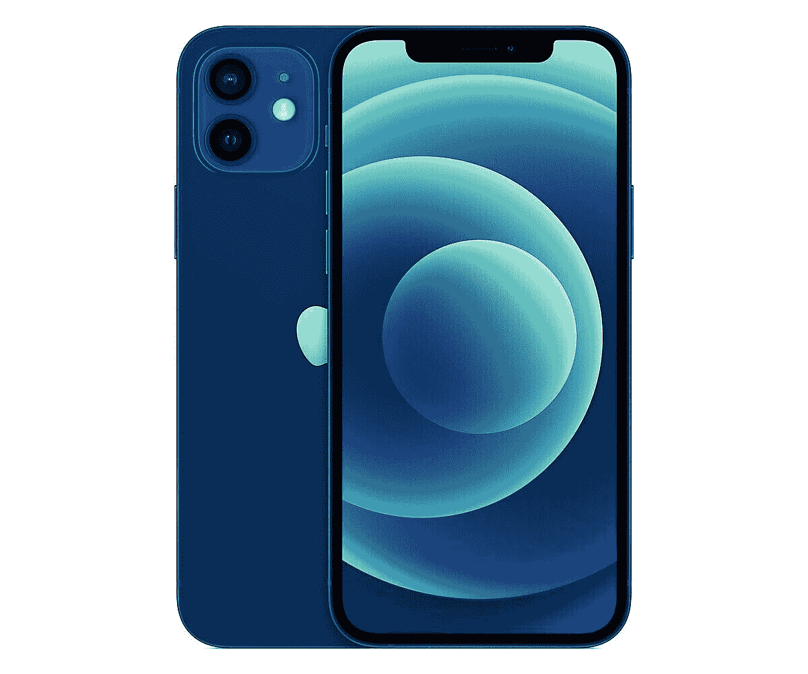

# 安装 iOS 15 beta 会使我的苹果保修失效吗？

> 原文：<https://www.xda-developers.com/ios-15-beta-iphone-warranty/>

iOS 15 是今年的亮点版本，为了准备发布，苹果将发布该软件的多个开发者测试版和公共测试版。[的第一个开发者测试版](https://www.xda-developers.com/ios-15-beta-1-hands-on/)已经发布，第一个公共测试版预计在七月发布。像许多人一样，你可能渴望获得全新的功能，测试版软件似乎是一种实现方式。但你可能想知道安装 iOS 15 测试版是否会使设备保修失效。简单的回答是没有。

如果你正在使用苹果测试版软件程序安装 iOS 15 公测版，你在保修方面没有什么可担心的。“不，安装公测版软件不会使你的硬件保修失效”苹果公司在其网站的[上明确声明。同样，如果您是作为 Apple 开发者计划的成员安装开发者测试版，您的设备保修将保持不变。](https://beta.apple.com/sp/betaprogram/faq)

但是，如果您以未经授权的方式安装公共测试版或开发测试版，如侧装或使用从非 Apple 网站下载的测试版配置文件，您的硬件保修将会失效。如果出现任何问题，您的手机可能需要保修期外维修。

除了 iOS，苹果还为 [iPadOS](https://www.xda-developers.com/ipados-15-beta-1-hands-on/) 、macOS、 [tvOS](https://www.xda-developers.com/how-to-install-tvos-beta/) 和 [watchOS](https://www.xda-developers.com/watchos-8-beta-1-hands-on/) 提供测试版软件，同样的保修原则也适用于这些测试版的安装。

### iOS 15 有什么期待

苹果将在今年秋季发布 iOS 15。它将获得几项视觉升级，FaceTime 的重大增强，以及 iMessage 中的新共享选项。此外，新的软件版本将包括通知改造，焦点模式，支持苹果钱包中的身份证，甚至更多的隐私调整。苹果地图、健康、iCloud、照片、Safari 和 Spotlight 也获得了一些新功能。要了解更多细节，请务必查看我们对 iOS 15 开发者测试版 1 的[初步印象。](https://www.xda-developers.com/ios-15-beta-1-hands-on/)

### 哪些 iPhones 会支持 iOS 15？

这个新版本的 iOS 兼容自 2015 年 9 月推出的 iPhone 6s 以来发布的所有 iPhone。基本上，最近六年推出的每一款 iPhone 都将迎来 iOS 15。此外，iPod touch(第七代)也将支持该版本。

**[这些苹果设备有资格使用 iOS 15、macOS Monterey、iPadOS 15 和 watchOS 8](https://www.xda-developers.com/ios-15-macos-monterey-ipados-15-watchos-8-device-compatibility-list/)**

 <picture></picture> 

Apple iPhone 12

##### 苹果 iPhone 12

苹果 iPhone 12 可能是苹果 2020 年产品线中位置最好的智能手机，其全面的包装在 iOS 生态系统中提供了巨大的价值。

希望这回答了你的一些 iOS 15 测试版的问题，包括安装它是否会使你的保修无效。如果你打算在手机上安装开发者测试版，别忘了阅读我们的指南[如何安全安装 iOS 15 和 iPadOS 15 开发者测试版](https://www.xda-developers.com/how-to-install-ios-beta/)。

如果你已经在 iPhone 上安装了测试版，请在评论区分享你使用新软件的体验。