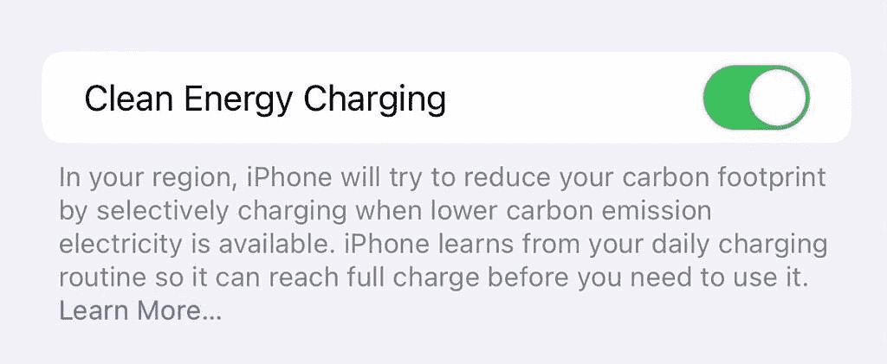

# 苹果向开发者发布 iOS 16.1 beta 5，以下是新内容

> 原文：<https://www.xda-developers.com/ios-16-1-beta-5/>

苹果在 WWDC22 的主基调中透露了 [iOS 16](http://xda-developers.com/ios-16) 、 [macOS Ventura](http://xda-developers.com/macos-ventura) 、 [watchOS 9](http://xda-developers.com/watchos-9) 。这些主要的软件更新包含了视觉变化和方便的功能，进一步丰富了苹果的产品。例如，iPhone 的锁屏现在几乎完全可以定制。更不用说所述屏幕上的小部件支持了。与此同时，Mac 现在有一个更精简的用户界面，更好地匹配 iPadOS 的用户界面。现在，库比蒂诺公司已经公开发布了 iOS 16.0，它一直在努力开发下一个次要版本。你瞧——iOS 16.1 beta 5 现已面向全球注册开发者开放。

## iOS 16.1 beta 5 有什么新功能

iOS 16.1 beta 5 似乎没有引入任何视觉变化或显著的功能。这完全在意料之中——考虑到公开、稳定的发布可能还要两个星期。不过，它确实包括一些底层的 bug 修复和调整。你可以在苹果的开发者网站上读到所有关于它们的内容——该公司在那里提供了官方的[发布说明](https://developer.apple.com/documentation/ios-ipados-release-notes/ios-16_1-release-notes)。

## Beta 4

### 与您共享闪屏

当在 iOS 16.1 beta 4 上首次启动 Messages 应用程序时，一个新的闪屏展示了苹果的 Shared with You 功能。

### 锁屏修复

iOS 16.1 beta 4 修复了一个恼人的视觉错误，当用户在 iPhones 上播放音乐/音频时，该错误会影响锁屏专辑封面。

## Beta 3

### 应用内内容后台下载

iOS 16.1 beta 3 在设置应用的 App Store 部分引入了新的应用内内容后台下载切换。默认情况下，它是启用的，允许应用程序在用户启动之前下载相关内容。

### 调整壁纸设置

iOS 16.1 beta 3 在设置应用中为壁纸部分引入了更干净的 UI。它允许有多种壁纸/锁屏设置的用户在不同的设置之间轻松切换。

### 事项更新

之前的测试版本在常规设置中引入了配对配件部分。iOS 16.1 beta 3 暂时删除了这一部分。苹果可能会在未来的测试版中重新引入它。

## Beta 2

### 不带 Apple Watch 的健身增强版

iOS 16.1 beta 2 引入了无需 Apple Watch 即可订阅 Fitness Plus 的功能。该公司表示，这一变化将发生在其*远*事件期间。

### 游戏中心闪屏

iOS 16.1 beta 2 在首次访问设置应用中的相应部分时，会带来新的游戏中心闪屏。

### 锁屏调整

当你插入 iPhone 时，iOS 16.1 beta 2 在锁定屏幕上恢复了瞬时电池百分比。

### 电池百分比调整

iOS 16 电池百分比在状态栏中的初始形式用于显示相同的视觉水平——不管实际电池百分比如何，只要在 20%以上。iOS 16.1 beta 2 现在包括更新的视觉效果，以反映实际的电池电量/百分比。

## Beta 1

### 现场活动

iOS 16.1 beta 1 增加了对苹果 Live Activities 功能的支持。直播活动类似于 Android OS 上的持续通知。因此，如果某个应用程序中有正在发生的事件，相关信息就会出现在你的锁屏屏幕上。它们还支持动画和持续刷新，以确保您及时了解最新动态。

### 更快的主屏幕壁纸编辑

iOS 16.1 beta 1 现在允许用户快速更改主屏幕壁纸——无需先通过锁屏一项。这当然是一个非常受欢迎的附加功能，为用户节省了一些时间。

### 物质基础

iOS 16.1 beta 1 包括一个专用于支持 Matter 智能家居标准的配件的部分。

### 清洁能源充电

 <picture></picture> 

Credit: *@RealFerst*

清洁能源充电在美国可用，旨在通过在特定时间为 iPhone 充电来减少碳足迹。这些时间取决于你的电网何时使用更清洁的能源。

### 更多型号的电池百分比支持

iOS 16.0 允许 Face ID iphone 用户在状态栏中显示电池百分比。不过，出于某种原因，这不包括 iPhone XR、11、12 Mini 和 13 Mini。最初的实现可能需要额外的显示空间——考虑到这一功能仅在较小屏幕的 iPhones 上不可用。iOS 16.1 beta 1 终于扩展了对这些更小的 iPhones 的支持。

### 可删除的钱包应用程序

iOS 16.1 beta 1 引入了删除内置苹果钱包 app 的功能。如果你改变主意，你可以随时从应用商店再次下载。

### 音乐应用程序调整

iOS 16.1 beta 1 上的音乐应用在正在播放的屏幕上包括连接的音频附件的图标。在此版本之前，它通常显示通用 AirPlay 图标。

你在你的 iPhone 上运行这个测试版吗？为什么或为什么不？请在下面的评论区留言。