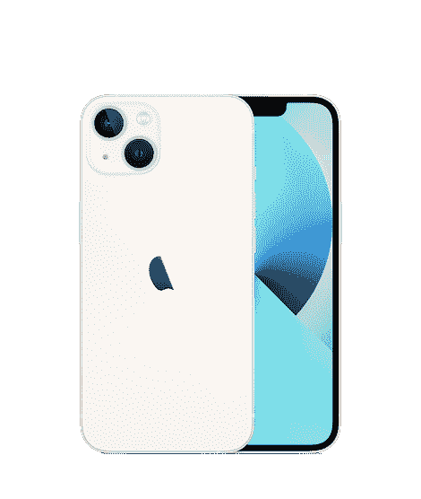

# iOS 16 开发者 Beta 1 动手:全面有意义的改进

> 原文：<https://www.xda-developers.com/ios-16-developer-beta-1-hands-on/>

我对 iOS 作为一个操作系统有很多问题，但我也是我的 iPhone 13 Pro 的忠实粉丝。虽然这款软件并不完美，但总体来说我还是喜欢它的，苹果多年来一直在对它进行改进。有很多我真的希望它拥有的功能，但也有一些事情它*比安卓做得更好，随着 [iOS 16](https://www.xda-developers.com/ios-16) 的发布，这些功能甚至更多。*

 *如果你想使用 iOS 16，你必须再等几个月才能在 iPhones 上推出，因为这是目前第一个开发者测试版。然而，与 iOS 15 相比，iOS 16 更加紧凑，它带来了新的定制、功能和变化，进一步丰富了操作系统。这是我们目前能找到的所有东西。

***关于这次动手:**本文包括来自 XDA 资深编辑 [Adam Conway](https://www.xda-developers.com/author/adamconway/) 的意见。*

## 重新设计的锁屏

鉴于苹果在主题演讲的 iOS 部分谈到了锁屏，这是一件大事。这是你打开手机时看到的第一个东西，也是你看到手机通知的第一个地方。这在 iPhones 上已经多年没有真正改变了，但这是相当激烈的。这是对你手机锁屏的一次彻底改造，你几乎可以编辑所有显示的内容。

我最喜欢的壁纸是天文学壁纸，因为它放大了你的祖国，显示了头顶上的云。您可以添加空气质量指标、日出/日落时间、世界上另一个时间的另一个时钟以及您的健身环的状态。它还补充了 watchOS 9 (Dev Beta 1) 上的 [Apple Watch 上的相同手表表面。](https://www.xda-developers.com/watchos-9-developer-beta-1-hands-on/)

苹果将为开发者提供一个锁屏 widget API，允许他们构建自己可以添加的 widget。你不会局限于只使用第一方的，你可以真正个性化它，以适应你的结果。您还可以创建多个锁屏，并通过向下按来快速轻松地浏览它们。

同样有趣的是，苹果似乎从谷歌的书中吸取了一页，因为[它是你启发的非常重要的材料](https://www.xda-developers.com/material-you-ios-16-lock-screen/)。锁屏上的文字会根据锁屏上的颜色发生变化，甚至会将锁屏上的时间等东西隐藏在照片主题的后面，以产生深度感。

不过我们发现的一件事是，苹果已经取消了锁屏动态壁纸。目前还不清楚这个功能是否会在未来回归，只是被遗忘了，还是永远消失了。我们需要等待未来的更新才能看到。

## 通知和焦点改进

多年来，通知一直是大多数人在 iPhones 上生存的祸根。它们只是做得不好，而且有一大堆问题。虽然它们还没有*修复*(至少在我看来)，但从可用性的角度来看，已经有了一些重大的改变。它们现在从显示屏的底部开始，这样就可以很容易地到达，现在还有“实时”通知-称为实时活动-可以随着时间的推移而更新。

此外，某些锁定屏幕将能够应用聚焦模式，尽管我不相信它是活跃的。Focus 也将更好地集成到应用程序中，甚至是第三方应用程序。当使用某种聚焦模式时，用户将能够隐藏某些元素或过滤他们不想在应用程序中看到的内容。

## 混合听写

语音听写最近风靡一时，苹果在多年前就为 iPhones 实现了自己的版本。我第一次在[的谷歌 Pixel 6 Pro](https://www.xda-developers.com/google-pixel-6-pro-review/) 上体验到了真正*好的*语音听写，这改变了我发短信的方式。苹果自己的没有我在 Pixel 6 Pro 上发现的好，但它足够好，我很可能会经常使用它。

iOS 16 将听写提升到了一个新的水平，允许用户一边说话一边打字——基本上是一种混合输入。在此之前，用户一次只能使用其中一种输入。此外，听写现在能够输入表情符号，并自动为您的输入加上标点符号。

## iMessage:取消发送、编辑和标记为未读

与竞争对手相比，iMessage 是一项非常基本的消息服务，在功能方面总是落后。然而，苹果公司增加了一些新的生活质量的变化和改进，这是非常需要的，并已在竞争平台上可用，如 Telegram，多年来。

首先，使用最新版本 iMessage 的用户可以在发送信息后 15 分钟内编辑或取消发送通过 iMessage 发送的信息。当使用旧版本的应用程序给某人发短信时，这些功能目前不起作用，iMessage 会警告你，你所做的更改或取消发送信息可能不会被其他人接受。

此外，他们还可以将一个聊天标记为未读，实际上是将其加入书签，以便稍后返回。最后,“信息”赶上了其他苹果应用程序，并引入了垃圾桶。iOS 16 上的用户可以在宁滨后 30 天内取回已删除的信息。此外，用户现在可以通过 iMessage 使用[share play](https://www.xda-developers.com/how-to-use-shareplay/)——而不仅仅是 FaceTime。这使您可以在不进行音频/视频通话的情况下与其他人一起消费数字商品。

## 社交游猎

Safari 增加了大量的社交功能，这将有助于与朋友一起计划事情时变得更加容易。您可以创建一个共享选项卡组，任何人都可以参与其中并在其中导航，以便您可以有效地计划事情。上面，我创建了一个名为“假期”的标签组，分享给我的同事阿米尔。我可以在上面添加与都柏林度假相关的链接，并在 iMessage 上与他分享。当我对选项卡组进行更改时，它甚至反映在 iMessage 中，在我们的对话顶部有一个通知，说我已经进行了更改。我还可以看到阿米尔正在查看哪个标签。

正如 Reddit 上的 */u/SkyGuy182* [所指出的，媒体控件现在会在右上角显示一个图标，告诉你它当前正在什么设备上播放。你可以在上面的截图中看到这一点，在那里它将显示它在 Apple TV 和蓝牙扬声器或耳机上的选角。在 iOS 16 之前，它只显示通用的 AirPlay 图标。](https://www.reddit.com/r/iOSBeta/comments/v6uxro/ios_16_beta_the_cast_icon_on_media_controls_now/)

## 照片升级

正如 Reddit 上的 */u/alias3800* [所指出的，你现在可以在照片应用程序中的图片之间复制和粘贴编辑内容，因此你可以快速轻松地对多张照片进行相同的调整。此外，您可以使用 Face ID 或触控 ID 锁定隐藏和最近删除的文件夹。](https://www.reddit.com/r/iOSBeta/comments/v6u60x/feature_ios_16b1_photos_app_now_allows_you_to/)

除此之外，用户现在可以选择照片中的元素，并将其拖动或复制到不同的应用程序中。这将删除背景和其他主题-使它很容易想出创造性的照片输出。最后，照片应用程序现在可以检测视觉上相似的照片，并将它们标记为重复，以便轻松合并它们。

正如 Reddit 上的 */u/SkyGuy182* [所指出的，你现在可以在设备上创建联系人组了。此前，唯一的方法是在 iCloud 网站或 Mac 上进行。联系人应用程序还可以检测重复的卡片，并为您提供合并它们的选项。](https://www.reddit.com/r/iOSBeta/comments/v6tzes/ios_16_beta_finally_after_years_of_begging_we_can/)

## 苹果音乐调整

我们多年来一直希望 Apple Music 上的 Spotify Connect 而 iOS 16 仍未能提供这一基本的连续性功能。尽管如此，苹果还是对其流媒体服务进行了一些小的改动。其中包括一个选择最喜欢的艺术家，以获得更准确的推荐，更全面的专辑封面列表，以及一个新的正在播放的锁定屏幕用户界面，该界面利用了最新的实时活动 API。

## 开发者模式

隐私设置中有一个新的开发者模式切换，允许开发者出于开发目的启动他们的侧装应用。这种模式的具体细节暂时还不清楚。

## Wi-Fi 密码列表

苹果终于将一项备受期待的功能从 macOS 带到了 iOS。我们现在可以查看保存的网络列表，删除它们，并查看它们的密码，而不需要 Mac。该公司只需要十几代这种操作系统就能搞清楚。但是嘿-迟到总比不到好。

## 图书馆照片共享

有没有希望你的手机能在聚会后自动发送集体照给各自的人？嗯，iOS 16 支持那个。现在有了新的规则，允许您指定照片图库的共享者。这些规则可能包括近距离接触和检测你的朋友或家人的脸。

## 快速笔记

去年在 iPadOS 15 和 [macOS Monterey](http://xda-developers.com/macos-monterey) 中推出的 Quick Note。苹果在今年的发布中在 iOS 上引入了这一功能。这允许您通过与 Notes 应用程序共享某些内容来创建快速笔记。在此之前，用户只能通过 iPhones 编辑在 iPad 或 Mac 上创建的快速笔记。说到笔记，你现在可以使用你设备的密码来锁定你的笔记，而不是只为这个应用程序创建一个自定义的密码。

## 更多 Apple Books 主题

Apple Books 在 iOS 16 中获得了一些新主题。这使得一般用户(尤其是视障用户)更容易找到符合他们阅读偏好的字体、大小和背景颜色的组合。图书应用程序也带来了一些设计上的变化，并将目录移动到底部角落的一个新按钮上。

## 药物跟踪

药物跟踪非常适合那些服用大量药丸并经常因跟踪而感到不知所措的人。这项新功能允许你创建一个你服用药物的清单，并设置服药时间的提醒。例如，如果你不应该喝酒，它会额外提醒你。为了更方便地跟踪您所爱的人的药物治疗，iOS 16 还允许您与您选择的人分享您的列表。这个功能也[延伸到了 watchOS 9](https://www.xda-developers.com/watchos-9-developer-beta-1-hands-on/) 上。

## 苹果地图新增功能

与谷歌地图相比，苹果地图有所欠缺。我总是发现自己需要后者，因为仅仅依靠苹果*是不行的*。不幸的是，这个版本仍然不支持离线导航的下载区域。但是，iOS 16 上的地图支持在前往某个目的地时添加多个站点。它还集成了受支持地区的交通卡。

## 更高效的邮件

我个人使用苹果邮件作为我的日常电子邮件客户端。然而，我也承认它并不像我希望的邮件客户端那样功能丰富。它在许多方面仍然是基本的——即使是在 macOS 上。不过，iOS 16 带来了一些新的东西。它仍然不能满足大多数专业用户，但这是朝着正确方向迈出的一步。

这些新变化包括一个在 10 秒内取消发送电子邮件的选项，安排在以后的日期和时间发送电子邮件，以及一个更丰富的搜索字段，支持自动纠正拼写错误的单词。不过，我最需要的功能可能是附件提醒，如果你忘了附上提到的文件，它会阻止邮件通过。

## 视频中的实时文本

库比蒂诺科技巨头在去年的操作系统发布中引入了实时文本。对于那些不熟悉它的人来说，这是一个 OCR 工具，允许你与图像上的文本进行交互，并识别植物和宠物品种。在 iOS 16 上，直播文本扩展到了视频，允许我们在视频播放中与文本进行交互和翻译。这个特性可以离线工作，而且肯定是受欢迎的。

## 重新设计的主页应用程序

iOS 16 也表现出了对 Home 应用的热爱。新的应用程序让用户可以轻松地同时访问多个连接的摄像头。它还引入了新的、更现代的壁纸和简化的用户界面。由于 Matter 标准的支持，用户将能够在今年晚些时候与兼容的智能设备进行通信。

## 非腕表所有者的健身

多年来，如果我想与非 Apple Watch 用户比较我的每日步数或步行距离，我必须依赖第三方服务，并让他们访问我的健康数据。幸运的是，即使你没有与 iPhone 配对的手表，iOS 16 也支持健身应用。除了其他指标外，智能手机本身已经支持计算您的步数、爬升的航班数和距离。这些统计数据在健康应用程序中一直可用。现在，你终于可以使用健身应用程序的分享功能，而不是截图或使用第三方应用程序与朋友竞争。尽管如此，Fitness Plus 仍然是 Apple Watch 的独家产品。

## 家庭暴力幸存者的安全检查

许多人与记录他们生活的施虐者关系密切。家暴是一个非常严重和猖獗的社会问题，iOS 16 希望帮助幸存者切断那些试图控制或伤害他们的人。新的安全检查重置了应用程序权限——例如，这样一来，用于跟踪的应用程序将无法访问受害者的位置。它还显示哪些人可以访问敏感信息，如您的“查找我的实时位置”。对于幸存者来说，这是一个很好的方式，在现场用数字方式把某人切掉。

## FaceTime 中的切换支持

苹果以其紧密的生态系统而闻名，iOS 16 进一步将产品捆绑在一起。运行这一版本和 macOS Ventura 的用户可以在 Mac 和 iPhone 之间无缝切换 FaceTime 通话。这样，您可以在一台设备上开始通话，并在另一台设备上继续通话。

## 新的 Memoji 风格和贴纸

在每一次年度发布中，苹果都倾向于包含新的 Memoji 定制和贴纸。iOS 16 也不例外——它带来了新的发型、头饰和鼻子选择。它还推出了新的贴纸，用户可以在第一和第三方应用程序中使用。这些补充虽然很小，但进一步丰富了 Memoji 库——允许用户通过这些漫画表达自己。

## 苹果记得提醒

提醒是我最喜欢的苹果应用之一。它简单地*工作*，通过帮助你完成**你的**任务来完成任务。iOS 16 进一步丰富了这个 app。不要大惊小怪-该公司已经设法保持它作为你知道和喜欢的简单应用程序，同时带来新的补充，使它更方便，更可定制。iOS 16 引入了列表锁定、可共享模板、可格式化笔记、共享列表通知等等。这使得与其他人的协作更加无缝。

## 更灵活的测量单位

您选择的区域会在许多方面影响您的设备。例如，如果您的设备被设置到服务不可用的区域，Apple News 应用程序不会出现在主屏幕上。该区域还会影响度量单位，如用于距离和重量的单位。苹果允许用户改变默认的温度单位已经有很长一段时间了，但是距离和重量单位遵循了所选地区的默认温度单位。幸运的是，iOS 16 允许你自定义，所以你可以将你的国家设置为美国，并在系统级别上使用公制。这是一个很小但非常非常受欢迎的变化。

## Apple Translate 中的摄像头支持

就像地图的情况一样，苹果翻译没有谷歌翻译好。是的，它可以在全系统范围内工作，并且有一个不错的用户界面(UI)。然而，它缺乏语言对的多样性，并且在翻译准确性方面不太可靠。当我试图翻译我说得很流利的对时，我见过一些语言噩梦。不太可信。

iOS 16 引入了大家熟悉的过渡功能——摄像头。这让你可以毫不费力地捕捉和转换你周围的事物。它也适用于照片应用程序中包含外国文字的现有照片。此外，苹果提到它引入了对土耳其语、泰语、越南语、波兰语、印度尼西亚语和荷兰语的支持。值得注意的是，这些语言在 Beta 1 中似乎并不存在。

* * *

## iOS 16 是一次相当重大的改革

在可定制性部门，iOS 16 是 iOS 近年来最大的更新之一。你可以做很多事情，这对改善通知系统有很大的帮助，这个系统已经很长时间处于不良状态了。当然，这可能也不是苹果将要增加的所有功能。在未来的测试版中也可能会发现一些小的调整和变化，当它们发生时，我们一定会密切关注。

尽管没有获得我们在 [iOS 16 愿望清单](https://www.xda-developers.com/wwdc22-wishlist-ios-16-features/)中包含的所有功能，但苹果带来的新增功能非常受欢迎。它们让 iOS 在某些方面更像 Android 同时保持了流行操作系统的独特感觉和外观。我们现在展望未来，以及该公司如何在未来进一步多样化这一操作系统。快乐的 WWDC！

 <picture></picture> 

Apple iPhone 13

##### 苹果 iPhone 13

iPhone 13 是苹果的最新款 iPhone，拥有更好的摄像头、更大的电池和更小的凹槽。

 <picture></picture> 

AT&T

##### 苹果 iPhone 13 Pro

iPhone 13 Pro 是苹果 2021 年 iPhone 阵容的一部分。它由新的 A15 仿生芯片驱动，运行在 iOS 15 上。

*你最喜欢的 iOS 16 功能是什么？请在下面的评论区告诉我们。**