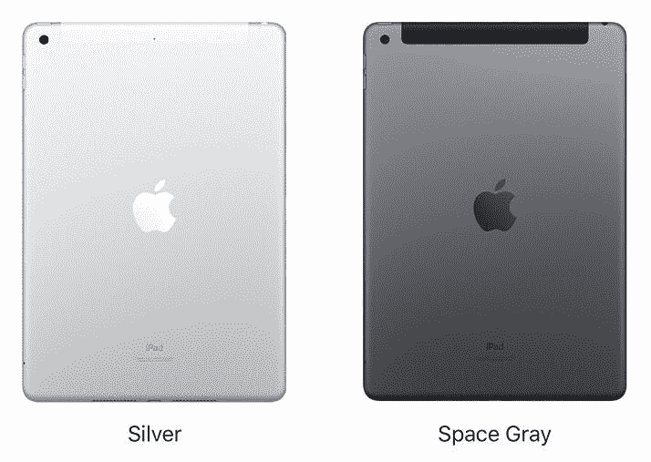
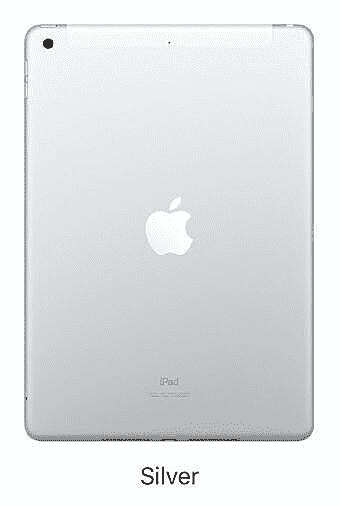
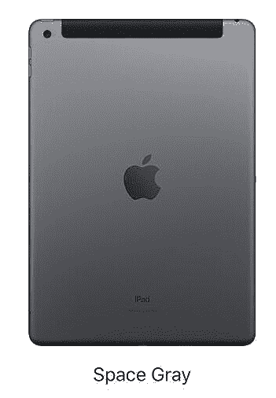

# 苹果 iPad 9 代颜色:银色和太空灰！

> 原文：<https://www.xda-developers.com/ipad-9-colors/>

最新[平价 iPad](https://www.xda-developers.com/best-ipad-9-deals/) 来了！苹果在 9 月 14 日的加州流媒体发布会上发布了 iPad 9 代。这是 T2 学生的最爱，因为它既便宜又多用途。不过你一定想知道 iPad 第九代有什么颜色？

虽然苹果在 iPhone 13[的颜色上变得更有创意，但 iPad 9 代却没有受到同样的喜爱。只有两种颜色可供选择——银色和太空灰。过去几年，这两种颜色一直是平价 iPad 的标准。](http://xda-developers.com/iphone-13)

 <picture></picture> 

Apple iPad 9

真人的颜色看起来与苹果公司的营销图片相似。太空灰只是稍微暗一点的银色。更容易区分它们的是背面的苹果标志。此外，蜂窝模型顶部的天线带可以很容易地分辨出单个 iPad 是银色还是太空灰，分别取决于它是白色还是黑色。

否则，如果你忽略苹果标志和手机天线，实际的铝制机身在某种程度上看起来是相似的，当然，除非你将两个不同颜色的 iPads 并列放置。值得注意的是，银色和太空灰型号的正面都有黑色挡板。

### 购买您选择的颜色的 iPad 9 代

 <picture></picture> 

Silver

##### 苹果 iPad (2021 年)

银色是两种略微相似的饰面中颜色较浅的一种。它的蜂窝型号上有一个白色天线，除此之外，纯 Wi-Fi 和蜂窝型号上都有一个明亮的苹果标志。

 <picture></picture> 

Apple iPad (9th gen), 2021

##### 苹果 iPad (2022 年)

太空灰是两种略微相似的饰面中颜色较深的一种。它的蜂窝型号上有一个黑色天线，除此之外，Wi-Fi 和蜂窝型号上都有一个较暗的苹果标志。

自几年前 iPhone 6 发布以来，苹果一直在使用这些相同的涂层。所以你很可能熟悉它们的色调。如果你正在寻找更丰富多彩和有趣的东西，你可能想看看最新的 iPad Air 和 iPad Mini。就我个人而言，我总是选择太空灰(当黑色不是一个选项时)，因为我不喜欢有彩色的电子产品。但是我确实得到了想要彩色设备的吸引力。

苹果可能没有增加更多的颜色选择，因为 iPad 9 代的实际机身与去年相似。因此，从生产的角度来看，保持颜色不变对他们来说是有意义的。一旦他们最终重新设计了他们负担得起的 iPad，他们可能会发布新的颜色，以匹配其他 iPad 型号和彩色的 M1 IMAC。