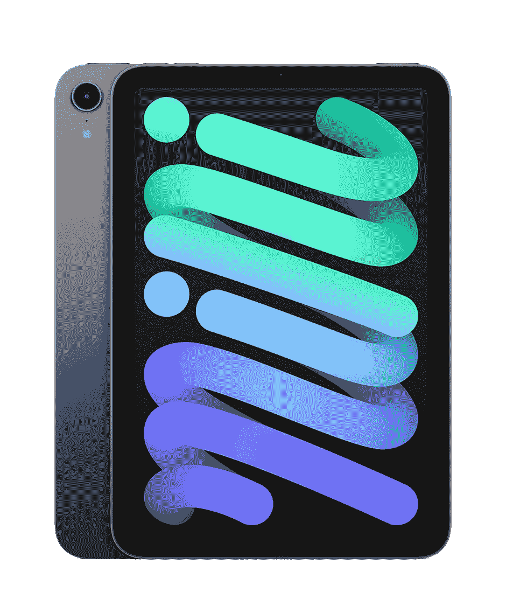
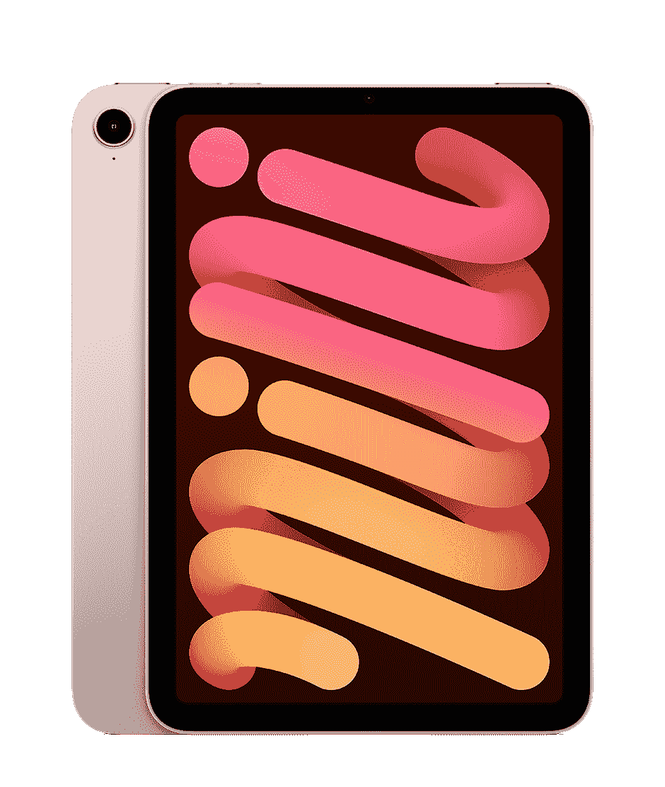
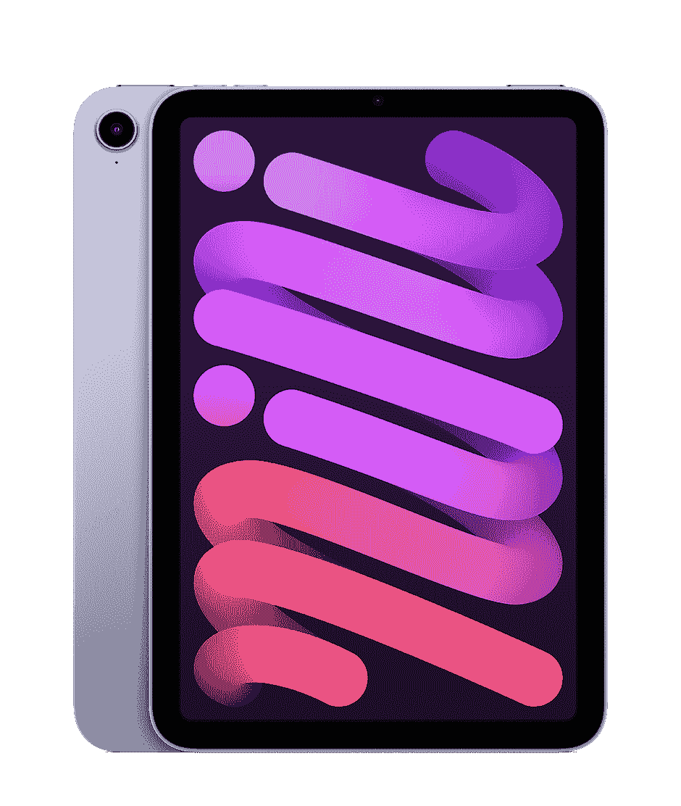
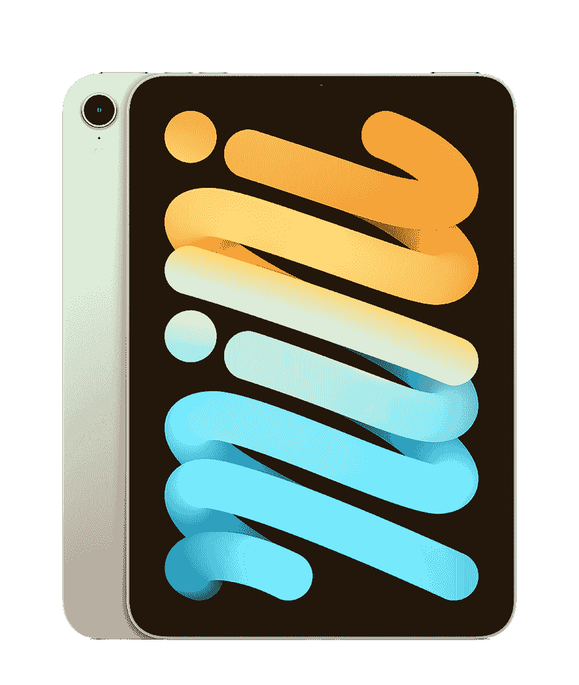

# 苹果 iPad Mini 第六代颜色:星光，粉红，紫色，等等！

> 原文：<https://www.xda-developers.com/ipad-mini-6-colors/>

# 新款 iPad Mini 第六代有什么颜色？

iPad Mini 6th Gen 的另一个变化是引入了新的颜色。如果你想知道它们是什么，你就来对地方了！

全新的 iPad Mini 发布了！苹果在加州流媒体活动中公布了 iPad Mini 的最大升级(迄今为止)。它配有更薄的边框，并遵循类似于最近 iPad Pro 型号的设计语言。如果你是一名学生，喜欢更小的外形和更强大的内部结构(与标准的、价格合理的 iPad 相比)，价格合理(T2)，迷你就是你要找的。最新款的另一个显著变化是引入了新的颜色。如果你想知道 iPad Mini 第六代的颜色，你来对地方了！

仅在一年前，苹果通过 iPad Air 首次为 iPad 增加了“有趣”的颜色选项。多年来，iPads 只有通常的颜色，而且对一些人来说很无聊。虽然最新的 iPad Mini 没有带来一些空气颜色，如天蓝色和绿色，但它确实给桌子带来了一些流行的色调。

iPad Mini 第六代有四种颜色可供选择——太空灰、粉色、紫色和星光。然而，所有的颜色都有相对相似的性质——主要是因为苹果追求各自颜色的微妙色调。尽管如此，它们确实提供了不同的氛围，赋予了 iPad Mini 自己的个性，这取决于你选择哪种表面处理方式。

### 购买您选择的颜色的 iPad Mini 第六代

 <picture></picture> 

Space Gray

##### 苹果 iPad Mini (2021 年)

太空灰选项是为那些喜欢把他们的设备放在最暗的地方的人准备的。它还为那些习惯了苹果一直以来所追求的传统颜色的人提供了一个熟悉的外观。

 <picture></picture> 

Pink

##### 苹果 iPad Mini (2022)

粉色的选择是给那些总是喜欢玫瑰金 iPhones 的人——或者希望他们喜欢的人。虽然它不完全是玫瑰金，但它几乎是一种褪色、苍白的版本。它散发出许多用户喜欢在他们的设备中拥有的玫瑰般的能量。

 <picture></picture> 

Purple

##### 苹果 iPad Mini (2022)

紫色的选择是给那些想要完全不同和新的东西的人。虽然它看起来像一个更有趣的太空灰变体，但紫色仍然是 iPad 的第一款。如果你想脱颖而出，这是适合你的选择。

 <picture></picture> 

Starlight

##### 苹果 iPad Mini (2021 年)

星光选项可以说是苹果银色和白色的混合物，带有温暖的奶油色调。如果你经常选择最亮的漆面，这款适合你。它为一个强大的设备提供了一种纯粹而简单的氛围。

iPad Mini 第六代的新颜色在某种程度上是相似的——主要是因为它们被淡出了。尽管如此，它们仍然是期待已久的设计更新的不错选择。就我个人而言，我会一直坚持黑色/太空灰饰面。但很高兴看到苹果试图通过提供匹配不同口味的选项来满足更多人。毕竟，这正在成为库比蒂诺的一种新趋势。现在，iPhones、不同型号的 iPad 和 iMacs 都提供了近年来没有的鲜艳颜色选择。