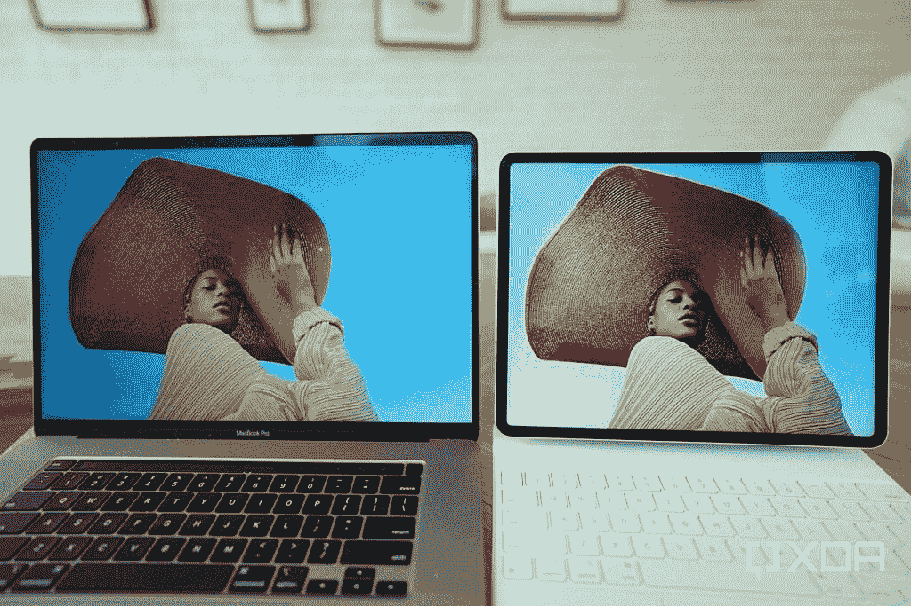
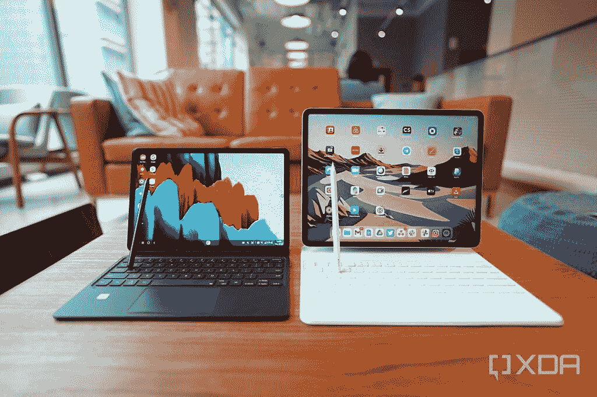

# iPad Pro 评论:苹果的 M1 芯片对于“仅仅”一台 iPad 来说太强大了

> 原文：<https://www.xda-developers.com/ipad-pro-2021-review/>

审查电脑和笔记本电脑通常没有审查手机有趣，因为前者通常只看到逐年递增的内部升级(也称为“规格提升”)，而智能手机除了处理器升级外，通常还会看到新的设计和拍照技术。因此，当我打开苹果新的 [iPad Pro 2021](https://www.xda-developers.com/ipad-pro/) 和 2021 Magic Keyboard 的包装盒时，我有一种似曾相识的感觉。当然，苹果给了它的第一方键盘壳新的颜色，但在大多数情况下，新的 iPad Pro 本身看起来与前两款平板电脑完全一样。

那是在我打开平板电脑之前。一旦我按下新的 12.9 英寸 iPad Pro 上的电源按钮，在设置过程循环的 30 秒内，我已经喃喃自语了一声“哇”。新 iPad Pro 的屏幕看起来明显更亮更清晰，比 iPad Air 2020 的动画更流畅，我正在从 iPad Air 2020 同步我的 iCloud 备份。

### iPad Pro 2021 规格:点击展开

| 

规格

 | 

iPad Pro 2021 (12.9 英寸)

 | 

iPad Pro 2021 (11 英寸)

 |
| --- | --- | --- |
| **建造** | 

*   铝制框架和背部
*   玻璃前部

 | 

*   铝制框架和背部
*   玻璃前部

 |
| **尺寸&重量** | 

*   280.6 x 214.9 x 6.4mm 毫米
*   682g(无线网络)
*   685g (Wi-Fi +蜂窝)

 | 

*   247.6 x 178.5 x 5.9mm 毫米
*   466g(无线网络)
*   470g (Wi-Fi +蜂窝)

 |
| **显示** | 

*   12.9 英寸“液态视网膜 XDR”迷你 LED 显示屏
*   4:3 宽高比
*   2048 x 2732
*   120 赫兹刷新率

 | 

*   11 英寸 IPS 液晶屏
*   4:3 宽高比
*   2388 x 1668
*   120 赫兹刷新率

 |
| **SoC** | 苹果 M1 | 苹果 M1 |
| **内存&存储** | 

*   128GB 存储空间+ 8GB 内存
*   256GB 存储空间+ 8GB 内存
*   512GB 存储空间+ 8GB 内存
*   1TB 存储+ 16GB 内存
*   2TB 存储+ 16GB 内存

 | 

*   128GB 存储空间+ 8GB 内存
*   256GB 存储空间+ 8GB 内存
*   512GB 存储空间+ 8GB 内存
*   1TB 存储+ 16GB 内存
*   2TB 存储+ 16GB 内存

 |
| **电池&充电** | 

*   40.88 瓦时
*   18W 快速充电
*   不包括充电砖

 | 

*   28.65 瓦时
*   18W 快速充电
*   不包括充电砖

 |
| **安全** | Face ID | Face ID |
| **后置摄像头** | 

*   **主要:** 12MP，f/1.8
*   **二级:** 10MP，超宽，f/2.4
*   **第三级:** ToF 3D 激光雷达扫描仪

 | 

*   **初级:** 12MP，f/1.8
*   **二级:** 10MP，超宽，f/2.4
*   第三代: ToF 3D 激光雷达扫描仪

 |
| **前置摄像头** | 12 兆像素，超宽 | 12 兆像素，超宽 |
| **端口** | USB-C | USB-C |
| **音频** | 

*   四声道立体声扬声器
*   没有耳机插孔

 | 

*   四声道立体声扬声器
*   没有耳机插孔

 |
| **连通性** | 

*   802.11 ax Wi-Fi 6；同步双频带(2.4GHz 和 5GHz)
*   5G 型号(A2301 和 A2379)
    *   5G NR(频段 n1、n2、n3、n5、n7、n8、n12、n20、n25、n28、n38、n40、n41、n66、n71、n77、n78、n79)4
    *   5G NR 毫米波(频段 n260，n261)
    *   FDD-LTE(频段 1、2、3、4、5、7、8、11、12、13、14、17、18、19、20、21、25、26、28、29、30、32、66、71)
    *   TD-LTE(频段 34、38、39、40、41、42、46、48)
    *   通用移动通信系统/HSPA/HSPA+/DC HSDPA(850，900，1700/2100，1900，2100 兆赫)

*   蓝牙 5.0
*   全球（卫星）定位系统
*   国家足球联盟

 | 

*   802.11 ax Wi-Fi 6；同步双频带(2.4GHz 和 5GHz)
*   5G 型号(A2301 和 A2379)
    *   5G NR(频段 n1、n2、n3、n5、n7、n8、n12、n20、n25、n28、n38、n40、n41、n66、n71、n77、n78、n79)4
    *   5G NR 毫米波(频段 n260，n261)
    *   FDD-LTE(频段 1、2、3、4、5、7、8、11、12、13、14、17、18、19、20、21、25、26、28、29、30、32、66、71)
    *   TD-LTE(频段 34、38、39、40、41、42、46、48)
    *   通用移动通信系统/HSPA/HSPA+/DC HSDPA(850，900，1700/2100，1900，2100 兆赫)

*   蓝牙 5.0
*   全球（卫星）定位系统
*   国家足球联盟

 |
| **软件** | iPadOS 14.5 | iPadOS 14.5 |
| **其他特色** |  |  |

***关于这个评测:**【孔】给我发了一个 1TB 存储的 12.9 寸 iPad Pro，带魔法键盘评测。苹果公司对这篇文章没有意见。*

## 硬件:屏幕和 SoC 是重中之重

与前两款机型一样，新款 2021 iPad Pro 有两种尺寸:11 英寸和 12.9 英寸。如果你在过去几年里见过 iPad Pro，那么你已经见过这款新机型了。它们看起来几乎一样，细长统一的边框容纳了 Face ID 的原深感摄像头系统，铝制机身和扁平的底盘已经成为苹果新的设计语言规范。今年，比以往任何时候都更值得关注的是 12.9 英寸的 iPad Pro，因为我在介绍中提到的那个辉煌的屏幕——苹果营销团队称之为“Liquid Retina XDR”的迷你 LED 显示屏——是更大型号的专属。

TCL、三星和 LG 在其高端电视中使用的 Mini LED 是一种相对较新的显示技术，使用非常小的发光二极管(LED)为显示器供电。2020 年的 iPad Pro 更传统的液晶面板有 72 个 LEDs 新的 2021 iPad Pro 的迷你 LED 具有超过 10，000 个 LED。这意味着，与 2020 年的型号相比，新款 iPad Pro 可以产生更大的动态范围、对比度和亮度，因为有更多的*led 可以根据屏幕显示的内容变亮或变暗。*

很明显，与 2020 年的 iPad Air 和 2019 年的 16 英寸 MacBook Pro 相比，12.9 英寸的 iPad Pro 的显示效果更好

我不是显示器专家，但新的 12.9 英寸 iPad Pro 与我的 2020 年 iPad Air 和 2019 年 16 英寸 MacBook Pro 在显示亮度上的差异是显而易见的。我的 iPad Air 可以达到 500 尼特的峰值亮度，MacBook Pro 600 尼特。两者在室内都很好，但无法与 iPad Pro 2021 上 1000 尼特的峰值亮度相比。

 <picture></picture> 

2019 16-inch MacBook Pro screen at 75% brightness vs 2021 12.9-inch iPad Pro screen at 75% brightness,

最好的手机(比如 iPhone 12 系列或 [Galaxy S21](https://www.xda-developers.com/galaxy-s21-ultra-display-review/) 系列)上最好的有机发光二极管屏幕与 iPad Pro 的 Mini LED 屏幕相当，但后者变得更亮，没有烧屏，更适合生产力机器。

## iPad Pro 2021 的 M1 到底有多强大？

今年 iPad Pro 系列的另一个重大升级是使用了[苹果的 M1 芯片](https://www.xda-developers.com/apple-macbook-air-macbook-pro-13-mac-mini-m1-arm-soc/)，这款基于 ARM 的 SoC 几个月前在 MacBook Air 和 Mac Mini 上首次亮相，获得了好评，因为它们基本上在真实世界和基准测试中击败了英特尔驱动的 Mac。

我对 2021 款 iPad Pro 的测试显示了同样令人印象深刻的结果。在一次测试中，我从 iMovie 导出了一个 26 分 38 秒长的 4K/30fps 视频，该视频安装在新 iPad Pro、2020 iPad Air(由 iPhone 12 系列中使用的相同 5 纳米 SoC 驱动)和 2019 英特尔 i9 MacBook Pro 上，内存为 32GB。M1 驱动的 iPad Pro 第一个完成，用时 13 分零 5 秒。iPad Air 以 15 分 4 秒的成绩获得第二名。i9 MacBook Pro(我花了*3300 美元*买的)用了 30 分 18 秒。

2021 年的 iPad Pro 展示了与苹果 M1 驱动的 MacBook 同样令人印象深刻的性能

在 GeekBench 上，2021 款 iPad Pro 的多核成绩是 2020 款 iPad Air(配有 A14 仿生)和[中兴 Axon 30 Ultra](https://www.xda-developers.com/zte-axon-30-ultra-hands-on/) (搭载[高通骁龙 888](https://www.xda-developers.com/qualcomm-snapdragon-888-benchmarks/) )的两倍多。我没有在我的英特尔 i9 MacBook Pro 上运行 Geekbench(因为该应用程序价格为 10 美元)，但其他测试人员有，它也输给了 2021 年的 iPad Air。

有三个更值得注意的硬件升级:2021 iPad Pro 平板电脑都获得了更强大的 USB-C 端口，支持 Thunderbolt 它们都支持蜂窝模型中的 5G 连接；他们都将前置摄像头升级为 12MP 超宽摄像头，这一点得到了很好的利用(我将在下一节中解释)。

iPad Pro 2021 的其他部分仍然和以前一样，从“推广”刷新率(120Hz)，显示分辨率，出色的四扬声器系统，以及包括宽、超宽和激光雷达扫描仪的主相机系统。

## 软件:iPadOS 14.5 占据了中心位置

我的新 iPad Pro 开箱时预装了 iPadOS 14.5，但不到两天，我就得到一个软件[更新到 14.5.1](https://www.xda-developers.com/apple-pushes-ios-14-5-1-security-update/) 。据我所知，iPadOS 14.5 几乎所有的大变化都是[带给 iOS 14.5](https://www.xda-developers.com/apple-ios-14-5-download-available/) 的一样，比如 Siri 更好地理解我的音乐聆听习惯；新的表情符号和 Siri 语音；最大的问题是[让马克·扎克伯格如此疯狂](https://www.xda-developers.com/facebook-apple-spar-upcoming-app-tracking-transparency-feature-ios-14/)——应用程序跟踪透明度。

新款 iPad Pro 是一款出色的同类最佳平板电脑，拥有比 Android 或 Windows 领域更好的动画、用户界面和更发达的应用生态系统。

iPadOS 软件独有的功能是一个名为“中央舞台”的技巧，它使用新 iPad Pro 的 M1 芯片和超宽前置摄像头，在视频通话中智能跟踪用户的面部。这意味着我可以在通话过程中四处移动，视频将跟随我的移动，并尽可能将我框在中间。如果有第二个人进入画面，那么 M1 会考虑我们两个人的脸，并调整画面，让我们两个人都在画面中。它工作得很好，如下面的例子所示。

除了 Center Stage 之外，2021 款 iPad Pro 的软件体验与 2020 或 2018 款 iPad Pro 基本相同。这意味着新的 iPad Pro 仍然是一款优秀的同类最佳平板电脑，拥有更好的动画、用户界面和比 Android [或 Windows space](https://www.xda-developers.com/microsoft-cant-keep-up-apple-ipad-pro-anymore/) 中的任何产品都更发达的应用生态系统。使用带键盘的平板电脑作为*电脑的替代品*可能是偶然的，因为你仍然可以同时打开最多两个应用程序(如果你愿意的话，可以打开三个)。我将在下一节详细解释。

## 可以用带魔法键盘的新款 iPad Pro 作为电脑替代品吗？

自从苹果在 2015 年首次推出 iPad Pro 以来，它一直被宣传为潜在的电脑替代品。当平板电脑一次只能显示一个应用程序，并且没有适当的文件管理系统时，这种说法起初是可笑的。到 2017 年左右，情况开始好转，当时苹果为 iPads 推出了分屏多任务处理，然后最终在 2018 年推出了文件管理系统。

我实际上在 2018 年的大部分时间里使用 iPad Pro 作为我的*主工作机*。当然，当时我完全是一名独立的自由撰稿人，所以我工作所需的应用程序只有谷歌文档、Safari 和 Gmail。一次只能在屏幕上显示两个应用并没有让我退缩太多，因为我从来不需要同时显示两个以上的应用。我没有常规的视频通话，也不需要登录 Slack 之类的聊天应用。

但是今天，我的工作情况更加复杂和动态，即使是新的 iPad Pro 也无法再将其作为我的主要工作机器。我和 XDA 的一个团队一起工作，这意味着我需要放松；有定期视频通话；我不再只是写文字——我还拍摄产品照片，编辑这些照片，上传到服务器，添加字幕，以及制作视频等其他任务。一次只能打开两个应用太受限制了，因为 Slack 本身总是需要在我工作时间打开。我可以在“滑动”模式下打开第三个应用程序，这种模式下应用程序挂在屏幕外，随时可以被拖入屏幕，但这仍然不像只有三个可调整大小的窗口那么容易，我可以在真正的计算机上甚至是三星的 Galaxy Tab S7 T1 上这样做。

在 2021 款 iPad Pro 上，Zoom 或 Google Meet 等第三方视频会议应用程序也可能时好时坏，因为进入分屏视图通常会导致摄像头关闭或把我踢出通话。

虽然 LumaFusion 在我看来是任何移动设备上最好的视频编辑应用程序，但它仍然无法与 Final Cut Pro 或 Adobe Premiere 等桌面级视频编辑软件相媲美。简而言之，我再也不能像 2018 年那样，在为期一周的旅行中携带 iPad Pro，并期望能够轻松完成所有工作。

新的 iPad Pro 不能再作为我的主要工作机器了

遗憾的是，iPadOS 仍然有点局限性，因为 iPad Pro 的 UI 动画、显示亮度和魔法键盘都是*那么好*。后者需要单独购买，与[更实惠的第三方键盘](https://www.xda-developers.com/logitechs-11-ipad-pro-keyboard-case-now-costs-less-than-half-of-apples-magic-keyboard/)相比，它的价格肯定过高，但如果钱不是问题，它是迄今为止我在任何平板电脑上使用过的最好的超薄键盘保护套。按键间距均匀，行程极佳，尽管触控板相对较小，但它比我测试过的大多数 Windows 笔记本电脑触控板(戴尔 XPS 13、华为 MateBook X Pro 等)都更准确。我也喜欢键盘把 iPad 从桌子上稍微抬高。

如果有一线希望的话，那就是在不久的将来这种情况可能会改变。苹果公司做出了一个奇怪的决定，给 1TB 和 2TB 型号的 iPad Pro 配备了 16GB 的内存，这是 2020 年 iPad Pro 使用的最大 6GB 内存的一个巨大飞跃。苹果从来不在乎在 iPhones 和 iPad 中塞进更多的内存，所以这款 M1 驱动的 iPad Pro 突然拥有 16GB，让许多业内人士怀疑苹果是否正在计划一些大事情——也许 iPadOS 在不久的将来会获得更好的多任务处理能力？或者，更多的 Mac 应用程序(如 Final Cut Pro)将会出现在 iPad 上？

我当然希望如此，因为就目前而言，M1 芯片对于“仅仅”运行平板电脑版 iOS 的 iPad 来说几乎太强大了。

## iPad Pro 搭配 Apple Pencil 可以当创意机用吗？

多年来，我一直是 Apple Pencil 的粉丝，我仍然喜欢在 2021 年的新款 iPad Pro 上使用它。无论是在苹果的默认 notes 应用程序中记下笔记，还是在非常受欢迎的 Procreate 应用程序中画草图，12.9 英寸的大画布和 3:2 的纵横比以及 120Hz 的刷新率都使书写变得非常愉快。苹果没有透露 Apple Pencil 的压力灵敏度的确切数字，但测试过它的专业艺术家表示，它与 Surface Pen 报道的 4096 级灵敏度相似。

不管是哪种情况，我用苹果铅笔画了一些草图，发现这种体验没有延迟，和在纸上画画差不多。

Apple Pencil 的尖端更细(与我们的手指相比),这也使它对照片和视频编辑非常有用。在 Lightroom 中，我可以进行更精确的裁剪和点校正。

我仍然喜欢在新款 2021 iPad Pro 上使用 Apple Pencil

## 使用 iPad Pro 玩有趣的平板电脑游戏

我之前已经说过，苹果的 iPad Pro 是市场上最好的平板电脑——这是大多数评论者的观点——所以这款新的 iPad Pro 打破了平板电脑的体验也就不足为奇了。这主要是因为应用程序开发人员更渴望为 iOS/iPadOS 开发应用程序，而不是 Android 或 Windows，因为苹果用户平均在应用程序上花费更多的钱，而 iPads 在市场上真的很丰富。但开发者的兴趣也是因为硬件:iPad Pro 的激光雷达(光探测和测距)扫描仪使 AR 应用程序的运行更加精确。例如，在配备激光雷达的 iPad Pro 上测量室内建筑的墙壁或地板到天花板之间的距离，要比在安卓手机上使用类似的应用程序精确得多。下面，你可以看到 iPad Pro 的激光雷达扫描仪能够准确地检测到木桌的弯曲表面区域。

苹果的 app store 里有几十款优秀的 AR 应用很好的利用了现实世界的环境，比如 AR 动物，愤怒的小鸟。在我的充满家具的共同工作空间里，iPad Pro 在柜台上、椅子和沙发旁边和周围显示虚拟物体没有问题。

新 iPad Pro 的四扬声器系统可以发出我用过的任何平板电脑中最好的声音，再加上华丽的大屏幕，可以成为顶级的游戏机或网飞游戏机。流畅的滚动动画也使平板电脑成为床上阅读的理想选择。

在我用过的所有平板电脑中，新款 iPad Pro 的音质最好

## 电池寿命

虽然 M1 驱动的 MacBook Air 的电池寿命比以前的英特尔版本有了大幅提高，因为基于 ARM 的移动 SoC 比英特尔的处理器效率高得多，但 2021 年新 iPad Pro 的电池寿命与 2020 年的型号没有太大区别，因为 iPad 一直运行在高效的基于 ARM 的 SoC 上。苹果公司表示，今年的 12.9 英寸 iPad Pro 一次充电可以持续使用约 10-11 个小时，但我的使用情况并不理想。我还没有一次将平板电脑从 100%完全推到 0%，但在几次四小时的使用过程中，包括在边上运行 Slack 和流媒体 Spotify 的情况下在 WordPress 上写作，我会看到电池电量下降了近 50%。所以对我来说，这感觉就像一台机器，可以达到八小时，也许九小时，但不是十小时。

至少充电很容易，因为 iPad Pro 通过 USB-C 充电，而不是烦人的 Lightning 线。

[sc name = " pull-quote " quote = " 2021 款 iPad Pro 无疑是目前能买到的最好的平板电脑"]

## 结论:新 iPad Pro 是最好的平板电脑，但 iPadOS 需要做得更多

考虑到科技媒体的普遍共识是，iPad 一直是市场上最好的平板电脑，M1 SoC 也没有辜负宣传，这几乎是一个既定的结论，即这款 M1 驱动的 iPad Pro 将是一款令人敬畏的机器，很容易成为 2021 年最好的平板电脑。

但事实是:我也说过 2015、2017、2018 和 2020 年的 iPad Pros。苹果的 A 系列芯片和 iOS 应用程序优化得如此之好，即使是 2018 年的 iPad Pro 今天也仍然可以完美运行。对于大多数不经常导出 4K 视频的人来说，除了屏幕看起来更好之外，他们很难说出 2021 年的 iPad Pro 比 2018 年的 iPad Pro 有什么改进。iOS 应用程序在四岁的 iPhone 8 上仍然运行良好，更不用说 2021 年推出的 iPad Pro 了。

这就是为什么苹果内部人士都想知道苹果是否在 iPad Pro 软件方面有更多的计划。因为 M1 对于一台 iPad 来说实在是太强大了。

苹果对这款 2021 iPad Pro 的定价也不仅仅是一款平板电脑。当然，基本型号的起价为 799 美元，对于苹果新产品来说，这似乎是一个非常实惠的价格，但这是针对没有迷你 LED 屏幕或蜂窝功能以及 128GB 存储空间的 11 英寸型号。你也不应该买一台 M1 驱动的 iPad Pro，只当平板电脑用，所以你也需要一个键盘。再加上 Apple Pencil，这个 799 美元的价格就涨到了四位数以上。最贵的 2021 款 iPad Pro (12.9 英寸，2TB 存储，WiFi +蜂窝连接)售价*2099 美元*(加上配件，接近 2400 美元)。

 <picture></picture> 

The Samsung Galaxy Tab S7 is a worthy alternative if you just want a tablet for just basic entertainment needs.

所以，是的，苹果最好的平板电脑在旗舰笔记本电脑类别中定价很高。如果你只是在寻找一台平板电脑来进行睡前阅读或播放网飞，我不会建议你购买 2021 款 iPad Pro。取而代之的是，买一台性价比更高的 iPad Air，甚至是一台 Galaxy Tab S7。但是对于那些真正打算在这台机器上工作的人(数字插画师、只需要打字的作家等)，我认为 2021 年的 iPad Pro 是值得的，因为他们将获得一台在工作和娱乐方面都表现出色的机器。

如果苹果真的带来了 Mac 应用程序并使 iPadOS 更强大呢？那么我认为这比笔记本电脑更划算。对我来说，如果我可以在这台机器上运行 Final Cut Pro 并在可调整大小的浮动窗口中打开应用程序，它会立即用 iPad Pro 取代我的 MacBook Pro 作为我的主要工作机器。

 <picture></picture> 

iPad Pro 2021 11-inch

##### 苹果 iPad Pro 11 英寸(2021 年)

11 英寸的 iPad Pro 可能没有迷你 LED 屏幕，但它仍然有改变游戏规则的 M1 处理器，并具有高度便携的尺寸。

 <picture></picture> 

12.9-inch iPad Pro

##### 苹果 iPad Pro 12.9 英寸(2021 年)

这款 12.9 英寸 iPad Pro 上的屏幕要亲眼看到才会相信。加上 M1 芯片，这对于一台 iPad 来说几乎太强大了。

 <picture></picture> 

Magic Keyboard for iPad Pro 2021 12.9-inch

##### 适用于 iPad Pro 12.9 英寸的苹果魔法键盘

如果你想充分发挥 iPad Pro 的潜力，你需要一个键盘，苹果官方的 Magic Keyboard 在相对较薄的 folio 外壳上拥有最佳的打字和触控板体验。