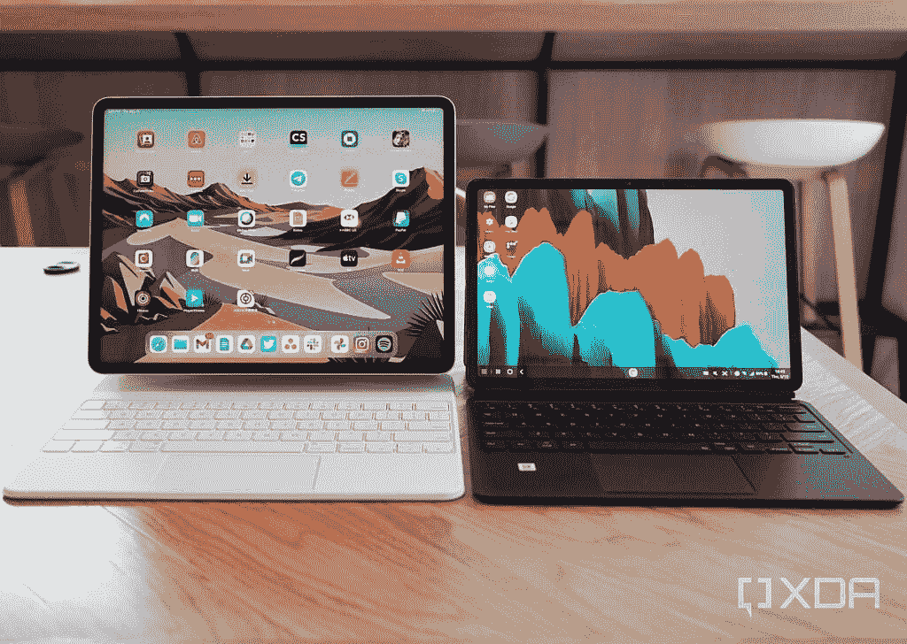
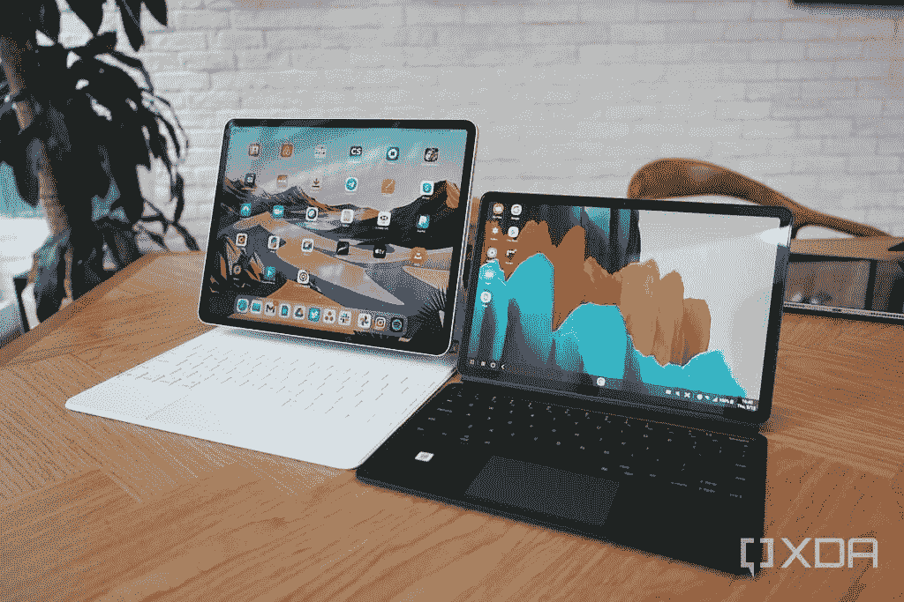
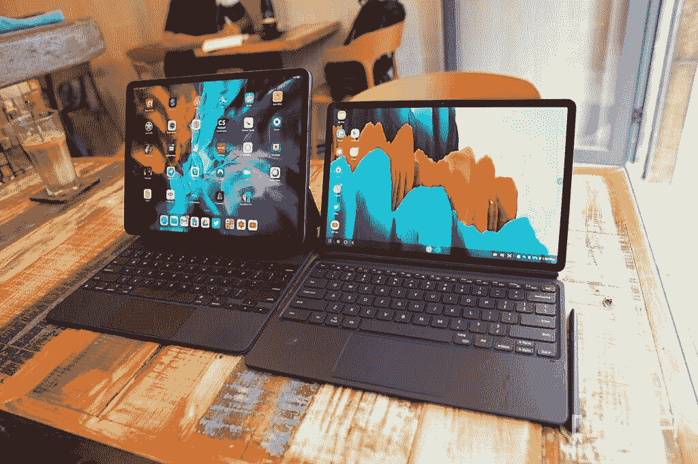
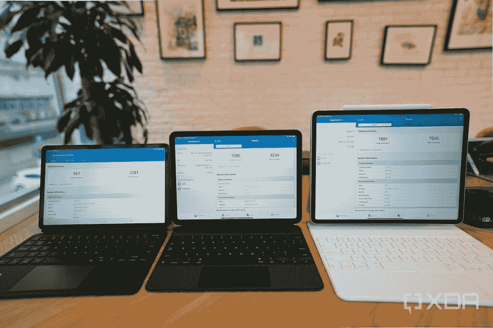
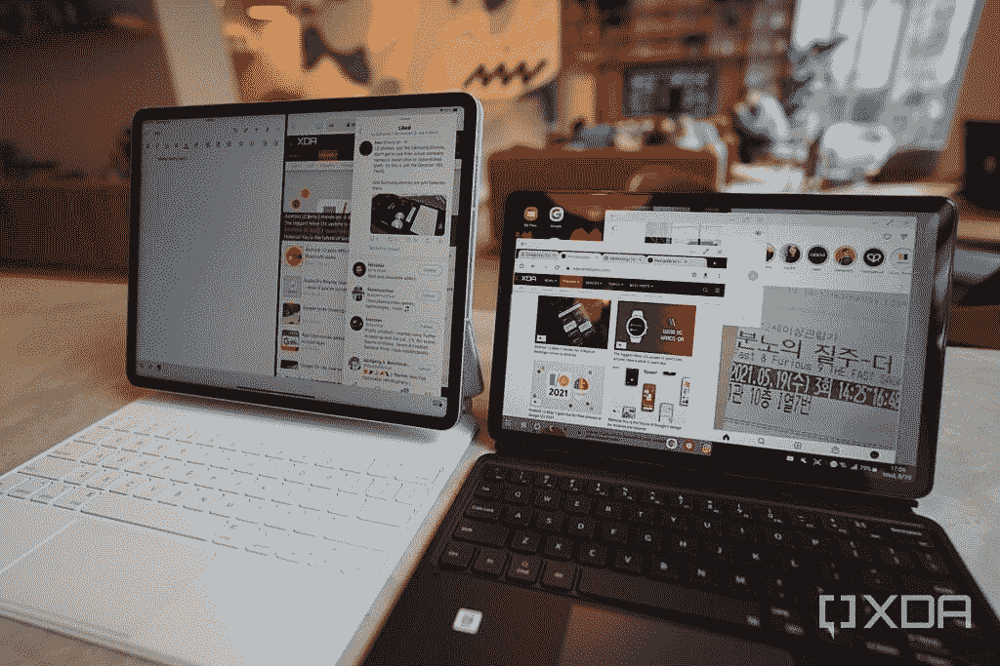
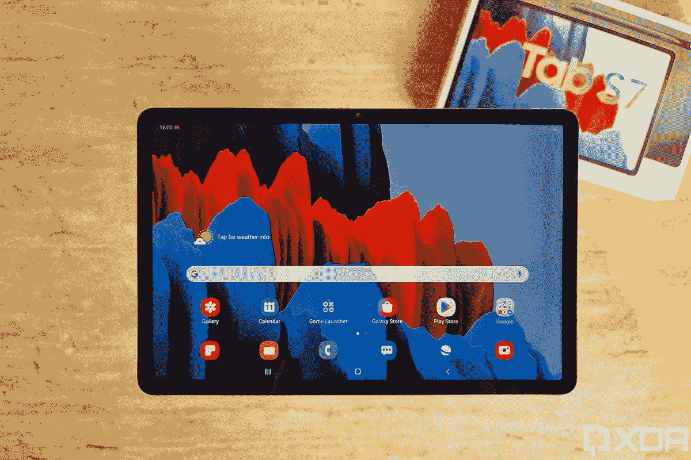
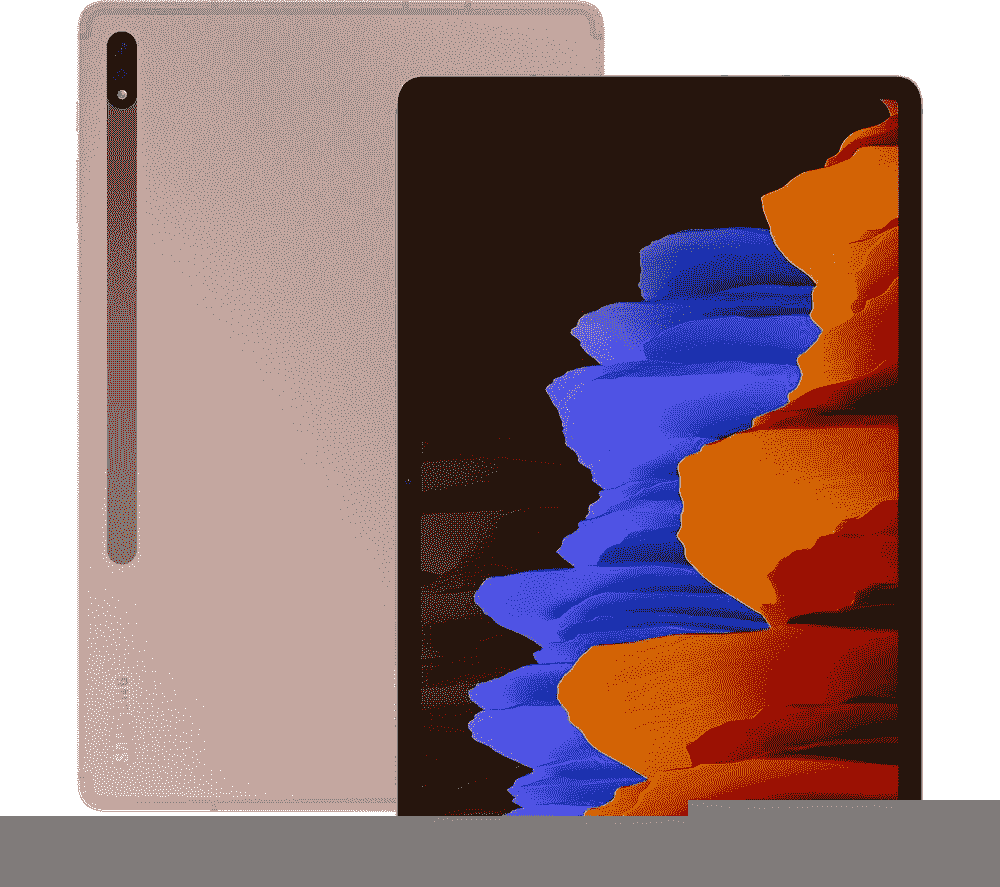

# iPad Pro 2021 vs Galaxy Tab S7:苹果和安卓平板电脑之战

> 原文：<https://www.xda-developers.com/ipad-pro-2021-vs-galaxy-tab-s7/>

在街上问一个人平板电脑的名字，他们很可能会提到 iPad。虽然从谷歌到华为到小米的许多安卓手机品牌都试图制造自己的旗舰平板电脑，但只有三星拥有品牌力、全球可用性、技术资源和营销实力的组合，能够真正与苹果竞争。所以不管是好是坏，三星的手机和平板电脑往往是安卓产品的代表。因此，随着苹果最新的 [iPad Pro](https://www.xda-developers.com/ipad-pro/) 刚刚上市，我们决定用它来对抗三星最新的平板电脑。

是的，我们知道这不是最直接的比较，因为我们有最高等级/较大的 iPad Pro 与较低等级/较小的 Galaxy Tab S7，但这是我目前拥有的两个型号。几个月前，我确实彻底测试了更大的 [Galaxy Tab S7+](https://www.xda-developers.com/samsung-galaxy-tab-s7-plus-preview/) 。所以，即使我现在手头没有一个单位，我仍然从个人经历来写它。

 <picture></picture> 

Apple's 12.9-inch, 2021 iPad Pro and an 11-inch Samsung Galaxy Tab S7, released in late 2020.

## iPad Pro 2021 (12.9 英寸)和三星 Galaxy Tab S7 (11 英寸):规格

| 

规格

 | 

iPad Pro (12.9 英寸，2021 年)

 | 

Galaxy Tab S7 (11 英寸)

 |
| --- | --- | --- |
| **打造** | 

*   铝制框架和背部
*   玻璃前部

 | 

*   铝制中框和背部
*   玻璃前部

 |
| **尺寸&重量** | 

*   280.6 x 214.9 x 6.4mm 毫米
*   682g(无线网络)
*   685g (Wi-Fi +蜂窝)

 | 

*   165.3 x 253.8 x 6.3mm 毫米
*   498g(无线网络)
*   500g (Wi-Fi +蜂窝)

 |
| **显示** | 

*   12.9 英寸“液态视网膜 XDR”迷你 LED 显示屏
*   4:3 宽高比
*   2048 x 2732
*   120 赫兹刷新率

 | 

*   11 英寸液晶显示器
*   16:10 宽高比
*   1600 x 2560
*   120 赫兹刷新率

 |
| **SoC** | 苹果 M1 | 骁龙 865 |
| **闸板&存放** | 

*   128GB 存储
*   256GB 存储空间
*   512GB
*   1TB
*   2TB
*   Ram 未公开

 | 

*   6GB 内存，128GB
*   8GB 内存，256GB
*   8GB 内存，512GB

 |
| **电池&充电** | 

*   9720 毫安时
*   18W 快速充电
*   不包括充电砖

 | 

*   8000 毫安时
*   45W 快速充电
*   含充电砖

 |
| **安全** | Face ID | 电容式指纹扫描仪 |
| **后置摄像头** | 

*   初选: 12MP，f/1.8
*   **二级:** 10MP，超宽，f/2.4
*   **第三级:** ToF 3D 激光雷达扫描仪

 | 

*   **初级:** 13MP，f/2.0
*   **二级:** 5MP，超宽，f/2.2

 |
| **前置摄像头** | 12 兆像素，超宽 | 800 万像素 |
| **端口** | USB-C | USB-C |
| **音频** | 

*   四声道立体声扬声器
*   没有耳机插孔

 | 

*   四声道立体声扬声器
*   没有耳机插孔

 |
| **连通性** | 

*   802.11 ax Wi-Fi 6；同步双频带(2.4GHz 和 5GHz)
*   5G 型号(A2301 和 A2379)
    *   5G NR(频段 n1、n2、n3、n5、n7、n8、n12、n20、n25、n28、n38、n40、n41、n66、n71、n77、n78、n79)4
    *   5G NR 毫米波(频段 n260，n261)
    *   FDD-LTE(频段 1、2、3、4、5、7、8、11、12、13、14、17、18、19、20、21、25、26、28、29、30、32、66、71)
    *   TD-LTE(频段 34、38、39、40、41、42、46、48)
    *   通用移动通信系统/HSPA/HSPA+/DC HSDPA(850，900，1700/2100，1900，2100 兆赫)
*   蓝牙 5.0
*   全球（卫星）定位系统
*   国家足球联盟

 | 

*   5G:低于 6GHz
*   超宽带
*   支持 2×2 MIMO 的 wi-Fi 6(802.11 ax)
*   蓝牙 5.0
*   国家足球联盟
*   全球（卫星）定位系统

 |
| **软件** | iOS 14.5 | 一个基于 Android 10 的 UI 2.5 |
| **其他特色** |  |  |

## iPad Pro 2021 (12.9 英寸)与 Galaxy Tab S7/S7+:显示屏

理论上，12.9 英寸的 iPad Pro 只比 Galaxy Tab S7 的屏幕多了 1.9 英寸。但在现实生活中，感觉远不止如此，因为苹果的平板电脑使用 4:3 的宽高比，而三星选择了 16:10 的宽屏宽高比。由于缺乏垂直空间，即使是更大的 Galaxy Tab S7+的 12.4 英寸屏幕对于书写工作来说也感到有点紧张，所以 Tab S7 上的 11 英寸感觉很受限制。相反，Tab S7 系列更宽的宽高比更适合大多数视频，减少了信箱。

 <picture></picture> 

12.9-inch iPad Pro (left) and an 11-inch Galaxy Tab S7.

除了长宽比，两个屏幕都有流畅的 120Hz 刷新率，看起来都很棒。如果我们只是比较新的 12.9 英寸 iPad Pro 2021 和小的 Galaxy Tab S7，那么苹果的平板电脑显然会赢，因为它的 Mini LED 技术优于 Tab S7 中使用的 IPS LCD 面板。然而，更大的三星平板电脑升级为 OLED 面板，差距明显缩小。一般来说，我觉得 Galaxy Tab S7+的 OLED 面板显示的黑色更深，红色更强烈，但配有迷你 LED 屏幕的 2021 iPad Pro 变得更加明亮。

 <picture></picture> 

The larger 12.4-inch Galaxy Tab S7+ (right) next to the 2020 iPad Pro (left).

## iPad Pro 2021 (12.9 英寸)与 Galaxy Tab S7/S7+:内部

2021 年 iPad Pro 的两个型号都由新的苹果 M1 硅驱动，而 Galaxy Tab S7 系列使用高通骁龙 865。非常罕见的是，苹果产品的内存比安卓产品大，因为 12.9 英寸的 iPad Pro 配备了 8GB 或 16GB 的内存，而 Tab S7 系列提供 6GB 或 8GB 的内存。

如果我们通过基准测试，这甚至不是一场比赛，因为 M1 在每个指标上都超过了骁龙 865，包括在 Geekbench 5 中的多核分数增加了一倍以上。然而，在现实世界的使用中，功率的差距更加微妙，因为 Galaxy Tab S7 基本上像一个超大的三星手机一样，三星的 One UI 也得到了很好的优化。

 <picture></picture> 

Geekbench 5 scores for the Galaxy Tab S7 (left); iPad Air 2020 (middle); and iPad Pro 2021 (right).

## iPad Pro 2021 (12.9 英寸)与 Galaxy Tab S7/S7+:摄像头

iPad Pro 的三镜头主摄像头系统具有 12MP 主摄像头、10MP 超宽和 LIDAR(光探测和测距)传感器，而三星的主系统仅包含 13MP 主摄像头和 5MP 超宽。在正面，Galaxy Tab S7 系列使用 800 万像素的标准自拍相机，而 iPad Pro 的前置光学系统包括 1200 万像素的超宽镜头和原深感摄像头系统(Face ID 所需的所有传感器)。

老实说，如果与旗舰智能手机相比，这两个相机系统都不令人惊讶，无论如何，我不想成为那些在公共场合用平板电脑拍照的人之一。玩笑归玩笑，如果我一定要比较的话，我发现 Galaxy Tab S7 的主摄像头比 iPad Pro 的主摄像头拍摄的图像更生动，但其他镜头远不如苹果的主摄像头。特别是，Tab S7 的 500 万像素超宽传感器可以拍摄出 200 美元安卓手机级别的照片，和三星设备一样，自拍会产生强烈的美化效果，使我的皮肤看起来不自然地光滑和变白。

iPad Pro 的附加激光雷达扫描仪对于增强现实应用程序也很方便，如测量家具的尺寸等。

## iPad Pro 2021 (12.9 英寸)与 Galaxy Tab S7/S7+:软件

iPad Pro 运行 iPadOS 14.5，而 Galaxy Tab S7 在 Android 10 上运行 One UI 2.5。这些本质上是每个公司智能手机软件的微调版本。iPadOS 的行为几乎与 iPhone 完全一样，只是它能够在分屏模式下同时运行两个应用程序(第三个应用程序悬停在屏幕外，随时可以被拉进来)。

在没有键盘配件的情况下，将这些设备用作平板电脑，我更喜欢在 iPad 上的体验，因为 iOS 移动应用程序在大屏幕上比 Android 平板电脑更优化；此外，专为 iPad 开发的应用程序比安卓平板电脑的选择要多得多。

但是使用平板电脑进行生产性工作，三星的软件更加通用。默认情况下，它的行为就像是放大版的三星手机，但 One UI 2.5 包括“DeX mode”，它将该软件变成了桌面电脑风格的用户界面，在屏幕底部有开始菜单和任务栏，应用程序在更小、可调整大小的窗口中打开，可以自由放置在屏幕上的任何地方。

这使得 Galaxy Tab S7 系列更加多功能，对于那些从笔记本电脑上跳下来想要完成一些工作的人来说更自然。然而，由于 DeX 只是 Android 的一个分支，这意味着并不是所有的 app 都针对 DeX 进行了优化。例如，Google Docs 在 Google DeX 中表现怪异——每个新文档都在一个单独的窗口中打开，而不是在原来的应用程序中打开。Spotify 等其他应用即使在 DeX 模式下，也仍然会打开智能手机布局。

 <picture></picture> 

Opening three apps in smaller resizable windows while the iPad Pro must open apps in split-screen mode.

我还发现 11 英寸的画布太小，无法同时打开两个以上的应用程序，所以一次可能打开三个或四个应用程序的优势主要是为了在较小的 11 英寸屏幕上展示。然而，在更大的 Galaxy Tab S7+上，我可以同时运行三个应用程序，工作起来没有太多问题。尽管如此，三星让用户选择更传统的桌面电脑用户界面是很棒的——ipad 在允许或不允许我们做什么方面仍然感觉有点过于苛刻。

## iPad Pro 2021 (12.9 英寸)与 Galaxy Tab S7/S7+:键盘对折和触控笔

iPad Pro 和 Galaxy Tab S7 的键盘外壳都是单独购买的，但 Galaxy Tab S7 系列包括其免费的触控笔 S-Pen，而 iPad Pro 的 Apple Pencil 伴侣是单独购买的。最重要的是，虽然这两个品牌的官方第一方键盘价格过高，但三星 200 美元或 250 美元(较小或较大型号)的要价仍然比苹果 300 美元或 350 美元的要价容易接受得多。

公平地说，苹果的 Magic Keyboard 具有出色的制造质量——相比之下，三星的键盘外壳感觉很薄——Magic Keyboard 甚至采用了一种巧妙的“浮动”设计，将 iPad Pro 稍微抬离桌子，以实现更好的人体工程学。但是，三星使用支架可以提供比 Magic Keyboard 更广泛的视角选择。

性能方面，两者我都挺满意的。考虑到它们的薄外形，这两种键盘都非常好，但苹果的触控板比三星的触控板更精确，更不容易意外点击。

至于手写笔，这是毫无疑问的 Apple Pencil 支持更多级别的压力识别，iPadOS 比 Android 有更多的应用程序可以利用手写笔。手写笔移动和屏幕响应之间的延迟在三星平板电脑上比在苹果平板电脑上稍微明显一些。但考虑到 S-Pen 是免费的，而 Apple Pencil 又要花 130 美元，也许这不是一个公平的比较。对于大多数人来说，S-Pen 可以完成任务。

同样值得注意的是，Tab S7 有一个更好的方法来容纳 S-Pen:它通过磁性附着在设备的背面，然后被 folio case 的翻盖覆盖。在 iPad Pro 上，Apple Pencil 通过磁力附着在设备的侧面/顶部，不受保护。三星的方法让手写笔更加安全。我在公共场合把 Apple Pencil 掉在地上，同时好几次把 iPad 从包里拿出来拿出来。

## iPad Pro 2021 (12.9 英寸)与 Galaxy Tab S7/S7+对比:结论

12.9 英寸的 iPad Pro 2021 和 Galaxy Tab S7 系列都是非常优秀的平板电脑。虽然 iPad 功能更强大，屏幕宽高比更适合工作，但 Galaxy Tab S7 的文件系统更具凝聚力，更像普通电脑。

最终，这真的归结为生态系统的选择。如果你使用 iPhone 或者拥有一台 Mac，有 iPad 作为伴侣会让你受益匪浅。相反，三星也在努力建立手机和平板电脑之间的连接——但就整体凝聚力而言，它仍然有点落后于苹果所取得的成就。

 <picture></picture> 

Samsung Galaxy Tab S7

##### 三星 Galaxy Tab S7

Galaxy Tab S7 现在打折，起价仅为 579 美元。

 <picture></picture> 

Samsung Galaxy Tab S7

##### 三星 Galaxy Tab S7 Plus

Galaxy Tab S7+采用了有机发光二极管屏幕，而其较小的同类产品采用了 LCD 面板。否则你会得到同样好的体验。

如果你想省钱，Galaxy Tab S7 或更大的 Galaxy Tab S7+几乎肯定是更好的选择，但 iPad Pro 有更好的应用程序支持，更有可能进行真正的创造性工作。如果你正在挑选 iPad，我们有一些关于 12.9 英寸 iPad Pro 2021 的[大箱子的建议。](https://www.xda-developers.com/best-ipad-pro-cases/)

 <picture></picture> 

iPad Pro 2021 11-inch

##### 苹果 iPad Pro 11 英寸(2021 年)

11 英寸的 iPad Pro 可能没有迷你 LED 屏幕，但它仍然有改变游戏规则的 M1 处理器，并具有高度便携的尺寸。

 <picture></picture> 

12.9-inch iPad Pro

##### 苹果 iPad Pro 12.9 英寸(2021 年)

这款 12.9 英寸 iPad Pro 上的屏幕要亲眼看到才会相信。加上 M1 芯片，这对于一台 iPad 来说几乎太强大了。

 <picture></picture> 

Magic Keyboard for iPad Pro 2021 12.9-inch

##### 适用于 iPad Pro 12.9 英寸的苹果魔法键盘

如果你想充分发挥 iPad Pro 的潜力，你需要一个键盘，苹果官方的 Magic Keyboard 在相对较薄的 folio 外壳上拥有最佳的打字和触控板体验。