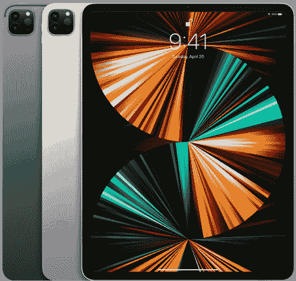

# 苹果 iPad Pro 12.9(2021)vs MacBook Pro 13(2022):买哪个？

> 原文：<https://www.xda-developers.com/ipad-pro-2021-vs-macbook-pro-13-2022/>

苹果在 WWDC22 的主基调中透露了 MacBook Pro 13 (2022)。这款备受争议的 Mac 系列产品将 M2 芯片封装在经典机箱中。它跳过了我们在 [MacBook Pro (2021)](https://www.xda-developers.com/macbook-pro-2021/) 上看到的重新设计——你可以[以更低的价格买到翻新的](https://www.xda-developers.com/best-places-buy-refurb-macbook-pro/)设备。尽管 MacBook Pro 13 的机身已经过时，但对于在旅途中工作的高级用户来说，它仍然是一款功能强大的笔记本电脑。但是，你应该买吗？这是 iPad Pro 12.9 (2021 年)对 MacBook Pro 13 (2022 年)——两个专业但非常不同的苹果设备之间的战争。

## 苹果 iPad Pro 12.9 (2021) vs 苹果 MacBook Pro 13 (2022):规格

|  | 苹果 iPad Pro 12.9 (2021 年) | 苹果 MacBook Pro 13 (2022) |
| --- | --- | --- |
| **处理器** |  |  |
| **图形** |  |  |
| **正文** | 

*   11.04 x 8.46 x 0.25 英寸
*   1.5 磅

 | 

*   11.97 x 8.36 x 0.61 英寸
*   3 磅

 |
| **显示** | 

*   12.9 英寸液态视网膜 XDR 多点触控显示屏
*   2732 x 2048
*   高达 1600 尼特的峰值亮度
*   真音技术
*   推广 120 赫兹技术
*   支持 Apple Pencil 2

 | 

*   13.3 英寸视网膜显示屏
*   2560 x 1600
*   高达 500 尼特的峰值亮度
*   真音技术

 |
| **端口** |  | 

*   两个雷电 4 端口
*   耳机插孔

 |
| **存储** | 

*   128GB
*   256GB
*   512GB
*   1TB
*   2TB

 |  |
| **记忆** |  |  |
| **电池** | 

*   40.88 瓦时电池
*   长达 10 小时的视频播放
*   20W 充电器

 | 

*   58.2 瓦时电池
*   长达 20 小时的视频播放
*   67W 充电器

 |
| **音频** |  | 

*   播放 Dolby Atmos 内容时，立体声扬声器具有宽立体声和空间音频支持

 |
| **摄像机** | 

*   专业后置摄像头系统:12MP 宽和 10MP 超宽摄像头
*   原深感摄像头系统:12MP 超宽摄像头，支持 Face ID

 |  |
| **连通性** | 

*   无线网络 6
*   蓝牙 5.0
*   5G(蜂窝模式)

 |  |
| **颜色** |  |  |
| **价格** |  |  |

## 设计:敬畏与糟糕的构建

设计确实是一件主观的事情。尽管如此，我们经常可以客观地观察和分解元素。在这种情况下，一个设备让你充满敬畏，而另一个则非常过时。苹果仍在回收多年来一直在 MacBook Pro 13 上使用的同一机身——这解释了为什么 iPad Pro 看起来明显更现代。

不过平心而论，一个设备是平板，另一个是笔记本。因此，iPad Pro 看起来比 MacBook 干净。它更薄，更具未来感，重量也轻得多。这是一个整洁的玻璃平板，带有薄边框和圆角——一个步入数字世界的窗口。

## 显示屏:更薄、更亮、更清晰 iPad 是这方面的专家

说到薄边框，iPad Pro 的显示屏几乎完全击败了 MacBookPro 13。这款平板电脑唯一的缺点是尺寸略小。否则，它有更高的分辨率，促进 120 赫兹刷新率，1600 尼特的亮度，等等。所以如果你在两者之间寻找更好的屏幕，肯定要瞄准 iPad Pro。

MacBook Pro 的显示屏很不错——尽管它不是最好的。如果你不打算创作或编辑复杂多彩的插图或视频，那么它应该足以满足你的一般需求。此外，iPad Pro 有一个支持 Apple Pencil 2 的多点触摸屏。因此，如果你是一个涂鸦者或重度笔记者，iPad Pro 可能比 MacBook Pro 13 更有意义。

## 性能:iPadOS 打破了 iPad 的记录

性能是 MacBook Pro 13 胜过 iPad Pro 的地方。我们无法将配备专用冷却系统的 MacBook Pro 与轻薄的平板电脑相提并论。不仅如此，MacBook Pro 封装了 2022 年的 M2 芯片，这是 2020 年 M1 芯片的升级。然而，也许 iPad Pro 最大的缺点是 iPadOS。尽管 [iPadOS 16](https://www.xda-developers.com/ipados-16/) 引入了[舞台管理器](https://www.xda-developers.com/how-to-use-stage-manager-macos/)的功能，但与 macOS 相比，它还是太欠缺了。后者是一个桌面操作系统，可以轻松击败被过分宣传的移动操作系统。

此外，iPad 没有键盘和触控板。是的，你可以分开买，但是好的不是最便宜的。在平板电脑的防御中，由于激光雷达，你可以在 iPad 背面获得支持 3D 地图的 Pro 相机系统。由于 TrueDepth 前置摄像头，您还可以获得 Face ID 支持。尽管如此，iPad Pro 在这一轮输给了 MacBook Pro 13，因为它的电池寿命也更差，端口也更少。

## 一句话:化妆品还是实用性？你决定

在 iPad Pro vs MacBook Pro 13 的战斗中，没有赢家。这是两种不同的设备，属于完全不同的类别。它们都迎合了其他产品无法满足的独特需求。如果你正在寻找更好的便携性，简约的设计，触摸支持，那么 iPad Pro 是这个部门的一个可靠设备。毕竟不是每个人都需要 macOS 的强大。如果你的工作围绕着网络应用，一个带独立键盘的 iPad 会很好。

如果您正在寻找一台更坚固、经得起未来考验的计算机来满足更密集的需求，那么 MacBook Pro 13 是您的不二之选。这台电脑有风扇来保持处理器冷却，所以需要更长的时间来抑制性能。更不用说它支持高达 24GB 的内存，而不是只有 16GB。它的电池续航时间几乎是使用时间的两倍，因此比 iPad 更实用。

这两款设备都有相同的两种颜色——银色和太空灰。你可以花 1099 美元买一台入门级的 iPad Pro，或者再花 100 美元买一台 MacBook Pro 13。最终，只有你自己才能知道哪种设备更适合你。我们只是对它们的规格进行了细分，以帮助您做出相应的决定。

 <picture></picture> 

Apple iPad Pro 12.9 (2021)

##### 苹果 iPad Pro 12.9 英寸(2021 年)

12.9 英寸的 iPad Pro (2021)装有苹果 M1 芯片，包括可选的 5G 支持，并在其薄边框中容纳原深感摄像头系统。

 <picture></picture> 

Apple MacBook Pro M2

##### 苹果 MacBook Pro 13 英寸(2022)

2022 年的 MacBook Pro 13 英寸提供了经典的设计，重新引入了 Touch Bar，并封装了 M2 芯片。

您会购买哪一款 Pro Apple 设备，为什么？请在下面的评论区告诉我们。