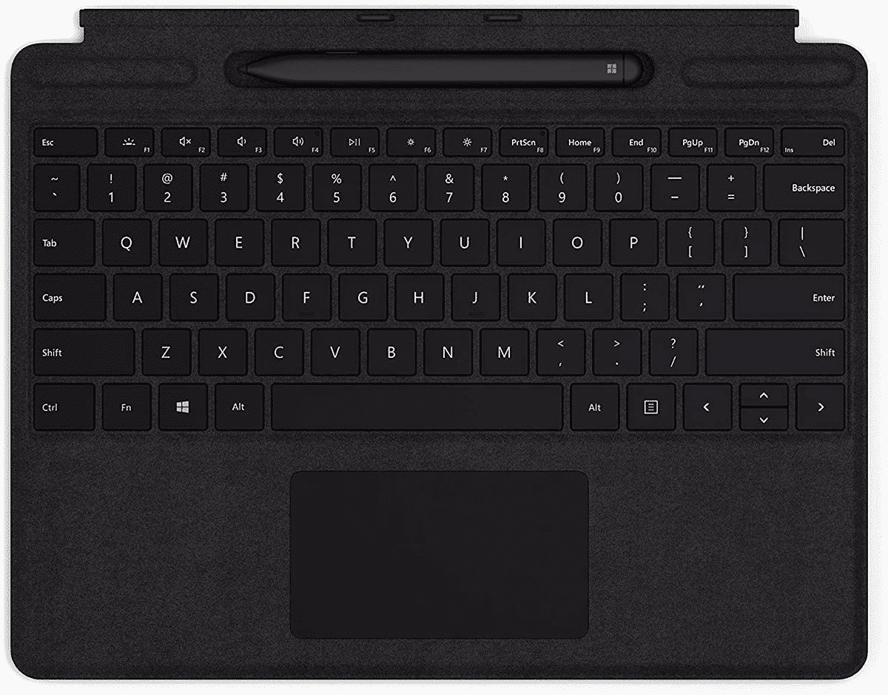

# 苹果 iPad Pro M1 vs Surface Pro X；ARM 平板哪个最好？

> 原文：<https://www.xda-developers.com/ipad-pro-m1-vs-surface-pro-x/>

苹果一直坚持认为 [iPad Pro](https://www.xda-developers.com/ipad-pro/) 是笔记本电脑的绝佳替代品，尤其是搭载 M1 芯片组的 2021 新款。这与苹果目前在 MacBook Pro 13、MacBook Air、Mac mini 和 24 英寸 iMac 上使用的处理器相同。最新的 iPad Pro 提供了充足的存储选项，大量的内存，支持 5G 连接，以及全新的迷你 LED 显示屏。

另一方面，我们有微软的 Surface Pro X，这是该公司第一款也是唯一一款运行高通制造的 ARM 芯片组和成熟的 Windows 10 的平板电脑。

如果你正在寻找一款可靠的生产力平板电脑，这两款之间有很多相似之处。两者都提供 13 英寸显示屏，运行在 ARM 芯片组上，你可以通过可选的键盘和手写笔附件获得它们。但是哪一个是更好的选择呢？

## 苹果 iPad Pro 12.9 英寸(M1)与微软 Surface Pro X:规格

|  | 

苹果 iPad Pro 12.9 英寸(M1)

 | 

微软 Surface Pro X

 |
| --- | --- | --- |
| **CPU** | 

*   苹果 M1 芯片(8 核 ARM CPU，16 核神经引擎)

 | 

*   微软 SQ1(最高 3GHz，8 核)
*   微软 SQ2(最高 3.15GHz，8 核)

 |
| **图形** |  | 

*   高通 Adreno 685
*   高通 Adreno 690

 |
| **正文** | 

*   280.6×214.9×6.4 毫米(11.04×8.46×0.25 英寸)
*   682 克(1.50 磅)(无线网络)
*   685 克(1.51 磅)(5 克)

 | 

*   287×208×7.3 毫米(11.3×8.2×0.28 英寸)
*   774 克(1.7 磅)，不含键盘

 |
| **显示** | 

*   12.9 英寸液态视网膜 XDR 迷你 LED 背光 IPS
*   2732×2048 分辨率，120Hz 提升，真音
*   1000 尼特最大全屏亮度，1600 尼特峰值亮度(HDR)
*   支持 Apple Pencil(第二代)

 | 

*   13 英寸 PixelSense (2880×1920)
*   267 PPI
*   3:2 纵横比
*   10 点多点触控

 |
| **端口** | 

*   配备 USB4 Type-C 的 Thunderbolt 4

 | 

*   2 个 USB-C
*   1 个表面连接端口
*   表面键盘端口
*   1 个 nano SIM

 |
| **存储** |  |  |
| **闸板** |  |  |
| **电池** | 

*   40.88 瓦时
*   18W USB Type-C 电源传输

 | 

*   长达 15 小时的典型设备使用时间

 |
| **音频** | 

*   5 个麦克风
*   四声道扬声器

 | 

*   双通道远场录音室话筒
*   2W 立体声扬声器，带杜比音效

 |
| **摄像机** | 

*   前置:12MP/2.4 光圈，最高 1080p 高清视频录制，人像模式，镜头校正，自动防抖，视网膜闪光灯，智能 HDR 3，FaceID
*   后置:12MP/1.8 光圈宽，10MP/2.4 光圈超宽，2 倍光学变焦，5 倍数码变焦，最高 4K 视频录制，智能 HDR 3，自动图像稳定，True Tone 闪光灯，蓝宝石晶体盖，镜头校正(超宽)

 | 

*   500 万像素前置摄像头，支持 1080p 全高清视频
*   10MP 后置自动对焦摄像头，支持 1080p 高清和 4k 视频
*   Windows Hello face 认证摄像头(前置)

 |
| **连通性** | 

*   无线网络 6
*   蓝牙 5
*   可选 5G

 | 

*   兼容 Wi-Fi 5: 802.11ac
*   蓝牙 5.0
*   高通骁龙 X24 LTE 型号

 |
| **颜色** |  |  |
| **价格** |  |  |

## 设计:Surface Pro X 提供更多端口，并配有支架

iPad Pro 2021 继续采用与去年类似的设计，采用超薄铝制机箱，背面有方形摄像头凸起，边框相当薄。Surface Pro X 还采用了铝合金表面，是一款非常时尚的设备，厚度几乎与 iPad Pro 相同(0.25 英寸对 0.28 英寸)，重量仅略多一点(682 克对 774 克)。它的背面有一个摄像头，就像 Surface Pro 7 一样，与主体齐平，所以没有摄像头凸起。和所有 Surface 平板设备一样，Surface Pro X 配备了内置支架，允许你在桌子上支撑平板电脑，而不需要额外的外壳或配件。

如果你把这两款平板电脑放在一起，你会注意到它们都提供了不同的屏幕长宽比；因此，iPad Pro 的显示屏看起来更高。与 Surface Pro X 的圆角边缘相比，iPad 的边缘也是平的。另一件你应该知道的事情是，Surface 的边框并不一致，因为顶部和底部的边框更厚，而侧面的边框更薄。

当谈到这两款平板电脑的端口选择时，事情变得有趣了。Surface Pro X 在左侧提供了两个 USB-C 端口，在右侧提供了一个 Surface Connect 端口。这意味着除了能够使用适配器、加密狗甚至扩展坞之外，你还可以在 Surface 上获得多种连接方式。另一方面，iPad 通过一个支持 Thunderbolt 的 USB-C 端口提供所有带宽。

此外，如果你选择苹果 iPad Pro 的魔法键盘，键盘外壳的脊柱上还内置了一个额外的 USB-C 端口，只能用于直通充电。两款平板电脑都没有耳机插孔，这是一个巨大的遗憾。

Surface Pro X 提供了升级内部 SSD 的选项，尽管获得 M.2 2230 SSD 并不容易，但它仍然比 iPad 上的固定存储选项要好。

综上所述，两款平板都提供了出色的设计。Surface Pro X 无疑更实用，这要归功于内置的支架和更宽的端口选择，但 iPad 因更轻、更纤薄和是一款非常简约的设备而获得了所有的分数。

## 显示屏:iPad Pro 上的液态视网膜 XDR 显示屏无与伦比

iPad Pro 和 Surface Pro X 的显示屏大小大致相同，但它们的长宽比不同。iPad 的比例是 4:3，而 Surface 的比例是 3:2。两者都没有格格不入的感觉，虽然 iPad 确实看起来更高了。当然，真正的区别是当你比较面板本身时，这就是 iPad Pro 的亮点，毫不夸张地说。

苹果在 iPad Pro 上使用了基于迷你 LED 的显示屏，特别是 12.9 英寸的型号。新的“液态视网膜 XDR”提供 1000 尼特的最大全屏亮度，使用 HDR 可以达到 1600 尼特的峰值亮度。这使得它成为当今平板电脑上最亮的显示器之一，即使在最强烈的阳光下，您也可以轻松查看内容。该显示器还支持苹果的推广功能，可以自动切换到 120Hz 的刷新率，体验流畅。

相比之下，Surface Pro X 上的 13 英寸显示屏分辨率为 2880×1920，这意味着它提供了同样好的像素密度，但它是 60Hz 的面板，最高只能达到 450 尼特的峰值亮度。

## 键盘和触控笔:Surface Pro X 键盘提供了更好的功能

Surface Pro X 和 iPad Pro 都有各自的键盘和触控笔。遗憾的是，它们都没有捆绑销售，这意味着如果你打算购买新的 iPad Pro 或 Surface Pro X，你需要额外花钱购买键盘和触控笔。你可以选择 199 美元的 12.9 英寸 iPad Pro 的 Apple Smart Keyboard Folio，或者如果你想获得合适的笔记本电脑体验，你需要投资 349 美元的 Magic Keyboard。iPad Pro 还支持第二代 Apple Pencil，售价 129 美元。

iPad Pro 的神奇键盘在去年推出时以其浮动屏幕设计获得了很多关注。它看起来真的很酷，允许你使用键盘外壳上部的强磁铁来吸附 iPad。但是也有局限性。首先也是最重要的是，由于其支架，与 Surface Pro X 相比，显示角度有限。最重要的是，平板电脑的整个重量都落在键盘的上半部分，这使得整个设置有点不稳定，特别是如果你没有一个平坦的桌子。

Apple Pencil 是目前平板电脑上功能最丰富的手写笔。它超越了涂鸦和涂鸦笔记，允许您使用 Scribble 在 UI 的几乎任何位置将手写内容转换为文本，通过双击在工具之间切换，各种手势，无线充电，倾斜和压力支持，等等。

标准的 Surface Pro X 键盘售价为 140 美元，与 Surface Pro 6/7 的 Surface Pro 类型外壳非常相似，具有超薄的外形，背光按键和磁铁，可以帮助你轻松地吸附到平板电脑上。如果你能多花一点钱，Surface Pro X Signature 键盘提供了黑色 Alcantara 面料和一个笔库，供你存放触控笔。

微软为 Surface Pro X 重新设计了手写笔，现在更小，采用了扁平设计。这款售价 145 美元的 Surface Slim Pen 还可以使用自己的充电底座进行无线充电，或者当你将它存放在 Surface Pro X Signature 键盘中时也可以进行无线充电。手写笔的功能与你在 Windows 上可以看到的大多数选项非常相似；然而，下一个 [Windows 11](https://www.xda-developers.com/windows-11/) 更新预计会带来一些新的、急需的升级。

这两种键盘的输入体验应该不成问题，你应该很快适应这种布局。话虽如此，Surface Pro X 的键盘不仅更便宜，而且也更容易操作。Magic Keyboard 无疑是独一无二的，并提供了一个额外的 USB-C 端口，但最终功能比形式更重要。我还建议看看罗技 Combo Touch 键盘保护套，它比苹果的 Magic Keyboard 相对便宜，可以将 iPad Pro 完全转变为类似 Surface 的设备。

说到笔的支持，Apple Pencil 显然是赢家，因为它提供了广泛的功能，但请注意，没有像 Surface Slim Pen 那样的专用底座，除非你购买第三方外壳。

## 性能:M1 芯片优于微软 SQ2

Surface Pro X 是微软仅有的搭载 ARM 处理器的产品之一。该公司与高通合作，构建了名为 SQ1 和 SQ2 的定制 SOC(片上系统)，这与第一代和第二代高通骁龙 8cx 芯片组基本相同。你可以在 ARM 上查看一些[最好的 Windows 原生应用](https://www.xda-developers.com/windows-arm-apps/)。

SQ2 芯片型号是去年宣布的，采用 big-little 架构，有四个主频为 3.15GHz 的 CPU 核心，而其他四个主频为 2.42GHz。你可以配置 16GB 的 RAM 和高达 512GB 的 SSD，用户可以更换。

新款 iPad Pro 运行苹果的 M1 芯片组，也是基于 ARM 架构；但是，对于应用程序支持没有任何限制。如前所述，这与苹果现在用于 MacBook Pro 13、MacBook Air、Mac mini 和新的 24 英寸 iMac 的芯片相同。它基于 5 纳米节点，具有八核 CPU、八核 GPU 和 16 核神经引擎。在内存和存储方面，iPad Pro 在 128GB、256GB 或 512GB 存储的型号上有 8GB 内存，在 1TB 或 2TB 存储的型号上有 16GB 内存。

在我们对 [iPad Pro 和 Surface Pro 7](https://www.xda-developers.com/ipad-pro-vs-surface-pro/) 的比较中，我提到了 iPad Pro 的硬件要优越得多。同时，比较性能是不公平的，因为两款平板电脑都运行在不同的操作系统上。类似地，Surface Pro X 也可以在 Windows 上运行，如果我们要比较性能，这也不是很简单。当然，基准测试数据表明，iPad Pro 以较大优势胜出。

## 结果

我要重申我从 iPad Pro 和 Surface Pro 7 的比较中得出的结论。如果你打算购买其中任何一个，请确保你考虑了你的核心需求。iPad 是一款很棒的平板电脑，但不是笔记本电脑的完美替代品。它在一个类似移动的生态系统上拥有广泛的应用支持，提供更好的摄像头，5G 连接选项，可能是你能得到的最好的笔输入。然而，Surface Pro X 更适合笔记本电脑体验，因为它在 Windows 上运行，尽管它对应用程序的支持有限。在执行日常任务时，如浏览网页、查看电子邮件、编辑照片等，您会感觉更加熟悉。

此外，在你做出决定之前，看看我们对市场上[最好的微软 Surface PC](https://www.xda-developers.com/best-microsoft-surface-pcs/)和[最好的 ipad](https://www.xda-developers.com/best-ipad/)的综述。

 <picture></picture> 

12.9-inch iPad Pro

##### 苹果 iPad Pro 12.9 英寸(2021 年)

2021 年的 12.9 英寸 iPad Pro 由苹果的 M1 ARM 芯片组和全新的 Liquid Retina XDR mini-LED 显示屏提供支持。它可以配置高达 2TB 的存储，5G 连接，并提供 Thunderbolt 支持。

 <picture></picture> 

Magic Keyboard for iPad Pro 2021 12.9-inch

##### 适用于 iPad Pro 12.9 英寸的苹果魔法键盘

iPad Pro 的魔法键盘带有浮动屏幕设计、背光按键和一个额外的 USB-C 端口。

 <picture></picture> 

Surface Pro X

##### 微软 Surface Pro X

Surface Pro X 是微软基于 ARM 的 Windows 混合平板电脑，由定制版的高通骁龙 8cx 驱动。

 <picture></picture> 

Surface Pro X Signature Keyboard with Slim Pen

##### 微软 Surface Pro X 签名键盘

Surface Pro X Signature 键盘套装配有 Surface Slim Pen 和一个专用支架来存放手写笔。

 <picture></picture> 

Slim Pen 2

##### 微软 Surface 超薄笔

Surface Slim Pen 是专门为 Surface Pro X 设计的，因为它可以轻松地存放在 Surface Pro X Signature 键盘盖中，尽管它为整个 Surface 产品线提供支持。