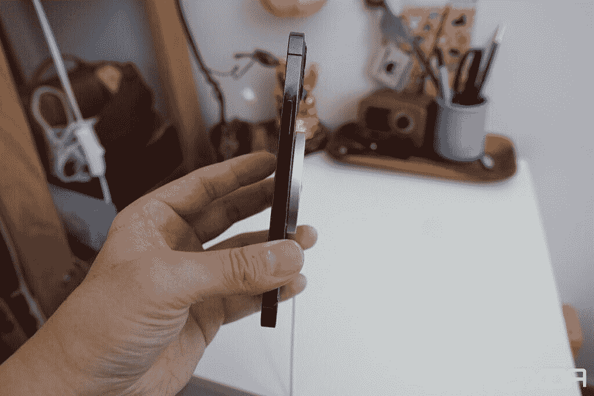
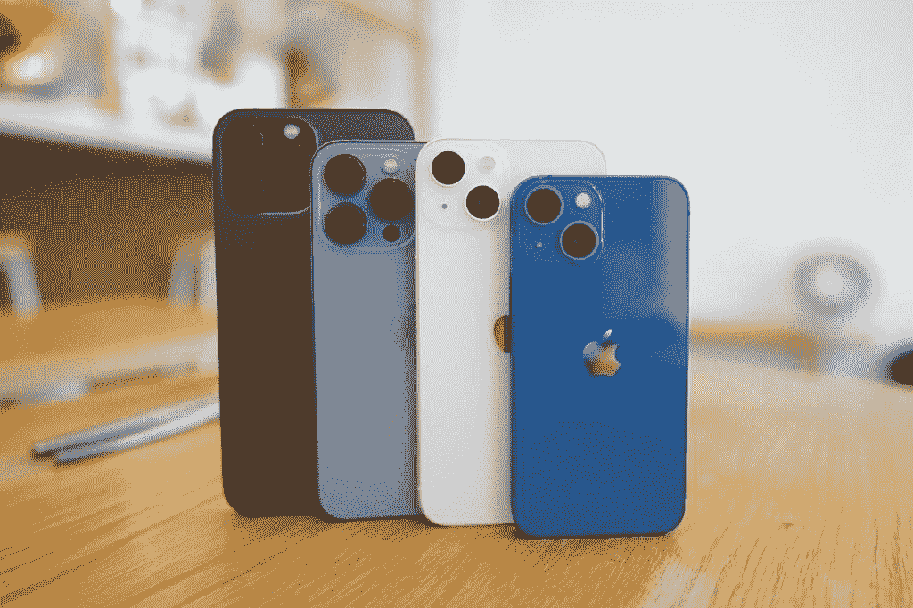

# To Plus，还是 to Max，那是苹果 iPhone 14 的问题

> 原文：<https://www.xda-developers.com/iphone-14-plus-or-max-editorial/>

苹果的“远出”活动只有几天了。我们期待该公司公布 [iPhone 14 阵容](https://www.xda-developers.com/apple-iphone-14/)和 [Apple Watch Series 8](http://xda-developers.com/apple-watch-series-8) 。除此之外，还有其他潜在产品，如 [AirPods Pro 2](http://xda-developers.com/apple-airpods-pro-2) ，Apple Watch Pro 和 Apple Watch SE 2。一年来，我们一直听到关于 iPhone 14 系列的传言——毫不夸张。事实上，在 iPhone 13 发布之前，围绕这条线的第一个传言就开始浮出水面。

关于今年的发布，我们了解到的一个值得注意的细节是，苹果可能会停止迷你版本。相反，该公司似乎会选择更大的 6.7 英寸常规型号。在这种情况下，我们会有两个 6.1 英寸的型号和两个 6.7 英寸的型号，每个型号都有一个常规版本和一个专业版本。一开始 iPhone 命名假设是 *14* 、 *14 Max* 、 *14 Pro* 、 *14 Pro Max* 。当然，这将是有意义的——因为 *Max* 指的是更大的屏幕尺寸，而 *Pro* 标签区分了它们的功能。另外，听起来更荒谬的 Pro Max 已经有了先例。

早在 7 月，一份报告声称苹果将为更大的非专业 iPhone 14 恢复 Plus 品牌。当然，并不是所有人都非常重视这份报告。为什么库比蒂诺的霸主会带回一个多年不用的死标签？出人意料的是，一些泄露的照片几天前在网上浮出水面。他们描绘了更大的 iPhone 14 型号的所谓案例。惊喜，惊喜——表壳标注为*加*，而不是 *Max* 。

那么，会是 iPhone 14 Plus 还是 Max 呢？可能是他们中的任何一个，我们可能要到 9 月 7 日才能确定。然而，这就是为什么我个人认为苹果恢复 Plus 品牌更有意义。

## iPhone 14:什么*加*和 *Max* 影射

今年早些时候，我们了解到苹果可能开始在专业 iPhones 上单独使用最新的芯片。所以普通的 iPhones 会坚持使用一年前的芯片组。据称，这一潜在的变化旨在进一步区分普通 iPhones 和专业 iPhones。通过增加专业独家配件，犹豫不决的顾客可能会选择更贵的型号。那么这与 Plus/Max 品牌有什么关系呢？

 <picture></picture> 

iPhone 13 Mini and iPhone 13 Pro Max

把*加*和 *Max* 这几个字并排放在一起。前者指向额外的东西，而后者指向最大限度的项目。*加*就是*多*， *Max* 就是*最多*。更大的 iPhone 14 提供了更多的屏幕，但在技术规格和功能方面还没有达到极限。通过保持 Max 品牌专属于较大的 Pro 型号，苹果进一步区分了常规和 Pro 型号。*加*不如 *Max* ，尽管这听起来无关紧要，但它可以在营销部门产生很大的影响。

不过，苹果会重振一个已经退役的品牌吗？

## 苹果不反对自掘(品牌)坟墓

 <picture></picture> 

MagSafe charging on the iPhone

因此，有些人可能会问——为什么苹果要重新引入一个它多年没用过的品牌？答案很简单——公司不在乎。当 Cupertino 公司最初在 Mac 上停用 MagSafe 时，它后来又在 iPhone 上重新推出了它。另一个例子是 iBooks——该公司将该术语(过去指硬件系列)作为一个现已退休的应用程序名称带回。从 iPhone 8 开始我们就没见过一加，不代表一加就一去不复返了。

## 不那么令人困惑的 iPhone 14 系列

 <picture></picture> 

iPhone 13 series

苹果公司致力于通过其设备简化人们的生活。它倾向于避免对顾客毫无意义的长产品名称。至少在很大程度上，它的品牌很简单。通过选择 iPhone 14、14 Plus、14 Pro 和 14 Pro Max，该公司消除了一个可能导致客户混淆的常见因素/术语。这样阵容就不言自明了。否则，人们可能无法分辨 iPhone 14 Max 还是 [iPhone 14 Pro](http://xda-developers.com/apple-iphone-14-pro) 是更高端的型号。事实上，14 Max 似乎比 14 Pro 更强大，尽管情况正好相反。*加上*暗示了一个额外，而 *Max* 远不止这些。

* * *

如果苹果称之为 iPhone 14 Max，整个系列可能会显得更精简——14、14 Max、14 Pro 和 14 Pro Max。只有两个*后缀*混在一起，这取决于设备规格。然而，考虑到语义，该公司可以去一个更独特的品牌。最终，我们将在几天内得到一个正式的外观。在此期间，我们可以无休止地推测和观察恒星是如何排列的，试图尽早发现。

*你个人觉得会叫 iPhone 14 Plus 还是 Max？请在下面的评论区告诉我们。*