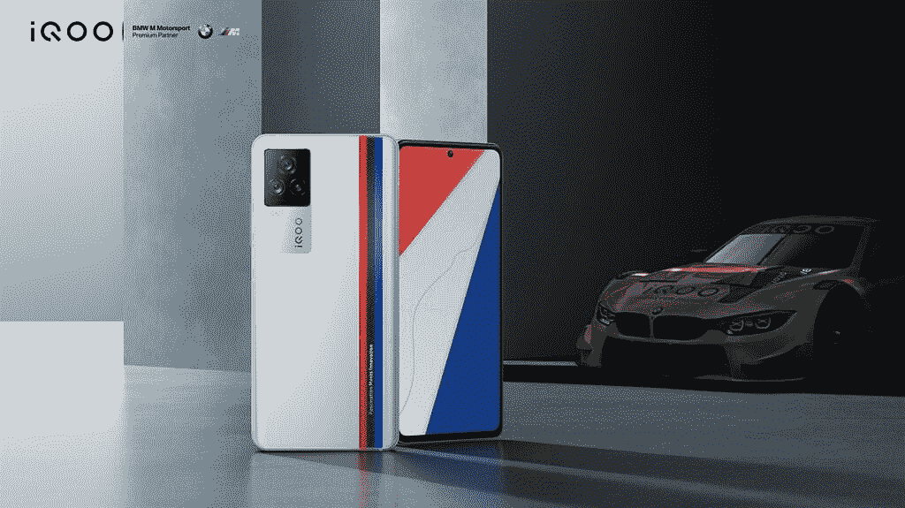
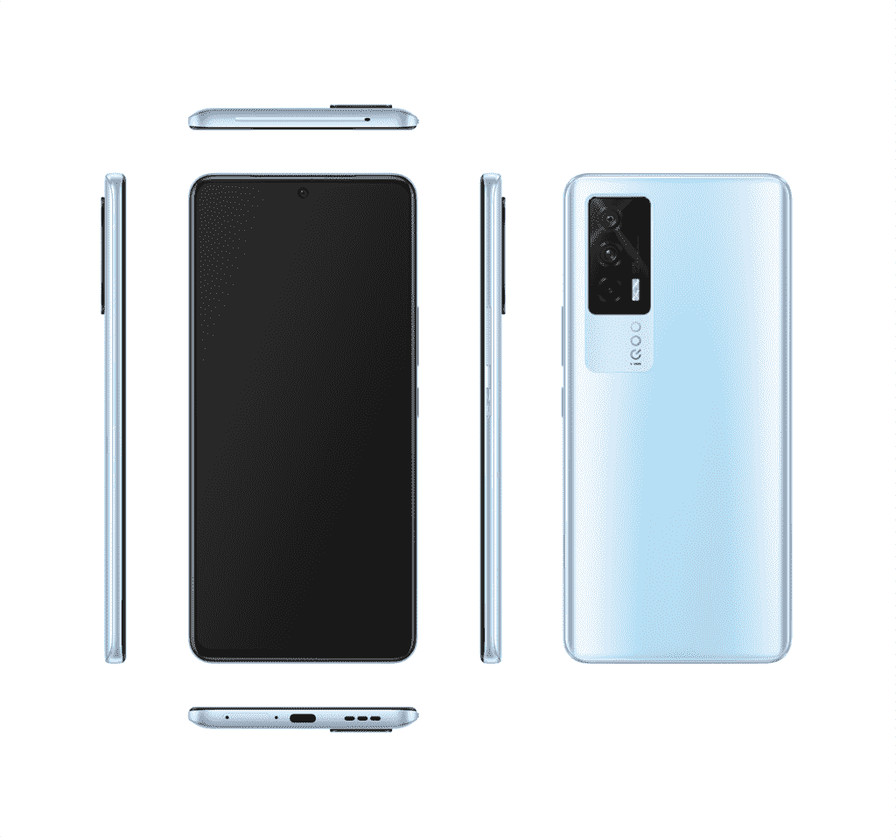

# iQOO 7 系列在印度推出，采用 120Hz AMOLED 显示屏、骁龙 888 和 66W 快速充电

> 原文：<https://www.xda-developers.com/iqoo-7-7-legend-india-launch/>

Vivo 的子品牌 iQOO 今天在印度推出了新的 iQOO 7 系列。自成立以来，iQOO 的主要关注点一直是其母国中国，它在中国推出了多个不同价格区间的智能手机。然而，该公司的全球产品组合中只有一款设备:去年在印度推出的 iQOO 3。去年的 iQOO 3 令人印象深刻，但[感觉错过了机会](https://www.xda-developers.com/iqoo-3-5g-review-one-of-the-fastest-but-not-smoothest-smartphones/)，因为它错过了更高刷新率的显示器，而目标是成为一款游戏手机。凭借 iQOO 7 和 iQOO 7 Legend，该公司似乎已经准备好迎接这一次的竞争。

## iQOO 7 图例和 iQOO 7:规格

| 

规格

 | 

iQOO 7 传奇

 | 

iQOO 7

 |
| --- | --- | --- |
| **打造** | 

*   银磨砂玻璃
*   铝制框架

 | 

*   银磨砂玻璃
*   铝制框架

 |
| **尺寸&重量** | 

*   162.2 毫米 x 75.8mm 毫米 x 8.7mm 毫米
*   210g

 | 

*   163.34 毫米 x 76.37mm 毫米 x 8.43mm 毫米
*   196

 |
| **显示** | 

*   6.62 英寸 AMOLED
*   2400 x 1080 (FHD+)
*   120 赫兹刷新率
*   300 赫兹(使用即时触摸采样率时高达 1000 赫兹)
*   1300 尼特峰值亮度
*   HDR10+

 | 

*   6.62 英寸 AMOLED
*   2400 x 1080 (FHD+)
*   120 赫兹刷新率
*   300 赫兹(使用即时触摸采样率时高达 1000 赫兹)
*   MEMC
*   智能显示芯片
*   1300 尼特峰值亮度
*   HDR10+

 |
| **SoC** | 

*   高通骁龙 888:
    *   1 个 Kryo 680 Prime 内核@ 2.84GHz
    *   3 个 Kryo 680 性能内核@ 2.4GHz
    *   4 个 Kryo 680 高效内核@ 1.8GHz
*   肾上腺素 660

 | 

*   高通骁龙 870
    *   1x ARM Cortex-A77 @ 3.2GHz
    *   3 个 ARM Cortex-A77 @ 2.4GHz
    *   4x ARM Cortex-A55 @ 1.8GHz
*   Adreno 650 GPU

 |
| **闸板&存放** | 

*   8GB / 12GB LPDDR5
*   128GB / 256GB UFS 3.1

 | 

*   8GB / 12GB LPDDR5
*   128GB / 256GB UFS 3.1 存储

 |
| **电池&充电** | 

*   4000 毫安时
*   66W 快速有线充电

 | 

*   4400 毫安时
*   66W 快速线充电器

 |
| **安全** | 显示指纹扫描仪 | 显示指纹扫描仪 |
| **后置摄像头** | 

*   主要:48MP 索尼 IMX598 OIS
*   次要:1300 万像素超宽，宏观
*   第三代:1300 万像素，50 毫米，长焦

 | 

*   主要:48MP 索尼 IMX598 OIS
*   次要:1300 万像素超宽，宏观
*   高等教育:200 万像素单色

 |
| **前置摄像头** |  |  |
| **端口** |  |  |
| **连通性** | 

*   5G NR
*   蓝牙 5.2
*   802.11 a/b/g/n/ac 双频 Wi-Fi
*   GPS，GLONASS，北斗，伽利略

 | 

*   5G NR
*   蓝牙 5.1
*   802.11 a/b/g/n/ac 双频 Wi-Fi
*   GPS，GLONASS，北斗，伽利略

 |
| **软件** | 搭载 Funtouch OS 11.1 的 Android 11 | 搭载 Funtouch OS 11.1 的 Android 11 |
| **其他特征** | 

*   怪物触摸
*   4D 双直线振动电机
*   高分辨率音频认证
*   双扬声器

 | 

*   双扬声器
*   高分辨率音频认证

 |

iQOO 7 系列包括两款手机:iQOO 7 和 iQOO 7 Legend。这两款手机有几个共同点，包括整体设计、显示屏和主摄像头，但在芯片组、电池和游戏功能等方面有所不同。对于 iQOO 7 来说，传奇是这里的顶级旗舰。它是与 BMW M Motorsports 合作制造的，背面带有三色赛车条纹。

 <picture></picture> 

iQOO 7 Legend

在正面，两款手机都采用 6.62 英寸 AMOLED 显示屏，屏幕刷新率为 120Hz，触摸采样率为 300Hz，峰值亮度高达 1300 尼特。在引擎盖下，iQOO 7 Legend 由顶级的骁龙 888 芯片组提供支持，搭配高达 12GB 的 LDDDR5 RAM 和 256GB 的 UFS 3.1 存储。另一方面，iQOO 7 选择了骁龙 870 芯片。iQOO 表示，他们正在使用新的 V6 UFS 3.1 闪存芯片，与去年的芯片相比，读写速度加快了 21%。他们还宣传了一种称为“扩展 RAM”的功能，这种功能可以重新分配多达 3GB 的闪存用作 RAM。

 <picture></picture> 

iQOO 7

在背面，iQOO 7 和 iQOO 7 Legend 采用了三摄像头阵列，包括一个 48MP 索尼 IMX598 主拍摄镜头和一个 13MP 广角摄像头，该摄像头还兼作微距镜头。标准 iQOO 7 上的第三个拍摄者是一个 2MP 单色镜头，而 Legend 则获得了一个 13MP 长焦镜头，等效焦距为 50mm。

iQOO 7 Legend 是一款专注于游戏的设备，因此它拥有一些标准型号上没有的独家游戏功能和硬件。

首先，你可以获得怪物触摸功能，它提供了一个屏幕上的虚拟操纵杆和带有压敏数字按钮的控制面板。iQOO 声称，这种设置将让玩家用两个手指玩游戏，同时仍然可以完成他们用四个手指可以做的事情。值得注意的是，去年的 iQOO 3 有两个压力感应肩部按钮，允许用户用四个手指弹奏。iQOO 7 Legend 去掉了这些物理按钮，转而选择了屏幕控制。看看这个软件解决方案是否会证明自己比肩扣更好，这将是一件有趣的事情。

iQOO 7 Legend 还在手机的左右两侧配备了双直线电机，以提供更身临其境的游戏和电影体验。对于散热，iQOO 7 Legend 采用了 4096 sq。蒸汽室液体冷却系统。与此同时，iQOO 7 使用 6000 sq。毫米石墨层全覆盖液体冷却系统。

iQOO 7 Legend 配备了 4,000mAh 电池，而标准 iQOO 7 配备了更大的 4400 mah 电池，两款手机都支持 66W FlashCharge 技术。

iQOO 7 系列的其他亮点包括 5G 支持、双扬声器、蓝牙 5.2/5.1、显示指纹扫描仪、双频 Wi-Fi、高分辨率音频和双 SIM 卡。

### 定价和可用性

iQOO 7 将有三种型号，价格如下:

*   8gb+128 GB—₹31,990(427 美元)
*   8gb+256 GB—₹33,990(454 美元)
*   12gb+256 GB—₹35,990(481 美元)

iQOO 7 Legend 有两种型号，价格如下:

*   8gb+128 GB—₹39,990(534 美元)
*   12gb+256 GB—₹43,990(588 美元)

这两款手机将于 5 月 1 日开始在 iqoo.com 和亚马逊印度接受预购，ICICI 和亚马逊提供各种返现和折扣优惠。

* * *

*更正:本文已更新，反映 iQOO 7 Legend 没有智能显示芯片。只是标准的 iQOO 7 有。我们对这个错误感到抱歉。*