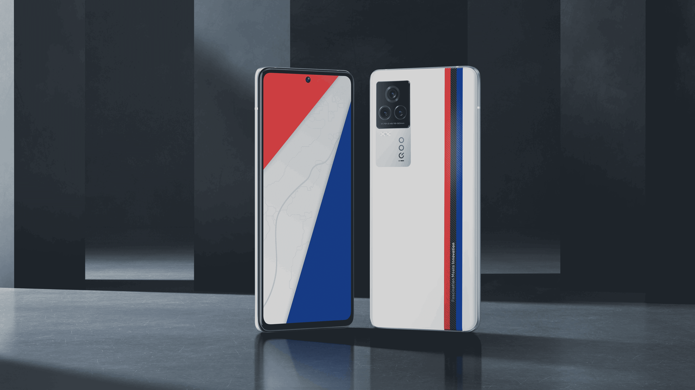
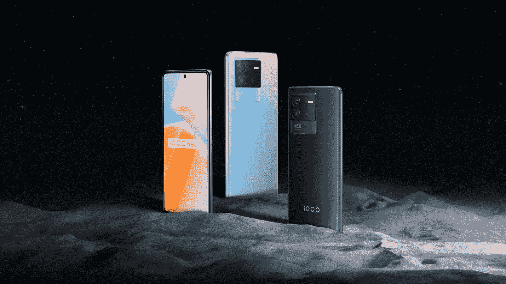

# 一窥 iQOO 对突破性性能的追求及其与宝马 M 赛车运动的合作

> 原文：<https://www.xda-developers.com/iqoo-bmw-m-motorsport-partnership/>

iQOO 成立于 2019 年，是全球智能手机制造商 vivo 的子品牌，于 2020 年初在国际上首次亮相，迎合了快速增长的印度移动游戏市场。现在，该品牌将首次将其业务扩展到东南亚，推出迄今为止最强大的设备。

iQOO 最新性能系列的旗舰机型 iQOO 11 将于 12 月初在全球发布。iQOO 11 融合了该公司自首次亮相以来学到的一切，以确保在游戏、电子竞技等领域的强大、全面的性能。

此外，iQOO 与 BMW M Motorsport 的优质合作关系强化了该品牌对高性能、速度、控制和追求卓越的关注。

## 独特的 iQOO 智能手机体验

iQOO，即“I quest on and on”，代表了该品牌在开发行业领先产品时对持续探索和创新的追求。流畅的操作、大显示屏和更长的电池寿命等重要因素对于任何一款优秀的游戏手机来说都是必不可少的，但 iQOO 设备的突出之处不仅仅在于提供基本功能。

iQOO 产品经理 Scott Sun 是 iQOO 产品团队的首批成员之一，他解释说，iQOO 智能手机的不同之处在于它在设计整体用户体验时对细节的关注。例如，iQOO 通过行业领先的快速充电技术推动了极限，并搭配了独家智能显示芯片来改善视觉效果，以及沉浸式全感官控制系统来增强游戏内的精度和控制。

孙表示，iQOO 以用户为导向的理念背后是一个由狂热的手机游戏玩家组成的团队，他们不仅从自己的体验中了解用户需求，还花大量时间进行深度采访，以获得更全面的视角。

“我有机会与团队中的许多 Z 世代同事一起工作，”孙说。“他们的活力、新鲜的想法和投入工作的决心使我的工作非常充实。这是一个非常有趣的动态，因为我们的团队本质上代表了我们的目标人群。”

在这样的世界中长大，年轻人倾向于更快地接受技术，因此期待高性能的产品。喜欢移动游戏的用户特别期待专注于移动游戏和电子竞技的方面。例如，没有一款游戏手机值得考虑，除非它背后有强大的力量来支撑大量的其他功能。

iQOO 11 将是首批采用高通最新骁龙 8 Gen 2 芯片组的智能手机之一，带来无与伦比的性能。iQOO 还因提供卓越的控制和触觉反馈功能而闻名，这些功能是沉浸式游戏的重要组成部分。之前，我们已经看到 iQOO 提供了诸如显示器内双怪物触摸和双 X 轴线性电机等功能。由于专注于游戏和电子竞技，毫无疑问，我们将在最新的 iQOO 11 智能手机上看到类似的东西。

## 不仅仅是电子竞技界的大胆挑战者

下一代智能手机用户对技术有很高的期望。在新一代游戏机、智能电视和通过应用程序即时送货上门的餐厅级食品的包围下，年轻一代在成长过程中期待最高性能和尖端技术。

为了满足这些高期望，iQOO 11 必然会配备 Z 一代用户在游戏智能手机中可能需要的一切。这包括一个大，生动的显示，高刷新率，也是一个强大的相机设置。孙证实，iQOO 11 不会只专注于游戏。

 <picture></picture> 

iQOO 7, launched in India in 2021, was the first iQOO smartphone on the Indian market to use dual-chip technology

“我们注意到，我们的目标消费者有拍摄大量照片并与朋友和家人分享的习惯，因此他们要求更好的摄影功能。这就是为什么我们在每一代 iQOO 中都提高了相机的性能，”孙说。“以中国市场为例，越来越多的人开始玩手机游戏。基于不断上升的需求，iQOO 感知到了电竞的流行，知道年轻一代想要什么。我们希望为消费者提供高性能产品，让他们可以玩手机游戏。”

但是 iQOO 不仅仅是进入次世代市场。孙的个人最爱 iQOO 7 于 2021 年在印度推出，这是该市场上第一款采用双芯片技术的 iQOO 智能手机。结合其标准 CPU 芯片和定制的智能显示芯片，该型号能够提供优化的视觉体验，同时降低功耗。它提供了性能和电池寿命之间的完美平衡，并已成为所有 iQOO 设备的标准。

## 与 BMW M Motorsport 合作

如果你还没有对 iQOO 11 提供的东西感到惊讶，这可能有助于扭转局面。在过去的几年里，iQOO 与宝马 M 赛车运动保持着持续而密切的合作关系，宝马 M 赛车运动是赛车界的一个传奇。iQOO 的品牌理念“我不断探索”通过这种合作得到了加强，这种合作推动了超快技术和创新的实现。

此前，iQOO 支持 BMW M Motorsport 参加顶级赛事，如 DTM 和纽博格林 24 小时耐力赛。在缺席 25 年后，宝马预计将重返即将到来的顶级原型车比赛，如 2023 年在代托纳举行的劳力士 24 小时耐力赛和 2024 年的勒芒 24 小时耐力赛，展示 iQOO 品牌的宝马 M 混合动力 V8 发动机。

为了传达类似的速度美学和控制感，iQOO 将发布其最新增强性能智能手机的传奇版。

“iQOO 传奇就像智能手机世界的‘宝马 M 赛车’。iQOO Legend 提供极致的速度和强大的性能，以及梦幻般的控制体验——如同宝马 M Motorsport 赛车一样快速、精确和稳定。如果你喜欢高速和操控的快感，那么 iQOO 11 系列是一个完美的选择。”

iQOO 传奇版的设计唤起了速度的美感，具有标志性的三色赛车条纹，具有粒状纹理，在玩游戏时提供了额外的触觉体验。根据 iQOO 的说法，红色、黑色和蓝色赛车条纹的每种颜色都有自己的含义。红色代表对赛车的激情和兴奋。黑色象征着对技术创新的追求。蓝色代表探索未知的乐趣。这三种颜色共同讲述了“魅力遇见创新”的故事

## iQOO 的未来

iQOO 采用前瞻性的行业见解，认为东南亚在游戏市场上具有巨大的潜力。预计到 2024 年，该地区将成为全球电子竞技收入增长最快的地区，同时，就市场份额而言，移动游戏正在超过整个行业。

 <picture></picture> 

iQOO Neo6 launched in May 2022, delivering outstanding performance and a flagship-level gaming experience at a more affordable price point

iQOO 准备好抓住这个机会，推出一个产品组合，在每个价位提供无与伦比的性能和独特的体验。它不仅迎合了国际年轻一代的需求，也帮助 iQOO 成为中国国内市场增长最快的品牌之一。它在印度的国际首演同样获得了巨大成功。

孙总结了 iQOO 对未来的期望:

“我们的目标消费者会用手机玩游戏，但我们并不止步于此。我们希望为消费者带来超出他们预期的产品，并为他们提供具有游戏配置的高性能手机，”孙说。“我们的旗舰系列定位为电竞旗舰，针对那些志在必得、乐在其中的消费者。未来属于一代人。他们有自己的态度和观点，无视现状。他们能很好地接受新事物。”

对 iQOO 品牌及其代表的意义感兴趣吗？想了解更多关于 iQOO 及其最新产品的信息吗？前往 iQOO 的官方网站了解更多信息。

我们感谢 iQOO 赞助了这篇文章。我们的赞助商帮助我们支付与经营 XDA 相关的许多费用。虽然您可能会在标准 XDA 内容旁边看到赞助内容，但它们将始终被标记为赞助内容，并不一定反映编辑团队的观点。XDA 绝不会通过接受金钱来赞扬一家公司，或以任何方式改变我们的观点或看法，从而损害其新闻诚信。