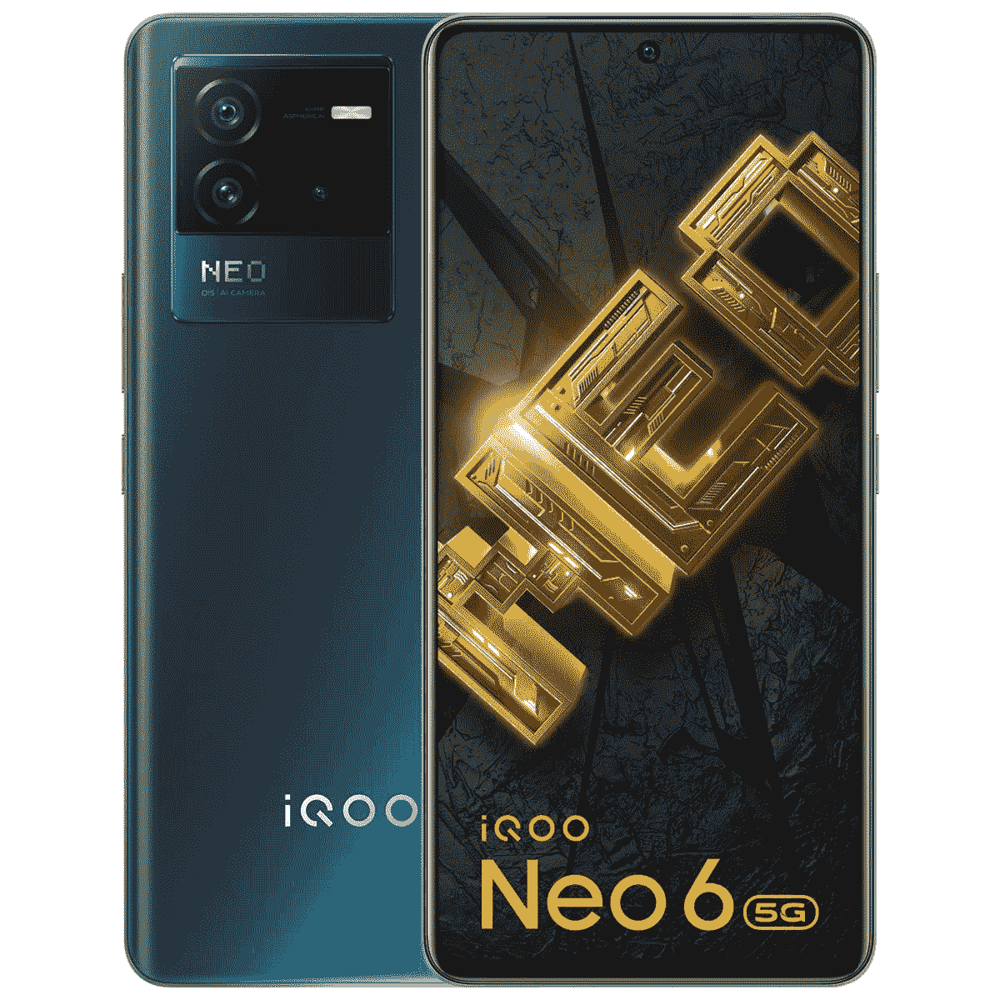

# 搭载骁龙 870、120Hz AMOLED 显示屏的 iQOO Neo 6 登陆印度

> 原文：<https://www.xda-developers.com/iqoo-neo-6-india-launch/>

继上月底在印度推出 iQOO Z6 和 Z6 Pro T1 之后，Vivo 的子品牌 iQOO 现在又在该地区推出了一款新的平价旗舰产品 iQOO Neo 6。iQOO 稳步增长的产品组合中的最新设备具有高通的骁龙 870 SoC、120Hz 三星 E4 AMOLED 显示屏、令人印象深刻的三摄像头设置和 80W 有线快速充电支持。如果你正在寻找一款价格实惠的旗舰产品，请继续阅读，了解更多关于新 iQOO Neo 6 的信息。

## iQOO Neo 6:规格

| 

规格

 | 

iQOO Neo 6

 |
| --- | --- |
| **建造** |  |
| **尺寸&重量** | 

*   163 x 76.16 x 8.54mm 毫米
*   190 克

 |
| **显示** | 

*   6.6 英寸 FHD+ E4 AMOLED
*   2400x1080
*   120 赫兹刷新率
*   360Hz 触摸采样率
*   1300 尼特峰值亮度
*   HDR10+认证

 |
| **SoC** | 高通骁龙 870 |
| **内存&存储** | 

*   8GB 内存+ 128GB 存储
*   12GB + 256GB

 |
| **电池&充电** | 

*   4700 毫安时
*   80W 有线快充支持

 |
| **安全** | 显示屏内指纹传感器 |
| **后置摄像头** | 

*   小学:6400 万女生/1.89，OIS
*   超宽:800 万像素/2.2 英寸
*   宏:2MP f/2.4

 |
| **前置摄像头** | 1600 万像素 f/2.0 |
| **港口** | USB 类型-C |
| **音频** | 

*   双立体声扬声器
*   高分辨率认证

 |
| **连通性** | 

*   5G
*   4G LTE
*   双频 Wi-Fi
*   蓝牙 5.2

 |
| **软件** | 

*   基于 Android 12 的 Funtouch OS 12
*   两年的安卓升级
*   三年每月安全更新

 |
| **其他特征** | 

*   x 轴线性电机
*   36,907mm2 级联冷却系统

 |

* * *

新的 iQOO Neo 6 是一款支持 5G 的设备，以相当实惠的价格提供了一些令人印象深刻的硬件。它配备了[骁龙 870](https://www.xda-developers.com/qualcomm-unveils-snapdragon-870/) 芯片，是游戏和其他高要求任务的可靠选择，不会让你倾家荡产。该 SoC 配有高达 12GB 的 RAM，256GB 的存储，以及令人惊叹的 6.6 英寸 FHD+三星 E4 AMOLED 显示屏。该面板提供 120Hz 的峰值刷新率、360Hz 的触摸采样率、1300 尼特的峰值亮度和 HDR10+认证。

iQOO Neo 6 的后面板左上角有一个大的摄像头岛，有点像旗舰产品 [iQOO 9 系列](https://www.xda-developers.com/iqoo-9-series-india-launch/)上的摄像头。它装有一个 6400 万像素的 OIS 主摄像头，一个 800 万像素的超宽摄像头和一个 200 万像素的宏观传感器。在正面，该设备配有一个 16MP 自拍相机。

其他值得注意的功能包括双立体声扬声器，X 轴线性振动电机，36，907mm2 的级联冷却系统，显示器内指纹传感器，以及用于充电和数据传输的 USB Type-C 端口。说到充电，iQOO Neo 6 配备了一块 4700 毫安时的大电池，支持 Vivo 的 80W 有线闪充技术。iQOO 声称，随附的 80W 充电砖可以在短短 12 分钟内将手机从 0-50%充电。对于无线连接，该设备提供 5G 支持、4G LTE、双频 Wi-Fi 和蓝牙 5.2。

在软件方面，iQOO Neo 6 运行 Vivo 基于 [Android 12](https://www.xda-developers.com/android-12/) 的 Funtouch OS 12。值得一提的是，iQOO 承诺两年的 Android 升级和三年的每月安全更新。

## 定价和可用性

iQOO Neo 6 从今天开始在印度发售。感兴趣的买家可以通过 iQOO 的网站或亚马逊购买这款设备。iQOO Neo 6 有两种 RAM/存储版本，价格如下:

*   8GB+128GB: ₹29,999(约 386 美元)
*   12GB+256GB: ₹33,999(约 438 美元)

这款设备有两种配色——黑暗新星和网络狂怒。如果你喜欢你所看到的，并想购买设备，你可以点击下面的链接，以订购一个了。请注意，iQOO 目前在该设备上提供有吸引力的折扣，你可以以低至₹25,999.的价格买到基本型号

 <picture></picture> 

iQOO Neo 6

##### iQOO Neo 6

iQOO Neo 6 是一款价格实惠的旗舰产品，采用高通的骁龙 870 芯片和 120Hz AMOLED 显示屏。