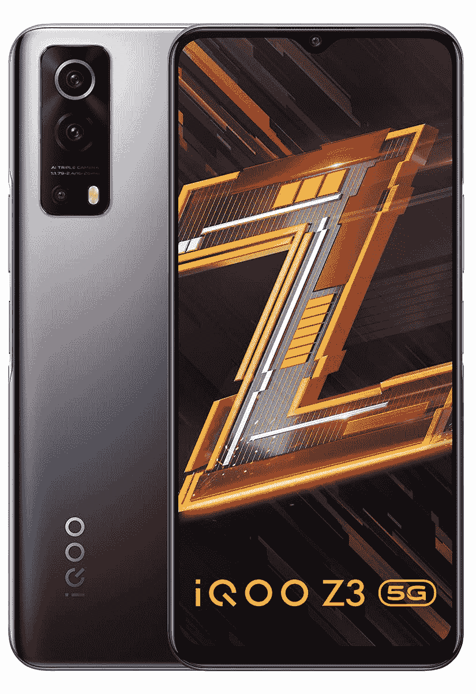

# iQOO Z3 在印度推出骁龙 768G 和 55W 快充

> 原文：<https://www.xda-developers.com/iqoo-z3-india-launch/>

# iQOO 在印度的最新中档智能手机以优惠的价格提供了坚实的硬件

iQOO 刚刚在印度推出了中端 iQOO Z3 5G 智能手机。这款手机以极具竞争力的价格提供了坚实的硬件包。

继上个月在印度发布 iQOO 7 系列之后，Vivo 的子品牌以 iQOO Z3 5G 的形式回归。iQOO Z3 最初于 3 月份在中国推出，是一款中档智能手机，专注于以具有竞争力的价格提供稳定的性能。

## iQOO Z3:规格

| 

规格

 | 

iQOO Z3

 |
| --- | --- |
| **尺寸和重量** | 

*   163.95 毫米 x 75.30 毫米 x 8.5mm 毫米
*   185.5 克

 |
| **显示** | 

*   6.58 英寸液晶显示器
*   全高清+ (2408 x 1080)
*   120 赫兹刷新率
*   180Hz 触摸采样速率
*   HDR10 支持
*   DCI-P3 宽色域

 |
| **SoC** | 

*   高通骁龙 768G:
    *   1 个 Kryo 475(基于 ARM Cortex-A76)Prime core @ 2.8 GHz
    *   1 个 Kryo 475(基于 ARM Cortex-A76)性能内核@ 2.2GHz
    *   6 倍(基于 ARM Cortex-A55)效率内核@ 1.8GHz
    *   7 纳米 EUV 工艺
*   Adreno 620(与骁龙 765G 相比，性能提升 15%)

 |
| **RAM 和存储器** | 

*   6GB/8GB LPDDR4 RAM
*   128GB/256GB UFS 2.2 闪存存储
*   MicroSD 卡支持

 |
| **电池&充电** | 

*   4400 毫安时电池
*   55W 快速充电器(包装盒内)

 |
| **后置摄像头** | 

*   主要:64MP ISOCELL GW3，f/1.8，0.7 m
*   次要:800 万像素 f/2.2，超广角
*   第三级:2MP 宏

 |
| **前置摄像头** |  |
| **端口** | 

*   USB 类端口
*   3.5 毫米耳机插孔

 |
| **连通性** | 

*   4G LTE
*   蓝牙 5.1
*   C 型端口
*   WiFi 802.11 . b/g/n/AC(2.4 GHz+5 GHz)

 |
| **其他特征** | 

*   侧装式指纹读取器
*   5 层液体冷却系统

 |
| **软件** | 

*   基于 Android 11 的 Funtouch OS 11.1 全球

 |

iQOO Z3 在尺寸为 164 毫米 x 75.3mm 毫米 x 8.5 毫米的机身中采用了 6.58 英寸 FHD+LCD 120 赫兹面板。该显示器提供了高达 180 赫兹的触摸采样率，并支持 HDR10 内容播放。从内部为该设备提供动力的是骁龙 768G SoC，而不是高通提供的最尖端的中端芯片，但对于 iQOO Z3 这样的中端设备来说应该足够强大。这款手机有三种内存版本:6GB/128GB、8GB/128GB 和 8GB/256GB。

相机部门由 64MP 主拍摄器、8MP 超宽凸轮和 2MP 微距镜头处理。为所有这些供电的是 4400 毫安时电池，支持 55 瓦快速充电。iQOO Z3 还拥有一个 5 层液体冷却系统，该公司表示，该系统可以将手机的核心温度降低 10 摄氏度。在软件方面，该手机运行基于 Android 11 的 Foutouch OS 11.1 Global。

### 定价和可用性

 <picture></picture> 

iQOO Z3

##### iQOO Z3

iQOO Z3 5G 以优惠的价格提供坚固的硬件包。它配备了 120Hz 显示屏、骁龙 786G、5 层液冷系统和 4,400mAh 电池，支持 55W 快速充电。

iQOO Z3 从今天开始在亚马逊和 iQOO.com 销售。它将有两种颜色可供选择:Ace 黑和 Cyber 蓝。所有三种变型的定价如下:

*   6GB + 128GB: ₹19,990
*   8GB + 128GB: ₹20,990
*   8GB + 256GB: ₹22,990