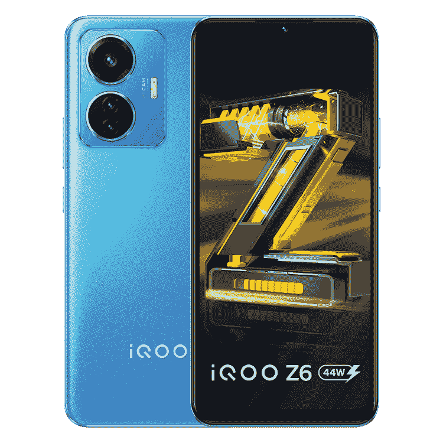
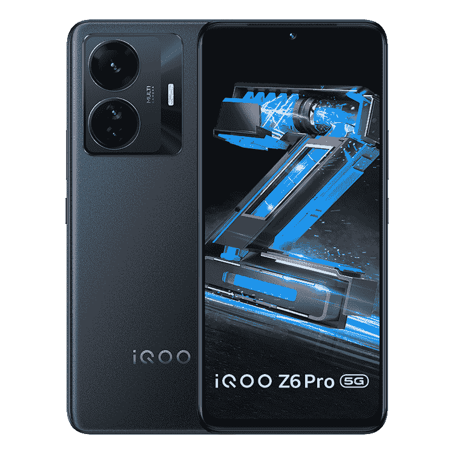

# iQOO Z6 和 Z6 Pro 在亚马逊正在进行的夏季销售期间以折扣价出售

> 原文：<https://www.xda-developers.com/iqoo-z6-44w-iqoo-z6-pro-now-on-sale-amazon-india/>

iQOO 最近在印度发布了两款新的智能手机:iQOO Z6 44W 和 iQOO Z6 Pro。这两款手机都物有所值，价格实惠，性能出众。iQOO Z6 44W 是一款经济实惠的产品，而 iQOO Z6 Pro 则更高端，适合中端市场。这两款机型现在都在亚马逊印度上销售，并提供了一些令人兴奋的发布优惠。

## iQOO 6 系列:规格

| 

规格

 | 

iQOO Z6 44W

 | 

iQOO 6 Pro

 |
| --- | --- | --- |
| **尺寸&重量** |  |  |
| **显示** | 

*   6.44 英寸 AMOLED
*   FHD+ (2400 x 1080)
*   60Hz 刷新率
*   180Hz 触摸采样速率
*   DCI-P3 色域

 | 

*   6.44 英寸 AMOLED
*   FHD+
*   90Hz 刷新率
*   1300 尼特峰值亮度
*   HDR10+支持

 |
| **SoC** | 

*   高通骁龙 680:
    *   Kryo 265 八核 CPU(最高 2.0GHz)
    *   6 纳米
*   Adreno 610 GPU

 | 

*   高通骁龙 778G
    *   4x ARM Cortex-A78 @ 2.4GHz
    *   4x ARM Cortex-A55 @ 1.8GHz
*   Adreno 642L
*   6 纳米工艺

 |
| **风筒&储存** | 

*   6GB/6GB/8GB 内存
*   128GB 存储

 |  |
| **电池&充电** | 

*   5000 毫安时电池
*   44W 快速充电支持

 | 

*   4700 毫安时电池
*   66W 快速充电支持

 |
| **安全** | 显示指纹扫描仪 | 显示指纹扫描仪 |
| **后置摄像头** | 

*   初级:50MP f/1.8
*   辅助:2MP f/2.4 微距
*   第三纪:2MP f/2.4 深度

 | 

*   初级:6400 万华氏度/1.79 英镑
*   二级:800 万像素 f/2.2 超宽
*   第三级:2MP f/2.4 微距

 |
| **前置摄像头** |  |  |
| **连通性** | 

*   4G LTE
*   双频 Wi-Fi
*   蓝牙 5
*   USB 型

 | 

*   5G NR
*   无线网络 6
*   蓝牙 5.2
*   USB 型

 |
| **软件** | 

*   搭载 Funtouch OS 12 的 Android 12

 | 

*   搭载 Funtouch OS 12 的 Android 12

 |

### iQOO Z6 44W

 <picture></picture> 

iQOO Z6 44W

##### iQOO Z6 44W

iQOO Z6 44W 配备了 6.44 英寸 AMOLED FHD+显示屏、骁龙 680 芯片组和 5000 毫安时大电池，支持 44W 快速充电。

iQOO Z6 44W 配备 6.44 英寸 FHD+ AMOLED 显示屏，骁龙 680SoC，4GB/6GB/8GB 内存和 64GB/128GB 存储，50MP + 2MP + 2MP 摄像头设置，5,000mAh 电池，支持 44W 快速充电。它配备了一个显示指纹扫描仪，并运行基于 Android 12 的 Funtouch OS 12。

### iQOO Z6 Pro

iQOO Z6 Pro 是一款高端中端产品，配备 6.44 英寸 AMOLED FHD+显示屏，刷新率为 90 赫兹。在引擎盖下，它由一个[高通骁龙 778G](https://www.xda-developers.com/qualcomm-snapdragon-778g/) 芯片组驱动，加上 6GB/8GB/12GB 内存和 128GB/256GB 存储。

 <picture></picture> 

iQOO Z6 Pro

##### iQOO Z6 Pro

iQOO Z6 Pro 是一款功能强大的中型游侠，内置高通骁龙 778G 芯片和 4,700mAh 电池，可提供 66W 快速充电。

在背面，这款手机标榜三摄像头设置，具有 64MP 主摄像头，8MP 超宽摄像头和 2MP 微距镜头。iQOO Z6 Pro 还包装了 VC 液冷系统，声称可以降低 CPU 温度 12 度。它还有一个 Z 轴线性电机，在游戏中提供更身临其境的触觉反馈。规格表中还包括 4700 毫安时电池，支持 66W 快速充电，内置指纹扫描仪，支持 Wi-Fi 6，蓝牙 5.2 和 5G 连接。

### iQOO Z6 44W 和 iQOO Z6 Pro 定价和供货情况

iQOO Z6 44W 现在可以在亚马逊印度购买，介绍价格为₹13,999.6GB/128GB 的型号在₹15,499 定价，而 8GB/128GB 的型号会让你在₹16,999.花费不菲为了让交易更加甜蜜，亚马逊提供了一张₹1000 折扣券，你可以在结账时使用，而 ICICI 信用卡用户可以获得额外的₹1000 折扣。另一方面，iQOO Z6 Pro 将以基本型号的₹23,999 和 8GB/128GB 型号的₹24,999 的介绍价格上市销售。ICICI 信用卡持有人可以获得₹3000 即时折扣，而亚马逊也提供₹1000 折扣券。