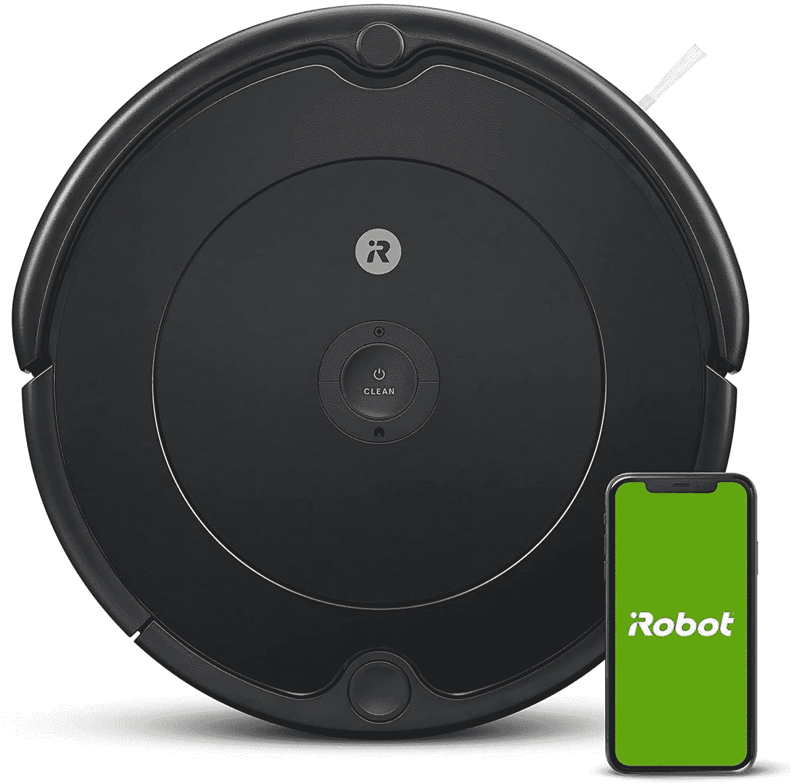

# Roomba 692 真空吸尘器仅需 199 美元，让您尽情放松

> 原文：<https://www.xda-developers.com/irobot-roomba-692-deal-november-2021/>

这是感恩节前夜，客人们都走了，你懒洋洋地坐在沙发上，盯着你最终要开始清理的脏乱。当你放松下来的时候，如果有人或者有什么东西在那里收集那些放在地板上的馅饼屑就好了。嗯，我们有好消息要告诉你！iRobot 的黑色星期五交易已经上线，提前了一天。现在，您可以在 Roomba 692 上节省 101 美元，并以 199 美元的价格拥有它，而它仍然有货。这个 *smol* ，乐于助人的机器人将在你的房子里漫游，用吸尘器清扫地板，并自动返回其坞站充电。是的，没错——你甚至不需要给这个小家伙插上电源。它是一个强大、独立的机器人，不需要人类。

 <picture></picture> 

iRobot Roomba 692

##### iRobot Roomba 692

这个有用的机器人会自动给你的房子吸尘，并自己充电。仅在有限的时间内，你可以花 199 美元拥有一台。

你可以使用 Alexa、谷歌助手或手机应用程序来安排这个方便的房屋的日常清洁时间。一旦完成，它将按照指示漫游并收集灰尘、碎片和污垢。无论你用的是硬地板、地毯，还是两者兼而有之，这个数字精灵(各种各样)都会自动适应。花几个小时清扫和吸尘整个房子的日子已经一去不复返了。Roomba 692 将从您的习惯中学习，并提供个性化的清洁班次。

这个看似愚蠢的机器实际上相当聪明，并具有生存本能。由于它的传感器和悬崖探测，它永远不会从楼梯上摔下来摔伤自己。它也会尽力避开家具、人和皮毛婴儿。Roomba 总能找到办法！说到电池寿命，这个方便的电子宠物将运行长达 90 分钟。之后，它会找到自己的路回到码头，给自己充电。你永远不用担心插上电源或者处理一个——但愿不会——死了的 Roomba。

*您会购买这款智能吸尘器吗？请在下面的评论区告诉我们。*