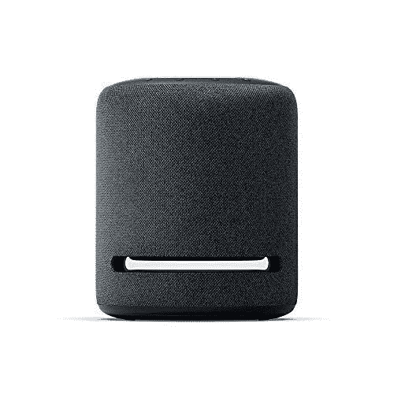

# 2022 年，亚马逊 Echo Sub 是否比其他扬声器更值得购买？

> 原文：<https://www.xda-developers.com/is-amazon-echo-sub-worth-it/>

亚马逊有大量的智能音箱和其他家用设备。有许多方法可以让亚马逊的虚拟助手进入你的家庭，这些支持 Alexa 的设备的列表继续保持增长。如果你没有关注亚马逊不断发展的 Echo 设备系列，那么 Echo Sub 可能已经在你的雷达下飞过。我不一定责怪你让这个幻灯片，因为它不同于其他回声扬声器。

然而，真正的问题是，回声潜艇是否值得购买？和其他 Echo 音箱一起用一个是什么感觉？尽管我喜欢几乎每天使用我的 Echo Sub 和我的其他 Echo 扬声器，但我不能在 2022 年向某人推荐它。以下是我认为你最好购买 Echo Studio 而不是 Echo Sub 的一些原因:

**浏览本文:**

## 请带上你自己的回声

对于那些不知道的人来说，回声潜艇不是一个独立的扬声器。因此，它没有大脑，没有有线输入，甚至没有麦克风。它是专为其他回声扬声器设计的。在 2018 年发布 Echo Sub 时，这看起来非常好，因为这是向现有音频设置添加更多低音的最简单方法之一。然而，在 2022 年花 130 美元买一个“哑”配件的想法似乎是不必要的，特别是像 Echo Studio 这样的选项，它们可以做的不仅仅是在现有的音频设置中添加更多的低音。

 <picture></picture> 

Amazon Echo Sub + Echo Dot (4th gen) bundle

##### 亚马逊回声潜艇

亚马逊目前正在提供 Echo Sub 的捆绑包，其中包括两个 Echo Dot 或两个常规 Echo 扬声器，以实现完整的设置。

当你与其他一些顶级扬声器相比时，130 美元的价格标签似乎是可以接受的，但值得注意的是，你不能单独使用 Sub 来听音乐或与 Alexa 交谈，并像使用其他 Echo 扬声器一样自动化你的智能家居配件。这意味着你至少要再花 40 美元买一个 [Echo Dot](https://www.xda-developers.com/amazon-echo-dot-4th-gen-review/) 音箱才能让它启动并运行。是的，它仍然相对便宜，但 Echo Studio 可以做得更多，减去 Sub 的所有令人沮丧的限制，就像你将在下面看到的那些。

## 外形和设计:需要更多空间

毫无疑问，亚马逊的 Echo Sub 在市场上的其他低音炮中脱颖而出。它本质上是当时相对较小的回声扬声器的一个更大的圆柱形版本。它采用深色网眼面料，顶部呈圆形，这意味着它符合 Echo 系列的审美。就价格而言，它看起来像是一种优质产品。但是仅仅因为它很好地融入了环境，并不意味着它是一个额外的单元，在你的系统中需要更多的空间。

我将我的 Echo Sub 与另外两个 Echo Dot 扬声器一起使用，我可以告诉你，添加 Sub 后，我的音频设置现在占用了我房间的更多空间。Echo Sub 从整体上改善了音频体验，但 Echo Studio 可以在占用更少空间的同时提供相同甚至更好的体验。Echo Studio 的尺寸几乎与 Sub 相同，但它不需要额外的 Echo 扬声器来工作，这意味着我可以放弃 Echo Dot 扬声器或将其放在其他房间，以节省我的空间。更不用说，我还将不得不处理更少的电缆，因为我不会被迫用自己的电缆为三个独立的单元供电。

当我们讨论设计时，我想指出 Echo Sub 只有一个按钮，它笨拙地位于后面。考虑到连接时潜艇会有多困难和多故障(下一节会有更多介绍)，我更喜欢把这个按钮放在顶部或更容易接近的地方。

## 连接问题

你的回声潜艇可能有连接问题，也可能没有，但它给我造成了足够的麻烦，迫使我建立了一个专门的部分。设置 Echo Sub 需要几个步骤，包括设置一个兼容的 Echo 扬声器，在 Alexa 应用程序中注册您的 Sub，然后将 Sub 与您现有的扬声器配对。你可以查看我们的指南[如何将回声音箱与回声音箱](https://www.xda-developers.com/how-to-pair-echo-sub-amazon-echo/)配对，以了解更多详细过程。

当扬声器自己无法连接到不同的 Wi-Fi 网络时，这种挫折感就会出现。我总是很难让 Alexa 应用程序找到我的 Sub，或者让它与我的其他 Echo 扬声器连接到同一个网络。将潜艇连接到网络会将回声扬声器踢出该特定网络，反之亦然。该应用程序迫使你不断重置连接，并再次尝试这个过程。我甚至不得不多次强制关闭应用程序才能让它工作。

如果您最终与我同乘一条船，那么我建议您从您的网络中注销所有 Echo 扬声器，重新启动扬声器和路由器，然后重新开始整个过程。当我走长路线时，它似乎是有效的，但退一步说，它很烦人。事实证明，我不是唯一一个经历这些问题的人。我能够在亚马逊和 Reddit 上看到很多用户的抱怨。

你知道亚马逊本可以做些什么来让它的顾客更方便吗？允许使用简单的语音命令进行配对和解除配对。但遗憾的是，你不能用任何回声扬声器做到这一点。在回声潜艇的情况下，它就像一个疼痛的拇指一样突出，因为它甚至没有麦克风来听你的悲伤。

## 音频质量

这不是我对回声潜艇的全面回顾，这就是为什么我想保持这一节简短，只有一些相关的信息。在不涉及太多细节的情况下，我可以说 Echo Sub 正如预期的那样工作，这意味着它像任何其他低音炮一样为您的音频设置添加了强劲的低音。强大的低音有时令人难以承受，这也是为什么我没有一个合适的均衡器来平衡音频。我发现自己只通过 Echo Dot 扬声器而不是乐队播放了很多音乐，这样我就可以正确地听到背景中的人声和乐器。

对于那些好奇的人来说，Echo Sub 通过一个 6 英寸的低音扬声器提供向下发射的 100W 深低音。相比之下，Echo Studio 配备了五个驱动器，包括一个 5.25 英寸的向下发射低音扬声器，三个 2 英寸的中音扬声器和一个 1 英寸的前向高音扬声器。工作室在一个 330 瓦的放大器和一个 24 位 DAC 的帮助下驱动所有这些。Echo Studio 在技术上更有能力自己输出更好的音频，而且它还可以针对它所在的房间进行专门调谐。

## 结束语:寻找替代方案

亚马逊在 2018 年推出了 Echo Sub，作为智能家居武库的坚实补充。对于那些已经拥有 Echo 扬声器，但真正想把低音带回家的人来说，这是一个很容易的选择。它有其缺陷，但它继续蓬勃发展，是唯一的选择，与现有的回声扬声器，以提高整体音频质量。虽然它仍然像预期的那样工作，但由于 Echo Studio 的到来，它不再是那些想要额外低音魅力的人的唯一选择。

 <picture></picture> 

Echo Studio

Echo Sub 不一定是一个坏产品，因为它改善了那些已经在亚马逊生态系统中投入大量资金并拥有一堆 Echo Dots 和普通 Echo 扬声器的人的整体音频体验。但是如果你把它和回声潜艇一年后推出的回声工作室比较一下，你就会知道你到底错过了什么。回声潜艇在 2022 年只是坐落在一个非常奇怪的地方。更不用说，它也有令人沮丧的限制，这让我很难推荐它和所有其他选项一起使用。

 <picture></picture> 

Echo Studio

##### 亚马逊 Echo 工作室

Echo Studio 在 Echo Sub 问世一年后发布，它在音频质量和可用性方面提供了明显更好的体验。