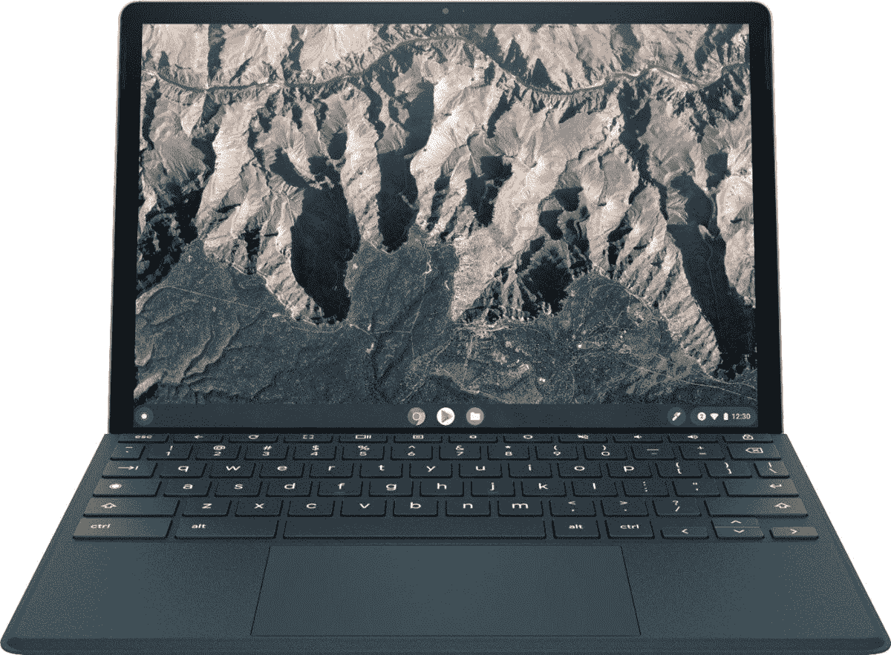

# 惠普 Chromebook x2 11 适合学校还是大学用？

> 原文：<https://www.xda-developers.com/is-hp-chromebook-x2-11-good-for-school/>

新的惠普 Chromebook x2 11 是在相当长一段时间内冲击消费者市场的最令人印象深刻的 Chrome OS 平板电脑之一。这是一款令人印象深刻的设备，具有专注于移动的骁龙 7c、高达 8GB 的内存和高达 128GB 的存储。如果你想在市场上购买一台新的 [Chromebook 供学校或大学使用](https://www.xda-developers.com/best-chromebooks-for-school/)，惠普 Chromebook x2 11 应该在你的候选名单上

起价 599 美元，对于 K-12 学生来说可能有点贵。另一方面，对于需要最大便携性的大学生来说，这绝对是一款令人惊叹的设备。让我们谈谈这是完美的 Chrome OS 设备的三个原因。

## USI 笔真正的可拆卸能力

Chromebooks 通常不被视为重型笔记本电脑。大多数人认为 Chromebooks 处于较低的阶层，在 PC 和 MAC 之后。而有了 Chromebook x2 11，绝对不是这样。惠普 Chromebook x2 11 附带了一个可拆卸键盘，这意味着你可以将它用作 Chromebook 或真正的 Chrome 平板电脑。

键盘也不是太大，所以即使连接了键盘，这个设备也是便携的。此外，您还可以获得一只捆绑的 USI 笔，它可以磁性附着在 HP Chromebook x2 11 上。如果你需要一整天都做笔记，惠普 Chromebook x2 11 绝对适合学校使用。

惠普还推出了一个名为 Quick Drop 的新工具，主要是将隔空投送功能引入你的 Chrome OS 设备。学生通常会定期来回共享文件，因此这可能会改变您的工作流程。

## 惊人的触摸板和键盘

打印长期论文会对你的手指和手腕造成损害。不舒服的键盘和触摸板在 Chromebook 上是不可接受的。谢天谢地，惠普 Chromebook x2 11 有一个非常舒适的可拆卸键盘。

虽然在膝上使用并不完美，但惠普 Chromebook x2 11 键盘确实有相当大的移动量，这是你从键盘盖设计中所不期望的。

惠普 Chromebook x2 11 上的触摸板相当宽敞，也有令人印象深刻的触觉反应。同样，这不会与传统的翻盖机型竞争，但对于一个真正的可拆卸键盘和触摸板都令人印象深刻。

## 电池续航时间和增强的安全功能

惠普声称 Chromebook x2 11 一次充电可以获得长达 12.5 小时的电池续航时间。我可以告诉你这肯定是错误的，但电池寿命仍然很好。考虑到机器的整体功率，在显示器亮度为 50%且工作负载稳定的情况下，您可能会获得 7-8 小时的电池续航时间。

如果你愿意将亮度调到 30%，你可以在减少主要是浏览网页的工作量的情况下，达到 10 小时的屏幕时间。这应该足够你在没有充电器的情况下坚持一整天，或者至少几节课。

那些担心隐私的人会喜欢 HP Chromebook x2 11 上内置的指纹传感器和网络摄像头隐私快门。这两个功能都让你的 Chromebook 在校园里使用时更加安全。

## 结论

总的来说，新款惠普 Chromebook x2 11 是大学生的绝佳选择。它不仅具有必要的便携性，还拥有许多你不上课时可以使用的高级功能。它的重量仅为 2.5 磅，非常适合整天在教室之间携带。没有多少 Chromebooks 能够将如此强大的功能集成到如此轻便的可拆卸设计中。这绝对是惠普有史以来最好的 Chromebooks 之一。

 <picture></picture> 

HP Chromebook x2 11

##### 惠普 Chromebook x2 11

惠普 Chromebook x2 11 结合了 Chrome OS 的强大功能和传统平板电脑的便携性。借助可选的 4G LTE 功能，您可以在任何地方工作。这是全新的顶级 Chrome OS 平板电脑体验。