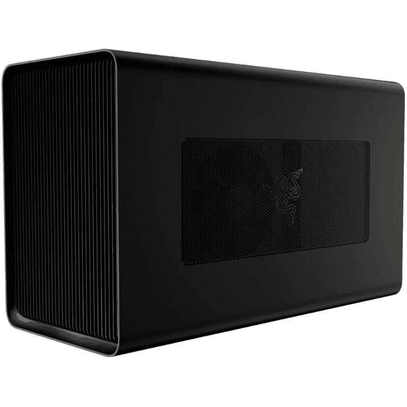

# Surface Pro 9 适合游戏吗？以下是你需要知道的

> 原文：<https://www.xda-developers.com/is-surface-pro-9-good-gaming/>

随着每一款 PC 的发布，都有一个问题，那就是你能否在上面玩视频游戏——毕竟，游戏是在 PC 上最受欢迎的活动之一。微软最近推出了 [Surface Pro 9](https://www.xda-developers.com/surface-pro-9/) 平板电脑，如果你想知道它能否用于游戏，答案是肯定的。然而，在启动它进行游戏之前，有很多事情需要考虑。

开箱后，Surface Pro 9 并不是一款游戏笔记本电脑，它也没有非常强大的规格。Wi-Fi 型号配备了 15W 英特尔处理器，没有独立显卡(尽管如果你调低设置，它可以处理像*火箭联盟*或*堡垒之夜*这样的轻量级游戏)。相比之下，5G 模型使用基于 Arm 的微软 SQ3 处理器，这根本不是为了原生运行游戏。有些游戏是为 Arm 处理器设计的，但它们非常罕见。

然而，Surface Pro 9 有一个 120Hz 刷新率的出色显示器，如果你能找到让游戏运行的方法，这将是一个很好的游戏体验。谢天谢地，现在有很多方法可以让游戏成真，无论你是使用云游戏还是 GPU，即使在 Surface Pro 9 这样的轻薄设备上，它们也可以很棒。

## Surface Pro 9 上的云游戏

如果你想在 Surface Pro 9 上玩游戏，更广泛的解决方案是使用云游戏服务，如 Xbox Cloud Gaming、Nvidia GeForce Now 或亚马逊 Luna。云游戏的工作方式是在服务器上渲染游戏，游戏通过互联网实时传输给你。这确实意味着你需要一个持续的高速互联网连接，但云游戏可以在英特尔和 Arm 版本的 Surface Pro 9 上运行。

由于 Surface Pro 9 拥有非常清晰的显示屏和 120Hz 的刷新率，Nvidia 的 GeForce Now 是利用这一点的最佳解决方案。通过 RTX 3080 会员资格，GeForce 现在允许您以高达 2560 x 1600 的分辨率和 120 FPS 的速度播放游戏，从而带来梦幻般的游戏体验。然而，GeForce 现在使用一个只有英特尔或 AMD 处理器支持的专用应用程序，所以你可能无法在 5G 的 Surface Pro 9 上玩。

Xbox 云游戏可以通过 Windows 的 Xbox 应用程序使用，该应用程序可以在 Surface Pro 9 的英特尔和 Arm 版本上运行，因此这可能是最方便的选择。你也可以通过网络浏览器访问亚马逊 Luna。如果你有 Arm 版本的 Surface Pro 9，你可能会想使用微软 Edge 或 Mozilla Firefox，因为这是仅有的两种在基于 Arm 的 Windows 设备上运行的浏览器。而且，因为 Arm 型号有 5G，你可能可以在任何地方玩游戏，即使没有 Wi-Fi。Xbox 云游戏和亚马逊 Luna 都支持 60 FPS 的 1080p 流媒体，所以虽然没有 GeForce Now 那么令人印象深刻，但你仍然会玩得很开心。我们会说 Xbox Cloud Gaming 提供了最大的价值，因为你可以通过 Xbox Game Pass Ultimate 订阅获得它，其中包括 100 多种游戏，其中许多都是主要版本，此外还有一个专用的应用程序来使用该服务。

值得注意的是，Xbox Game Pass Ultimate 上的游戏并不使用鼠标和键盘，所以你需要一个类似 [Xbox 无线控制器](https://shop-links.co/1788389240385713815?u1=878ad6fd-ca91-47d5-a8e1-ce2717319b70)的控制器。

 <picture></picture> 

Xbox Game Pass Ultimate (3 months)

##### Xbox 游戏通行证终极版(3 个月)

Xbox Game Pass Ultimate 让你可以在 Xbox 和 PC 上访问超过 100 款游戏，包括访问云游戏，以便你可以在 Surface Pro 9 上玩游戏。

## 使用外部 GPU(仅限英特尔型号)

如果你有一个采用英特尔处理器的 Surface Pro 9，你的另一个选择是使用外部 GPU，这要归功于 Thunderbolt 4 的强大功能。这是英特尔的专有技术，因此它不可用于 Surface Pro 9 的 5G 型号。尽管如此，它仍有一些令人惊叹的功能，包括高达 40Gbps 的带宽，最重要的是，通过 USB Type-C 端口支持 PCIe 信号。

PCIe 是用于与 PC 内部组件通信的接口，但通过 Thunderbolt 4 端口，你可以使用外部 GPU 外壳连接实际上在计算机外部的显卡。这是一个相当昂贵的选择，因为你需要购买外壳和 GPU 本身，但这意味着你不需要经常连接到互联网来玩游戏，你可以充分利用 Surface Pro 9 上的 120Hz 显示屏。

如果你需要一个外部 GPU，Razer Core X Chroma 是 T2 最好的机箱之一，它将支持大多数现代 GPU，尽管你可能会在 GeForce RTX 4090 这样的超大卡上遇到麻烦。尽管如此，像 GeForce RTX 3060 这样的 GPU 已经可以在大多数游戏中给你带来梦幻般的体验，而且价格便宜得多。

 <picture></picture> 

Razer Core X Chroma

##### 雷蛇核心 X 色度

Razer Core X Chroma 是一个外部 GPU 外壳，具有 750W 电源，包括 100W 的功率传输到您的笔记本电脑。此外，它有一些额外的天赋 RGB 照明。

你也可以试试[千兆字节的游戏盒](https://www.amazon.com/GIGABYTE-REV2-0-WATERFORCE-Thunderbolt-GV-N3080IXEB-10GD/dp/B09CC3VLPT/ref=sr_1_1?tag=xda-4cj0oh8-20&ascsubtag=UUxdaUeUpU44194&asc_refurl=https%3A%2F%2Fwww.xda-developers.com%2Fis-surface-pro-9-good-gaming%2F&asc_campaign=Evergreen)，它已经内置了 GPU。然而，你不能升级它里面的 GPU。

* * *

关于 Surface Pro 9 上的游戏，这就是你需要知道的全部。虽然它不是为游戏而生的机器，但云游戏和 Thunderbolt 4 等现代技术使这种体验成为可能，即使这需要一些投资。

Surface Pro 9 可能是你今天能买到的[最好的 Windows 平板电脑](https://www.xda-developers.com/best-windows-tablets/)，也是[最好的笔记本电脑](https://www.xda-developers.com/best-laptops/)之一。如果你还没有，你可以在下面购买，不管你是否对游戏感兴趣。

 <picture></picture> 

Surface Pro 9 (Wi-Fi Model)

##### Surface Pro 9

Surface Pro 9 是一款采用英特尔或高通处理器的顶级 Windows 平板电脑，它首次拥有多种颜色。