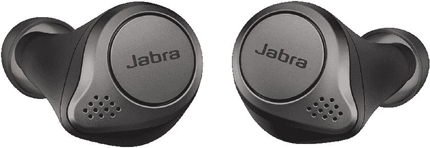

# 本周在百思买购买 100 美元的 Jabra Elite 75t 耳机

> 原文：<https://www.xda-developers.com/jabra-elite-75t-best-buy/>

随着圣诞节越来越近，找到好的交易会变得更加困难。相信我，每天盯着交易的人。但是，总是会有交易，尤其是当百思买为那些最后一秒钟购物的人打折时。有许多音频项目与最后一秒储蓄活动一起出售，这将成为你忘记的给你继母的第二个表妹的美好礼物。例如，Jabra Elite 75t 耳塞仅售 100 美元。

Elite 75t 耳机的建议零售价为 180 美元，这是我见过的最好的折扣之一。你也没有在质量上打折扣，因为这些耳塞深受 XDA 员工的喜爱。当 Jabra 宣布 Elite 85t 耳机时，他们也宣布 75t 将升级使用[主动降噪技术](https://www.xda-developers.com/jabra-elite-85t-tws-earbuds-update-elite-75t-anc/)，所以你知道这些将能够阻挡你周围的噪音。耳塞也有 20Hz - 20kHz 的耳机频率响应，我被告知非常好！很抱歉我不太了解音频指标，但你可以在[百思买商店页面](https://shop-links.co/1727300280011232152?u1=cfaaf356-9d61-4538-b76d-618ee33cc1b1)上阅读所有规格！

事实上，对于这种先进的主动降噪、24 小时的电池寿命和蓝牙 5.0 来说，即使 180 美元也是非常划算的。但是它们的价格是 100 美元，所以如果你需要一副新的耳塞，黑色的 Jabra Elite 75ts 是完美的选择！不过，如果你想要金米色或钛黑色，你就得多花 120 美元。不管你是送货上门还是从当地商店提货，百思买都会为你提供服务。

 <picture></picture> 

Jabra Elite 75t Headphones

##### Jabra Elite 75t

你想要一些不花费一只胳膊和一条腿的伟大的噪音消除耳塞吗？在百思买以 100 美元的价格购买 Elite 75t 耳塞，享受高品质耳机的所有好处，而无需支付价格。

像本周的许多交易一样，这次折扣是百思买最后一秒节约活动的一部分，该活动将持续到周四。查看[销售登录页面](https://shop-links.co/1727300279815656419?u1=5c09c23b-2ae6-4315-b337-3e672371af38)了解更多优惠！