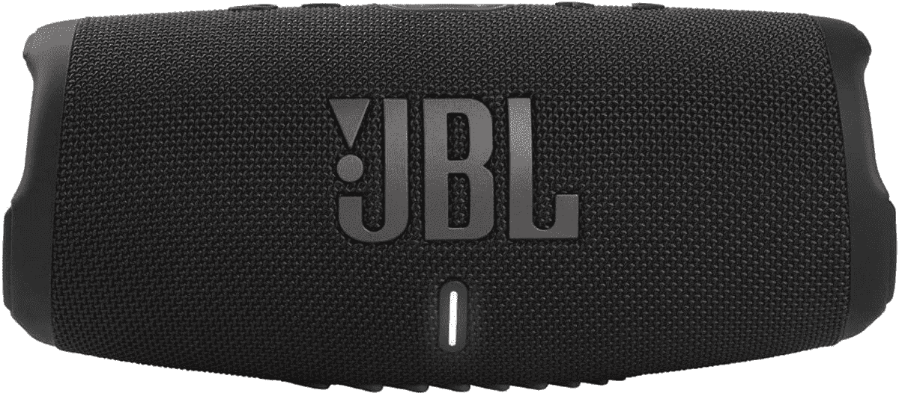

# 黄金时段购买 JBL 充电 5 便携式扬声器可节省 30 美元

> 原文：<https://www.xda-developers.com/jbl-charge-5-prime-day-deal-2022/>

# 黄金时段购买 JBL 充电 5 便携式扬声器可节省 30 美元

JBL 收费 5 只在有限的时间内打折。在此交易到期前购买一个，并在此过程中节省 30 美元！

亚马逊优惠日到了，我们最喜欢的商品也在打折。JBL 是一家声誉良好的公司，生产相对实惠的扬声器和耳机。尽管价格颇具吸引力，但 JBL 仍提供经久耐用的优质设备。如果你已经盯上了 JBL 5 号，那么今天就是你的幸运日。这种便携式防水扬声器目前正在销售，如果你在限时交易到期前购买一台，可以节省 30 美元。你不用支付 179 美元，只需 149 美元就能买到一台，并在这个过程中节省 17%。

JBL 充电 5 提供 IP67 防水和防尘性能，一次充电可长达 20 小时的播放时间，以及蓝牙连接。然而，更令人印象深刻的是，你可以将多个兼容的扬声器配对，以提高声音输出。不仅如此，JBL 充电 5 还可以作为一个电源银行，在你的设备没电的时候给它们充电。它的确是完美的户外聚会伴侣！

 <picture></picture> 

JBL Charge 5

##### JBL 充电 5

JBL 充电 5 具有 IP67 防水和防尘等级，提供 20 小时的收听时间，并有六种颜色可供选择。

这款 JBL 音箱有六种 vivd 颜色可供选择。六个中的每一个都散发出精致的氛围，反映出其独特的身份和个性。你可能会发现自己敬畏地凝视着——只是无法决定从这些杰作中挑选哪一件。它具有球形(ish)设计和播放控制按钮，以避免需要依赖你的手机。的确，它是野营或海滩旅行的完美伙伴。

说到音乐，Beats 也为 Prime Day 打折了五款热门产品！如果你正在寻找高端耳机或耳塞，请查看这些 [Beats 交易](https://www.xda-developers.com/beats-prime-day-deals-2022/)。对于那些使用苹果产品的人来说，它们特别棒——因为该公司已经为使用这些设备的人提供了额外的软件津贴。

*您会购买 JBL 充电 5 吗？为什么或为什么不？请在下面的评论区告诉我们。*