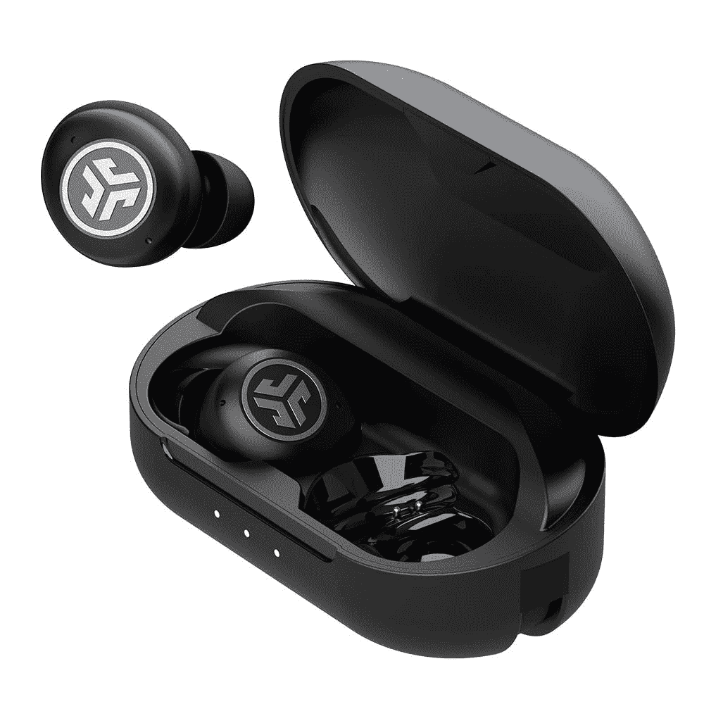
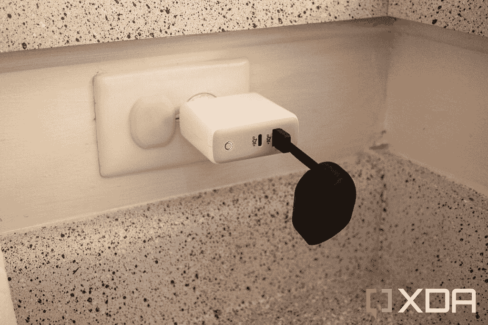
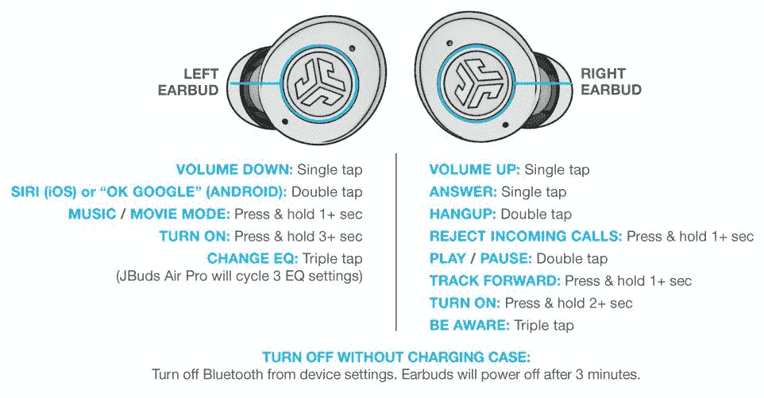

# JLab JBuds Air Pro 评论:PS5 游戏价格的无线耳塞

> 原文：<https://www.xda-developers.com/jlab-jbuds-air-pro-review/>

就在几年前，大多数真正的无线耳塞都非常糟糕。电池寿命、两个 buds 之间的同步、充电和其他功能经常出现问题。快进到 2022 年，你可以用不到 100 美元买到一副[的真正无线耳塞](https://www.xda-developers.com/best-wireless-earbuds/)。最近的一款产品是 JLab 的 Jbuds Air Pro，它拥有蓝牙多点支持和 IP55 等级，售价仅为 59 美元。我已经使用 JLab JBuds Air Pro 一周多一点了，虽然我的耳塞确实有一些问题，但对于你支付的费用来说，这是一个不错的套餐。

 <picture></picture> 

JLab JBuds Air Pro

##### JLab JBuds Air Pro

这些 59 美元的真正的无线耳塞是一个很好的价值，但在一些领域有所欠缺。

## JLab JBuds Air Pro:定价和可用性

JBuds 目前只在公司自己的在线商店上销售 JBuds Air Pro。尽管 JLab 的一些其他耳机和耳塞在 Office Depot 等商店有卖，但 Air Pro 似乎不是这样——至少目前不是。

截至这篇评论发表时，价格定为 59.00 美元，标准运费免费。

## JLab JBuds Air Pro:规格

| 

规格

 | 

JLab Jbuds Air Pro

 |
| --- | --- |
| **打造** | IP58 防尘/防水等级(仅限耳塞) |
| **尺寸&重量** | 

*   耳塞:每个 5.3 克
*   装箱数:39.1 克

 |
| **演讲者** | 

*   6mm 定制动态驱动器
*   20–20 kHz 频率响应
*   阻抗:16ω
*   输出:98 分贝

 |
| **ANC** | 不 |
| **麦克风** | 两个耳塞内置 MEMS -38dB+/-1dB 麦克风 |
| **编解码器** |  |
| **连通性** | 

*   蓝牙 5.1
*   多点支持

 |
| **手势** | 

*   音量、播放和通话控制
*   轻按三次以更改均衡器设置

 |
| **电池&充电** | 

*   每个耳塞中有 60 毫安时电池
*   620 毫安时电池
*   耳塞充电时间为 1.5 小时
*   表壳充电时间为 2 小时

 |
| **其他特征** | 

*   三套盒装凝胶耳塞
*   盒子里有两套 cush fins

 |

***关于这篇评论:** JLab 为了这篇文章把 JBuds Air Pro 送到了 XDA。JLab 对该审查的内容没有意见。*

## 设计:你的普通耳塞

就像现代汽车一样，所有真正的无线耳塞在这一点上或多或少都是相同的设计。耳塞本身有点大，因为所有的硬件组件都包含在耳塞中——没有像苹果 AirPods 那样的“茎部”。每个人的耳朵都不一样，但是如果耳塞再大一点，就不适合我的耳朵了。从好的方面来说，我没有遇到过耳塞慢慢从耳朵里掉出来的问题，就像我注意到的其他一些入耳式设计一样。

JLab 在包装盒中包括三套凝胶耳塞(包括默认耳塞)，以防常规耳塞不太合适。还有两套橡胶“cush fins”，可以包裹在花蕾的边缘，这样你的耳朵就不会接触到塑料。它们还可能有助于在大量运动后(例如，在运动中)耳塞不会从你的耳朵中滑出，但我个人没有鳍就没有这个问题。

像大多数最新的真正的无线耳塞一样，耳塞中有传感器，当你取出耳塞时，传感器会检测到，并自动暂停媒体播放。从我的耳朵里拿出一个和音乐暂停之间的延迟大约是一秒钟，但这并不太糟糕。

这些耳塞的主要问题是没有主动噪音消除(ANC)，所以唯一被阻挡的噪音来自耳尖密封。即使没有 ANC，也有相当好的隔音水平，并且有一个使用耳塞内置麦克风传输外部声音的手势——下一节将详细介绍。如果你打算在嘈杂的环境中，你肯定想尽可能地屏蔽掉，比如坐火车或坐飞机，那么 [Galaxy Buds 2](https://www.amazon.com/Wireless-Cancelling-Bluetooth-Lightweight-Graphite/dp/B094242FV1?tag=xda-1a8kqm4-20&ascsubtag=UUxdaUeUpU41151&asc_refurl=https%3A%2F%2Fwww.xda-developers.com%2Fjlab-jbuds-air-pro-review%2F&asc_campaign=Short-Term) 通常售价约为 100 美元，ANC 也不错。

移动到充电盒，你可以在前面看到三个指示灯，显示当前的电池电量，还有一个廉价的塑料结构。然而，充电解决方案绝对是独一无二的——大多数耳塞外壳都有一个 USB Type-C 端口用于供电(有时还有 Qi 无线充电)，但 Air Pro 有一个从底部折叠出来的 USB Type-A 连接器。JLab 的广告和产品手册暗示，你应该主要从笔记本电脑或个人电脑上充电，如果你在旅行，你不需要随身携带电缆。

 <picture></picture> 

Charging the JBuds Air Pro with a USB wall adapter

我不确定这个设计决定是不是最好的主意，因为现在许多笔记本电脑根本没有 USB Type-A 端口。短电缆长度也意味着将其插入 PC 或壁式充电器意味着外壳将悬挂在 USB 端口上(见上图)，如上图所示。USB Type-C 基本上已经解决了为每个设备携带不同电缆和充电器的问题，鉴于这个价格范围内有许多带 Type-C 端口的真正的无线耳塞(有些还带无线充电)，我不确定 JLab 需要在这里重新发明轮子。

JLab 声称一次充电最多可以玩 9 个小时，这个案例提供了额外的 27 个小时。我不认为我曾经一次在耳朵里塞了九个小时的耳塞，但我肯定没有注意到电池电量下降到广告宣传的数字以下。更大的电池组和 ANC 的缺乏可能有助于电池寿命。

## 软件:多点和复杂控制

Jbuds Air Pro 没有定制控制/音频或安装更新的移动应用程序，这对我来说很好——大多数音频附件的应用程序都不太好。然而，这意味着你需要熟悉 Air Pro 的手势，这些手势有点复杂，会根据你敲击的耳塞而变化。我相信大多数人在定期使用一段时间后会习惯这些控制，但你肯定会在把耳塞从盒子里拿出来后至少查看几次手册。

 <picture></picture> 

JBuds Air Pro gestures (Credit: JLab)

主要卖点，尤其是这个价位的，就是支持多点蓝牙。这使得你可以同时将耳塞连接到两个蓝牙设备，如电话和 PC，耳塞将在它们之间切换。例如，你可以通过电脑播放音乐，当有电话打进来时，耳机会切换到你的手机。

没有办法在耳塞上轻松进入配对模式

这个功能对某些人来说可能很方便，但老实说，我并不怎么用它——我不经常用手机打电话，这似乎是主要的用例。许多其他耳塞已经能够快速切换到不同的设备，JBuds Air Pro 实际上比大多数其他耳塞处理得更差。除非您找到耳塞当前与哪个设备配对，并将其从蓝牙设置中断开，否则无法在耳塞上轻松进入配对模式。否则，您将同时与新设备和旧设备配对。这是一种令人困惑的混乱。

JBuds Air Pro 似乎不是为每个耳塞独立工作而设计的。当我试图把一个耳塞从盒子里拿出来放在一只耳朵里时，它会一直暂停任何媒体播放，然后通常允许我在 10-20 秒后播放一些东西。

## 音质:三种设置和一个正常的麦克风

有三种音频模式可供选择，可以通过在左耳塞上轻按三次来改变。第一个是“JLab Signature”，它似乎可以提升人声和其他中频。还有“低音增强”，这就像它听起来一样，最后是“平衡的”。我更喜欢来自平衡选项的声音，低音增强使人声更难理解。

像大多数廉价的真正无线耳塞一样，JBuds Air Pro 支持标准的 AAC 音频编解码器，但不支持任何高通的 aptX 编解码器。aptX 的主要优势是更低的延迟，但大多数 Android 应用程序在这一点上可以调整蓝牙延迟，没有问题。

[audio m4a = " https://static 1 . xdaimages . com/WordPress/WP-content/uploads/2022/04/JBuds-recording . m4a "][/audio]

【JBuds Air Pro 的室内语音录制

[audio m4a = " https://static 1 . xdaimages . com/WordPress/WP-content/uploads/2022/04/Voice-001 . m4a "][/audio]

【JBuds Air Pro 的室外语音录制

内置麦克风一般用于入耳式蓝牙耳塞...只要你在室内，背景噪音最小。我试着在外面使用麦克风，即使是最小的风或噪音也会使我的声音变弱。

## 该不该买 JLab JBuds Air Pro？

我以前从未试过 JLab 的任何耳塞，但 JBuds Air Pro 似乎是 59 美元要价的一笔不错的交易。耳塞很合适(至少对我的耳朵来说)，没有基本功能所需的应用程序，我对平衡选项的音质没有任何抱怨。不过，用于充电的 USB Type-A 连接器有点奇怪——标准的 USB Type-C 端口似乎是 2022 年更好的解决方案。

JLab 宣传这是多点蓝牙耳塞最便宜的选择之一，但该功能的复杂性及其对配对的影响损害了体验。这主要是因为蓝牙是一项糟糕的技术，但我更喜欢可以在不同设备之间快速切换的耳塞(如 Galaxy Buds Pro 或苹果 AirPods)，而不是为多个同时连接而构建的东西。

**如果出现以下情况，您应该购买...**

*   你真的想要多点蓝牙支持。
*   你正在寻找一副 50 美元左右的像样的耳塞。

如果有以下情况，你就不应该买它...

*   你需要非国大的支持。
*   您不断地在设备之间切换(而不是同时使用所有设备)。
*   您通常一次只使用一个无线耳塞。