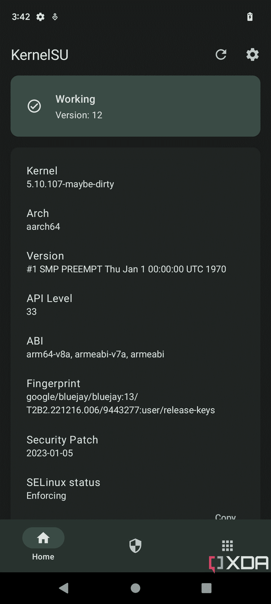

# KernelSU 为 GKI 设备带来无缝的内核辅助根访问

> 原文：<https://www.xda-developers.com/kernelsu-gki-root/>

在 Android 的修改圈子里，没有比 [Magisk](https://www.xda-developers.com/how-to-install-magisk/) 更知名的应用了。它有着实至名归的声誉，是 T2 为你的手机、平板电脑以及几乎所有运行安卓系统的东西提供支持的事实上的标准。虽然 Magisk 成功地将自己确立为 [Chainfire 的 SuperSU](https://www.xda-developers.com/chainfire-ending-development-root-apps/) 的继任者，但售后市场开发社区在过渡阶段偶然发现了多种根本解决方案。除了那些著名的，例如认可的开发者 phhusson 的超级用户，我们也遇到了一些独特的实现，例如认可的开发者 Jason Donenfeld 的内核辅助超级用户。

与其他传统的 root 方法不同，KernelSU 将获得 root 访问权限的能力嵌入到 Android 本身的底层 Linux 内核中。然而，它从未受到主流的关注，因为没有简单的方法来动态地修补现有的特定于设备的内核。你不仅需要在内核构建过程中整合它，而且根管理器应用的缺乏也让普通用户感到困难。话虽如此，谷歌实施通用内核映像的策略基本上消除了采用 PC 式内核更新机制的主要障碍，这意味着创建一组与设备无关的根引导映像不再是一项困难的任务。为这种可能性做准备，XDA 资深会员舒威，虚拟曝光和太极的开发者，现在已经提出了一个新的基于内核的 Android root 解决方案。

舒威改编的 GKI 版《KernelSU》比最初的版本有很多优势。更广泛的兼容性是一个主要因素，因为每个运行内核版本 5.10 或更高版本的 Android 设备都应该符合这个项目。此外，开发人员提供了一个专用的根管理应用程序，允许您轻松切换已安装应用程序的超级用户访问权限。最后但并非最不重要的一点是，KernelSU 的这种变体还支持基于覆盖的修改，因此您可以对只读分区进行修改，而无需对它们进行物理整形。

 <picture></picture> 

KernelSU's manager app running on a rooted Google Pixel 6a

对于与 GKI 2.0 兼容的设备，如果您可以解锁引导加载程序，您可以通过从项目的 Buildbot 下载合适的预补丁引导映像并刷新它来引导它们。内核构建者也可以自己编译映像，甚至为某些非 GKI 内核集成 KernelSU(有一些限制)。要了解更多关于用 KernelSU 为你的 Android 智能手机生根的信息，请看我们即将推出的教程。

值得注意的是，舒威的 KernelSU 仍然是一个正在开发的解决方案，所以如果你严重依赖于根应用程序，你可能会面临随机的错误和故障。但是如果你是一个内核或 ROM 开发者，或者如果你坚决要使用这个新工具，可以查看这个项目的主页和 GitHub 库来了解更多信息。

**KernelSU by 舒威:[网站](https://kernelsu.org/) || [GitHub 回购](https://github.com/tiann/KernelSU/)**