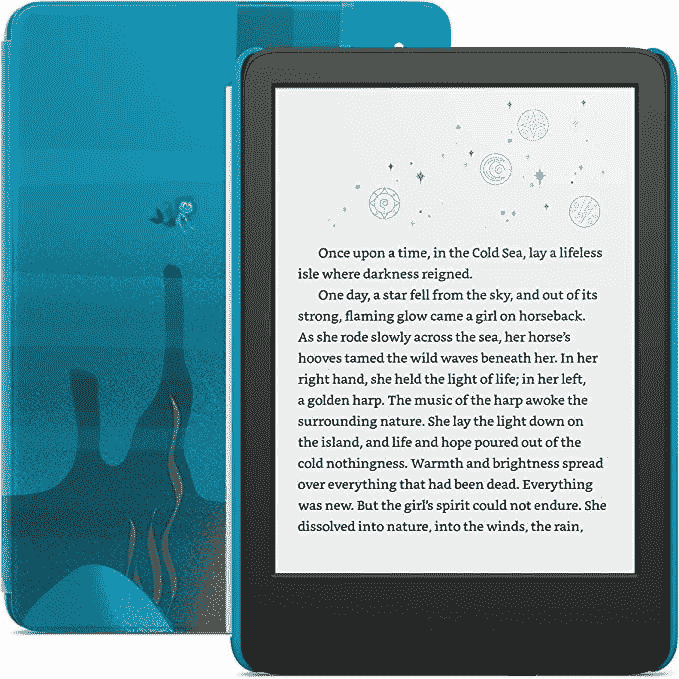

# 2022 款 Kindle 和 Kindle Kids 现已上市

> 原文：<https://www.xda-developers.com/kindle-kindle-kids-2022-first-sale/>

在秋季发布会上推出全新的 Kindle Scribe 之前，亚马逊[给了基本款 Kindle 和 Kindle Kids 一个更新](https://www.xda-developers.com/amazon-debuts-new-kindle-for-2022/)。最新的平价 Kindle 配备了 300ppi 像素密度的更高分辨率显示器，USB-C 充电端口，长达 6 周的电池寿命和 16GB 的存储空间，使其成为预算意识最强的电子阅读器。如果你想买一个新的 Kindle，又不想花几百美元买高级版，现在你可以点击下面的链接订购最新的基本版 Kindle。

尽管亚马逊在上个月推出新款 Kindle (2022 年版)后不久就开放了预购，但这款电子阅读器现在终于可以在美国购买了。你可以只花 99.99 美元购买支持锁屏广告的版本，而没有锁屏广告的版本将花费你 119.99 美元。两种款式都有两种颜色可供选择——黑色和牛仔布。

 <picture></picture> 

Kindle (2022 release)

##### Kindle (2022 年发布)

亚马逊的最新基本型号 Kindle 现在终于可以在美国购买了。

如果你想给你的孩子买电子阅读器，你可能会考虑新的 Kindle Kids (2022 年发布)。它配有一个保护套，一年免费的亚马逊 Kids+，两年保修，所有这些都是普通无广告 Kindle 的价格。Kindle Kids (2022 年发布)有三种独特的选择，太空鲸，海洋探险者和独角兽谷，背面板上有适合孩子的图形。

 <picture></picture> 

Kindle Kids (2022 release)

##### Kindle Kids (2022 年发布)

最新的 Kindle Kids 带有免费的后盖，一年的亚马逊 Kids+，两年的保修。

虽然新的 Kindle 和 Kindle Kids 具有背光功能，但它们不像 Kindle Paperwhite 和其他优质型号那样提供温度调节。电子阅读器也缺乏防水性，所以你在户外阅读时应该格外小心。

您会订购新的 Kindle 或 Kindle Kids 吗？你会选择哪种型号，为什么？请在下面的评论区告诉我们。此外，查看我们的[最佳 Kindle 电子阅读器](https://www.xda-developers.com/best-amazon-kindle-ereader/)列表，了解各种产品之间的所有差异。