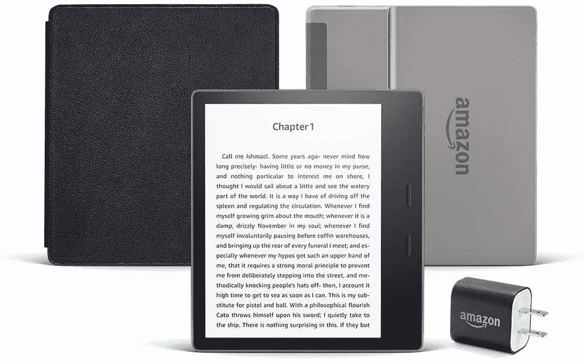

# 这个套装是在黄金日获得 Kindle Oasis 的最佳方式

> 原文：<https://www.xda-developers.com/kindle-oasis-essentials-bundle-prime-day-deal/>

如果说 Prime Day 有一件事是可以保证的，那就是亚马逊自己的硬件总是会看到一些令人惊叹的折扣。无论你是在找 Echo，Fire TV，还是 Kindle，总有你想要的东西。

然而，Prime Day 交易不仅仅是针对 Kindle。它将 Kindle Oasis 与您开始使用所需的所有其他东西捆绑在一起，包括一个外壳和一个电源适配器。最重要的是，这个捆绑包本身就大大降低了 Kindle Oasis 的正常价格。

通常情况下，你会看到支付 280 美元以上的 Kindle Oasis。这个包的价格刚刚超过 200 美元，带有一个皮革外壳和一个电源适配器，你可能需要也可能不需要。对于亚马逊最好的 Kindle 来说，这是一个不错的选择。

但是，为什么 Oasis 是这么好的 Kindle 呢？[XDA 执行主编里奇·伍兹的这段话概括了这一点:](https://www.xda-developers.com/editorial-amazon-kindle-oasis-best-ever/)

我非常喜欢这个产品。当我外出走动时，以及当我躺在床上时，它是完美的电子阅读器。这东西设计的时候基本没有瑕疵，我一直用到了今天。

 <picture></picture> 

Amazon Kindle Oasis Bundle

##### 亚马逊 Kindle Oasis

这款 Kindle Oasis 套装在黄金日大打折扣，可以节省大量费用，还可以购买一些配件。

Kindle Oasis 是一款奢侈品，这一点无可否认。但它也不仅仅是另一个提供书籍阅读的平板设备。设计新颖，防水性能使其成为完美的度假伴侣。纸质书不会经得起在游泳池或海滩上被溅到，但 Kindle Oasis 甚至不会注意到。

在购买 Kindle Oasis 时，利用 Prime Day 也是明智之举。它价格昂贵，所以去掉一些刺是一个值得一试的机会。如果你是亚马逊 Prime 的订阅者，它会在 Prime Day 结束前一直在线。