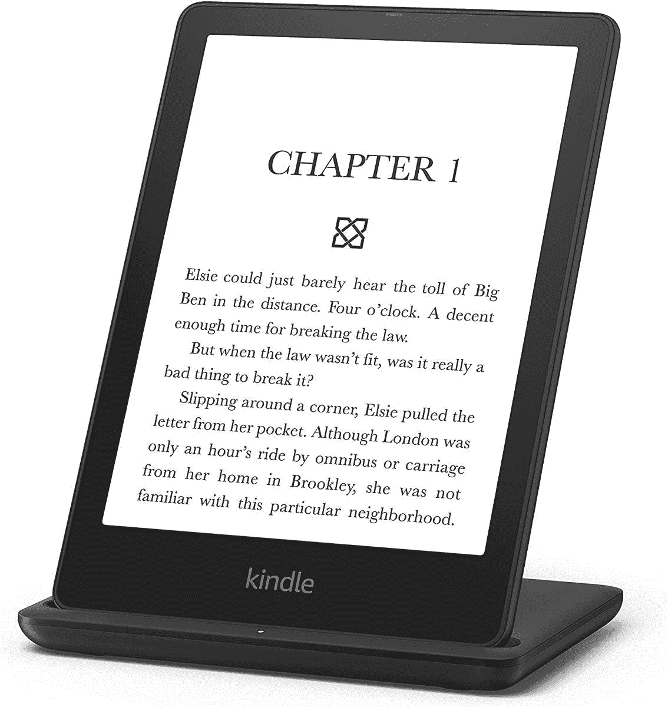

# 在这个黄金日以最低价格购买 Kindle Paperwhite 第 11 代和 Paperwhite 签名版

> 原文：<https://www.xda-developers.com/kindle-paperwhite-11th-gen-paperwhite-signature-edition-prime-day-deal/>

亚马逊的 [Kindle 电子阅读器](https://www.xda-developers.com/best-amazon-kindle-ereader/)是移动阅读的绝佳设备。虽然有几款 Kindles 可供选择，但 Paperwhite 可能是该系列中的最佳选择，因为它以合理的价格提供了功能丰富的体验。如果你一直想得到一个，现在是最好的时机。Paperwhite 第 11 代降至最低价。

容量为 8GB 的基本款 Paperwhite 通常零售价为 139.9 美元。但是今天，你只需花 94.99 美元就能买到，还能省下 45 美元。这个型号在锁屏上显示广告。如果你不想要那个，你得多花 20 美元。

Paperwhite 签名版也降到了今天的最低价。售价 134.99 美元，比原价低 55 美元。Signature Edition 打包了 32GB 的存储空间，并添加了无线充电支持，但除此之外，它的硬件与基础 Paperwhite 相同。

 <picture></picture> 

Amazon Kindle Paperwhite 11th Gen

##### 亚马逊 Kindle Paperwhite(第 11 代)

全新的 Kindle Paperwhite 第 11 代有一个 6.8 英寸的大电子墨水显示屏，USB-C 充电，电池寿命长达 10 周。

Kindle Paperwhite 第 11 代是 Kindle 产品线的最新成员，比前代产品有了一些重大改进，包括更大的显示屏、更快的性能和更长的电池寿命。你得到一个 6.8 英寸的电子墨水无眩光显示器，即使在阳光直射下也能保持可读性。新的 Paperwhite 第 11 代还提供了[暖光](https://www.xda-developers.com/how-to-enable-warm-light-amazon-kindle/)，这是以前 Kindle Oasis 独有的。性能也显著提高，亚马逊承诺将翻页速度提高 20%，并改善导航体验。更重要的是，新的 Paperwhite 抛弃了旧的 microUSB 端口，转而支持 USB-C 端口，这意味着你不必携带单独的电缆。另一个值得注意的改进是电池寿命，新型号有望在一次充电后持续十周。

 <picture></picture> 

Kindle Paperwhite Signature Edition

##### 亚马逊 Kindle Paperwhite 签名版(第 11 代)

Paperwhite 签名版包含 32GB 存储空间和无线充电支持

如果你在 Kindle Oasis 和 Paperwhite 之间犹豫不决，看看我们对这两款设备的[面对面比较](https://www.xda-developers.com/kindle-oasis-vs-kindle-paperwhite)。一定要看看白皮书的[最佳案例](https://www.xda-developers.com/best-amazon-kindle-paperwhite-cases/)。

寻找更多惊人的交易？看看我们为[亚马逊黄金日](https://www.xda-developers.com/amazon-prime-day/)挑选的热门商品。