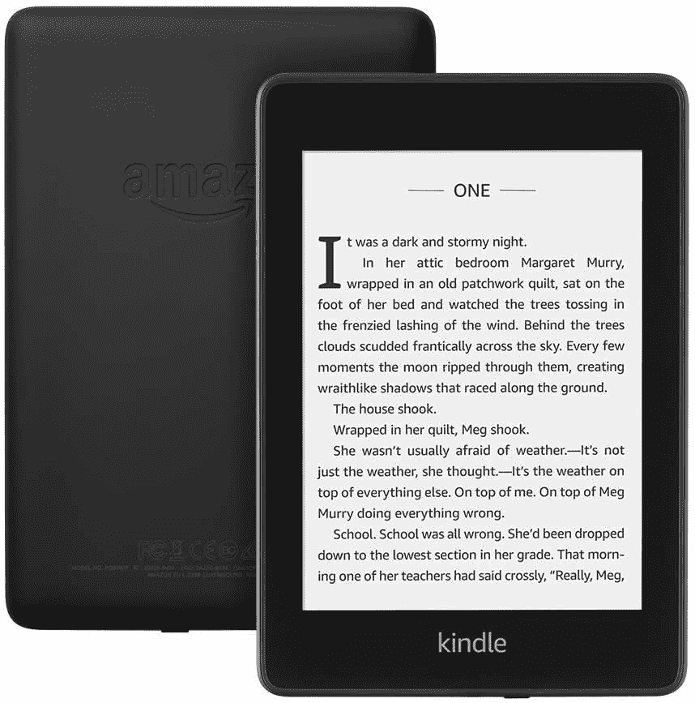

# 限时抢购 Kindle Paperwhite 电子阅读器，仅需 85 美元！

> 原文：<https://www.xda-developers.com/kindle-paperwhite-e-reader-black-friday-sale-amazon/>

# 在这个黑色星期五的交易中，限时抢购 Kindle Paperwhite 电子阅读器只需 85 美元

Kindle Paperwhite 现在在亚马逊上仅售 85 美元，在预算有限的情况下提供防水、清澈的阅读体验。

一些人认为专用电子阅读器已经过时了。随着[手机完全能够提供体面的阅读体验](https://www.xda-developers.com/black-friday-phone-deals/)，你可能会认为真的不再需要一个单独的电子阅读器了，对吗？好吧，有几个使用电子阅读器更好的案例:更好的电池寿命，以及拥有一个专用设备来显示你的书籍并允许你在必要时阅读它们。这个概念的先驱之一是 Kindle，而更新的 [Kindle](https://www.xda-developers.com/how-to-root-kindle/) Paperwhite 紧随这些基本型号的脚步，现在，你只需 85 美元就可以买到它，低于通常 130 美元的价格。

 <picture></picture> 

Kindle Paperwhite

##### 亚马逊 Kindle Paperwhite(第十代)

Kindle Paperwhite 提供了一个 6 英寸的电子墨水面板，像素密度为 300 ppi，还带有防水功能，无论走到哪里都可以获得坚固的阅读体验，当你考虑到 85 美元的低价位时，这就派上了用场。

Kindle Paperwhite 是一款最基本的设备，值得称赞的是，它将所有的要素都做对了。它有一个 6 英寸的大显示屏，像素密度为 300 ppi，比只有 167ppi 的基本型号 Kindle 有了明显的改进。这意味着文本看起来清晰生动。电子墨水显示屏是该设备超长电池寿命背后的秘密武器。以非常低的刷新率和单色为代价，这两者对电子阅读器来说并不重要，你可以获得比传统智能手机更持久的电池。它有一个相当基本的背光，适合夜间阅读。

这款设备还获得了 IPX8 防水认证，这意味着它是一款坚固的设备，应该能够处理你扔给它的任何东西。Kindle Paperwhite 是一个令人惊叹的交易，每个寻找专用电子阅读器的人都应该绝对考虑。它还拥有 8 GB 的存储空间，足以存储你最喜欢的所有书籍。它也明显优于售价 60 美元的普通 Kindle，因为它增加了防水和更好的显示屏等功能。