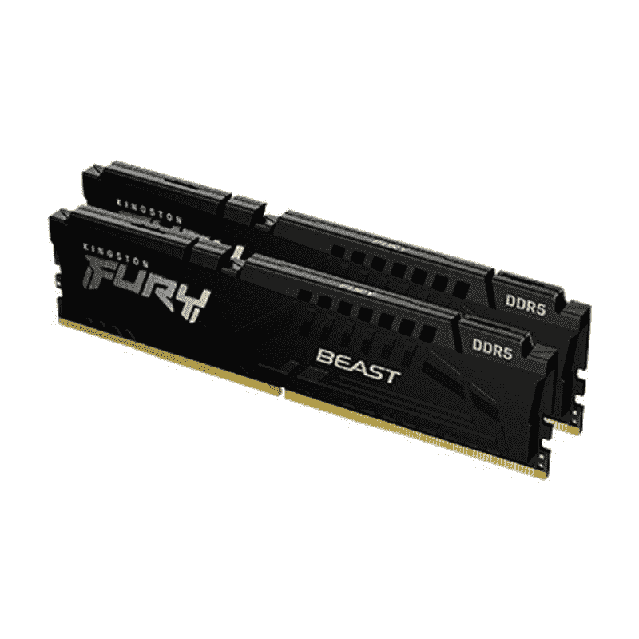

# 金士顿狂怒野兽 DDR5 32GB DDR5-4800 内存审查

> 原文：<https://www.xda-developers.com/kingston-fury-beast-ddr5-review/>

第 12 代英特尔酷睿处理器的到来也标志着 DDR5 内存套件进入市场。DDR4 RAM 套件并不慢，但 DDR5 内存为更高的性能水平打开了大门。当然，由于短缺和黄牛级别的定价，DDR5 的推出并不是最顺利的，但我们预计事情很快就会到位。届时，您将有一系列 DDR5 RAM 套件可供选择。

金士顿的 Fury Beast 32GB DDR5-4800 套件是那些希望升级到新内存标准的人的可用选项之一。今天，我们将看看来自 Kingston 的 4800MT/s 套件，其形式为 Fury Beast 32GB DDR5-4800 RAM。

**浏览此评论:**

## 规格:高速和高延迟组合

在我们开始之前，这里有一个快速浏览 Kingston Fury Beast 32GB DDR5 套件的规格:

| 

规格

 | 

Kingston Fury Beast DDR 5 32GB DDR 5-4800 内存

 |
| --- | --- |
| **容量** | 单个 DIMM:16 GB 2:32 GB 套件 |
| **频率** | 

*   4800 兆赫
*   5200 兆赫
*   5600 兆赫
*   6000 兆赫

 |
| **延迟时间** |  |
| **电压** |  |
| **工作温度** | 0 摄氏度至 85 摄氏度 |
| **尺寸** | 133.35 毫米 x 34.9 毫米 x 6.62 毫米 |

Fury Beast DDR5 套件与市面上的许多其他 [DDR5 套件](https://www.xda-developers.com/best-ddr5-ram/)不相上下。你可能会发现更多具有相对更高内存速度的高端套件，但我们认为 5200MT/s 标志着大多数用户从基本 DDR4 套件升级的最佳时机。

## 设计和构建质量:外表不那么浮华

如你所见，Kingston Fury Beast DDR5 模块有一个非常基本的设计。散热器看起来很光滑，有一个优质的完成，但它缺乏 RGB。它看起来与很久以前推出的 DDR4 的非 RGB 版本相同。对于许多人来说，缺少 RGB 可能是也可能不是一个交易破坏者，但我们预计这些 DIMMs 的 RGB 版本将在未来的某个时间到来。值得指出的是，这些是 48.25 毫米(1.34 英寸)高的薄型 DIMMs。它应该不会有任何重大问题，适合市场上大多数的 CPU 冷却器。

铝制散热器相当厚。它覆盖了内部所有的微米内存模块，也增加了棒的重量。棒上有明显的 Fury 和 DDR5 品牌，我们认为这为它们增添了更多的个性。关于设计本身没有太多其他可谈的，我们认为金士顿在坚持基本设计方面做得很好，有微妙的风格和黑暗的主题。

## 性能:足以击败 DDR4？

我们使用第 12 代英特尔酷睿 i9-12900k(T1)测试了 Kingston Fury Beast DDR5 套件，这是我们目前在市场上选择的[最佳 CPU(T3)。开箱即用的 Kingston Fury Beast 32GB DDR5 套件默认为 4800 MT/s，CAS 延迟为 38。正如您所看到的，它也运行在 1.1v，这也更符合市场上大量的 DDR5 模块。我们还使用了 Gigabyte Z690 Aorus Pro DDR5 主板，使用 XMP 配置文件将模块推高到 1.25v 的 5200MHz 非常容易。这也将内存计时提高到 40-40-40-80。](https://www.xda-developers.com/best-cpus/)

客观来看，DDR4 的联合电子设备工程委员会(JEDEC)标准最高可达 3200 MT/s，许多 CPU 都可以很好地适应这一速度。也就是说，我们认为 5200MT/s 甚至 4800MT/s 应该是那些从基线 DDR4-3600 套件或更低套件升级的人的良好起点。

正如我们在 DDR4 和 DDR5 RAM 比较中提到的，内存延迟的差异相当大，但这并不一定反映了现实世界的使用情况。具有较高延迟和较快速度的 RAM 模块往往与具有较低速度和相应低延迟的 RAM 模块不相上下。嗯，这正是我们在进行一些测试后能够得出的结果。

市场上 DDR5 内存套件的有限可用性使我们无法添加大量相关数据进行比较，但随着我们最终测试更多模块，我们将不断更新这些数据。

| 

基准

 | 

Kingston Fury beast 32 GB(2x 16)DDR 5-4800 C38

 | 

Kingston Fury beast 32gb(2x 16)DDR 5-5200 C40

 | 

阿达塔 XPG GAMMIX d 3032 GB(2x 16)DDR 4-3600 C18

 |
| --- | --- | --- | --- |
| **PCMark 10(越高越好)** | 12,067 | 12,145 | 11,628 |
| **Cinebench R23 - Multi(越高越好)** | 27,127 | 27,086 | 27,140 |
| **Blender - BMW(越低越好)** | 88 | 87 | 88 |
| **电晕 1.3 - RT** **(越低越好)** | 54 | 54 | 54 |
| **手刹 x264，。mkv 到. mp4(越低越好)** | 126 | 123 | 131 |
| **手刹 x265，。mkv to .mp4** **(越低越好)** | 284 | 283 | 291 |
| **7-Zip 压缩(越高越好)** | 123,656 | 126,203 | 89,657 |

正如您所见，C40 的内存延迟较高，这在实际使用中并不是什么大问题。相对较高的内存速度弥补了这一点，这表明 RAM 模块并不多。在我们决定称之为稳定性问题之前，我们还能够进一步超频模块，以大约 1.350v 的功率达到 5400MT/s。尽管如此，这些数字仍然令人印象深刻。一个相当的 DDR4-3600 模块将达到 1.45v，以接近 DDR4-4000 的速度，更不用说 5200 了。

我们在这里看到的本质上只是一个边际升级。只要你调整内存模块运行在广告的设置，你应该能够得到一个体面的性能。这足以保证升级您现有的 [DDR4 内存](https://www.xda-developers.com/best-ddr4-ram/)模块吗？那要看你现在用的是哪种内存模块了。

## Kingston Fury Beast DDR 5 32GB DDR 5-4800 RAM:最终想法

DDR5 RAM 仍处于初级阶段。我们在过去说过很多次，现在很明显，我们在野外有这些模块。如果你已经有了上一代的高速 RAM 套件，那么性能的提升，至少对于现在可用的一些主流 DDR5 套件来说，并不显著。也就是说，我们预计未来会出现更好的 DDR5 RAM 套件，并有更大的改进。事实上，我们已经看到一些速度高达 8000MT/s 的 DDR5 套件，我们认为这将显示出比现有套件的一些可测量的升级。

除非你执意购买市场上最好的产品，或者你口袋里有多余的钱，否则我们认为最好还是继续使用你已经拥有的 DDR4 模块。即使你正在建造一台新电脑，这也是事实，因为市场上有兼容 DDR4 的 [LGA 1700 主板](https://www.xda-developers.com/best-lga-1700-motherboard/)供你崭新的[阿尔德莱克](https://www.xda-developers.com/intel-12th-gen-alder-lake/)建造。从面向未来的角度来看，DDR5 内存是值得考虑的，但预计会花很多钱来购买我们认为不是 DDR4 的实质性升级，至少目前是这样。

 <picture></picture> 

KINGSTON FURY BEAST 32GB DDR5-4800 KIT

##### 金士顿狂怒野兽 32GB DDR5-4800

Kingston Fury Beast DDR5 RAM 是首批上市的消费级 DDR5 内存模块之一，正好赶上了 Alder Lake 的发布。