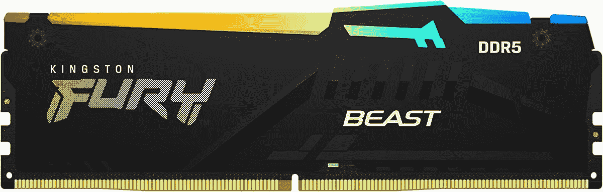

# 通过亚马逊的 DDR5 交易，为英特尔第 13 代产品做好准备

> 原文：<https://www.xda-developers.com/kingston-fury-prime-early-access-deal/>

# 通过这一优惠的早期访问交易，为您的新英特尔第 13 代产品购买 DDR5 RAM

为您的全新英特尔第 13 代电脑做好准备，在快速 Kingston Fury DDR5 上享受疯狂优惠。哦，它有 RGB，所以它是必须买的。

距离英特尔第 13 代 CPU 发布还有一周多一点的时间，亚马逊正在进行大减价。那么，还有什么比现在更好的时机来收集您需要的相关硬件，以构建一台新的游戏 PC 呢？特别是，这个关于 Kingston Fury DDR5 RAM 的交易对于一个将在未来几年内建立的怪物来说绝对是完美的。它比先前的最低价低了将近 100 美元，所以这是一笔大买卖。

Kingston Fury，以前被称为 HyperX 的艺术家，是你可以得到的一些顶级 RAM，这个 64GB 的 Prime 早期访问折扣太好了，不能错过。当然，如果你正在建造一台 [AMD 锐龙 7000](https://www.xda-developers.com/amd-ryzen-7000/) PC，你也可以利用这个优势。但是，由于英特尔第 13 代被评定为支持 DDR5-5600，而这正是它所支持的，所以它看起来非常适合从您的新系统中获得最大性能。

这款 64GB 的套件带有一对 32GB 的记忆棒，为您将来进一步升级到 128GB 内存留出了空间。有可能你甚至现在都不需要 64GB，但是永远不要说不。如果您对游戏之外的工作负载感兴趣，您可能很快就会发现它的用途。它支持 XMP 3.0，一键超频设置。或者可以 4800 MT/s 即插即用。

如果有任何疑问，游戏玩家是目标，沿散热器的 RGB 条是一个死的赠品。RAM 并不是最令人兴奋的东西，所以没有什么能阻止你稍微修饰一下它。Kingston Fury 上的 RGB 可以坐在那里做自己的事情，也可以与您已建立的 RGB 生态系统同步。ASUS、Gigabyte、MSI 和 ASRock RGB 系统都受支持，因此您的内存可以与系统的其余部分完美协调地闪烁。

 <picture></picture> 

Kingston Fury DDR5-5600 64GB

##### 金士顿 Fury DDR5-5600 64GB

全新第 13 代英特尔架构的完美补充，帮助您尽可能提高性能。