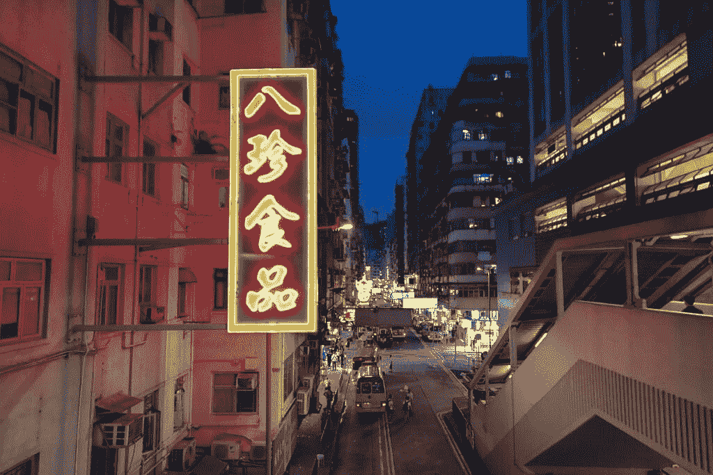
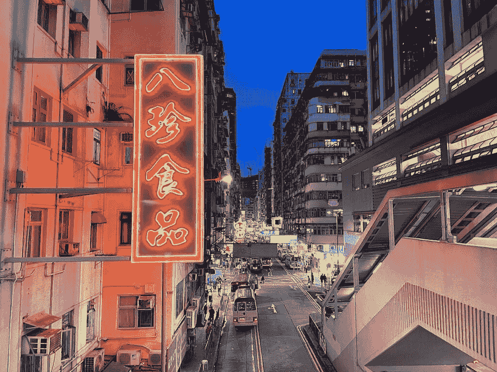

# 徕卡·莱茨电话 1 实践:品牌有什么意义吗？

> 原文：<https://www.xda-developers.com/leica-leitz-phone-1-preview/>

在将品牌授权给华为顶级手机几年后，标志性的德国相机制造商徕卡决定发布自己的手机。总之，算是吧。徕卡·莱茨手机 1 实际上只是一个更名的[夏普 Aquos R6](https://www.xda-developers.com/sharp-aquos-r6-hands-on/) ，但它确实采用了徕卡设计的全新机身，看起来非常引人注目。

除此之外，Leitz Phone 1 的内部结构与 Aquos R6 完全相同，软件也基本相同，只有两处小的改动。这款手机目前只在日本销售，但我们设法从香港进口商[三一电子](https://www.facebook.com/trinityelectronic)那里借了一部。

### 徕卡利兹电话 1:规格。点击/单击以显示。

## 徕卡·利兹电话 1:规格

| 

规格

 | 

徕卡·利兹电话 1

 |
| --- | --- |
| **构建** | 

*   大猩猩玻璃正面和背面，铝边。

 |
| **尺寸&重量** |  |
| **显示** | 

*   6.67 英寸专业 IGZO 有机发光二极管
*   2730 x 1260 像素
*   2000 尼特峰值亮度
*   240Hz 峰值刷新率
*   可变刷新率支持(1-240 赫兹)
*   2000 万:1 对比度
*   直接热轧制

 |
| **SoC** | 高通骁龙 888 |
| **闸板&存放** | 

*   12GB LPDDR5
*   128GB UFS 3.1
    *   microSD 卡插槽(最高 1TB)

 |
| **电池&充电** |  |
| **安全** | 高通 3D Sonic Max 显示屏下指纹传感器 |
| **后置摄像头** | 

*   20MP 1 英寸 CMOS 传感器
*   7 元 f/1.9 徕卡 Summicron 镜头
*   19 毫米等效焦距
*   ToF 传感器
*   LED 闪光灯

 |
| **前置摄像头** | 1260 万英镑 |
| **端口** | USB 类型-C |
| **音频** | 立体声扬声器 |
| **连通性** |  |
| **软件** | 安卓 11 |

## 徕卡·利兹手机 1:拆箱、硬件和设计

徕卡·莱茨手机 1 采用了低调而简单的包装。盒子是全黑的，只有很少的标志——只有盒子顶部中间的徕卡标志，侧面是手机的名称，背面是基本的监管标志。

打开顶部，你会马上收到电话，面朝上。拿出手机，首先映入眼帘的肯定是覆盖在相机模块上的铝制镜头盖。

镜头盖通过磁力吸附在模块上，只需轻轻一拉即可取下。

在手机和纸板支架的下面是一个辅助纸箱，里面装有 SIM 卡弹出工具、数据传输加密狗、说明书和橡胶套，橡胶套紧贴着手机的整个背面和侧面。

值得注意的是，包装不包括充电砖或充电电缆。考虑到这款手机的定价相当于 1700 美元的日元——这令人失望。

我个人认为手机看起来很华丽，握起来很舒服。然而，我并不喜欢背面玻璃面板上使用的涂层，这种涂层会让背面感觉抓地力，但却是那种塑料般的橡胶般的感觉。但是包裹着手机的铝制机箱感觉优质而坚固，我喜欢手机的顶部和底部是平的，所以 Leitz Phone 1 可以独立站立。

在机箱的右侧是音量摇杆和一个电源按钮，以及一个专用的谷歌助手按钮，不能重新映射。

相机模块确实会稍微突出手机，但没有小米或三星的 Ultra 手机突出那么多。然而，镜头盖放在相机上时，确实会突出很多。

下一节我会更详细地介绍相机，让我们先来谈谈屏幕。这里的 6.67 英寸显示器是 IGZO OLED 面板，刷新率可变，最低可达 1Hz，最高可达 240Hz。正如我在测试夏普 Aquos R6 时已经说过的，屏幕看起来很棒，动画确实非常流畅。然而，我不能说我注意到像 Galaxy S21 Ultra 的 120Hz 屏幕这样的快速面板有任何优越的流动性。

另一个值得注意的新硬件是显示指纹扫描仪，它使用了高通的 3D Sonic Max 解决方案。它本质上是过去三年三星旗舰平板手机所用技术的改进版本。扫描面积更大，速度更快。特别是，手机支持两个手指认证，这意味着需要两个不同的指纹来解锁手机，以增加安全性。

引擎盖下是骁龙 888，有 12GB 的内存和 256GB 的内部存储(只有一种配置)，和 5000 毫安时的电池。Leitz Phone 1 的防水等级为 IP68。总的来说，所有的优质旗舰组件，除了它缺乏无线充电。

## 徕卡·利兹电话 1:软件

Leitz Phone 1 运行 Android 11，顶部有一个未命名的软件皮肤。它基本上与夏普 Aquos R6 的皮肤相同，这意味着它有一个基本干净的 Android 外观，有一些小的软件添加，如通过单个应用程序设置刷新率的能力(夏普/徕卡称之为“高速显示”)，或长按电源按钮时启动应用程序。

所有这些软件功能都已经在夏普 Aquos R6 上看到了，所以徕卡·雷茨手机 1 实际上只带来了两个自己的功能。第一个是主屏幕上的徕卡小工具，它可以循环显示专业人士用徕卡相机拍摄的精选照片，第二个是相机应用程序中的黑白拍摄模式，我将在下一节中解释。

## 徕卡·利兹手机 1:相机和性能

Leitz Phone 1 的主要卖点是它的主摄像头，一个 20MP，f/1.9 的摄像头，带有 1 英寸的传感器。拥有这样一个更大的图像传感器意味着更浅的景深，所以帧内有物体或主题的照片通常会以散景的形式与背景有更多的深度分离。

你甚至不必使用肖像模式；只要将相机对准某物或某人，然后拍摄，通常会在该物或该人周围出现一个美学上令人愉悦的模糊。

如果你与传感器相对较小的手机(如 iPhone 12 Pro Max)相比，照片中额外的深度真的很明显。

然而，正如我在夏普 Aquos R6 的亲身体验中提到的，夏普/徕卡的相机硬件可能是顶尖的，但该公司(companies？)缺乏苹果或其他主流安卓品牌的软件处理能力。例如，苹果或小米将使用 HDR 等计算摄影技术来处理恶劣的拍摄条件，如逆光拍摄。夏普/徕卡的软件也不太适应。在 iPhone 12 Pro Max 或小米 Mi 11 Ultra 拍摄的照片上，颜色往往更流行，而在徕卡·莱茨手机 1 上，颜色看起来有点柔和——因为苹果/三星使用软件 smarts 处理照片，使其看起来更动态(有时以牺牲真实感为代价)。

下面这张照片也许是最好的例子。这是夏普 Aquos R6 的一张照片(不是徕卡·莱兹手机 1，但两款手机都有相同的硬件和软件，所以它们几乎可以互换)。

 <picture></picture> 

Sharp Aquos R6

这是来自 iPhone 12 Pro 的同一张照片。苹果的镜头看起来更有动感；它有更生动的色彩和更好的各种曝光平衡，但它看起来确实处理过。

 <picture></picture> 

iPhone 12 Pro

另一个很好的例子在下面的集合中。我是在逆光拍摄的:小米的软件“修复”了光线，产生了均匀平衡的 HDR 镜头，而徕卡的图像却让阴影区域完全沉浸在黑暗中。我觉得我还是比较喜欢 Leitz Phone 1 的镜头，因为它保留了当时现场的情绪和氛围。

简而言之，这是徕卡·莱茨手机 1 的摄像头。它不能像主流手机那样处理困难的拍摄条件，但它有更多的自然，有机的氛围——自然的散景和更真实的颜色。

这也是前面提到的新增软件的用武之地。Leitz Phone 1 在相机应用程序中有一个名为“Leitz Looks”的新拍摄模式，它基本上是一个黑白滤镜。这听起来很普通，但徕卡的工程师知道如何唤起怀旧情绪，我用“莱茨外观”抓拍的照片确实有自己独特的特征。

## 徕卡·利兹电话 1:结论

徕卡·莱茨手机 1 包含一些尖端的硬件和漂亮的设计，但对于将 iPhone 12 Pro Max 与 Galaxy S21 Ultra 或小米 Mi 11 Ultra 进行比较的人来说，1700 美元的价格太高了，所有这些产品的价格都更低，摄像头整体功能更强。然而，我认为 Leitz Phone 1 对徕卡粉丝或那些想尝试新事物的人有很大的吸引力。与夏普 Aquos R6 相比，Leitz Phone 1 更具个性。

**[夏普 Aquos R6/徕卡莱茨手机 1 论坛](https://forum.xda-developers.com/f/sharp-aquos-r6.12299/)**