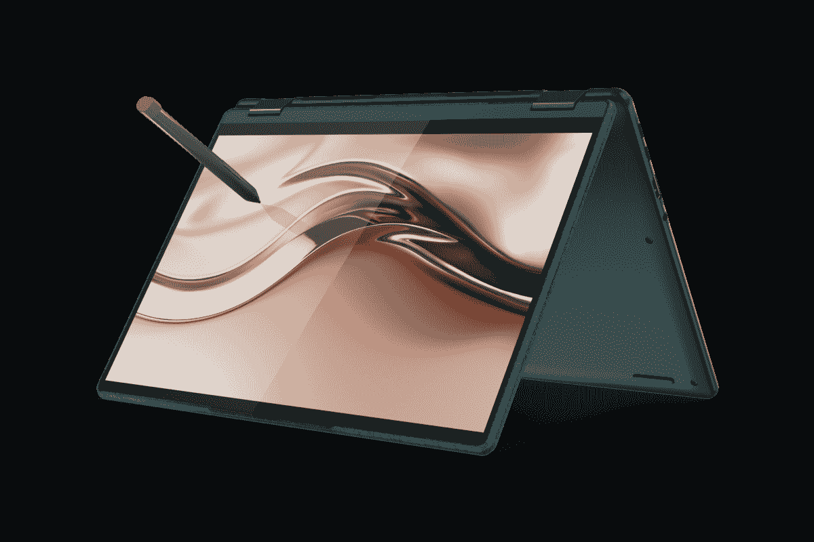
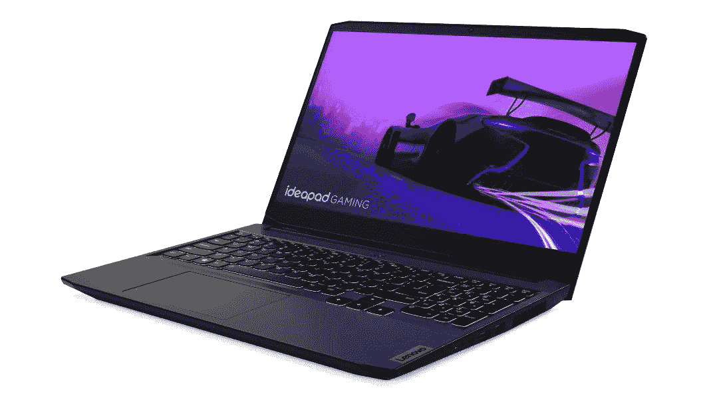

# 联想的返校优惠包括联想 Yoga 6 的 25%折扣

> 原文：<https://www.xda-developers.com/lenovo-back-to-school-deals-25-off-lenovo-yoga-6/>

对我们许多人来说，夏天似乎才刚刚开始，但联想已经通过其笔记本电脑的一些早期返校交易走在了前面。这些交易包括一批新旧笔记本电脑，但如果你正在寻找一些特定的东西，我们选择了几个亮点。

其中最有趣的交易之一是联想 ThinkBook 14 Gen 4。这款笔记本之所以引人注目，是因为它是 ThinkBook 14 的最新型号，已经搭载了英特尔的第 12 代处理器。这款特定型号配备了英特尔酷睿 i5-1235U，一个 10 核 12 线程的 CPU，以及 4.4GHz 的高性能内核。您还可以获得 16GB 的 DDR4 内存和 512GB 的固态硬盘。它还包括一个 Windows 11 Pro 许可证。现在，如果你使用优惠券代码 GEAREDUP2THINK，它的价格是 40%，仅为 896.40 美元，这对这些规格来说是一个很好的价格。

*   <picture></picture>

    联想 Yoga 6

    ##### 联想 Yoga 6

    联想 Yoga 6 对于那些买不起 1000 美元以上笔记本电脑的人来说，是一款绝佳的敞篷车。由于持续的折扣，顶级型号仅售 779.99 美元，这是一笔令人难以置信的交易。

*   <picture></picture>

    联想 idea pad Gaming 3i(360 美元起)

    ##### 联想 IdeaPad Gaming 3i

    联想 IdeaPag Gaming 3i 是进入游戏笔记本电脑的绝佳入口，配有 35W 处理器和独立 Nvidia RTX 显卡。它还有一个 120 赫兹的显示屏。使用优惠券代码 IDEAOFFERS，您可以花费 819.99 美元获得它。

虽然这是你能得到的最大折扣之一，但还有一些折扣绝对值得你关注。例如，我们评测并喜爱的最新联想 Yoga 6[，其各种配置均有 25%的折扣。你可以只花 779.99 美元买到配备 AMD 锐龙 7、16GB 内存和 512GB 固态硬盘的顶级型号，这对这款设备来说是一个非常棒的价格。这是一款配有 16:10 显示屏和 1080p 网络摄像头的敞篷车，性能稳定，因此我们绝对推荐它。你也可以](https://www.xda-developers.com/lenovo-yoga-6-gen-7-review/)[看看现在在售的所有瑜伽模特](https://shop-links.co/1780434276793199554?u1=612ebc4b-c192-4c46-849f-bd9f46d213e7)。

如果你更喜欢游戏，联想 IdeaPad Gaming 3i 是一款坚固的入门级游戏笔记本电脑，配备英特尔酷睿 i7-11370H 和 Nvidia GeForce RTX 3050 Ti GPU。它有 8GB 的内存和 1TB 的硬盘加上 256GB 的固态硬盘，你可以优惠 360 美元，使用优惠券代码 IDEAOFFERS 只需 819.99 美元。你可以看看上面的这些。

如果这些都没有引起你的注意，联想的网站上还有很多返校交易。如果您对其中任何一个感兴趣，我们将它们归纳如下:

*   [联想 IdeaPad 3 AMD (AMD 锐龙 5 5625U，8GB 内存，512GB 固态硬盘)-549.99 美元](https://shop-links.co/1780434276722958023?u1=030e236e-5c8d-43a1-b28c-f6d1a90bcd8c)，优惠券代码 IDEAPADGEARUP(通常为 779.99 美元)
*   [联想 IdeaPad 1i(英特尔赛扬 N5100，4GB 内存，128 GB eMMC)-249.99 美元，优惠券代码为 IDEAPADGEARUP(通常为 374.99 美元)](https://shop-links.co/1780434277802055316?u1=28eebb43-d6ff-4998-b30b-898aa9270f4a)
*   [联想 IdeaPad Flex 3 (AMD 速龙 3050e，4GB 内存，64GB eMMC)-274.99 美元，优惠券代码为 IDEAOFFERS(通常为 379.99 美元)](https://shop-links.co/1780434277349752361?u1=a13d3f8b-1202-416d-b062-07352987093c)
*   [联想 Chromebook 5i(英特尔奔腾金色 7505，4GB 内存，128GB 固态硬盘)——269.99 美元](https://shop-links.co/1780434279147615767?u1=f8304713-855a-48a6-be3b-407b3dff7acd)，优惠券代码 IDEAOFFERS(通常为 439.99 美元)
*   [联想 IdeaCentre AIO 5 AMD (AMD 锐龙 7 5700U，16GB 内存，1TB 硬盘，256GB 固态硬盘)-919.99 美元](https://shop-links.co/1780434278724148642?u1=6e950e00-61e0-48f7-b695-02f85f70c222)，优惠券代码 IDEA5DT(通常为 989.99 美元)
*   [联想 ThinkCentre M75s Gen 2 (AMD 锐龙 3 Pro 5350G，16GB 内存，128GB 固态硬盘)——499 美元](https://shop-links.co/1780434279647934258?u1=80ba51fb-7ea3-47aa-85b0-0c7241b46096)，优惠券代码 THINKSFF(通常为 1129 美元)

除了所有这些交易之外，联想还为学生提供了一些额外的优惠，如 PC 最高可优惠 100 美元，代码为 BTS2022 的产品可额外优惠 5%。不过，您需要使用 ID.me 验证您的身份才能使用此功能。无论如何，这里都有一些不错的返校交易，ThinkBook 14 Gen 4 和联想 Yoga 6 是我们个人的亮点。你一定会在这里找到你喜欢的东西。