# 联想的黑色星期五交易包括 ThinkPads、Chromebooks 等

> 原文：<https://www.xda-developers.com/lenovo-black-friday-deals/>

黑色星期五正式到来了，随之而来的是我们今年见过的最大折扣。联想没有错过这一乐趣，它正在各种笔记本电脑和其他设备上进行一些非常划算的交易。这包括联想 ThinkPads、Chromebooks 和游戏笔记本电脑，所有这些都更有黑色星期五交易的诱惑力。

这里有很多你可以利用的好交易，你可以在下面查看。

## 联想黑色星期五商务电脑促销

商用笔记本电脑是联想的面包和黄油，但它们在 MSRP 可能有点贵。令人欣慰的是，有一些很好的交易让它们变得更容易获得。

 <picture>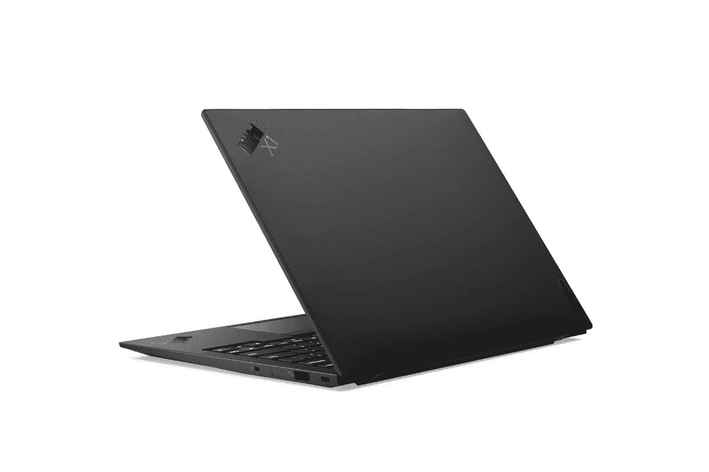</picture> 

Lenovo ThinkPad X1 Carbon

##### 联想 ThinkPad X1 Carbon Gen 9

搭载英特尔酷睿 i5-1135G7、8GB 内存和 256GB 固态硬盘。它有一个 14 英寸的全高清显示屏和 Windows Hello 支持。

 <picture></picture> 

Lenovo ThinkBook 13s Gen 3

##### 联想 ThinkBook 13s Gen 2

配备英特尔酷睿 i7-1165G7 处理器、16GB 内存和 512GB 固态硬盘。包括四核高清显示屏和指纹识别器。

 <picture>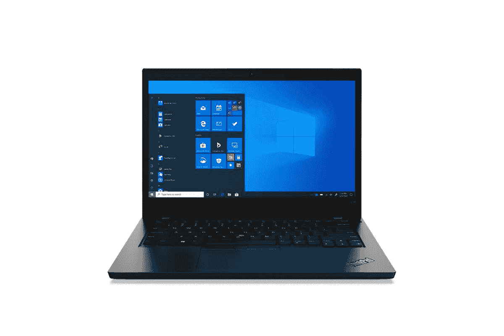</picture> 

Lenovo ThinkPad L14 Gen 2 Intel ($200 off)

##### 联想 ThinkPad L14 Gen 2

搭载英特尔酷睿 i3-1115G4 处理器，4GB 内存和 256GB 固态硬盘。它有 14 英寸全高清显示屏和 720p 网络摄像头。

 <picture>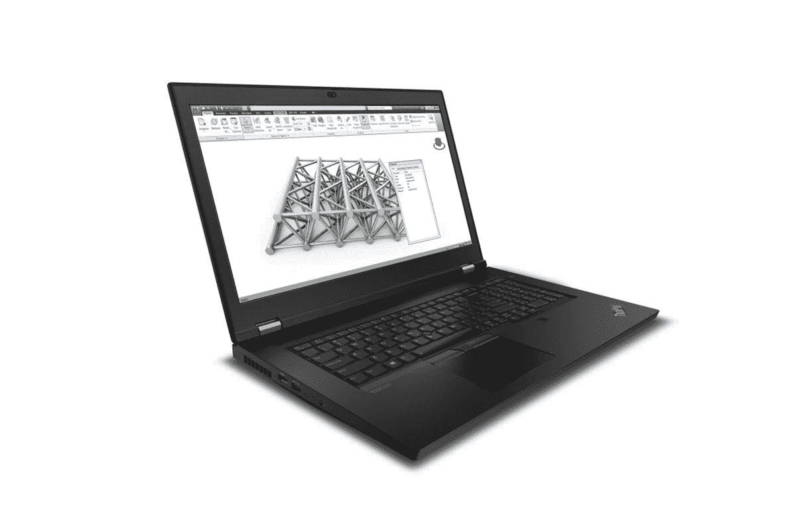</picture> 

Lenovo ThinkPad P17 Gen 2 ($527 off)

##### 联想 ThinkPad P17 Gen 2

搭载英特尔酷睿 i8-11950H 处理器、英伟达 RTX A3000 显卡、32GB 内存和 1TB 固态硬盘。包括 4K+显示屏和 Windows Hello 支持。

 <picture>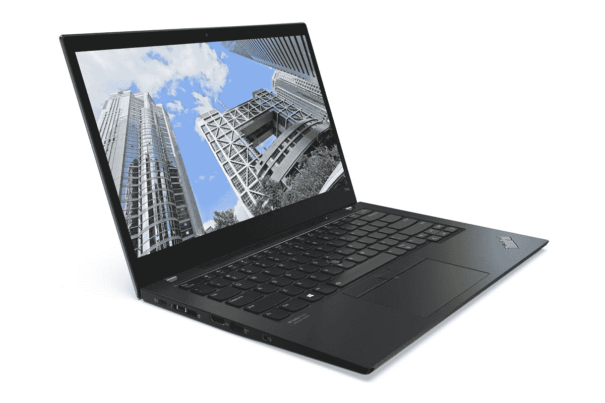</picture> 

Lenovo ThinkPad T14s Gen 2 ($307 off)

##### 联想 ThinkPad T14s Gen 2

配备 AMD 锐龙 PRO 5 5650U 处理器、16GB 内存和 512GB 固态硬盘:包括全高清触摸屏和指纹读取器。

 <picture>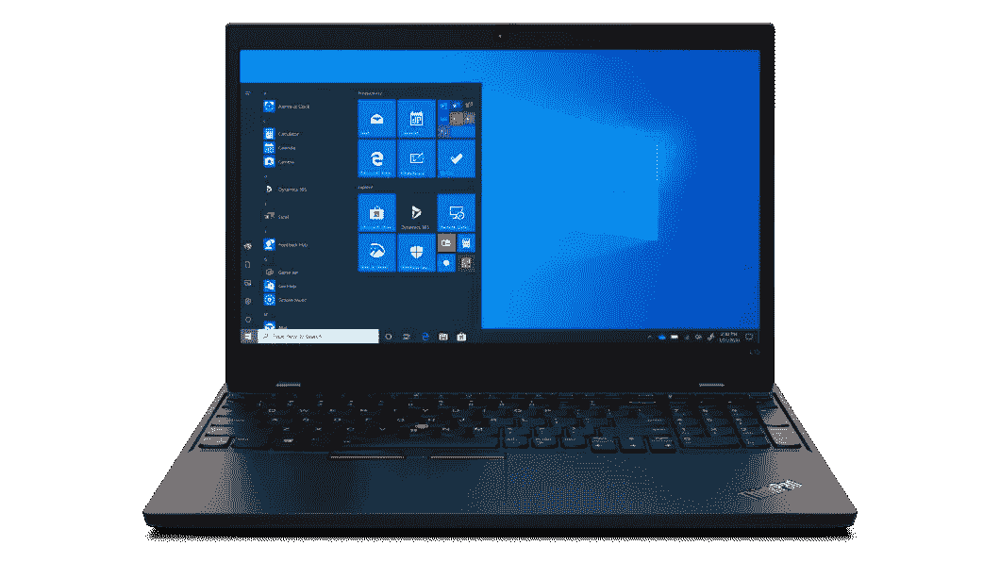</picture> 

Lenovo ThinkPad L15 Gen 2 ($287 off)

##### 联想 ThinkPad L15 Gen 2

搭载英特尔酷睿 i7-1165 G7、16GB 内存和 512GB 固态硬盘。包括全高清显示屏和指纹识别器。

## 联想黑色星期五 Chromebooks 打折

如果你对 Chromebook 更感兴趣，联想也在提供一些优惠，包括将 10e Chromebook 平板电脑的价格降至 100 美元以下。

 <picture>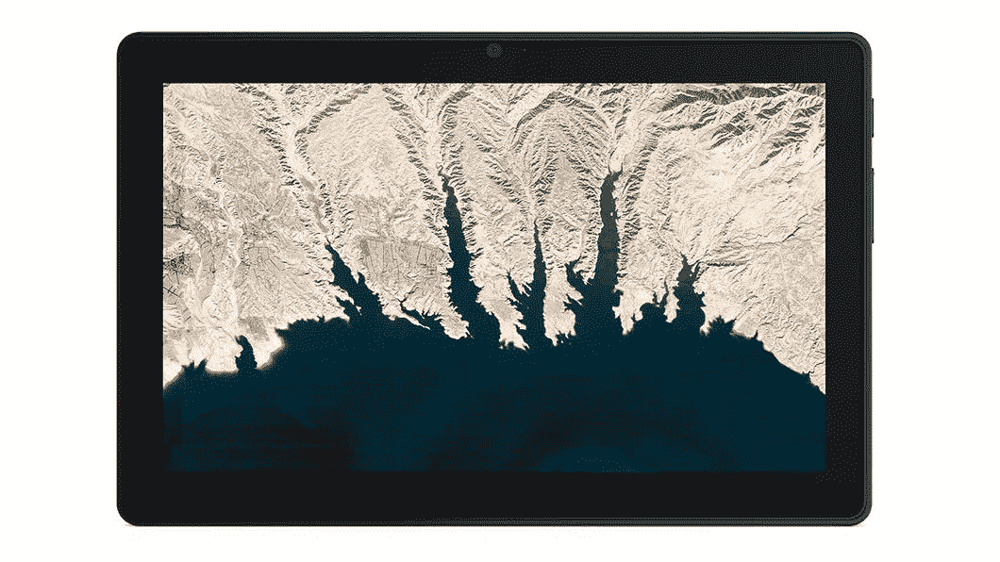</picture> 

Lenovo 10e Chromebook ($235 off)

##### 联想 Chromebook 10e

搭载联发科 MT8183 处理器，4GB 内存，32GB eMMC 存储。它有一个 10 英寸的全高清显示屏和前后摄像头。

 <picture></picture> 

Lenovo Chromebook Duet 3 ($70 off)

##### 联想 Chromebook Duet 3

搭载联发科 P60T 处理器，4GB 内存，64GB eMMC 存储。包括一个全高清+屏幕和两个摄像头，以及一个可拆卸键盘。

 <picture></picture> 

Lenovo Chromebook Duet 3 ($70 off)

##### 联想 Chromebook 3

由英特尔 Celereon N4020 处理器、4GB 内存和 32GB eMMC 存储提供支持。包括 14 英寸高清显示屏和高清网络摄像头。

 <picture>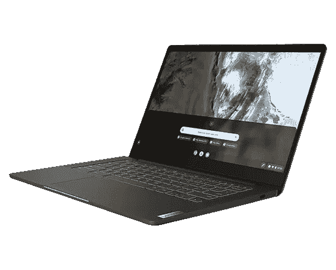</picture> 

Lenovo Chromebook 5i ($140 off)

##### 联想 Chromebook 5i

由英特尔奔腾黄金 7505、4GB 内存和 128GB 固态硬盘驱动。包括 14 英寸全高清显示屏和高清网络摄像头。

如果你对联想 Chromebook Duet 3 感兴趣，还有一个带有源手写笔的版本，从美国东部时间中午 12 点开始，将有类似的 70 美元折扣。你可以在联想的网站上以 249.99 美元的价格购买。

## 联想黑色星期五游戏优惠

寻找你的下一个游戏装备？联想的黑色星期五交易包括一些很棒的游戏笔记本电脑和台式机，一定会给你带来很好的体验。以下是最划算的交易:

 <picture>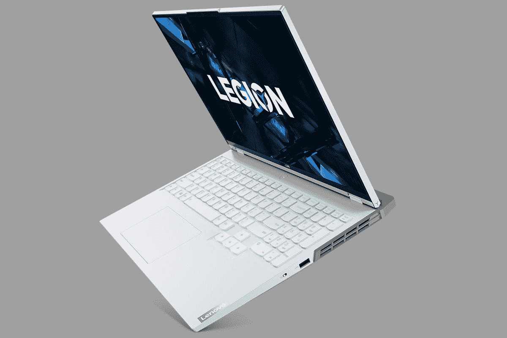</picture> 

Lenovo Legion 5i Pro ($400 off)

##### 联想军团 5i Pro

由英特尔酷睿 i7-11800H、NVIDIA GeForce RTX 3060、16GB 内存和 2TB 固态硬盘提供支持。包括 16 英寸四核高清显示屏，刷新率为 165 赫兹，支持 HDR 400。

 <picture>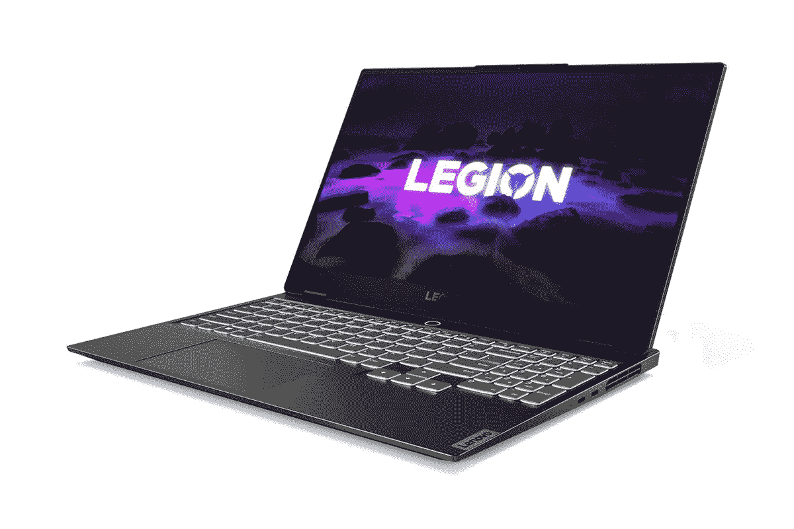</picture> 

Lenovo Legion Slim 7 ($300 off)

##### 联想军团 Slim 7

由 AMD 锐龙 7 5800H，NVIDIA GeForce RTX 3060，16GB 的内存和 2TB 的固态硬盘。包括 15.6 英寸显示屏，刷新率为 165HZ，支持 G-Sync。

 <picture></picture> 

Lenovo Legion 5 Pro ($380 off)

##### 联想军团 5 Pro

由 AMD 锐龙 7 5800H、NVIDIA GeForce RTX 3060、16GB 内存和 2TB 固态硬盘提供支持。包括 16 英寸四核高清显示屏，刷新率为 165 赫兹，支持 G-Sync 和 HDR 400。

 <picture></picture> 

Lenovo legion Tower 5i ($300 off)

##### 联想军团大厦 5i

由英特尔酷睿 i7-11700、NVIDIA GeForce GTX 1660 Super、8GB 内存和 512GB 固态硬盘提供支持。包括 Wi-Fi 支持和 RGB 照明。

 <picture>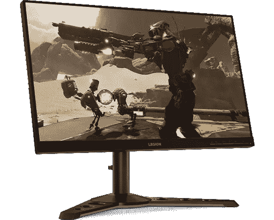</picture> 

Lenovo Legion Y25-25 Gaming Monitor ($40 off)

##### 联想军团 Y25-25 游戏显示器

兼容 G-Sync 的全高清 240Hz IPS 游戏显示器。包括 HDMI、DisplayPort 和多个 USB 下游端口。

## 联想黑色星期五在主流电脑上打折

如果您正在寻找一台日常使用的 Windows PC，无论是用于学校、工作还是只是浏览网页，这些都是您现在可以利用的优惠。其中一些没有最新的规格，但它们仍然是日常使用的可靠设备。

 <picture></picture> 

Lenovo IdeaPad Flex 5 ($150 off)

##### 联想 IdeaPad Flex 5

由英特尔酷睿 i3-1115G4、8GB 内存和 256GB 固态硬盘提供支持:包括全高清触摸屏和指纹读取器。

 <picture>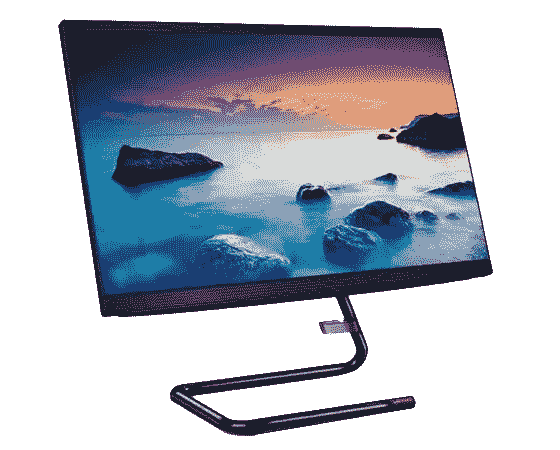</picture> 

Lenovo IdeaCentre AiO 3i 22 ($105 off)

##### 联想 IdeaCentre AiO 3i 22

搭载英特尔酷睿 i3-10100T，8GB 内存，128GB 固态硬盘和 1TB 硬盘。它有一个 21.5 英寸全高清触摸屏和高清网络摄像头。

 <picture>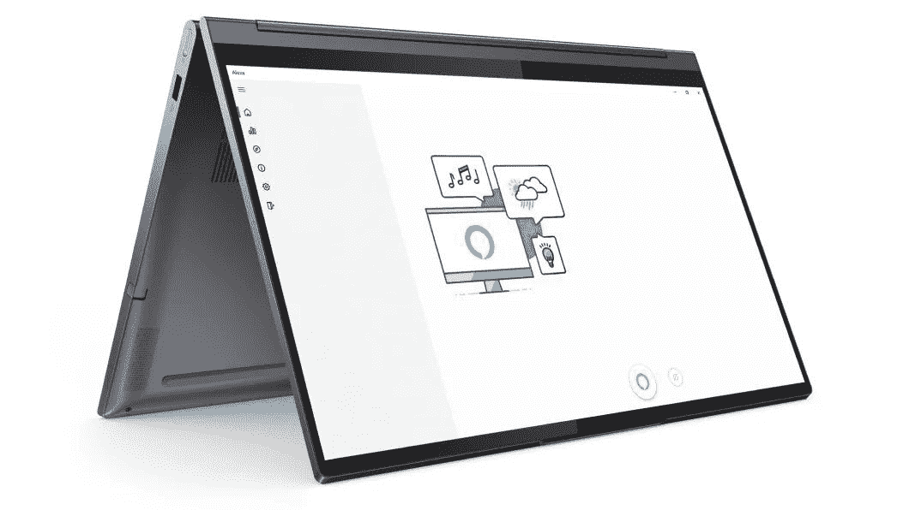</picture> 

Lenovo Yoga 9i ($400 off)

##### 联想 Yoga 9i

由英特尔酷睿 i7-10750H、NVIDIA GeForce 1650 Ti 显卡、12GB 内存和 512GB 固态硬盘提供支持。包括 15.6 英寸全高清触摸屏和指纹读取器。

## 联想在外设上的交易

最后，如果您正在为您的电脑寻找新的外设，联想也有一些优惠。以下是一些最好的例子:

 <picture>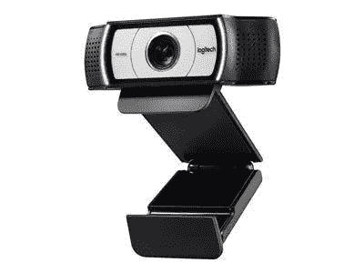</picture> 

Logitech C930e Webcam ($20 off)

##### 罗技 C930e 网络摄像头

内置环形灯的全高清网络摄像头。包括自动对焦、平移、倾斜和 4 倍变焦。适用于 Chromebooks。

 <picture>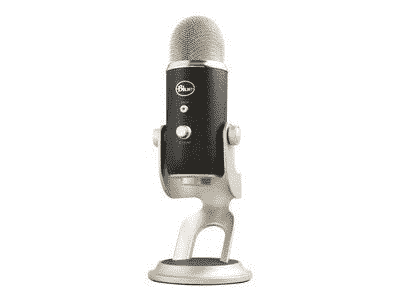</picture> 

Blue Yeti Pro USB microphone ($100 off)

##### 蓝色雪人 Pro

优质 streamingg 麦克风，具有三振膜阵列、增益控制和 24 位/192KHz 质量

 <picture></picture> 

C2G USB-C Mini Dock ($52 off)

##### C2G USB-C 迷你坞站

带有 HDMII、USB Type-A、以太网和 100W 充电的 USB Type-C 坞站。

如果你想了解联想黑色星期五的其他交易，可以查看[这一页](https://shop-links.co/link/?exclusive=1&publisher_slug=xda&article_name=Lenovo%27s+Black+Friday+deals+include+ThinkPads%2C+Chromebooks%2C+and+more&article_url=https%3A%2F%2Fwww.xda-developers.com%2Flenovo-black-friday-deals%2F&u1=UUxdaUeUpU6736&url=https%3A%2F%2Fwww.lenovo.com%2Fus%2Fen%2Fd%2Fdeals%2Fdoorbusters%2F%3Ftabkey%3DBlack%2BFriday%2BDoorbusters)。请注意，该页面上的一些交易，包括我们文章中列出的交易，将在一天内上线，因此它们可能不会立即可用。

如果你现在想要最好的交易，查看我们的[黑色星期五个人电脑交易](https://www.xda-developers.com/best-black-friday-pc-gaming-deals/)页面，寻找其他个人电脑设备，并顺便访问我们专注于移动的[黑色星期五](https://www.xda-developers.com/black-friday/)中心。