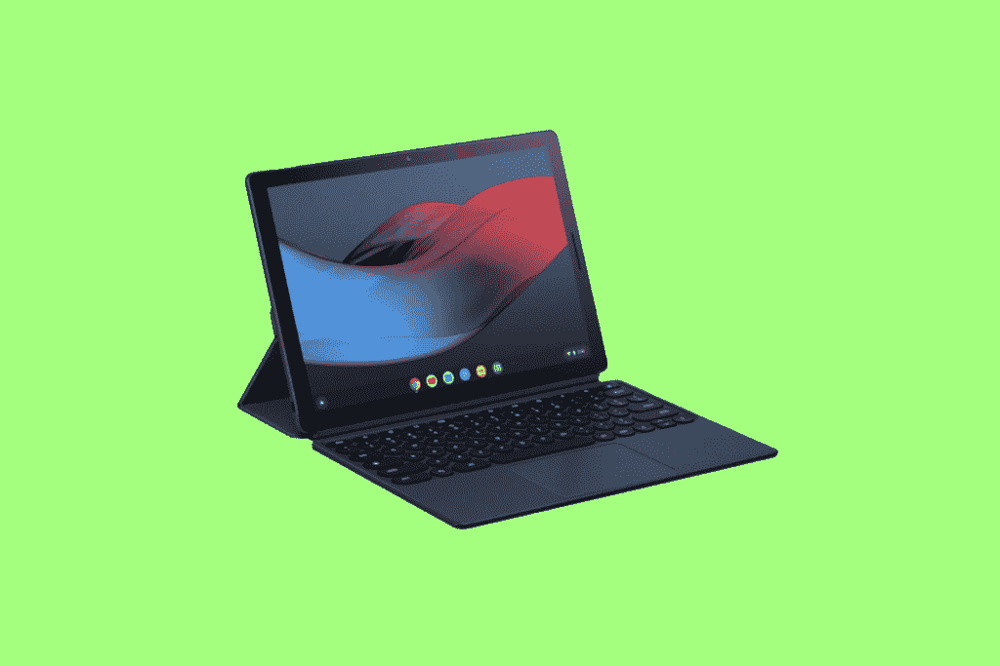
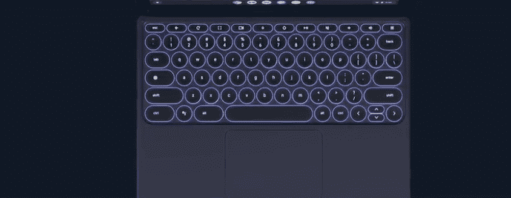
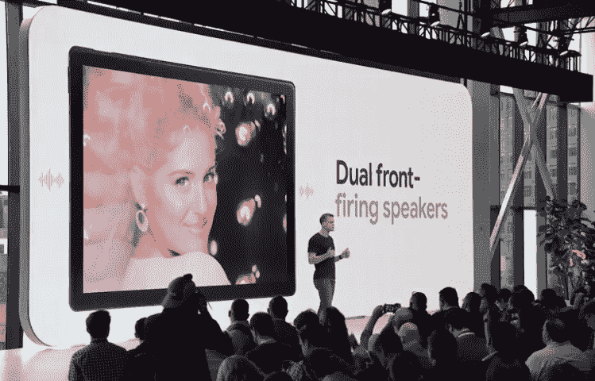

# 联想 Chromebook Duet 5 vs Pixel Slate:该买哪个？

> 原文：<https://www.xda-developers.com/lenovo-chromebook-duet-5-vs-google-pixel-slate/>

联想最近在联想科技世界 2021 上发布了 Chromebook Duet 5。Chromebook Duet 5 是我们最近跟踪的众多新款 Chrome OS 平板电脑之一。它看起来是一个引人注目的产品，但考虑所有可用的选项总是一个好主意。尽管谷歌的 Pixel Slate 产品周期很短，但它仍然是最受欢迎的 Chrome OS 平板电脑之一。

在这次比较中，我们将了解这些平板电脑的不同之处，以及您今天应该购买哪一款。这是联想 Chromebook Duet 5 vs Pixel Slate。

| 规格 | 联想 Chromebook Duet 5 | 谷歌像素写字板 |
| --- | --- | --- |
| **尺寸&重量** | 

*   7.35 英寸 x 12.4 英寸 x .29 英寸
*   1.5 磅(700 克)

 | 

*   11.45 x 7.95 x 0.28 英寸
*   1.59 磅

 |
| **显示** | 

*   13.3 英寸 1920x1080 像素
*   触摸屏
*   有机发光二极管（Organic Light Emitting Diode 的缩写）

 | 

*   全新的分子展示
*   12.3 英寸液晶显示器 3000x2000 LTPS
*   触摸屏

 |
| **处理器** | 

*   高通骁龙 7c 计算平台第二代
*   8 核
*   高通 Adreno 618 GPU

 | 

*   第八代英特尔酷睿 m3、i5 或 i7 或赛扬处理器
*   英特尔 UHD 显卡

 |
| **内存&存储** | 

*   板载高达 8GB LPDDR4X
*   高达 256GB 的 eMMC 存储

 | 

*   4GB、8GB 或 16GB 内存
*   32、64、128 或 256GB eMMc 存储

 |
| **电池&充电** | 

*   快速充电时长达 15 小时
*   基于较低的亮度设置进行估计

 | 

*   长达 12 小时
*   48 瓦时电池
*   45W 充电

 |
| **安全** |  | 

*   电源按钮上的 Pixel Imprint 指纹传感器
*   泰坦 C 安全芯片提高设备安全性

 |
| **前置摄像头** |  | 

*   针对视频通话优化的 duo Cam:8MP，1.9 光圈，

 |
| **面向世界的摄像头** |  | 

*   针对视频通话优化的 duo Cam:8MP，1.9 光圈，

 |
| **端口** | 

*   2 个 USB-C(第二代)
*   5 点弹簧针

 | 

*   2 个 USB-C 端口，用于充电和 4K 显示器连接
*   键盘连接器

 |
| **音频** | 

*   4x 杜比音频扬声器
*   智能放大器

 | 

*   双前置扬声器带来更好的环绕声
*   2 个麦克风，用于改善噪音消除

 |
| **连通性** | 

*   802.11 a/b/g/n/ac、MIMO、2x2、2.4GHz/5GHz 双频带
*   蓝牙 5.1

 | 

*   WiFi 802.11 a/b/g/n/ac，2x2 MIMO，双频(2.4 GHz，5.0 GHz)
*   蓝牙 4.2

 |
| **软件** | Chrome OS | Chrome OS |
| **其他特征** | 

*   可拆卸键盘
*   深渊蓝，风暴灰
*   起价 429 美元

 | 

*   阳极氧化铝车身
*   可拆卸键盘
*   Pixelbook 笔支持
*   起价 499 美元

 |

## 设计和展示

从设计和制造开始，这些平板电脑在许多方面都很相似。首先是

[Lenovo Chromebook Duet 5](https://www.xda-developers.com/best-lenovo-chromebooks/)

根据规格表，大约与像素板的重量相同。这是值得注意的，特别是因为 Pixel Slate 实际上有一个略小的屏幕。两款平板电脑都同样轻薄小巧，但请记住，如果在任何一种情况下添加可选的可拆卸键盘，它们的重量都会大大增加。

我们知道的一件事是，联想 Chromebook Duet 5 实际上与盒子中的可拆卸键盘捆绑在一起。Pixel Slate 有一个可选的可拆卸键盘，必须单独购买，仍然相当昂贵。在基本价格中包含可拆卸键盘对于联想 Chromebook Duet 5 来说无疑是一个胜利。两款平板都是金属材质，相当耐用。Pixel Slate 由镁合金制成，而联想 Chromebook Duet 5 由铝合金制成。这两款平板电脑也都支持笔输入。Pixel Slate 需要可选的 Pixelbook 笔，单独购买价格为 99 美元，尽管最近你可以很容易地在大减价中找到它。联想 Chromebook Duet 5 支持 USI 笔标准，但你仍然需要单独购买 USI 笔，要么从联想购买，要么从亚马逊上的第三方制造商购买。

一个关键区别是像素板中的生物特征安全性。Pixel Slate 的电源按钮中嵌入了指纹扫描仪。令人耳目一新的是，许多高端 Chromebooks 都取消了生物识别安全选项，从而改善了用户体验。不幸的是，联想 Chromebook Duet 5 在许多配置中都没有指纹扫描仪选项。至于显示屏，这两款 Chrome 平板电脑都配有高分辨率面板。然而，Pixel slate 凭借其 3000 x 2000 分子显示屏在整体 ppi 中胜出。尽管 Pixel Slate 上的显示器没有最好的颜色精度，所以我们需要在评测时看看联想 Chromebook Duet 5 的 FHD 面板在那里的表现如何。无论哪种方式，你都可以从这两种设备获得高于平均水平的 400 尼特左右的稳定亮度。

## 键盘和笔支架

如前所述，Pixel Slate 上的键盘和笔完全是可选的附加组件。联想 Chromebook Duet 5 包括可拆卸键盘，但 USI 笔单独出售。有了 Pixel Slate，你将多花 300 美元来享受设备上的键盘和笔支持。如果你需要使用 Chrome 平板电脑工作，并且需要键盘或笔输入，这是目前最大的考虑因素。

说到键盘质量，联想 Chromebook Duet 5 仍有许多未知之处。Pixel Slate 键盘的最初评论是有利的，尽管 Slate 确实有很多蓝牙问题。尽管如此，Pixel Slate 确实提供了一个具有多种打字方向和舒适布局的键盘。Duet 5 的键盘布局看起来很好，比 2020 年的原版 Duet 更宽敞，但我们不能肯定地说，在我们测试之前，它将是可比的。

## 性能和电池

预发布产品的性能有时很难预测，但联想 Chromebook Duet 5 应该会轻而易举地在这两者之间胜出。虽然我们还不太了解真实世界的性能，因为我们目前还没有进行任何基准测试，但理论上，联想平板电脑中更新的骁龙 7c 第二代应该在基准测试中超过 Pixel Slate。

我们可以肯定的一点是，Pixel Slate 也有自己的性能问题。玩像 PUBG 或 Asphalt 9 这样的高端 Android 游戏是非常困难的。如果你想在 Chrome 操作系统中使用多个 Linux 应用程序或运行要求苛刻的照片或视频编辑程序，多任务处理也可能很困难。联想 Chromebook Duet 5 似乎有可能在理论上和实践中获得整体性能的冠军，这是我们可以并将在下个月 Duet 5 上市时进行测试的。理论上，这两款设备从各自的原始设备制造商那里获得了相似的电池额定值。Pixel Slate 评论表明，谷歌平板电脑的实际使用时间约为 7-8 小时，而规格表上声称的时间为 12 小时。这是很常见的，我们通常会期望联想 Chromebook Duet 5 的电池寿命类似。然而，联想声称 Duet 5 一次充电实际上可以续航 15 小时。这是一个相当大胆的声明。不过，有一点可能会延长电池寿命，那就是联想 Chromebook Duet 5 内部的骁龙 7c 第二代处理器。如果联想对平板电脑进行优化，以利用 7c 的功能，我们可以看到电池寿命大幅提高。

## 相机和音频

在过去的 18 个月中，视频通话因持续的疫情而变得突出。大多数 Chromebooks 仍然有普通的 720p 网络摄像头，根本没有后置摄像头。

相机质量是这两款平板电脑的突出特点。联想 Chromebook Duet 5 和 Pixel Slate 都在正面和背面配备了 FHD+分辨率的摄像头。Pixel Slate 前后都有一个 800 万像素的摄像头，而联想 Chromebook Duet 5 则有一个 500 万像素的前置摄像头和 800 万像素的宽视野后置摄像头。在变焦、微软团队和谷歌相遇的时代，这些相机是一件大事。

Pixel Slate 拥有一些你可以在任何 Chrome OS 设备上找到的更好的扬声器。发布时，音频质量是谷歌平板电脑的主要吸引力之一。不过，联想正在寻求与音频竞争，Chromebook Duet 5 采用了四扬声器设置。考虑到只有双扬声器的原始二重唱听起来有多好，联想很有可能在这个部门留下深刻印象。

## 结论

虽然这两款设备各有利弊，但 2021 年的联想 Chromebook Duet 5 有太多 Pixel Slate 缺少的功能。你不仅可以获得更新的骁龙 7c 第二代处理器，还可以获得可拆卸键盘、USI 笔和更长的 Chrome OS 支持时间线。联想 Chromebook Duet 5 看起来将成为

[best Chromebooks of 2021](https://www.xda-developers.com/best-chromebooks/)

。对我来说，包含 USI 笔和可拆卸键盘真的是最大的卖点。如果你用 Pixel Slate 买一个类似的套装，光是这些配件就要多花将近 300 美元。如果你是谷歌的忠实用户，这听起来可能值得，但我不会推荐 2021 年的 Pixel Slate，因为它太老了。

### 联想 Chromebook Duet 5

联想 Chromebook Duet 5 是 2020 年 Chromebook Duet 的更大、更高端版本。你得到一个明亮的有机发光二极管显示器，可拆卸键盘，和 USI 笔支持。售价 429 美元的所有这些功能使其在 Chrome 平板电脑领域具有坚实的价值。

**Affiliate Links**

Lenovo

[View at Lenovo](https://shop-links.co/link/?exclusive=1&publisher_slug=xda&article_name=Lenovo+Chromebook+Duet+5+vs+Pixel+Slate%3A+Which+should+you+buy%3F&article_url=https%3A%2F%2Fwww.xda-developers.com%2Flenovo-chromebook-duet-5-vs-google-pixel-slate%2F&u1=UUxdaUeUpU5272&url=https%3A%2F%2Fwww.lenovo.com%2Fus%2Fen%2Fd%2Fchromebook-laptop%2F)

### 谷歌像素写字板

虽然 Pixel Slate 现在有点过时，但它仍然是在 Chrome OS 上获得真正谷歌体验的绝佳选择。它还支持可选的可拆卸键盘和 Pixel Slate 笔，可在旅途中提高工作效率。

**Affiliate Links**

Amazon

[View at Amazon](https://www.amazon.com/Google-Pixel-12-3-Inch-Tablet-aspect/dp/B07JWCHWRM/?tag=xda-2032dno-20&ascsubtag=UUxdaUeUpU5272&asc_refurl=https%3A%2F%2Fwww.xda-developers.com%2Flenovo-chromebook-duet-5-vs-google-pixel-slate%2F&asc_campaign=Short-Term)