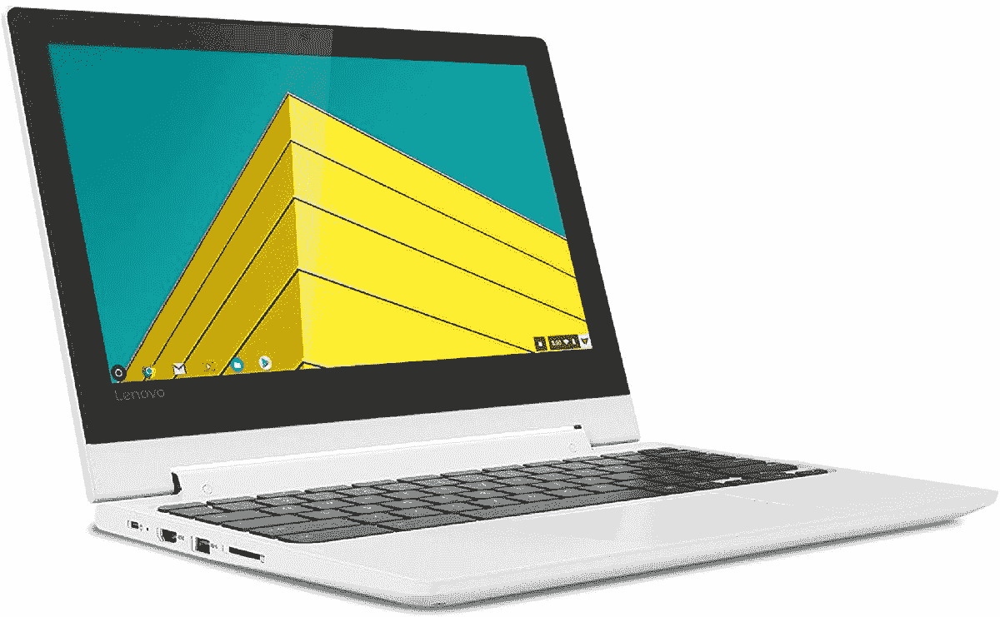

# 联想 Chromebook Flex 3 11 英寸现售价 150 美元，这是迄今为止的最低价

> 原文：<https://www.xda-developers.com/lenovo-chromebook-flex-3-11-deal-november-2021/>

Chromebooks 仍不适合所有人，但它们因其易用性、Android 应用兼容性以及普遍缺乏恶意软件和病毒而变得流行。联想销售了很多 Chromebooks，但该公司目前的预算型号之一是 Flex 3 11”，刚刚降至 149.99 美元。这比最初的建议零售价低 170 美元，这似乎是亚马逊上这款笔记本电脑的最低价格。

联想 Chromebook Flex 3 11”(多好的名字！)是一款 2 合 1 笔记本电脑，所以你可以翻转屏幕像平板电脑一样使用它。有一个 11.6 英寸的 1366 x 768 IPS 触摸屏，一个联发科 MT8173C 片上系统，4GB 的 LPDDR3 内存，64GB 的 eMMC 存储，当然，还有用于软件的谷歌 Chrome OS。这款笔记本电脑还有一系列令人印象深刻的端口，包括两个 USB Type-C 连接器、一个 USB 3.1 Type-A 端口(用于插入没有加密狗的旧 USB 设备)、一个 HDMI 端口、一个 SD 卡插槽和一个 3.5 毫米耳机插孔。

 <picture></picture> 

Lenovo Chromebook Flex 3 11

##### 联想 Chromebook Flex 3

这款预算 Chromebook 现在售价 149.99 美元，比原价节省了 170 美元。

这绝对是目前最低端的 Chromebooks 之一，所以你不应该指望编辑视频或处理几十个 Chrome 标签，但对于基本的网络浏览和生产力任务来说，这是一个很好的选择。内置的 720p 网络摄像头也意味着它可以处理偶尔的 Google Meet 或 Zoom 视频通话。谷歌表示，这款笔记本电脑最早将在 2028 年 6 月前继续接收 Chrome 操作系统更新。

如果你有更多的钱可以花，而且你肯定想要一台 Chromebook，看看我们的[最佳 chrome book](https://www.xda-developers.com/best-chromebooks/)综述。我们已经收集了几个价位的一些最佳选择，所以无论你对电脑有什么要求，Chromebook 可能都适合你。谷歌最近也推出了大量对 Chrome OS 的改进，包括新的写作应用程序和 Chrome OS 93 更新。